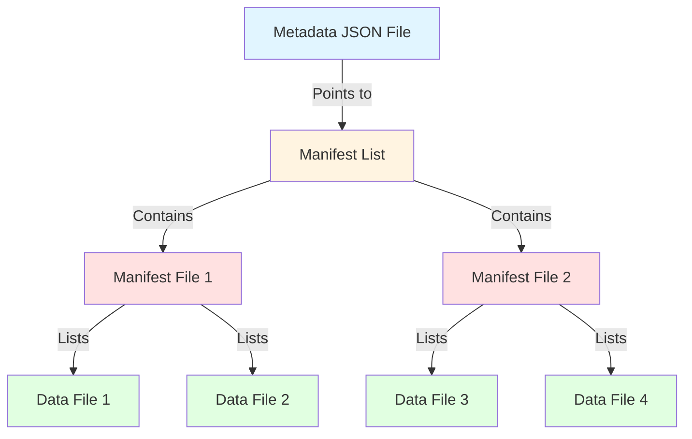
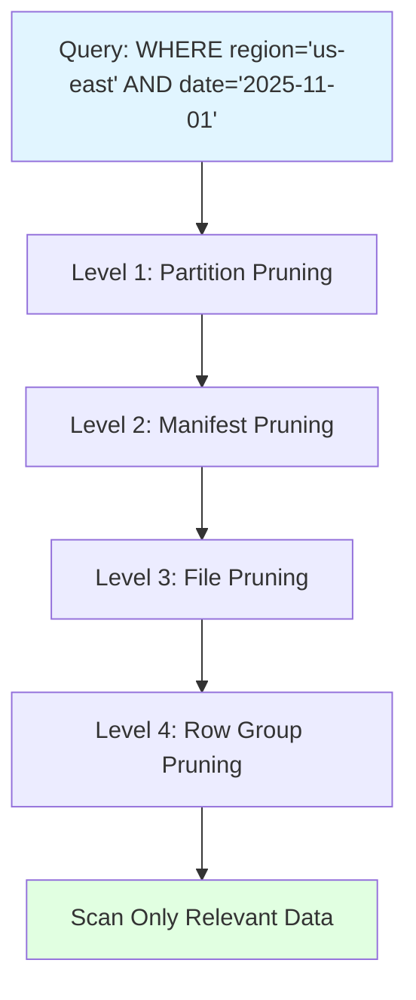

# Apache Iceberg Internals: How It Works Behind the Scenes

This guide explains how Apache Iceberg manages data, metadata, and CRUD operations at the file level.

## Table of Contents
1. [Iceberg Architecture Overview](#iceberg-architecture-overview)
2. [File Structure in S3](#file-structure-in-s3)
3. [Metadata Layers](#metadata-layers)
4. [Complete File State After Each CRUD Operation](#complete-file-state-after-each-crud-operation)
5. [Partitioning in Iceberg](#partitioning-in-iceberg)
6. [Data Pruning in Iceberg](#data-pruning-in-iceberg)
7. [Query Execution Flow](#query-execution-flow)
8. [Practical Examples](#practical-examples)

---

## Iceberg Architecture Overview

Apache Iceberg is a **table format** (not a file format) that provides:
- **ACID transactions** on data lakes
- **Time travel** and versioning
- **Schema evolution** without rewriting data
- **Hidden partitioning** that's transparent to users
- **Efficient metadata management** for large tables

### Key Concept: Immutability
> [!IMPORTANT]
> Iceberg uses **immutable files**. Data files are never modified - only added or marked as deleted. This enables time travel and concurrent reads/writes.

---

## File Structure in S3

When you see an S3 path like:
```
s3://85d4e97f-c10c-4028-43asmbiifyirntbgasjrbgffaxsd6usw2b--table-s3/
```

Here's what's inside:

```
s3://bucket-name/
├── metadata/
│   ├── v1.metadata.json          # Table metadata (schema, partitioning, snapshots)
│   ├── v2.metadata.json          # Updated metadata after changes
│   ├── v3.metadata.json          # Latest metadata
│   ├── snap-123.avro             # Snapshot manifest list
│   ├── snap-456.avro             # Another snapshot
│   └── manifest-abc.avro         # Manifest file (list of data files)
│
└── data/
    ├── partition1/
    │   ├── data-file-001.parquet
    │   ├── data-file-002.parquet
    │   └── data-file-003.parquet
    └── partition2/
        ├── data-file-004.parquet
        └── data-file-005.parquet
```

---

## Metadata Layers

Iceberg uses a **three-layer metadata structure**:



### Layer 1: Metadata JSON File

The **table metadata file** is the entry point. It contains:

```json
{
  "format-version": 2,
  "table-uuid": "85d4e97f-c10c-4028-...",
  "location": "s3://bucket/table",
  "last-updated-ms": 1701234567890,
  "last-column-id": 5,
  "schema": {
    "type": "struct",
    "fields": [
      {"id": 1, "name": "tenant_id", "type": "string", "required": true},
      {"id": 2, "name": "risk_score", "type": "double", "required": false},
      {"id": 3, "name": "timestamp", "type": "timestamp", "required": true}
    ]
  },
  "partition-spec": [
    {"name": "tenant_id", "transform": "identity", "source-id": 1}
  ],
  "current-snapshot-id": 123456789,
  "snapshots": [
    {
      "snapshot-id": 123456789,
      "timestamp-ms": 1701234567890,
      "manifest-list": "s3://bucket/metadata/snap-123456789.avro",
      "summary": {
        "operation": "append",
        "added-files": "5",
        "added-records": "10000"
      }
    }
  ]
}
```

### Layer 2: Manifest List (Snapshot)

A **manifest list** is an Avro file that lists all manifest files for a snapshot:

| manifest_path | manifest_length | partition_spec_id | added_files | deleted_files |
|--------------|-----------------|-------------------|-------------|---------------|
| s3://.../manifest-abc.avro | 5432 | 0 | 3 | 0 |
| s3://.../manifest-def.avro | 6789 | 0 | 2 | 1 |

### Layer 3: Manifest File

A **manifest file** is an Avro file listing individual data files:

| status | file_path | partition | record_count | file_size_bytes |
|--------|-----------|-----------|--------------|-----------------|
| ADDED | s3://.../data-001.parquet | {tenant_id=entergy} | 5000 | 1048576 |
| ADDED | s3://.../data-002.parquet | {tenant_id=entergy} | 3000 | 786432 |
| DELETED | s3://.../data-old.parquet | {tenant_id=entergy} | 2000 | 524288 |

---

## Complete File State After Each CRUD Operation

This section shows the **exact content** of all files after each operation, answering: "Where did snap-123 go?"

> [!IMPORTANT]
> **Key Point**: Old files (snap-123, v2.metadata.json, etc.) are **NEVER deleted**. They remain in S3 for time travel and are only removed during maintenance operations like `EXPIRE SNAPSHOTS`.

### Operation 0: CREATE TABLE (Initial State)

**SQL:**
```sql
CREATE ICEBERG TABLE dev.gold.risk_scores (
  tenant_id STRING,
  risk_score DOUBLE,
  timestamp TIMESTAMP
) PARTITION BY (tenant_id);
```

**Files in S3:**
```
s3://bucket/
└── metadata/
    └── v1.metadata.json
```

**Content of `v1.metadata.json`:**
```json
{
  "format-version": 2,
  "table-uuid": "85d4e97f-c10c-4028-abc",
  "location": "s3://bucket/table",
  "last-updated-ms": 1701234560000,
  "schema": {
    "fields": [
      {"id": 1, "name": "tenant_id", "type": "string"},
      {"id": 2, "name": "risk_score", "type": "double"},
      {"id": 3, "name": "timestamp", "type": "timestamp"}
    ]
  },
  "partition-spec": [
    {"name": "tenant_id", "transform": "identity", "source-id": 1}
  ],
  "current-snapshot-id": null,
  "snapshots": []
}
```

---

### Operation 1: First INSERT

**SQL:**
```sql
INSERT INTO dev.gold.risk_scores 
VALUES ('entergy', 0.85, '2025-11-28 10:00:00');
```

**Files in S3:**
```
s3://bucket/
├── metadata/
│   ├── v1.metadata.json          ← Still here (for time travel)
│   ├── v2.metadata.json          ← NEW (current)
│   ├── snap-5001.avro            ← NEW (manifest list)
│   └── manifest-a1b2.avro        ← NEW (manifest file)
└── data/
    └── tenant_id=entergy/
        └── data-001.parquet      ← NEW (actual data)
```

**Content of `data-001.parquet`:**
| tenant_id | risk_score | timestamp |
|-----------|------------|-----------|
| entergy | 0.85 | 2025-11-28 10:00:00 |

**Content of `manifest-a1b2.avro`:**
| status | file_path | partition | record_count | file_size | column_sizes | value_counts | null_counts | lower_bounds | upper_bounds |
|--------|-----------|-----------|--------------|-----------|--------------|--------------|-------------|--------------|--------------|
| ADDED | s3://bucket/data/tenant_id=entergy/data-001.parquet | {tenant_id=entergy} | 1 | 1024 | {1:100,2:50,3:80} | {1:1,2:1,3:1} | {1:0,2:0,3:0} | {1:"entergy",2:0.85} | {1:"entergy",2:0.85} |

**Content of `snap-5001.avro` (Manifest List):**
| manifest_path | manifest_length | partition_spec_id | added_snapshot_id | added_files_count | existing_files_count | deleted_files_count | added_rows_count |
|--------------|-----------------|-------------------|-------------------|-------------------|----------------------|---------------------|------------------|
| s3://bucket/metadata/manifest-a1b2.avro | 2048 | 0 | 5001 | 1 | 0 | 0 | 1 |

**Content of `v2.metadata.json`:**
```json
{
  "format-version": 2,
  "table-uuid": "85d4e97f-c10c-4028-abc",
  "location": "s3://bucket/table",
  "last-updated-ms": 1701234567000,
  "schema": { /* same as v1 */ },
  "partition-spec": [ /* same as v1 */ ],
  "current-snapshot-id": 5001,
  "snapshots": [
    {
      "snapshot-id": 5001,
      "timestamp-ms": 1701234567000,
      "manifest-list": "s3://bucket/metadata/snap-5001.avro",
      "summary": {
        "operation": "append",
        "added-data-files": "1",
        "added-records": "1",
        "total-data-files": "1",
        "total-records": "1"
      }
    }
  ],
  "snapshot-log": [
    {"snapshot-id": 5001, "timestamp-ms": 1701234567000}
  ]
}
```

---

### Operation 2: Second INSERT (Different Partition)

**SQL:**
```sql
INSERT INTO dev.gold.risk_scores 
VALUES ('pge', 0.92, '2025-11-28 11:00:00');
```

**Files in S3:**
```
s3://bucket/
├── metadata/
│   ├── v1.metadata.json          ← Still here
│   ├── v2.metadata.json          ← Still here
│   ├── v3.metadata.json          ← NEW (current)
│   ├── snap-5001.avro            ← Still here
│   ├── snap-5002.avro            ← NEW (manifest list)
│   ├── manifest-a1b2.avro        ← Still here
│   └── manifest-c3d4.avro        ← NEW (manifest file)
└── data/
    ├── tenant_id=entergy/
    │   └── data-001.parquet      ← Still here
    └── tenant_id=pge/
        └── data-002.parquet      ← NEW
```

**Content of `data-002.parquet`:**
| tenant_id | risk_score | timestamp |
|-----------|------------|-----------|
| pge | 0.92 | 2025-11-28 11:00:00 |

**Content of `manifest-c3d4.avro`:**
| status | file_path | partition | record_count | file_size |
|--------|-----------|-----------|--------------|-----------|
| ADDED | s3://bucket/data/tenant_id=pge/data-002.parquet | {tenant_id=pge} | 1 | 1024 |

**Content of `snap-5002.avro` (Manifest List):**
| manifest_path | added_snapshot_id | added_files_count | existing_files_count | added_rows_count |
|--------------|-------------------|-------------------|----------------------|------------------|
| s3://bucket/metadata/manifest-a1b2.avro | 5001 | 0 | 1 | 0 |
| s3://bucket/metadata/manifest-c3d4.avro | 5002 | 1 | 0 | 1 |

> [!NOTE]
> Notice that `snap-5002.avro` **references both manifests**: the old `manifest-a1b2.avro` (existing files) and the new `manifest-c3d4.avro` (new files).

**Content of `v3.metadata.json`:**
```json
{
  "format-version": 2,
  "table-uuid": "85d4e97f-c10c-4028-abc",
  "location": "s3://bucket/table",
  "last-updated-ms": 1701238167000,
  "schema": { /* same */ },
  "partition-spec": [ /* same */ ],
  "current-snapshot-id": 5002,
  "snapshots": [
    {
      "snapshot-id": 5001,
      "timestamp-ms": 1701234567000,
      "manifest-list": "s3://bucket/metadata/snap-5001.avro",
      "summary": { /* from before */ }
    },
    {
      "snapshot-id": 5002,
      "timestamp-ms": 1701238167000,
      "manifest-list": "s3://bucket/metadata/snap-5002.avro",
      "summary": {
        "operation": "append",
        "added-data-files": "1",
        "added-records": "1",
        "total-data-files": "2",
        "total-records": "2"
      }
    }
  ],
  "snapshot-log": [
    {"snapshot-id": 5001, "timestamp-ms": 1701234567000},
    {"snapshot-id": 5002, "timestamp-ms": 1701238167000}
  ]
}
```

---

### Operation 3: UPDATE

**SQL:**
```sql
UPDATE dev.gold.risk_scores 
SET risk_score = 0.90 
WHERE tenant_id = 'entergy';
```

**Files in S3:**
```
s3://bucket/
├── metadata/
│   ├── v1.metadata.json          ← Still here
│   ├── v2.metadata.json          ← Still here
│   ├── v3.metadata.json          ← Still here
│   ├── v4.metadata.json          ← NEW (current)
│   ├── snap-5001.avro            ← Still here
│   ├── snap-5002.avro            ← Still here
│   ├── snap-5003.avro            ← NEW (manifest list)
│   ├── manifest-a1b2.avro        ← Still here
│   ├── manifest-c3d4.avro        ← Still here
│   └── manifest-e5f6.avro        ← NEW (manifest file)
└── data/
    ├── tenant_id=entergy/
    │   ├── data-001.parquet      ← Still here (marked DELETED in manifest)
    │   └── data-003.parquet      ← NEW (updated data)
    └── tenant_id=pge/
        └── data-002.parquet      ← Still here
```

**Content of `data-003.parquet`:**
| tenant_id | risk_score | timestamp |
|-----------|------------|-----------|
| entergy | 0.90 | 2025-11-28 10:00:00 |

**Content of `manifest-e5f6.avro`:**
| status | file_path | partition | record_count |
|--------|-----------|-----------|--------------|
| DELETED | s3://bucket/data/tenant_id=entergy/data-001.parquet | {tenant_id=entergy} | 1 |
| ADDED | s3://bucket/data/tenant_id=entergy/data-003.parquet | {tenant_id=entergy} | 1 |

**Content of `snap-5003.avro` (Manifest List):**
| manifest_path | added_snapshot_id | added_files_count | existing_files_count | deleted_files_count | added_rows_count |
|--------------|-------------------|-------------------|----------------------|---------------------|------------------|
| s3://bucket/metadata/manifest-c3d4.avro | 5002 | 0 | 1 | 0 | 0 |
| s3://bucket/metadata/manifest-e5f6.avro | 5003 | 1 | 0 | 1 | 1 |

**Content of `v4.metadata.json`:**
```json
{
  "format-version": 2,
  "current-snapshot-id": 5003,
  "snapshots": [
    {"snapshot-id": 5001, "manifest-list": "s3://bucket/metadata/snap-5001.avro", /* ... */},
    {"snapshot-id": 5002, "manifest-list": "s3://bucket/metadata/snap-5002.avro", /* ... */},
    {
      "snapshot-id": 5003,
      "timestamp-ms": 1701241767000,
      "manifest-list": "s3://bucket/metadata/snap-5003.avro",
      "summary": {
        "operation": "overwrite",
        "added-data-files": "1",
        "deleted-data-files": "1",
        "added-records": "1",
        "deleted-records": "1",
        "total-data-files": "2",
        "total-records": "2"
      }
    }
  ]
}
```

---

### Operation 4: DELETE

**SQL:**
```sql
DELETE FROM dev.gold.risk_scores 
WHERE tenant_id = 'pge';
```

**Files in S3:**
```
s3://bucket/
├── metadata/
│   ├── v1.metadata.json          ← Still here
│   ├── v2.metadata.json          ← Still here
│   ├── v3.metadata.json          ← Still here
│   ├── v4.metadata.json          ← Still here
│   ├── v5.metadata.json          ← NEW (current)
│   ├── snap-5001.avro            ← Still here
│   ├── snap-5002.avro            ← Still here
│   ├── snap-5003.avro            ← Still here
│   ├── snap-5004.avro            ← NEW (manifest list)
│   ├── manifest-a1b2.avro        ← Still here
│   ├── manifest-c3d4.avro        ← Still here
│   ├── manifest-e5f6.avro        ← Still here
│   └── manifest-g7h8.avro        ← NEW (manifest file)
└── data/
    ├── tenant_id=entergy/
    │   ├── data-001.parquet      ← Still here
    │   └── data-003.parquet      ← Still here
    └── tenant_id=pge/
        └── data-002.parquet      ← Still here (marked DELETED)
```

**Content of `manifest-g7h8.avro`:**
| status | file_path | partition | record_count |
|--------|-----------|-----------|--------------|
| DELETED | s3://bucket/data/tenant_id=pge/data-002.parquet | {tenant_id=pge} | 1 |

**Content of `snap-5004.avro` (Manifest List):**
| manifest_path | added_snapshot_id | existing_files_count | deleted_files_count |
|--------------|-------------------|----------------------|---------------------|
| s3://bucket/metadata/manifest-e5f6.avro | 5003 | 1 | 1 |
| s3://bucket/metadata/manifest-g7h8.avro | 5004 | 0 | 1 |

**Content of `v5.metadata.json`:**
```json
{
  "format-version": 2,
  "current-snapshot-id": 5004,
  "snapshots": [
    {"snapshot-id": 5001, /* ... */},
    {"snapshot-id": 5002, /* ... */},
    {"snapshot-id": 5003, /* ... */},
    {
      "snapshot-id": 5004,
      "timestamp-ms": 1701245367000,
      "manifest-list": "s3://bucket/metadata/snap-5004.avro",
      "summary": {
        "operation": "delete",
        "deleted-data-files": "1",
        "deleted-records": "1",
        "total-data-files": "1",
        "total-records": "1"
      }
    }
  ]
}
```

---

### Summary: What Happens to Old Files?

| File Type | What Happens | When It's Removed |
|-----------|--------------|-------------------|
| **Old metadata.json** (v1, v2, v3) | Kept in S3 | After `EXPIRE SNAPSHOTS` or table drop |
| **Old snapshots** (snap-5001, snap-5002) | Kept in S3 | After `EXPIRE SNAPSHOTS` removes old snapshots |
| **Old manifests** (manifest-a1b2, etc.) | Kept in S3 | After snapshot expiration removes references |
| **Old data files** (data-001.parquet) | Kept in S3 even if DELETED | After `EXPIRE SNAPSHOTS` + `DELETE ORPHAN FILES` |

**To clean up old files:**
```sql
-- Remove snapshots older than 7 days
ALTER TABLE dev.gold.risk_scores 
EXECUTE EXPIRE_SNAPSHOTS(OLDER_THAN => DATEADD(day, -7, CURRENT_TIMESTAMP()));

-- Remove orphaned data files
ALTER TABLE dev.gold.risk_scores 
EXECUTE REMOVE_ORPHAN_FILES(OLDER_THAN => DATEADD(day, -7, CURRENT_TIMESTAMP()));
```

---

## Partitioning in Iceberg

### How Partitioning Works

Iceberg uses **hidden partitioning** - users don't need to specify partition filters in queries, and the partition structure can evolve without rewriting data.

#### Basic Partition Example

**Create table with partition:**
```sql
CREATE ICEBERG TABLE events (
  event_id STRING,
  user_id STRING,
  event_time TIMESTAMP,
  event_type STRING
) PARTITION BY (DATE(event_time));
```

**Physical layout in S3:**
```
s3://bucket/data/
├── event_time_date=2025-11-01/
│   ├── data-001.parquet
│   └── data-002.parquet
├── event_time_date=2025-11-02/
│   └── data-003.parquet
└── event_time_date=2025-11-03/
    └── data-004.parquet
```

**Partition spec in metadata:**
```json
{
  "partition-spec": [
    {
      "name": "event_time_date",
      "transform": "day",
      "source-id": 3,
      "field-id": 1000
    }
  ]
}
```

### Partition Transforms

Iceberg supports various partition transforms:

| Transform | Example | Use Case |
|-----------|---------|----------|
| `identity` | `PARTITION BY (tenant_id)` | Exact value partitioning |
| `year` | `PARTITION BY (YEAR(timestamp))` | Yearly partitions |
| `month` | `PARTITION BY (MONTH(timestamp))` | Monthly partitions |
| `day` | `PARTITION BY (DAY(timestamp))` | Daily partitions |
| `hour` | `PARTITION BY (HOUR(timestamp))` | Hourly partitions |
| `bucket[N]` | `PARTITION BY (BUCKET(10, user_id))` | Hash bucketing into N buckets |
| `truncate[W]` | `PARTITION BY (TRUNCATE(5, price))` | Truncate to width W |

**Example with bucket:**
```sql
CREATE ICEBERG TABLE user_events (
  user_id STRING,
  event_data STRING
) PARTITION BY (BUCKET(16, user_id));
```

This creates 16 buckets (0-15) based on hash of `user_id`.

### Multiple Partition Keys

Iceberg supports **multiple partition columns** for hierarchical partitioning.

**Example:**
```sql
CREATE ICEBERG TABLE sales (
  sale_id STRING,
  region STRING,
  sale_date TIMESTAMP,
  amount DOUBLE
) PARTITION BY (region, DAY(sale_date));
```

**Physical layout:**
```
s3://bucket/data/
├── region=us-east/
│   ├── sale_date_day=2025-11-01/
│   │   └── data-001.parquet
│   └── sale_date_day=2025-11-02/
│       └── data-002.parquet
├── region=us-west/
│   ├── sale_date_day=2025-11-01/
│   │   └── data-003.parquet
│   └── sale_date_day=2025-11-02/
│       └── data-004.parquet
└── region=eu-central/
    └── sale_date_day=2025-11-01/
        └── data-005.parquet
```

**Partition spec:**
```json
{
  "partition-spec": [
    {
      "name": "region",
      "transform": "identity",
      "source-id": 2,
      "field-id": 1000
    },
    {
      "name": "sale_date_day",
      "transform": "day",
      "source-id": 3,
      "field-id": 1001
    }
  ]
}
```

**Query optimization:**
```sql
-- Prunes to only: region=us-east/sale_date_day=2025-11-01/
SELECT * FROM sales 
WHERE region = 'us-east' 
  AND sale_date = '2025-11-01';
```

### Partition Evolution

> [!IMPORTANT]
> Iceberg's killer feature: **Change partitioning without rewriting data!**

#### Scenario: Changing Partition Strategy

**Initial partition (by day):**
```sql
CREATE ICEBERG TABLE logs (
  log_id STRING,
  timestamp TIMESTAMP,
  message STRING
) PARTITION BY (DAY(timestamp));
```

**After 6 months, data grows too large. Change to hourly:**
```sql
ALTER TABLE logs 
SET PARTITION SPEC (HOUR(timestamp));
```

**What happens:**

```
s3://bucket/
├── metadata/
│   ├── v1.metadata.json          # partition-spec-id: 0 (DAY)
│   └── v2.metadata.json          # partition-spec-id: 1 (HOUR)
└── data/
    ├── timestamp_day=2025-05-01/     # Old data (spec-id: 0)
    │   └── data-001.parquet
    ├── timestamp_day=2025-05-02/     # Old data (spec-id: 0)
    │   └── data-002.parquet
    ├── timestamp_hour=2025-11-01-00/ # New data (spec-id: 1)
    │   └── data-003.parquet
    └── timestamp_hour=2025-11-01-01/ # New data (spec-id: 1)
        └── data-004.parquet
```

**Metadata tracks both specs:**
```json
{
  "partition-specs": [
    {
      "spec-id": 0,
      "fields": [{"name": "timestamp_day", "transform": "day", "source-id": 2}]
    },
    {
      "spec-id": 1,
      "fields": [{"name": "timestamp_hour", "transform": "hour", "source-id": 2}]
    }
  ],
  "default-spec-id": 1
}
```

**Manifest tracks which spec each file uses:**
```
| file_path | partition_spec_id | partition |
|-----------|-------------------|-----------|
| data-001.parquet | 0 | {timestamp_day=2025-05-01} |
| data-002.parquet | 0 | {timestamp_day=2025-05-02} |
| data-003.parquet | 1 | {timestamp_hour=2025-11-01-00} |
| data-004.parquet | 1 | {timestamp_hour=2025-11-01-01} |
```

**Query still works seamlessly:**
```sql
SELECT * FROM logs 
WHERE timestamp >= '2025-05-01' 
  AND timestamp < '2025-11-02';
```

Iceberg automatically:
1. Reads both partition specs
2. Prunes files from both old (day) and new (hour) partitions
3. Returns unified results

### Adding/Removing Partition Keys

**Add a partition key:**
```sql
-- Original: partitioned by region only
CREATE ICEBERG TABLE sales (
  region STRING,
  sale_date TIMESTAMP,
  amount DOUBLE
) PARTITION BY (region);

-- Later: add date partitioning
ALTER TABLE sales 
SET PARTITION SPEC (region, DAY(sale_date));
```

**Remove a partition key:**
```sql
-- Change from (region, day) to just (day)
ALTER TABLE sales 
SET PARTITION SPEC (DAY(sale_date));
```

**Result:**
- Old data remains in `region=X/` directories
- New data goes into `sale_date_day=YYYY-MM-DD/` directories
- Queries work across both layouts!

### Unpartitioned to Partitioned

**Start unpartitioned:**
```sql
CREATE ICEBERG TABLE events (
  event_id STRING,
  event_time TIMESTAMP
);
-- No PARTITION BY clause
```

**Later, add partitioning:**
```sql
ALTER TABLE events 
SET PARTITION SPEC (DAY(event_time));
```

**File layout evolution:**
```
Before:
s3://bucket/data/
├── data-001.parquet  # unpartitioned
└── data-002.parquet  # unpartitioned

After new inserts:
s3://bucket/data/
├── data-001.parquet              # old unpartitioned (spec-id: 0)
├── data-002.parquet              # old unpartitioned (spec-id: 0)
├── event_time_day=2025-11-01/    # new partitioned (spec-id: 1)
│   └── data-003.parquet
└── event_time_day=2025-11-02/    # new partitioned (spec-id: 1)
    └── data-004.parquet
```

---

## Data Pruning in Iceberg

Iceberg uses a **multi-level pruning strategy** to skip reading unnecessary data:



### Level 1: Partition Pruning

**How it works:**
- Iceberg reads partition values from manifest files
- Skips entire partitions that don't match query predicates

**Example:**

**Table:**
```sql
CREATE ICEBERG TABLE sales (
  region STRING,
  sale_date TIMESTAMP,
  amount DOUBLE
) PARTITION BY (region, DAY(sale_date));
```

**Query:**
```sql
SELECT SUM(amount) FROM sales 
WHERE region = 'us-east' 
  AND sale_date >= '2025-11-01' 
  AND sale_date < '2025-11-03';
```

**Partition layout:**
```
data/
├── region=us-east/
│   ├── sale_date_day=2025-11-01/  ✅ SCAN
│   ├── sale_date_day=2025-11-02/  ✅ SCAN
│   └── sale_date_day=2025-11-03/  ❌ SKIP (date >= 2025-11-03)
├── region=us-west/                ❌ SKIP (region != 'us-east')
│   └── sale_date_day=2025-11-01/
└── region=eu-central/             ❌ SKIP (region != 'us-east')
    └── sale_date_day=2025-11-01/
```

**Result:** Only scans 2 partitions instead of 5!

### Level 2: Manifest Pruning

**How it works:**
- Each manifest file contains partition summaries
- Iceberg reads manifest list to find relevant manifests
- Skips manifests that don't overlap with query predicates

**Manifest list content:**
```
| manifest_path | partition_summaries |
|--------------|---------------------|
| manifest-001.avro | {region: [us-east], date: [2025-11-01]} |
| manifest-002.avro | {region: [us-west], date: [2025-11-01]} |
| manifest-003.avro | {region: [us-east], date: [2025-11-02]} |
```

**Query:** `WHERE region = 'us-east' AND date = '2025-11-01'`

**Pruning:**
- ✅ Read `manifest-001.avro` (matches region and date)
- ❌ Skip `manifest-002.avro` (region doesn't match)
- ❌ Skip `manifest-003.avro` (date doesn't match)

### Level 3: File Pruning (Column Statistics)

**How it works:**
- Each manifest entry contains **min/max statistics** for each column
- Iceberg uses these to skip files that can't contain matching rows

**Manifest file content:**
```
| file_path | record_count | column_stats |
|-----------|--------------|--------------|
| data-001.parquet | 10000 | {amount: {min: 10.0, max: 100.0}} |
| data-002.parquet | 8000  | {amount: {min: 150.0, max: 500.0}} |
| data-003.parquet | 12000 | {amount: {min: 50.0, max: 200.0}} |
```

**Query:** `WHERE amount > 400`

**Pruning:**
- ❌ Skip `data-001.parquet` (max = 100.0 < 400)
- ✅ Scan `data-002.parquet` (max = 500.0 >= 400)
- ❌ Skip `data-003.parquet` (max = 200.0 < 400)

**Only 1 file scanned instead of 3!**

### Level 4: Row Group Pruning (Parquet Level)

**How it works:**
- Parquet files contain row groups with their own statistics
- Parquet reader skips row groups that don't match predicates

**Parquet file structure:**
```
data-002.parquet:
├── Row Group 0: amount [150-250]  ❌ SKIP (max < 400)
├── Row Group 1: amount [300-450]  ✅ SCAN
└── Row Group 2: amount [420-500]  ✅ SCAN
```

### Complete Pruning Example

**Setup:**
```sql
CREATE ICEBERG TABLE transactions (
  transaction_id STRING,
  user_id STRING,
  region STRING,
  amount DOUBLE,
  transaction_date TIMESTAMP
) PARTITION BY (region, DAY(transaction_date));

-- Insert 1 billion rows across 100 partitions
```

**Query:**
```sql
SELECT COUNT(*) FROM transactions
WHERE region = 'us-east'
  AND transaction_date = '2025-11-01'
  AND amount > 1000;
```

**Pruning stages:**

```
Total data: 1 billion rows in 10,000 files

Level 1 - Partition Pruning:
  100 partitions → 1 partition
  10,000 files → 100 files
  ✂️ Eliminated: 99% of partitions

Level 2 - Manifest Pruning:
  50 manifests → 2 manifests
  ✂️ Eliminated: 96% of manifests

Level 3 - File Pruning (column stats):
  100 files → 10 files
  ✂️ Eliminated: 90% of files in partition

Level 4 - Row Group Pruning:
  10 files × 10 row groups = 100 row groups
  → 25 row groups actually scanned
  ✂️ Eliminated: 75% of row groups

Final result: Scan 25 row groups instead of 100,000!
```

### Pruning with Multiple Conditions

**Query:**
```sql
SELECT * FROM transactions
WHERE region IN ('us-east', 'us-west')
  AND transaction_date BETWEEN '2025-11-01' AND '2025-11-03'
  AND amount > 500
  AND user_id LIKE 'USER_123%';
```

**Pruning strategy:**

1. **Partition pruning**: `region` and `transaction_date`
   - Only scan partitions matching region IN ('us-east', 'us-west')
   - Only scan dates between 2025-11-01 and 2025-11-03

2. **File pruning**: `amount`
   - Use min/max stats to skip files where max(amount) <= 500

3. **Row group pruning**: `amount`
   - Skip row groups where max(amount) <= 500

4. **Row-level filtering**: `user_id LIKE 'USER_123%'`
   - Applied during actual scan (can't be pruned with stats)

### Partition Evolution Impact on Pruning

When partition spec changes, Iceberg handles pruning across both specs:

**Example:**
```sql
-- Old spec: PARTITION BY (DAY(timestamp))
-- New spec: PARTITION BY (HOUR(timestamp))

SELECT * FROM logs 
WHERE timestamp BETWEEN '2025-11-01 10:00:00' AND '2025-11-01 12:00:00';
```

**Pruning:**
- Old data (day partitions): Scan entire `timestamp_day=2025-11-01` partition
- New data (hour partitions): Only scan `timestamp_hour=2025-11-01-10`, `timestamp_hour=2025-11-01-11`, `timestamp_hour=2025-11-01-12`

**Result:** New data benefits from finer-grained pruning!

### Statistics Tracked by Iceberg

For each data file, Iceberg tracks:

| Statistic | Purpose |
|-----------|---------|
| **record_count** | Total rows in file |
| **file_size_bytes** | Physical file size |
| **column_sizes** | Size of each column in bytes |
| **value_counts** | Number of values per column |
| **null_counts** | Number of nulls per column |
| **lower_bounds** | Minimum value per column |
| **upper_bounds** | Maximum value per column |
| **nan_counts** | Number of NaN values (for float/double) |

**Example manifest entry:**
```json
{
  "file_path": "s3://bucket/data/region=us-east/data-001.parquet",
  "record_count": 10000,
  "file_size_bytes": 5242880,
  "column_sizes": {
    "1": 100000,
    "2": 200000,
    "3": 150000
  },
  "value_counts": {
    "1": 10000,
    "2": 10000,
    "3": 10000
  },
  "null_counts": {
    "1": 0,
    "2": 150,
    "3": 0
  },
  "lower_bounds": {
    "1": "2025-11-01T00:00:00Z",
    "2": 10.50,
    "3": "USER_001"
  },
  "upper_bounds": {
    "1": "2025-11-01T23:59:59Z",
    "2": 9999.99,
    "3": "USER_999"
  }
}
```

---

## Query Execution Flow

### SELECT Query Optimization

### Time Travel Query

**SQL:**
```sql
SELECT * FROM dev.gold.risk_scores 
TIMESTAMP AS OF '2025-11-27 10:00:00';
```

**What Happens:**

1. Read `v3.metadata.json`
2. Find snapshot closest to timestamp
3. Use that snapshot's manifest list
4. Read data files from that snapshot
5. **No data movement** - just reading different metadata!

---

## Practical Examples

### Example 1: Tracking Changes Over Time

**Initial state (v1):**
```
Snapshot 1 (10:00 AM):
  - data-001.parquet: 1000 rows
```

**After INSERT (v2):**
```
Snapshot 2 (11:00 AM):
  - data-001.parquet: 1000 rows (still there)
  - data-002.parquet: 500 rows (new)
```

**After UPDATE (v3):**
```
Snapshot 3 (12:00 PM):
  - data-001.parquet: DELETED
  - data-002.parquet: 500 rows
  - data-003.parquet: 1000 rows (updated version of data-001)
```

### Example 2: Concurrent Writes

Two users insert data simultaneously:

**User A:**
```sql
INSERT INTO table VALUES ('tenant_a', 0.8);
```
- Creates: `data-004.parquet`, `manifest-ghi.avro`, `snap-789.avro`, `v4.metadata.json`

**User B:**
```sql
INSERT INTO table VALUES ('tenant_b', 0.9);
```
- Creates: `data-005.parquet`, `manifest-jkl.avro`, `snap-790.avro`, `v5.metadata.json`

**Result:**
- Both succeed! 
- v5.metadata.json includes both snapshots
- No conflicts because different partitions

---

## Key Takeaways

| Aspect | How It Works |
|--------|--------------|
| **Data Files** | Immutable Parquet files, never modified |
| **Metadata** | Versioned JSON files, each write creates new version |
| **Snapshots** | Point-in-time view of table, enables time travel |
| **Manifests** | Track which files are ADDED/DELETED per snapshot |
| **Updates** | Copy-on-write: create new files, mark old as deleted |
| **Deletes** | Logical deletion: mark files as deleted in manifest |
| **Queries** | Read metadata → find relevant files → scan only needed data |
| **Concurrency** | Optimistic concurrency with atomic metadata updates |

---

## Exploring Your Iceberg Table

To see this in action with your table:

```sql
-- Find the table using this S3 location
SHOW ICEBERG TABLES IN DATABASE DEV;

-- View table history (snapshots)
SELECT * FROM DEV.GOLD.YOUR_TABLE_NAME.SNAPSHOTS;

-- View manifest files
SELECT * FROM DEV.GOLD.YOUR_TABLE_NAME.MANIFESTS;

-- View data files
SELECT * FROM DEV.GOLD.YOUR_TABLE_NAME.FILES;

-- Time travel
SELECT * FROM DEV.GOLD.YOUR_TABLE_NAME 
TIMESTAMP AS OF '2025-11-27 10:00:00';
```

---

## Further Reading

- [Apache Iceberg Spec](https://iceberg.apache.org/spec/)
- [Snowflake Iceberg Tables](https://docs.snowflake.com/en/user-guide/tables-iceberg)
- [Iceberg Table Evolution](https://iceberg.apache.org/docs/latest/evolution/)
