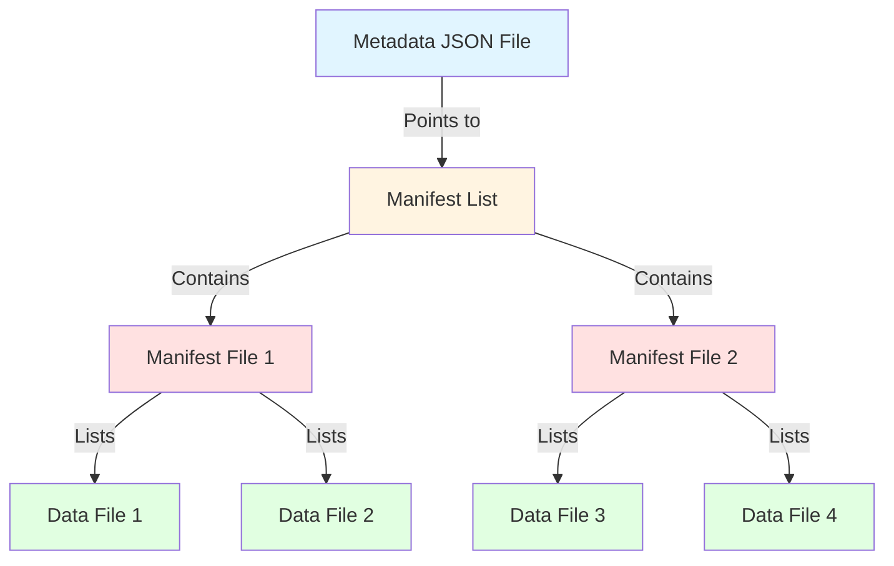
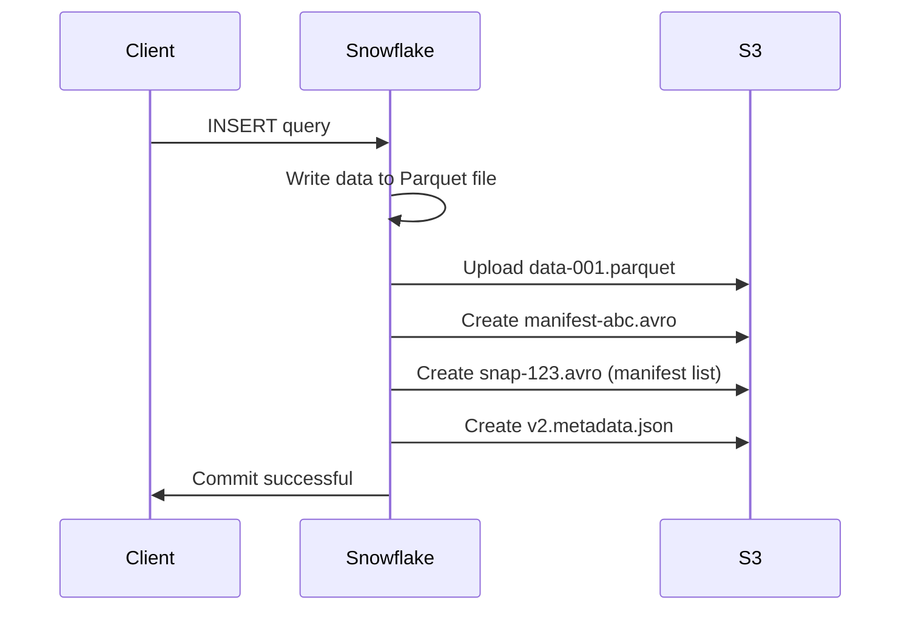
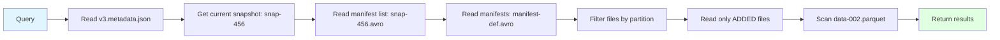

# Apache Iceberg Internals: How It Works Behind the Scenes

This guide explains how Apache Iceberg manages data, metadata, and CRUD operations at the file level.

## Table of Contents
1. [Iceberg Architecture Overview](#iceberg-architecture-overview)
2. [File Structure in S3](#file-structure-in-s3)
3. [Metadata Layers](#metadata-layers)
4. [CRUD Operations Deep Dive](#crud-operations-deep-dive)
5. [Query Execution Flow](#query-execution-flow)
6. [Practical Examples](#practical-examples)

---

## Iceberg Architecture Overview

Apache Iceberg is a **table format** (not a file format) that provides:
- **ACID transactions** on data lakes
- **Time travel** and versioning
- **Schema evolution** without rewriting data
- **Hidden partitioning** that's transparent to users
- **Efficient metadata management** for large tables

### Key Concept: Immutability
> [!IMPORTANT]
> Iceberg uses **immutable files**. Data files are never modified - only added or marked as deleted. This enables time travel and concurrent reads/writes.

---

## File Structure in S3

When you see an S3 path like:
```
s3://85d4e97f-c10c-4028-43asmbiifyirntbgasjrbgffaxsd6usw2b--table-s3/
```

Here's what's inside:

```
s3://bucket-name/
├── metadata/
│   ├── v1.metadata.json          # Table metadata (schema, partitioning, snapshots)
│   ├── v2.metadata.json          # Updated metadata after changes
│   ├── v3.metadata.json          # Latest metadata
│   ├── snap-123.avro             # Snapshot manifest list
│   ├── snap-456.avro             # Another snapshot
│   └── manifest-abc.avro         # Manifest file (list of data files)
│
└── data/
    ├── partition1/
    │   ├── data-file-001.parquet
    │   ├── data-file-002.parquet
    │   └── data-file-003.parquet
    └── partition2/
        ├── data-file-004.parquet
        └── data-file-005.parquet
```

---

## Metadata Layers

Iceberg uses a **three-layer metadata structure**:



### Layer 1: Metadata JSON File

The **table metadata file** is the entry point. It contains:

```json
{
  "format-version": 2,
  "table-uuid": "85d4e97f-c10c-4028-...",
  "location": "s3://bucket/table",
  "last-updated-ms": 1701234567890,
  "last-column-id": 5,
  "schema": {
    "type": "struct",
    "fields": [
      {"id": 1, "name": "tenant_id", "type": "string", "required": true},
      {"id": 2, "name": "risk_score", "type": "double", "required": false},
      {"id": 3, "name": "timestamp", "type": "timestamp", "required": true}
    ]
  },
  "partition-spec": [
    {"name": "tenant_id", "transform": "identity", "source-id": 1}
  ],
  "current-snapshot-id": 123456789,
  "snapshots": [
    {
      "snapshot-id": 123456789,
      "timestamp-ms": 1701234567890,
      "manifest-list": "s3://bucket/metadata/snap-123456789.avro",
      "summary": {
        "operation": "append",
        "added-files": "5",
        "added-records": "10000"
      }
    }
  ]
}
```

### Layer 2: Manifest List (Snapshot)

A **manifest list** is an Avro file that lists all manifest files for a snapshot:

| manifest_path | manifest_length | partition_spec_id | added_files | deleted_files |
|--------------|-----------------|-------------------|-------------|---------------|
| s3://.../manifest-abc.avro | 5432 | 0 | 3 | 0 |
| s3://.../manifest-def.avro | 6789 | 0 | 2 | 1 |

### Layer 3: Manifest File

A **manifest file** is an Avro file listing individual data files:

| status | file_path | partition | record_count | file_size_bytes |
|--------|-----------|-----------|--------------|-----------------|
| ADDED | s3://.../data-001.parquet | {tenant_id=entergy} | 5000 | 1048576 |
| ADDED | s3://.../data-002.parquet | {tenant_id=entergy} | 3000 | 786432 |
| DELETED | s3://.../data-old.parquet | {tenant_id=entergy} | 2000 | 524288 |

---

## CRUD Operations Deep Dive

### CREATE (Initial Table Creation)

**SQL:**
```sql
CREATE ICEBERG TABLE dev.gold.risk_scores (
  tenant_id STRING,
  risk_score DOUBLE,
  timestamp TIMESTAMP
) PARTITION BY (tenant_id);
```

**What Happens:**

1. **Metadata file created**: `v1.metadata.json`
   - Defines schema, partition spec
   - No snapshots yet (empty table)

2. **S3 structure:**
   ```
   s3://bucket/
   └── metadata/
       └── v1.metadata.json
   ```

---

### INSERT (Adding Data)

**SQL:**
```sql
INSERT INTO dev.gold.risk_scores 
VALUES ('entergy', 0.85, CURRENT_TIMESTAMP());
```

**What Happens:**



**Step-by-step:**

1. **Data file written**: `data/tenant_id=entergy/data-001.parquet`
   - Contains the actual row data
   - Immutable once written

2. **Manifest file created**: `metadata/manifest-abc.avro`
   ```
   status: ADDED
   file_path: s3://.../data-001.parquet
   partition: {tenant_id=entergy}
   record_count: 1
   ```

3. **Manifest list created**: `metadata/snap-123.avro`
   - Lists manifest-abc.avro

4. **New metadata file**: `v2.metadata.json`
   - Points to snap-123.avro as current snapshot
   - Previous metadata (v1) still exists for time travel

**S3 structure after INSERT:**
```
s3://bucket/
├── metadata/
│   ├── v1.metadata.json          # Old (empty table)
│   ├── v2.metadata.json          # New (current)
│   ├── snap-123.avro             # Snapshot manifest list
│   └── manifest-abc.avro         # Manifest file
└── data/
    └── tenant_id=entergy/
        └── data-001.parquet      # Actual data
```

---

### UPDATE (Modifying Data)

**SQL:**
```sql
UPDATE dev.gold.risk_scores 
SET risk_score = 0.90 
WHERE tenant_id = 'entergy';
```

**What Happens:**

> [!WARNING]
> Iceberg doesn't modify files in-place. It uses **copy-on-write** or **merge-on-read** strategies.

**Copy-on-Write (COW) Strategy:**

1. **Read old file**: `data-001.parquet`
2. **Create new file**: `data-002.parquet` with updated values
3. **New manifest**: Marks `data-001.parquet` as DELETED, `data-002.parquet` as ADDED
4. **New snapshot**: Points to updated manifest
5. **New metadata**: `v3.metadata.json`

**S3 changes:**
```diff
s3://bucket/
├── metadata/
│   ├── v1.metadata.json
│   ├── v2.metadata.json
+   ├── v3.metadata.json          # New metadata
+   ├── snap-456.avro             # New snapshot
+   └── manifest-def.avro         # New manifest
└── data/
    └── tenant_id=entergy/
        ├── data-001.parquet      # Still exists (for time travel)
+       └── data-002.parquet      # New file with updates
```

**Manifest changes:**
| status | file_path | record_count |
|--------|-----------|--------------|
| DELETED | data-001.parquet | 1 |
| ADDED | data-002.parquet | 1 |

---

### DELETE (Removing Data)

**SQL:**
```sql
DELETE FROM dev.gold.risk_scores 
WHERE tenant_id = 'entergy';
```

**What Happens:**

1. **No data files deleted** from S3
2. **New manifest** marks files as DELETED
3. **New snapshot** created
4. **New metadata** points to new snapshot

**Manifest after DELETE:**
| status | file_path | record_count |
|--------|-----------|--------------|
| DELETED | data-002.parquet | 1 |

> [!NOTE]
> The actual data file `data-002.parquet` still exists in S3. It will be removed later by **compaction** or **expiration** processes.

---

### SELECT (Reading Data)

**SQL:**
```sql
SELECT * FROM dev.gold.risk_scores 
WHERE tenant_id = 'entergy';
```

**What Happens:**



**Optimizations:**

1. **Partition pruning**: Skip entire partitions based on WHERE clause
2. **Manifest filtering**: Skip manifests that don't contain relevant data
3. **File-level stats**: Use min/max values to skip files
4. **Only read ADDED files**: Ignore DELETED files

---

## Query Execution Flow

### Time Travel Query

**SQL:**
```sql
SELECT * FROM dev.gold.risk_scores 
TIMESTAMP AS OF '2025-11-27 10:00:00';
```

**What Happens:**

1. Read `v3.metadata.json`
2. Find snapshot closest to timestamp
3. Use that snapshot's manifest list
4. Read data files from that snapshot
5. **No data movement** - just reading different metadata!

---

## Practical Examples

### Example 1: Tracking Changes Over Time

**Initial state (v1):**
```
Snapshot 1 (10:00 AM):
  - data-001.parquet: 1000 rows
```

**After INSERT (v2):**
```
Snapshot 2 (11:00 AM):
  - data-001.parquet: 1000 rows (still there)
  - data-002.parquet: 500 rows (new)
```

**After UPDATE (v3):**
```
Snapshot 3 (12:00 PM):
  - data-001.parquet: DELETED
  - data-002.parquet: 500 rows
  - data-003.parquet: 1000 rows (updated version of data-001)
```

### Example 2: Concurrent Writes

Two users insert data simultaneously:

**User A:**
```sql
INSERT INTO table VALUES ('tenant_a', 0.8);
```
- Creates: `data-004.parquet`, `manifest-ghi.avro`, `snap-789.avro`, `v4.metadata.json`

**User B:**
```sql
INSERT INTO table VALUES ('tenant_b', 0.9);
```
- Creates: `data-005.parquet`, `manifest-jkl.avro`, `snap-790.avro`, `v5.metadata.json`

**Result:**
- Both succeed! 
- v5.metadata.json includes both snapshots
- No conflicts because different partitions

---

## Key Takeaways

| Aspect | How It Works |
|--------|--------------|
| **Data Files** | Immutable Parquet files, never modified |
| **Metadata** | Versioned JSON files, each write creates new version |
| **Snapshots** | Point-in-time view of table, enables time travel |
| **Manifests** | Track which files are ADDED/DELETED per snapshot |
| **Updates** | Copy-on-write: create new files, mark old as deleted |
| **Deletes** | Logical deletion: mark files as deleted in manifest |
| **Queries** | Read metadata → find relevant files → scan only needed data |
| **Concurrency** | Optimistic concurrency with atomic metadata updates |

---

## Exploring Your Iceberg Table

To see this in action with your table:

```sql
-- Find the table using this S3 location
SHOW ICEBERG TABLES IN DATABASE DEV;

-- View table history (snapshots)
SELECT * FROM DEV.GOLD.YOUR_TABLE_NAME.SNAPSHOTS;

-- View manifest files
SELECT * FROM DEV.GOLD.YOUR_TABLE_NAME.MANIFESTS;

-- View data files
SELECT * FROM DEV.GOLD.YOUR_TABLE_NAME.FILES;

-- Time travel
SELECT * FROM DEV.GOLD.YOUR_TABLE_NAME 
TIMESTAMP AS OF '2025-11-27 10:00:00';
```

---

## Further Reading

- [Apache Iceberg Spec](https://iceberg.apache.org/spec/)
- [Snowflake Iceberg Tables](https://docs.snowflake.com/en/user-guide/tables-iceberg)
- [Iceberg Table Evolution](https://iceberg.apache.org/docs/latest/evolution/)
