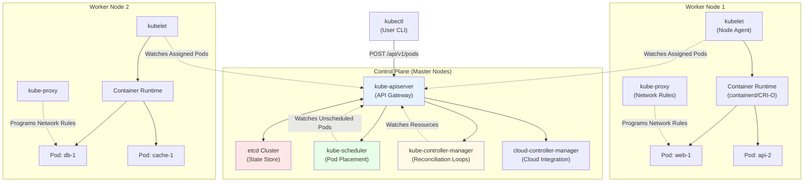
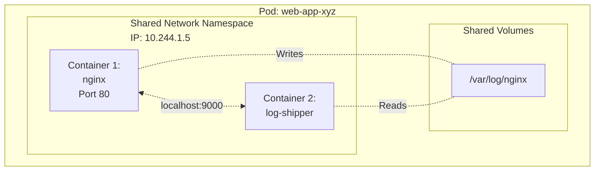
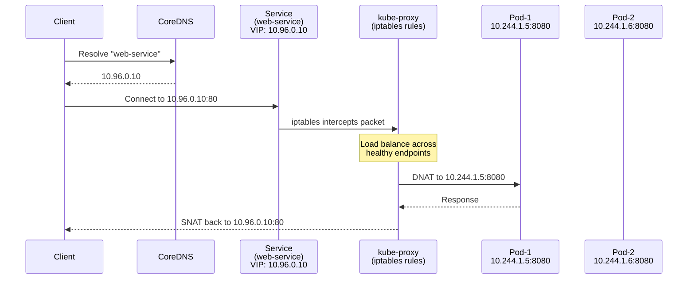
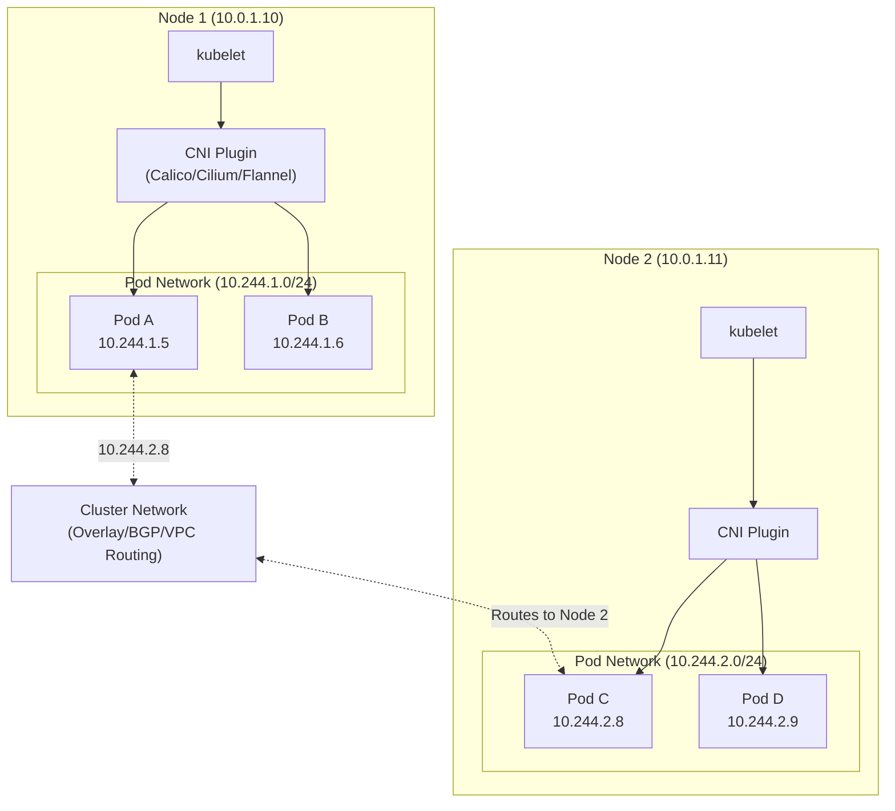
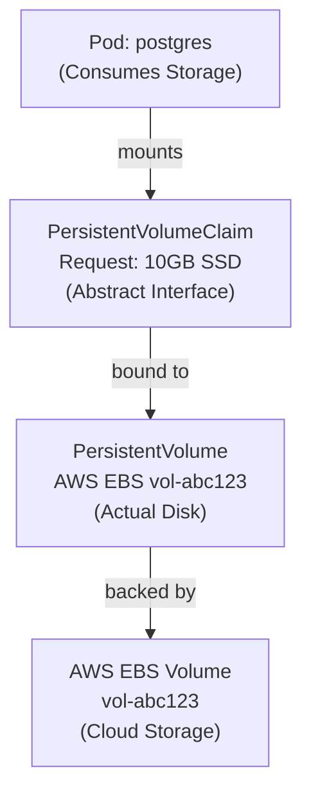
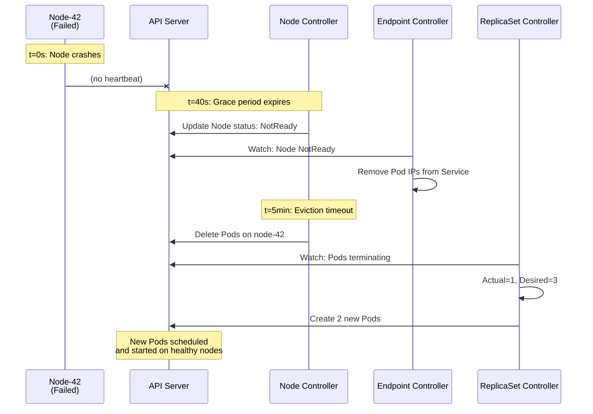

# Kubernetes Architecture: Container Orchestration at Scale

## 1. Introduction

### The Container Management Problem

**Scenario**: You're running an e-commerce platform with 50 microservices. Black Friday is approaching.

**Without Kubernetes**:
- **10:00 AM**: Traffic doubles. Your `payment-service` crashes (out of memory)
- **10:05 AM**: You manually SSH into servers, increase container memory, restart
- **10:15 AM**: `checkout-service` dies on server-03. You don't know which server it's on
- **10:20 AM**: You find it, restart it manually
- **10:25 AM**: Server-07's disk fills up. All containers on that server fail
- **10:30 AM**: You're still firefighting while customers abandon carts

**With Kubernetes**:
- **10:00 AM**: Payment service crashes
- **10:00:03 AM**: Kubernetes detects crash, automatically restarts container on healthy node
- **10:00:05 AM**: Service restored, zero manual intervention
- **10:05 AM**: Kubernetes auto-scales `checkout-service` from 3 to 10 replicas based on CPU
- **10:10 AM**: Server-07 disk fills. Kubernetes evacuates all Pods to healthy nodes within 30 seconds
- **You**: Drinking coffee, monitoring dashboards

**What is Kubernetes?**

Kubernetes is a **container orchestration platform** that automates deployment, scaling, and management of containerized applications across a cluster of machines. It treats your entire data center as a single compute resource.

**Key Differentiator**: 
- **Docker**: Runs containers on a single machine
- **Kubernetes**: Manages containers across thousands of machines as if they were one

**Industry Adoption**:
- **Google**: Runs billions of containers per week on Kubernetes (Borg → Kubernetes)
- **Spotify**: Manages 3,000+ services across global deployment
- **Pinterest**: Handles 1 million+ requests/second via Kubernetes
- **Every major cloud**: AWS (EKS), Azure (AKS), Google (GKE) offer managed Kubernetes

**Evolution**:
1. **2003-2014**: Google develops Borg (internal container orchestration)
2. **2014**: Google open-sources Kubernetes (Borg lessons applied)
3. **2015**: Kubernetes 1.0 released, donated to Cloud Native Computing Foundation (CNCF)
4. **2018**: Becomes first CNCF project to graduate (production-ready certification)
5. **2024**: De facto standard for container orchestration (80%+ market share)

---

## 2. Core Architecture



### Key Components

**Control Plane (Brain)**:

1. **kube-apiserver**: The only component that talks to etcd. All cluster operations flow through here. Acts as the REST API gateway.

2. **etcd**: Distributed key-value store. Single source of truth for ALL cluster state (Pods, Services, Secrets, everything).

3. **kube-scheduler**: Watches for newly created Pods with no assigned node. Decides which worker node should run each Pod based on resources, constraints, and affinity rules.

4. **kube-controller-manager**: Runs control loops that watch desired state (what you want) vs actual state (what exists) and reconciles differences. Contains 20+ controllers (Deployment, ReplicaSet, Node, Service controllers).

5. **cloud-controller-manager**: Integrates with cloud providers (AWS, Azure, GCP) to manage load balancers, storage volumes, and node lifecycle.

**Worker Nodes (Execution)**:

6. **kubelet**: Agent running on every worker node. Watches API server for Pods assigned to its node, ensures containers are running and healthy.

7. **kube-proxy**: Manages network rules on each node. Implements Services by routing traffic to appropriate Pods.

8. **Container Runtime**: Actually runs containers (containerd, CRI-O). Kubernetes talks to runtime via CRI (Container Runtime Interface).

**Control Plane vs Data Plane**:
- **Control Plane**: Decision-making components (API, scheduler, controllers) - typically 3-5 replicated nodes
- **Data Plane**: Execution layer (worker nodes running actual application Pods) - scales from 1 to 10,000+ nodes

---

## 3. How It Works: Basic Mechanics

### A. Declarative Configuration (The Core Philosophy)

**Imperative (Docker) approach**:
```bash
# You tell the system HOW to do things
docker run nginx
docker stop nginx
docker start nginx
if [ crashed ]; then docker restart nginx; fi
```

**Declarative (Kubernetes) approach**:
```yaml
# You tell the system WHAT you want
apiVersion: v1
kind: Pod
metadata:
  name: nginx
spec:
  containers:
  - name: nginx
    image: nginx:1.21
```

**What Happens**:

1. You submit the desired state to Kubernetes: "I want 1 nginx Pod running"
2. Kubernetes stores this in etcd
3. Control loops continuously check: Does 1 nginx Pod exist?
   - **If NO**: Create it
   - **If YES**: Do nothing
   - **If Pod crashes**: Recreate it automatically
4. You never manually start/stop containers. You update desired state, Kubernetes reconciles.

**Why This Matters**:
- **Self-healing**: Containers crash → Kubernetes automatically restarts them
- **Consistency**: You define infrastructure as code (version controlled, reviewable)
- **Scalability**: Change `replicas: 1` to `replicas: 100`, Kubernetes handles the rest

### B. Pod: The Atomic Unit

**Why Pod (not just Container)?**

**Problem**: You have a web application that needs:
- Main nginx container serving traffic
- Sidecar container collecting logs and shipping to ElasticSearch
- Shared volume between them for log files

**Solution**: Pod = group of containers that MUST run together on the same machine



**Pod Characteristics**:

1. **Shared Network**: All containers in a Pod share the same IP address. Container 1 can reach Container 2 via `localhost:9000`.

2. **Shared Storage**: Containers can mount the same volumes to share files.

3. **Scheduling Unit**: Kubernetes schedules the entire Pod to one node (containers never split across nodes).

4. **Ephemeral**: Pods are disposable. If a Pod dies, Kubernetes creates a NEW Pod (with new IP). Never "repair" a Pod.

**Lifecycle States**:

```
Pending → Running → Succeeded/Failed
   ↓         ↓            ↓
(Waiting) (Healthy)  (Completed/Crashed)
```

### C. Controllers: The Reconciliation Pattern

**Example: ReplicaSet Controller**

**Desired State** (stored in etcd):
```yaml
apiVersion: apps/v1
kind: ReplicaSet
metadata:
  name: web
spec:
  replicas: 3  # ← I want 3 Pods
  selector:
    matchLabels:
      app: web
  template:
    # Pod definition
```

**Controller Loop** (runs every 10 seconds):

```
while true:
    desired = 3 Pods with label app=web
    actual = Query API: How many Pods with app=web exist?
    
    if actual < desired:
        Create (desired - actual) new Pods
    elif actual > desired:
        Delete (actual - desired) excess Pods
    elif actual == desired:
        Do nothing (system is healthy)
    
    sleep 10 seconds
```

**Concrete Example**:

```
Time 0s: User creates ReplicaSet (replicas=3)
Time 1s: Controller sees 0 Pods, creates 3 Pods
Time 5s: Controller sees 3 Pods, does nothing ✓

Time 30s: Pod-1 crashes (node failure)
Time 31s: Controller sees 2 Pods, creates 1 new Pod
Time 35s: Controller sees 3 Pods, does nothing ✓

Time 60s: User updates ReplicaSet (replicas=5)
Time 61s: Controller sees 3 Pods (desired=5), creates 2 Pods
Time 65s: Controller sees 5 Pods, does nothing ✓
```

**This pattern repeats for EVERY resource**:
- **Deployment Controller**: Manages ReplicaSets
- **Node Controller**: Detects failed nodes, evicts Pods
- **Service Controller**: Updates load balancer backends
- **Job Controller**: Ensures batch jobs complete successfully

### D. Services: Stable Network Endpoints

**Problem**: Pods have ephemeral IPs. When a Pod restarts, it gets a NEW IP address.

**Scenario**:
```
10:00 AM: web-pod-1 (IP: 10.244.1.5) is running
          frontend connects to 10.244.1.5
10:05 AM: web-pod-1 crashes
10:05:03 AM: Kubernetes creates web-pod-2 (IP: 10.244.2.8)  ← Different IP!
          Frontend still trying to connect to 10.244.1.5 → FAILS
```

**Solution**: Service = stable virtual IP (VIP) that load balances across Pods

```yaml
apiVersion: v1
kind: Service
metadata:
  name: web-service
spec:
  selector:
    app: web  # Route traffic to Pods with this label
  ports:
  - port: 80
    targetPort: 8080
  type: ClusterIP
```

**How It Works**:



**Step-by-Step**:

1. **User creates Service**: Kubernetes allocates virtual IP `10.96.0.10` (ClusterIP)
2. **CoreDNS registers name**: `web-service.default.svc.cluster.local` → `10.96.0.10`
3. **kube-proxy watches Service**: Detects Pods with label `app=web`
4. **kube-proxy programs iptables**: "Traffic to 10.96.0.10:80 → redirect to Pod IPs"
5. **Client sends request**: `curl web-service:80`
6. **iptables intercepts**: Changes destination from `10.96.0.10:80` to `10.244.1.5:8080`
7. **Pod responds**: kube-proxy changes source back to `10.96.0.10` (client sees stable IP)

**Service remains stable even if ALL Pods die and restart with new IPs!**

---

## 4. Deep Dive: Internal Implementation

### A. Scheduling: How Pods Find Homes

**Scheduler's Job**: For each new Pod, pick the best node from 1,000 available nodes in <100ms.

**Three-Phase Process**:

#### Phase 1: Filtering (Feasibility)

Eliminate nodes that cannot run the Pod:

```
Pod Requirements:
  CPU: 2 cores
  Memory: 4GB
  Disk: SSD
  Zone: us-east-1a

Filtering:
  Node-1: CPU=1 core     → REJECT (insufficient CPU)
  Node-2: CPU=8 cores, Memory=2GB  → REJECT (insufficient memory)
  Node-3: CPU=8 cores, Memory=16GB, HDD → REJECT (needs SSD)
  Node-4: CPU=8 cores, Memory=16GB, SSD, Zone=us-east-1b → REJECT (wrong zone)
  Node-5: CPU=8 cores, Memory=16GB, SSD, Zone=us-east-1a → PASS ✓
  Node-6: CPU=8 cores, Memory=16GB, SSD, Zone=us-east-1a → PASS ✓
```

**Predicate Checks**:
1. **PodFitsResources**: Node has enough CPU/memory/ephemeral-storage
2. **PodFitsHost**: Pod explicitly requested this node via `nodeName`
3. **PodFitsHostPorts**: Port not already used by another Pod
4. **NoDiskConflict**: Volume can be mounted (not locked by another Pod)
5. **MatchNodeSelector**: Node labels match Pod's `nodeSelector`
6. **PodToleratesNodeTaints**: Pod tolerates node taints (e.g., node=gpu)

#### Phase 2: Scoring (Optimization)

Rank remaining nodes (0-100 points):

```
Scoring Functions:

LeastRequestedPriority:
  Node-5: (8 - 2) / 8 = 75% CPU free → Score: 75
  Node-6: (8 - 6) / 8 = 25% CPU free → Score: 25

BalancedResourceAllocation:
  Node-5: CPU 25% used, Memory 25% used → Score: 100 (balanced)
  Node-6: CPU 75% used, Memory 10% used → Score: 40 (imbalanced)

SelectorSpreadPriority:
  Node-5: Already has 2 Pods with app=web → Score: 30
  Node-6: Has 0 Pods with app=web → Score: 100 (spread Pods)

Final Scores:
  Node-5: (75 + 100 + 30) / 3 = 68
  Node-6: (25 + 40 + 100) / 3 = 55
```

#### Phase 3: Binding

```
1. Scheduler picks Node-5 (highest score)
2. Sends binding request to API server:
   POST /api/v1/namespaces/default/pods/web-pod-1/binding
   {
     "target": {
       "kind": "Node",
       "name": "node-5"
     }
   }
3. API server updates Pod in etcd:
   spec.nodeName: "node-5"
4. kubelet on node-5 sees Pod assigned, starts containers
```

**Performance**:
- **Single Pod**: 5-20ms scheduling latency
- **1,000 Pods burst**: Scheduler processes 100 Pods/second
- **5,000 node cluster**: Filtering + Scoring completes in 50-100ms

### B. Networking Model: Every Pod Gets an IP

**Understanding NAT (Network Address Translation)**:

Before explaining Kubernetes networking, let's understand what NAT is and why avoiding it matters.

**Scenario: Your Home Router**

```
Your home has 4 devices:
  - Laptop:       192.168.1.10 (private IP)
  - Phone:        192.168.1.11 (private IP)
  - Smart TV:     192.168.1.12 (private IP)
  - Home Router:  203.0.113.5 (PUBLIC IP from ISP)

Problem: You only have 1 public IP, but 4 devices need internet access!
```

**How NAT Works**:

```
Step 1: Laptop makes request to Google
  Source:      192.168.1.10:45678 (Laptop's private IP + random port)
  Destination: 142.250.80.46:443 (Google's server)

Step 2: Router intercepts packet (NAT Translation)
  Router records in NAT table:
    External: 203.0.113.5:12345 → Internal: 192.168.1.10:45678
  
  Router REWRITES packet:
    Source:      203.0.113.5:12345 (Router's public IP + new port)
    Destination: 142.250.80.46:443 (unchanged)

Step 3: Google receives packet, responds to 203.0.113.5:12345
  Response: 142.250.80.46:443 → 203.0.113.5:12345

Step 4: Router receives response, looks up NAT table
  Finds: Port 12345 → 192.168.1.10:45678
  
  Router REWRITES response:
    Destination: 192.168.1.10:45678 (Laptop's private IP)

Step 5: Laptop receives response as if it came directly from Google
```

**Why NAT is a Problem for Containers**:

```
Traditional Docker Setup (with NAT):

Host-A: 10.0.1.50 (public IP)
  └─ Container-1: 172.17.0.2 (private bridge IP)
  
Host-B: 10.0.1.51 (public IP)
  └─ Container-2: 172.17.0.2 (SAME private IP!)

Container-1 wants to talk to Container-2:
  ❌ Cannot use 172.17.0.2 (which container? Ambiguous!)
  ✅ Must use Host-B:8080 → NAT → Container-2
  
Problems:
  1. Port conflicts: What if both containers need port 8080?
  2. Complex routing: Need port mappings for every service
  3. Service discovery breaks: Cannot directly address containers
  4. Performance overhead: Every packet requires NAT translation
```

**Kubernetes Networking Requirements (No NAT!)**:

Instead of NAT, Kubernetes uses a **flat network model**:

1. **Every Pod has a unique cluster-wide IP** (no NAT between Pods)
2. **Pods can communicate with all other Pods** without NAT
3. **Nodes can communicate with all Pods** (and vice versa) without NAT

**Why This Matters**:

In Docker world:
```
Container-1 on Host-A: 172.17.0.2 (private Docker bridge IP)
Container-2 on Host-B: 172.17.0.2 (SAME IP! Isolated by host)

To communicate: Use port mapping (Host-A:8080 → Container-1:80)
```

In Kubernetes:
```
Pod-1 on Node-A: 10.244.1.5 (cluster-unique IP)
Pod-2 on Node-B: 10.244.2.8 (cluster-unique IP)

Pod-1 can directly connect to 10.244.2.8 (no port mapping!)
```

**What is CNI (Container Network Interface)?**

**The Problem**: Kubernetes needs networking, but doesn't want to be locked into one implementation.

**Analogy**: CNI is like a **power outlet standard** (US, EU, UK plugs).

```
Without Standard:                With Standard (CNI):
  Every appliance →                Any appliance →
  Custom wiring per device         Standard plug →
  Electrician needed               Works anywhere

  Every container engine →         Any container →
  Custom networking per tool       CNI interface →
  Tied to one solution            Works with any plugin
```

**Why CNI Exists**:

1. **Different environments need different networking**:
   - **AWS**: Use VPC native IPs (no overlay needed)
   - **On-Premise**: BGP routing between physical routers
   - **Multi-Cloud**: Overlay network (VXLAN) across data centers
   - **Security-First**: eBPF-based filtering (Cilium)

2. **Kubernetes doesn't implement networking**: It delegates to plugins via standard interface

**How CNI Works - The Interface**:

```
Kubernetes says:     "I need networking for this Pod"
                     ↓
                 CNI Standard Interface
                     ↓
CNI Plugin says:     "I'll handle that!"


The Interface (simplified):
  ADD:    Create network for new Pod
  DEL:    Remove network for deleted Pod
  CHECK:  Verify network still works
```

**CNI Plugin Job**:

When kubelet says "ADD Pod-123":

```
Step 1: Allocate IP address
  IPAM (IP Address Management) component:
    "Node-1 has CIDR 10.244.1.0/24"
    "Next available IP: 10.244.1.5"
    → Assign 10.244.1.5 to Pod-123

Step 2: Create network interface
  Create veth pair (virtual ethernet cable):
    One end: In Pod's network namespace (eth0)
    Other end: In node's network namespace (vethXXX)

Step 3: Configure IP on interface
  Inside Pod: ip addr add 10.244.1.5/24 dev eth0

Step 4: Set up routing
  Inside Pod: ip route add default via 10.244.1.1
  (10.244.1.1 is the gateway - typically the node)

Step 5: Advertise Pod network to cluster
  Different per plugin:
    - Calico: BGP announcement to routers
    - Flannel: Update etcd with route mapping
    - Cilium: eBPF route injection
```

**Key Insight**: kubelet doesn't know HOW networking works. It just executes the CNI plugin binary and trusts it to set up connectivity.

**Implementation via CNI**:



**Pod Creation Network Flow**:

```
Step 1: kubelet calls CNI plugin
  ADD command with Pod namespace ID

Step 2: CNI IPAM allocates IP
  10.244.1.5 (from node's Pod CIDR block)

Step 3: CNI creates veth pair
  vethXXX (in node namespace) ↔ eth0 (in Pod namespace)

Step 4: CNI assigns IP to Pod's eth0
  ip addr add 10.244.1.5/24 dev eth0

Step 5: CNI configures routing
  Inside Pod: default gateway → node's bridge/interface
  On Node: 10.244.1.5 → vethXXX

Step 6: CNI updates cluster routing
  Announce: "10.244.1.0/24 is on Node-1" (BGP/Overlay)
```

**Popular CNI Implementations**:

| CNI Plugin | How It Routes Pods | Performance | Use Case |
|:-----------|:-------------------|:------------|:---------|
| **Calico** | BGP routing (no encapsulation) | High (native L3) | On-prem, bare metal |
| **Cilium** | eBPF-based routing | Highest (kernel bypass) | Security-focused, observability |
| **Flannel** | VXLAN overlay | Medium (encapsulation overhead) | Simple, AWS/GCP compatibility |
| **AWS VPC CNI** | Direct VPC IP assignment | High (no overlay) | AWS-only, uses ENI IPs |

### C. Storage: Persistent Volumes

**Problem**: Containers are ephemeral. When a Pod restarts, all data in the container filesystem is LOST.

**Scenario**:
```
PostgreSQL Pod crashes
Kubernetes restarts it on new node
Database is empty (all data gone!)
```

**Solution**: PersistentVolume (PV) + PersistentVolumeClaim (PVC)

**Three-Layer Abstraction**:



**Step-by-Step**:

**1. Admin provisions storage** (or dynamic provisioner does it):
```yaml
apiVersion: v1
kind: PersistentVolume
metadata:
  name: pv-database
spec:
  capacity:
    storage: 10Gi
  accessModes:
  - ReadWriteOnce  # Only one node can mount
  awsElasticBlockStore:
    volumeID: vol-abc123
    fsType: ext4
```

**2. User requests storage**:
```yaml
apiVersion: v1
kind: PersistentVolumeClaim
metadata:
  name: postgres-pvc
spec:
  accessModes:
  - ReadWriteOnce
  resources:
    requests:
      storage: 10Gi
  storageClassName: fast-ssd
```

**3. Kubernetes binds PVC → PV**:
```
PVC Controller:
  1. Sees new PVC requesting 10GB ReadWriteOnce
  2. Finds matching PV with 10GB+ capacity
  3. Binds PVC to PV (creates association in etcd)
```

**4. Pod uses PVC**:
```yaml
apiVersion: v1
kind: Pod
metadata:
  name: postgres
spec:
  containers:
  - name: postgres
    image: postgres:14
    volumeMounts:
    - name: data
      mountPath: /var/lib/postgresql/data
  volumes:
  - name: data
    persistentVolumeClaim:
      claimName: postgres-pvc
```

**5. kubelet mounts volume**:
```
When Pod scheduled to Node-5:
  1. kubelet sees Pod needs PVC "postgres-pvc"
  2. Looks up bound PV: "pv-database" (AWS EBS vol-abc123)
  3. Calls AWS API: AttachVolume(vol-abc123, node-5)
  4. Waits for volume to attach (~10 seconds)
  5. Mounts volume: mount /dev/xvdf /var/lib/kubelet/pods/.../volumes/
  6. Bind-mounts into container: /var/lib/postgresql/data
```

**6. Pod crashes and restarts on Node-7**:
```
  1. kubelet on Node-5 detects Pod gone
  2. Unmounts volume, calls AWS DetachVolume(vol-abc123)
  3. kubelet on Node-7 sees new Pod assignment
  4. Calls AWS AttachVolume(vol-abc123, node-7)
  5. Mounts volume (data persists! Database intact)
```

**Volume Lifecycle**:

```
Available → Bound → Released → [Reclaimed/Deleted]
    ↓         ↓         ↓              ↓
(No PVC)  (PVC uses) (PVC deleted) (Policy: Retain/Delete)
```

---

## 5. End-to-End Walkthrough: Deploying a Web Application

Let's deploy a 3-tier application (frontend, API, database) and trace every component interaction.

**Application Architecture**:
```
Frontend (React) → API Service (Node.js) → Database Service (PostgreSQL)
     3 replicas          3 replicas            1 replica + PV
```

### Step 1: User Submits Deployment (t=0s)

**Component**: Developer workstation

**Action**: Run `kubectl apply -f app.yaml`

```yaml
# app.yaml (simplified)
apiVersion: apps/v1
kind: Deployment
metadata:
  name: api
spec:
  replicas: 3
  selector:
    matchLabels:
      app: api
  template:
    metadata:
      labels:
        app: api
    spec:
      containers:
      - name: api
        image: mycompany/api:v1.2.3
        ports:
        - containerPort: 3000
        resources:
          requests:
            cpu: 500m
            memory: 512Mi
```

**State Change**: kubectl sends HTTP POST to kube-apiserver `/apis/apps/v1/deployments`

**Timing**: 5ms (local → API server network latency)

### Step 2: API Server Validates and Stores (t=5ms)

**Component**: kube-apiserver

**Action**:
1. **Authentication**: Verify user's kubeconfig credentials (cert, token, etc.)
2. **Authorization**: Check RBAC - does user have `create deployments` permission?
3. **Admission Controllers**: Run validating webhooks
   - **Namespace exists?** Check `default` namespace present
   - **Resource quotas?** Namespace allows 3 more Pods?
   - **Pod Security?** Image registry allowed?
4. **Validation**: Schema check - all fields valid?
5. **Write to etcd**: Serialize Deployment as Protobuf → Store at key `/registry/deployments/default/api`

**State Change**: 
- etcd revision increments: 5000 → 5001
- Deployment stored with `resourceVersion: "5001"`

**Timing**: 10-20ms (includes etcd consensus write)

### Step 3: Deployment Controller Creates ReplicaSet (t=25ms)

**Component**: kube-controller-manager (Deployment Controller)

**Action**:
```
Deployment Controller Loop:

Watch Event: ADDED Deployment "api"
Observed Spec:
  - replicas: 3
  - selector: app=api
  - Pod template: mycompany/api:v1.2.3

Current State:
  - ReplicaSets matching selector: 0

Decision: Create new ReplicaSet

POST /apis/apps/v1/replicasets
{
  name: "api-7d8f4b9c"  ← Generated from template hash
  replicas: 3
  selector: {app: api}
  template: <Pod template from Deployment>
  ownerReferences: [Deployment/api]  ← Garbage collection link
}
```

**State Change**: ReplicaSet `api-7d8f4b9c` created in etcd (revision 5002)

**Timing**: 10ms

### Step 4: ReplicaSet Controller Creates Pods (t=35ms)

**Component**: kube-controller-manager (ReplicaSet Controller)

**Action**:
```
ReplicaSet Controller Loop:

Watch Event: ADDED ReplicaSet "api-7d8f4b9c"
Desired: replicas=3
Actual: Pods with label app=api = 0

Decision: Create 3 Pods

For i in 1..3:
  POST /api/v1/pods
  {
    name: "api-7d8f4b9c-<random-5-chars>"
    labels: {app: api, pod-template-hash: 7d8f4b9c}
    spec: <Pod template>
  }
```

**Created Pods**:
- `api-7d8f4b9c-abc12` (status: Pending, nodeName: null)
- `api-7d8f4b9c-def34` (status: Pending, nodeName: null)
- `api-7d8f4b9c-ghi56` (status: Pending, nodeName: null)

**State Change**: 3 Pods created in etcd (revisions 5003, 5004, 5005)

**Timing**: 15ms (3 serial API calls)

### Step 5: Scheduler Assigns Pods to Nodes (t=50ms)

**Component**: kube-scheduler

**Action** (for each Pod):
```
Scheduler Loop:

Watch Event: 3 new Pods with nodeName=null

For Pod "api-7d8f4b9c-abc12":

Phase 1: Filter Nodes
  - Cluster has 100 nodes
  - Pod requests: 500m CPU, 512Mi memory
  - After filtering: 45 nodes feasible

Phase 2: Score Nodes
  Node-12: Score 85 (low CPU usage, good spread)
  Node-34: Score 72
  Node-56: Score 91 (WINNER)
  ...

Phase 3: Bind Pod to Node-56
  POST /api/v1/pods/api-7d8f4b9c-abc12/binding
  {"target": {"name": "node-56"}}
```

**State Change**:
- Pod `api-7d8f4b9c-abc12`: `spec.nodeName: "node-56"` (etcd rev 5006)
- Pod `api-7d8f4b9c-def34`: `spec.nodeName: "node-23"` (etcd rev 5007)
- Pod `api-7d8f4b9c-ghi56`: `spec.nodeName: "node-78"` (etcd rev 5008)

**Timing**: 15ms per Pod (parallel processing) = 15ms total

### Step 6: kubelet Pulls Image and Starts Container (t=65ms)

**Component**: kubelet on node-56

**Action**:
```
kubelet Watch Loop on Node-56:

Watch Event: Pod "api-7d8f4b9c-abc12" assigned to node-56

Step 1: Create Pod Sandbox (t=70ms)
  - Call CRI: RunPodSandbox()
  - Container runtime creates pause container
  - Allocates network namespace

Step 2: Call CNI to Setup Networking (t=75ms)
  - CNI IPAM assigns IP: 10.244.56.10
  - Creates veth pair: vethXXX ↔ pod eth0
  - Configures routes

Step 3: Pull Image (t=80ms)
  - Check local cache: mycompany/api:v1.2.3 not present
  - Pull from registry (could take 5-60 seconds if not cached)
  - ASSUME cached locally: 50ms

Step 4: Create Application Container (t=130ms)
  - Call CRI: CreateContainer(mycompany/api:v1.2.3)
  - Mount volumes (none in this example)
  - Set environment variables
  - Configure cgroups (CPU: 500m, Memory: 512Mi)

Step 5: Start Container (t=150ms)
  - Call CRI: StartContainer()
  - Container starts, runs entrypoint
  - Application boots (assume 2 seconds)

Step 6: Health Check Probe (t=2.2s)
  - kubelet runs readiness probe (HTTP GET /health)
  - If 200 OK → Mark Pod Ready
```

**State Change**:
```
t=150ms:
  Pod status.phase: "Running"
  Pod status.podIP: "10.244.56.10"
  Container state: Running (startedAt: 2024-01-12T00:00:00Z)

t=2.2s:
  Pod status.conditions:
    - type: Ready
      status: True
```

**Timing**: 
- Container start: 150ms
- Application boot: 2 seconds
- **Total to Ready**: ~2.2 seconds per Pod

### Step 7: Service Creation and Endpoint Discovery (t=2.5s)

**User Action**: `kubectl apply -f service.yaml`

```yaml
apiVersion: v1
kind: Service
metadata:
  name: api-service
spec:
  selector:
    app: api
  ports:
  - port: 80
    targetPort: 3000
  type: ClusterIP
```

**Component**: kube-apiserver + Endpoint Controller

**Action**:
```
t=2.5s: API server allocates ClusterIP
  - Pick IP from service-cluster-ip-range: 10.96.0.50
  - Store Service in etcd

t=2.51s: Endpoint Controller watches Service
  - Query Pods with selector: app=api
  - Finds 3 Ready Pods:
      10.244.56.10:3000 (node-56)
      10.244.23.15:3000 (node-23)
      10.244.78.22:3000 (node-78)
  - Creates EndpointSlice:
      endpoints:
      - 10.244.56.10:3000
      - 10.244.23.15:3000
      - 10.244.78.22:3000
```

**State Change**: EndpointSlice created (etcd rev 5009)

**Timing**: 10-50ms

### Step 8: kube-proxy Programs Network Rules (t=2.55s)

**Component**: kube-proxy on all nodes

**Action** (on every node):
```
kube-proxy Watch Loop:

Watch Event: New Service "api-service" (ClusterIP: 10.96.0.50:80)
Watch Event: New EndpointSlice (backends: 3 Pod IPs)

Programming iptables rules:

# DNAT: Intercept traffic to ClusterIP
iptables -t nat -A KUBE-SERVICES \
  -d 10.96.0.50 -p tcp --dport 80 \
  -j KUBE-SVC-API

# Load balance to Pod-1 (33% probability)
iptables -t nat -A KUBE-SVC-API \
  -m statistic --mode random --probability 0.33 \
  -j DNAT --to-destination 10.244.56.10:3000

# Load balance to Pod-2 (50% of remaining)
iptables -t nat -A KUBE-SVC-API \
  -m statistic --mode random --probability 0.50 \
  -j DNAT --to-destination 10.244.23.15:3000

# Load balance to Pod-3 (remainder)
iptables -t nat -A KUBE-SVC-API \
  -j DNAT --to-destination 10.244.78.22:3000
```

**State Change**: All nodes can now route traffic to `10.96.0.50:80`

**Timing**: 50-100ms (iptables rule insertion)

### Step 9: DNS Registration (t=2.6s)

**Component**: CoreDNS

**Action**:
```
CoreDNS Watch Loop:

Watch Event: New Service "api-service" in namespace "default"

Add DNS Record:
  api-service.default.svc.cluster.local → 10.96.0.50
  
DNS Resolution:
  dig api-service.default.svc.cluster.local
  Answer: 10.96.0.50 (TTL: 30s)
```

**State Change**: DNS entry cached in CoreDNS

**Timing**: Immediate (in-memory update)

### Step 10: Application Traffic Flow (t=3s+)

**Component**: Frontend Pod making API request

**Action**:
```
Frontend Pod (10.244.12.5) → API Service:

Step 1: DNS Lookup
  Client: Resolve "api-service"
  CoreDNS: 10.96.0.50

Step 2: Send HTTP Request
  SRC: 10.244.12.5:45678
  DST: 10.96.0.50:80
  Packet: GET /api/users

Step 3: kube-proxy Intercepts (on source node)
  iptables rule matches: DST=10.96.0.50
  Random selection: To Pod-2 (10.244.23.15:3000)
  DNAT: DST → 10.244.23.15:3000

Step 4: CNI Routes Packet
  Packet routed via overlay/BGP to node-23

Step 5: Pod Receives Request
  API container on node-23 receives HTTP packet
  Application processes request, queries database

Step 6: Response Path
  Pod-2 sends response:
    SRC: 10.244.23.15:3000
    DST: 10.244.12.5:45678
  
  kube-proxy SNAT (reverses DNAT):
    SRC → 10.96.0.50:80
  
  Frontend receives response from "10.96.0.50" (stable IP!)
```

**Timing**:
- DNS lookup: 1-5ms (cached after first request)
- Packet routing: 1-10ms (intra-cluster)
- Application processing: 10-100ms (depends on business logic)

### Performance Summary

| Phase | Timing | Latency |
|:------|:-------|:--------|
| kubectl → API server | t=0ms | 5ms |
| API validation + etcd write | t=5ms | 20ms |
| Controller creates ReplicaSet | t=25ms | 10ms |
| Controller creates Pods | t=35ms | 15ms |
| Scheduler assigns nodes | t=50ms | 15ms |
| kubelet starts containers | t=65ms | 2.2s |
| Service created | t=2.5s | 10ms |
| kube-proxy programs rules | t=2.55s | 50ms |
| **Total to application ready** | **t=2.6s** | — |
| First request served | t=3s+ | 15ms |

**Bottlenecks**:
- **Image pull**: Can add 10-120 seconds if not cached (mitigate: image pre-pull, registry mirrors)
- **Application boot**: 2 seconds (optimize: use compiled languages, lazy loading)
- **Storage attachment**: If using PV, add 10-30 seconds for volume attach

---


## 6. Failure Scenarios

### Scenario A: Node Failure and Pod Eviction

**Symptom**: Worker node becomes unresponsive. All Pods on that node stop serving traffic.

**Cause**: Hardware failure, kernel panic, network partition, or kubelet crash.

**Mechanism** (step-by-step):

```
t=0s: Node-42 crashes (power failure)

t=0s-40s:
  - kubelet on node-42 stops sending heartbeats to API server
  - API server marks node "NotReady" but does NOT evict Pods yet
  - Reason: Temporary network glitch shouldn't cause Pod churn

t=40s: Node Controller detects sustained failure
  - Node condition: Ready=False for 40 seconds (grace period)
  - Node Controller updates node status: "NotReady"

t=40s-5min:
  - Pods on node-42 still exist in etcd (status: Running)
  - BUT they cannot serve traffic (endpoints removed from Service)
  - Endpoint Controller removes node-42 Pod IPs from EndpointSlices
  - kube-proxy updates iptables (traffic now goes to healthy Pods only)

t=5min: Pod Eviction Triggered
  - Node Controller waits "pod-eviction-timeout" (default 5 minutes)
  - Marks all Pods on node-42 for deletion
  - Pods enter "Terminating" state

t=5min + 5s: ReplicaSet Controller Reconciles
  - Desired Replicas: 3
  - Running Replicas: 1 (2 were on node-42, now terminating)
  - Creates 2 new Pods on healthy nodes

t=5min + 10s: Scheduler assigns new Pods to nodes
t=5min + 15s: New Pods start on healthy nodes
t=5min + 17s: New Pods become Ready

Total Downtime for Affected Pods: 5 minutes 17 seconds
```

**Diagram**:



**The Fix** (Configuration to reduce downtime):

1. **Reduce eviction timeout**: `--pod-eviction-timeout=1m` (from 5m)
   - **Trade-off**: More aggressive recovery, but may cause unnecessary evictions during temporary network issues

2. **Use Pod Disruption Budgets**:
```yaml
apiVersion: policy/v1
kind: PodDisruptionBudget
metadata:
  name: api-pdb
spec:
  minAvailable: 2  # Always keep 2 Pods running
  selector:
    matchLabels:
      app: api
```

3. **Configure Pod Anti-Affinity** (spread Pods across nodes):
```yaml
affinity:
  podAntiAffinity:
    requiredDuringSchedulingIgnoredDuringExecution:
    - labelSelector:
        matchLabels:
          app: api
      topologyKey: kubernetes.io/hostname
```
   - Ensures Pods never co-locate on same node
   - Node failure affects at most 1 Pod

### Scenario B: Resource Starvation (OOM Kill)

**Symptom**: Pods randomly crash with exit code 137. Logs show "OOMKilled" status.

**Cause**: Container memory usage exceeded `limits.memory`, triggering Linux OOM killer.

**Mechanism**:

```
Step 1: Pod starts with configuration
  resources:
    requests:
      memory: 512Mi  ← Scheduler uses this for placement
    limits:
      memory: 1Gi    ← Kernel enforces this via cgroups

Step 2: Container's Memory Cgroup Set
  kubelet configures cgroup:
  memory.limit_in_bytes = 1073741824  (1Gi)

Step 3: Application Allocates Memory
  t=0s:   Memory usage: 200Mi
  t=10s:  Memory usage: 600Mi
  t=20s:  Memory usage: 950Mi (approaching limit)
  t=25s:  Memory usage: 1025Mi (EXCEEDS 1Gi limit!)

Step 4: Kernel OOM Killer Triggered
  - Linux kernel detects cgroup memory exceeded
  - OOM killer selects process to kill
  - Sends SIGKILL to container process
  - Container exits with code 137 (128 + 9 SIGKILL)

Step 5: Kubelet Detects Container Exit
  - Pod status: CrashLoopBackOff
  - Restart count increments
  - Exponential backoff: 0s → 10s → 20s → 40s → 80s (max 5min)

Step 6: Pod Keeps Crashing
  - If memory leak exists, Pod crashes repeatedly
  - After 10 restarts in 10 minutes → backoff maxes out
  - Pod restarts every 5 minutes indefinitely
```

**The Fix**:

1. **Increase memory limits** (if legitimate usage):
```yaml
resources:
  requests:
    memory: 1Gi
  limits:
    memory: 2Gi  # Double the limit
```

2. **Set requests = limits** (guaranteed QoS):
```yaml
resources:
  requests:
    memory: 1Gi
    cpu: 1000m
  limits:
    memory: 1Gi  # Same as request
    cpu: 1000m
```
   - Pod gets "Guaranteed" QoS class
   - Never evicted due to resource pressure on other Pods

3. **Profile memory usage**:
   - Use `kubectl top pod <name>` to monitor real-time usage
   - Add Prometheus metrics to track memory trends
   - Fix memory leaks in application code

### Scenario C: DNS Resolution Failures

**Symptom**: Pods cannot resolve Service names. Application logs show "getaddrinfo: Name or service not known".

**Cause**: CoreDNS Pods overwhelmed, network policy blocking DNS, or ndots configuration issue.

**Mechanism**:

```
Problem: Application tries to resolve "api-service"

Step 1: Pod's /etc/resolv.conf
  nameserver 10.96.0.10  ← ClusterIP of kube-dns Service
  search default.svc.cluster.local svc.cluster.local cluster.local
  options ndots:5

Step 2: ndots=5 Causes Excessive Queries
  Application queries: "api-service"
  
  Due to ndots=5 (require 5 dots to treat as FQDN):
    Query 1: api-service.default.svc.cluster.local     (asks DNS)
    Query 2: api-service.svc.cluster.local             (asks DNS)
    Query 3: api-service.cluster.local                 (asks DNS)
    Query 4: api-service (finally succeeds)
  
  Each application request = 3-4 DNS queries!

Step 3: CoreDNS Overloaded
  - 1000 requests/sec * 4 queries = 4000 DNS queries/sec
  - CoreDNS Pods (2 replicas, 1 CPU each) saturate at 3000 QPS
  - Queries start timing out (5 second timeout)
  - Applications fail with DNS errors

Step 4: Cascading Failures
  - Slow DNS → Application timeouts
  - Applications retry → More DNS load
  - CoreDNS crashes (OOM from query cache)
  - Zero DNS resolution cluster-wide
```

**The Fix**:

1. **Use fully qualified domain names** in application code:
```javascript
// ❌ Bad: Triggers 4 DNS queries
fetch('http://api-service/users')

// ✅ Good: Single DNS query
fetch('http://api-service.default.svc.cluster.local/users')
```

2. **Reduce ndots value** (in Pod spec):
```yaml
spec:
  dnsConfig:
    options:
    - name: ndots
      value: "1"  # Only append search domains if fewer than 1 dot
```

3. **Scale CoreDNS**:
```bash
# Auto-scale CoreDNS based on cluster size
kubectl scale deployment coredns --replicas=5 -n kube-system
```

---

## 7. Performance Tuning / Scaling Strategies

### A. Control Plane Tuning

| Configuration | Recommended Value | Why? |
|:--------------|:------------------|:-----|
| **kube-apiserver** | | |
| `--max-requests-inflight` | 400 (default: 200) | Allows more concurrent read requests to API server |
| `--max-mutating-requests-inflight` | 200 (default: 100) | Higher write concurrency for deployments at scale |
| `--watch-cache-sizes` | `pods#1000,services#100` | Dedicate more memory to high-churn resources |
| **etcd** | | |
| `--quota-backend-bytes` | 8589934592 (8GB) | Prevent database "out of space" errors (default 2GB too low) |
| `--auto-compaction-retention` | `8h` | Automatically clean up old revisions (reduce DB size) |
| **kube-scheduler** | | |
| `--kube-api-qps` | 100 (default: 50) | Allow scheduler to query API server faster |

### B. Horizontal Pod Autoscaling (HPA)

```yaml
apiVersion: autoscaling/v2
kind: HorizontalPodAutoscaler
metadata:
  name: api-hpa
spec:
  scaleTargetRef:
    apiVersion: apps/v1
    kind: Deployment
    name: api
  minReplicas: 3
  maxReplicas: 50
  metrics:
  - type: Resource
    resource:
      name: cpu
      target:
        type: Utilization
        averageUtilization: 70  # Scale when avg CPU > 70%
  behavior:
    scaleUp:
      stabilizationWindowSeconds: 60   # Wait 60s before scaling up again
```

**HPA Algorithm**:
```
desiredReplicas = ceil(currentReplicas * (currentMetric / targetMetric))

Example:
  Current: 10 replicas, avg CPU 85%
  Target: 70% CPU
  Desired: ceil(10 * (85 / 70)) = ceil(12.14) = 13 replicas
```

---

## 8. Constraints & Limitations

| Constraint | Limit | Why? |
|:-----------|:------|:-----|
| **Cluster Size** | ~5,000 nodes (tested) | etcd performance degrades; control plane CPU/memory limits |
| **Pods per Cluster** | ~150,000 (tested) | API server watch cache memory usage; etcd database size |
| **Pods per Node** | 110 (default), 250 (max) | CNI IP address allocation; kubelet resource consumption |
| **Service Endpoints** | 1,000 endpoints/Service | iptables rules performance (use IPVS for 10,000+) |
| **ConfigMap/Secret Size** | 1 MB per object | etcd value size limit; API server memory usage |
| **etcd Database Size** | ~8 GB (recommended max) | BoltDB performance degrades; defrag time increases |

---

## 9. When to Use?

| Use Case | Verdict | Why? |
|:---------|:--------|:-----|
| **Microservices Architecture (10+ services)** | ✅ **YES** | Kubernetes excels at multi-service orchestration, service discovery, rolling updates |
| **Stateless Web Applications** | ✅ **YES** | Easy horizontal scaling, auto-healing, zero-downtime deployments |
| **Batch Processing / Cron Jobs** | ✅ **YES** | CronJob resource for scheduled tasks, Job resource for one-off workloads |
| **Machine Learning Inference** | ✅ **YES** | GPU scheduling, horizontal scaling for inference, model rollout strategies |
| **Legacy Monolith (Single 10GB JAR)** | ❌ **NO** | Operational overhead not justified; use VM or managed service |
| **Extremely Low-Latency (<1ms P99)** | ❌ **NO** | Network overlay adds 0.5-2ms latency; use bare metal |
| **Small Project (<3 services)** | ❌ **NO** | Complexity outweighs benefits; use Docker Compose |

---

## 10. Production Checklist

### Pre-Deployment Checklist

1. **[ ] Control Plane High Availability**
   - Deploy 3 or 5 control plane nodes (odd number for etcd quorum)
   - Spread control plane across 3 availability zones

2. **[ ] etcd Backup and Recovery**
   - Automated snapshots every 6 hours: `etcdctl snapshot save`
   - Store snapshots in S3/GCS with 30-day retention
   - Test restore procedure quarterly

3. **[ ] Resource Quotas and LimitRanges**
   ```yaml
   apiVersion: v1
   kind: ResourceQuota
   metadata:
     name: default-quota
   spec:
     hard:
       requests.cpu: "100"
       requests.memory: 200Gi
   ```

4. **[ ] Network Policies (Default Deny)**
   ```yaml
   apiVersion: networking.k8s.io/v1
   kind: NetworkPolicy
   metadata:
     name: default-deny-all
   spec:
     podSelector: {}
     policyTypes:
     - Ingress
     - Egress
   ```

5. **[ ] Monitoring and Alerting**
   - Prometheus + Grafana for metrics
   - Logging: Fluentd → ElasticSearch/Loki

6. **[ ] Cluster Autoscaler**
   - Configure node auto-scaling
   - Set scale-down delay to 10 minutes

### Critical Metrics to Monitor

**etcd Health**:
```
etcd_disk_wal_fsync_duration_seconds:
  Description: Time taken to fsync WAL to disk
  Target: P99 < 10ms
  Why it matters: High fsync latency indicates slow disk; causes API server write delays
  Fix: Use NVMe SSD; check disk I/O wait time

etcd_mvcc_db_total_size_in_bytes:
  Description: Total size of etcd database
  Target: < 4GB (warn at 6GB)
  Why it matters: Large DB slows reads; defrag time increases
  Fix: Enable auto-compaction; manually compact old revisions
```

**API Server Performance**:
```
apiserver_request_duration_seconds:
  Description: API server request latency
  Target: P99 < 1s for GET, < 5s for POST/PUT
  Why it matters: High latency impacts kubectl, controllers, schedulers
  Fix: Scale API server horizontally; increase --max-requests-inflight
```

**Scheduler Performance**:
```
scheduler_pending_pods:
  Description: Pods waiting to be scheduled
  Target: 0 in healthy cluster
  Why it matters: Pending Pods mean insufficient resources or unsatisfiable constraints
  Fix: Add nodes; review Pod affinity/taints
```

**Application Metrics**:
```
kube_pod_container_status_restarts_total:
  Description: Container restart count
  Target: 0 (restarts indicate crashes)
  Why it matters: Frequent restarts mean OOMKilled or liveness probe failures
  Fix: Increase memory limits; fix application bugs
```

---

**Summary Performance Targets**:

| Metric | Target | Alert Threshold |
|:-------|:-------|:----------------|
| Pod startup time | < 5s (cached image) | > 30s |
| Deployment rollout | < 2 minutes (10 Pods) | > 10 minutes |
| Scheduler latency | P99 < 100ms | P99 > 1s |
| API server latency (GET) | P99 < 500ms | P99 > 2s |
| etcd fsync duration | P99 < 10ms | P99 > 50ms |
| DNS resolution latency | P99 < 10ms | P99 > 100ms |

