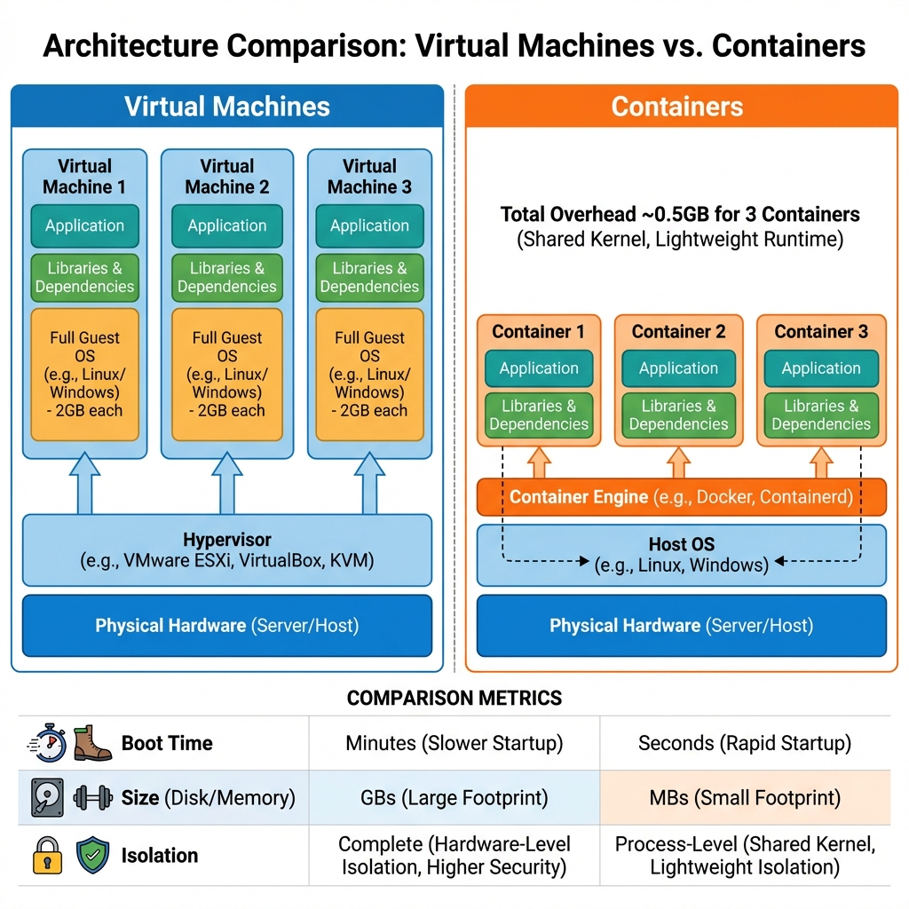
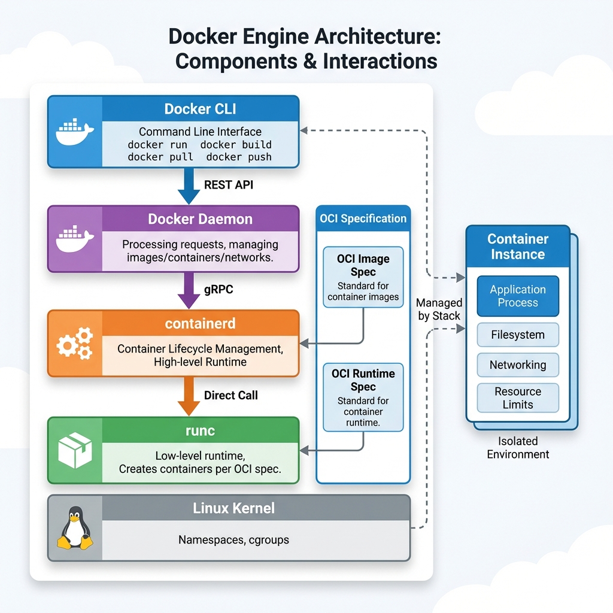
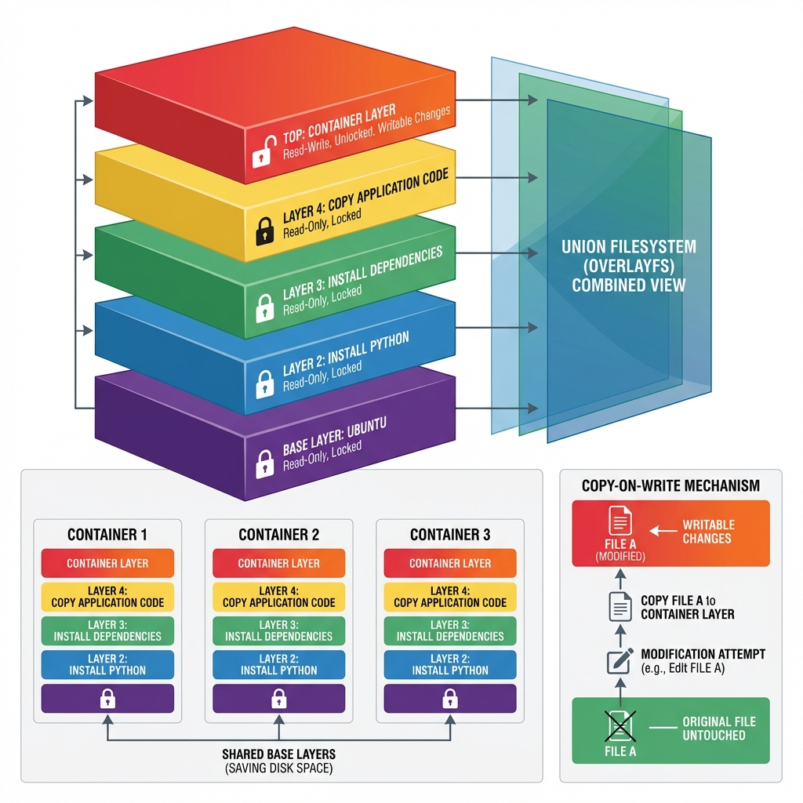
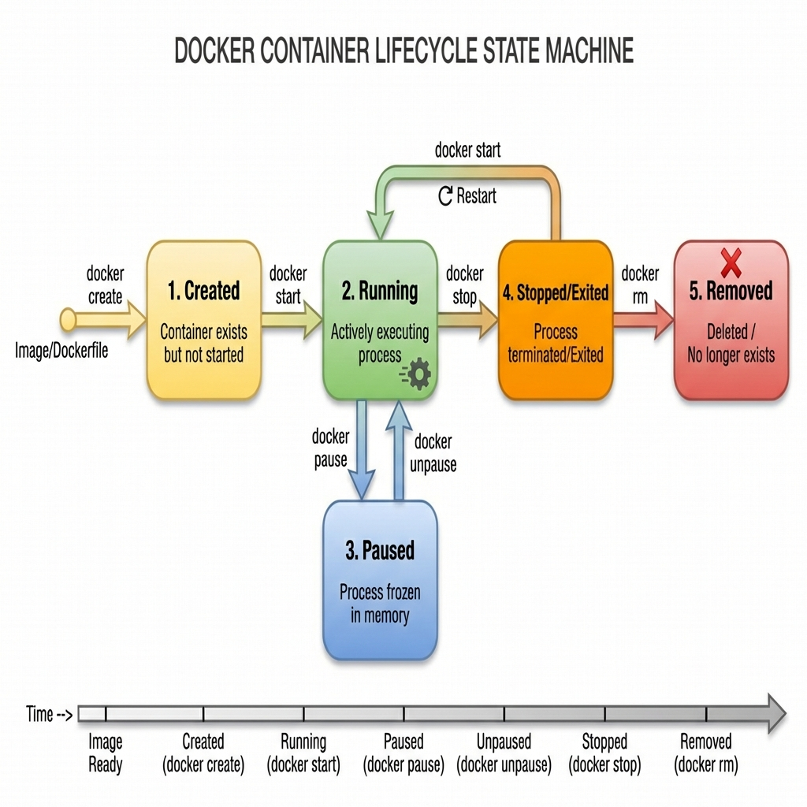
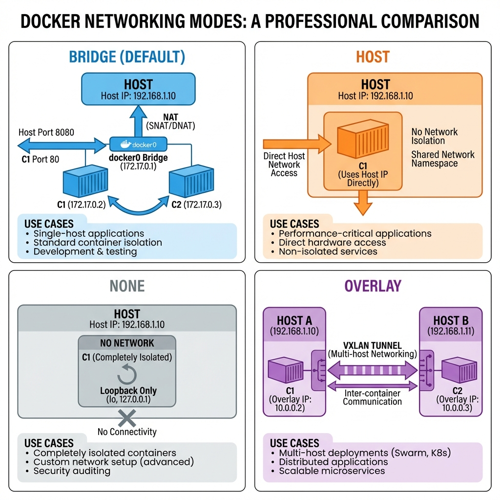
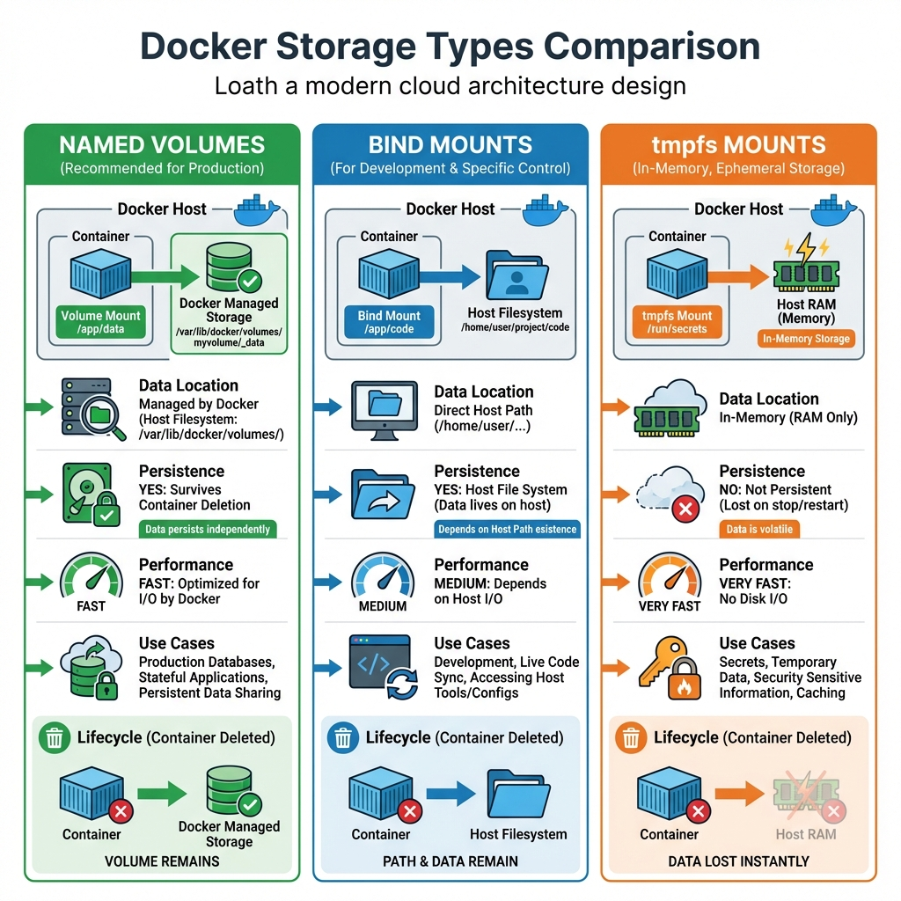

# Docker Deep Dive: Containerization from First Principles

## 1. Introduction

### The Dependency Hell Problem

**Scenario**: You're a developer joining a new team. The README says:

```
To run this application:
1. Install Python 3.8 (not 3.7, not 3.9 - exactly 3.8)
2. Install PostgreSQL 12.3
3. Install Redis 5.0.7
4. Set environment variables: DATABASE_URL, REDIS_HOST
5. Install 47 Python packages (hope there are no conflicts!)
6. Run migrations
7. Pray it works
```

**What actually happens:**

```
Day 1, 10:00 AM: Install Python 3.9 (wrong version! App breaks)
Day 1, 11:30 AM: Uninstall Python 3.9, install 3.8
Day 1, 02:00 PM: PostgreSQL 13 installed (wrong version again!)
Day 1, 04:00 PM: Dependency conflict between package A and B
Day 2, 09:00 AM: "It works on my machine" ← Famous last words
```

**With Docker:**

```bash
docker run myapp
# Done. Runs everywhere. Always.
```

**What is Docker?**

Docker is a platform for developing, shipping, and running applications in **containers**. A container packages an application with all its dependencies (code, runtime, libraries, system tools) into a single

, standardized unit that runs consistently across any environment.

**Key Innovation**: "**Build once, run anywhere**" - truly.

**Evolution Timeline:**
1. **2000-2010**: Manual server setup (days)
2. **2010-2013**: Configuration management tools (Ansible, Puppet) - hours
3. **2013**: Docker launches - containers go mainstream
4. **2015**: Docker Compose for multi-container apps
5. **2024**: 13 million+ developers using Docker, de facto standard for containerization

---

### Containers vs Virtual Machines: What's the Difference?



**The diagram shows the fundamental architectural difference:**

**Virtual Machines (LEFT)**:
- Each VM includes a **full guest operating system** (2GB+ each)
- Hypervisor layer adds overhead
- Boot time: **minutes**
- Total overhead for 3 apps: **~6GB** just for OS

**Containers (RIGHT)**:
- Share the **host OS kernel** 
- Only package app + libraries
- Boot time: **seconds**
- Total overhead for 3 apps: **~0.5GB**

**Key Comparison**:

| Aspect | Virtual Machines | Containers |
|:-------|:-----------------|:-----------|
| **Isolation** | Complete (hardware-level) | Process-level (shared kernel) |
| **Boot Time** | Minutes | Seconds |
| **Disk Size** | GBs (full OS) | MBs (app only) |
| **Memory** | Heavy (GB per VM) | Light (MB per container) |
| **Portability** | Limited (hypervisor dependent) | Excellent (run anywhere with Docker) |
| **Use Case** | **Run different OSes** (Windows on Linux) | **Run same OS, different apps** |

**When to use VMs**: Different operating systems (Windows app on Linux host), strong isolation requirements, legacy applications

**When to use Containers**: Modern microservices, CI/CD pipelines, cloud-native apps, development environments

---

## The Docker Architecture: How All the Pieces Fit Together



**The diagram shows Docker Engine's layered architecture**. Let's break down each component:

### Components Explained

**1. Docker CLI** (blue layer - what you interact with):
```bash
docker run nginx
docker build -t myapp .
docker ps
```

The command-line interface you use daily. Sends REST API requests to the Docker Daemon.

**2. Docker Daemon** (`dockerd`) - (purple layer - the manager):
- **Runs on the host** as a background service
- **Manages Docker objects**: images, containers, networks, volumes
- **Listens for API requests** from Docker CLI
- **Coordinates** with containerd for actual container operations

**Interface**:
```bash
# Docker CLI talks to daemon via REST API
POST /containers/create
GET /containers/nginx/json
DELETE /containers/nginx
```

**3. containerd** (orange layer - high-level runtime):
- **Container lifecycle management**: start, stop, delete containers
- **Image management**: pull, push, delete images
- **Originally part of Docker**, donated to CNCF (Cloud Native Computing Foundation)
- **Used by Kubernetes** as well (not just Docker!)

**4. runc** (green layer - low-level runtime):
- **Creates and runs containers** according to OCI (Open Container Initiative) specification
- **Interfaces directly with Linux kernel**: sets up namespaces, cgroups
- **Spawns the container process** and then exits

**5. Linux Kernel** (gray layer - the foundation):
- Provides **namespaces** (isolation)
- Provides **cgroups** (resource limits)
- Provides **union filesystems** (layering)

### Communication Flow

```
$ docker run nginx

1. Docker CLI → REST API → Docker Daemon
   "Create and start container from nginx image"

2. Docker Daemon → gRPC → containerd
   "Start a container with this

 image"

3. containerd → direct call → runc
   "Create container process with these namespaces"

4. runc → Linux kernel syscalls
   "clone() + pivot_root() + setgroups()"

5. Container running!
```

**Key Insight**: Docker is NOT a single monolithic program. It's a stack of specialized components working together.

---

## How Containers Actually Work: The Linux Kernel Features

Containers aren't magic—they're just **clever use of Linux kernel features** that already existed. Docker made them accessible.

### Feature 1: Namespaces (Isolation)

**The Problem**: Without isolation, all processes see the entire system.

**The Solution**: Namespaces create **virtual views** of system resources.

**Six Types of Namespaces**:

**1. PID Namespace** (Process ID):
```bash
# Inside container
$ ps aux
PID   USER     COMMAND
1     root     nginx

# On host
$ ps aux | grep nginx
PID    USER     COMMAND
15234  root     nginx  ← Same process, different PID!
```

Container thinks nginx is PID 1. Host knows it's PID 15234. **Isolated view**.

**2. Network Namespace**:
```bash
# Inside container
$ ifconfig
eth0: 172.17.0.2  ← Container's own IP

# On host
$ ifconfig
docker0: 172.17.0.1  ← Bridge interface
eth0: 192.168.1.100  ← Host IP
```

Container has its own network stack (IP, ports, routing table).

**3. Mount Namespace**:
Container sees its own filesystem tree (`/`). Can't see host's `/home`, `/etc`, etc.

**4. UTS Namespace** (hostname):
```bash
# Inside container
$ hostname
web-container-123

# On host
$ hostname
my-laptop
```

**5. IPC Namespace** (Inter-Process Communication):
Shared memory, semaphores isolated between containers.

**6. User Namespace**:
Root inside container ≠ root on host (advanced security).

**Creating Namespaces (under the hood)**:
```c
// What Docker does when creating container
clone(CLONE_NEWPID | CLONE_NEWNET | CLONE_NEWNS | ...);
```

---

### Feature 2: cgroups (Resource Limits)

**The Problem**: Without limits, one container can consume all CPU/memory and starve others.

**The Solution**: **cgroups** (control groups) enforce resource limits.

**What You Can Limit**:

**CPU**:
```bash
docker run --cpus="1.5" nginx
# Container can use max 1.5 CPU cores
```

**Memory**:
```bash
docker run --memory="512m" --memory-swap="1g" nginx
# 512MB RAM, 512MB swap
# If exceeded: OOM killer terminates container
```

**Disk I/O**:
```bash
docker run --device-write-bps /dev/sda:10mb nginx
# Max 10MB/s writes to disk
```

**Example cgroup hierarchy** (`/sys/fs/cgroup/`):
```
/sys/fs/cgroup/
  ├── cpu/
  │   └── docker/
  │       └── <container-id>/
  │           ├── cpu.cfs_quota_us  (CPU limit)
  │           └── cpu.shares        (CPU weight)
  ├── memory/
  │   └── docker/
  │       └── <container-id>/
  │           ├── memory.limit_in_bytes
  │           └── memory.usage_in_bytes
```

**Real-world scenario**:
```bash
# Without limits
Container A: Mining Bitcoin, using 100% CPU
Container B: Web server, can't get any CPU → SLOW

# With limits
docker run --cpus="2" bitcoin-miner
docker run --cpus="2" web-server
# Both get fair share
```

---

### Feature 3: Union Filesystems (Layering)

This is how Docker achieves **fast image building** and **efficient storage**.



**The Layering Concept** (like a pancake stack):

**Read-Only Layers** (locked, shared):
1. **Base Layer: Ubuntu** (100MB) - shared by ALL containers
2. **Layer 2: Install Python** (50MB) - shared by Python apps
3. **Layer 3: Install dependencies** (30MB)
4. **Layer 4: Copy application code** (5MB)

**Writable Layer** (unique per container):
5. **Container Layer** - changes made at runtime

**Copy-on-Write (CoW) Mechanism**:

```
Scenario: Container wants to modify /etc/nginx/nginx.conf

Step 1: File exists in read-only Layer 4
Step 2: Container tries to write
Step 3: Union FS copies file to writable Container Layer
Step 4: Modification happens in Container Layer
Step 5: Original in Layer 4 remains untouched

Result: Each container sees its own modified version
```

**Why This Matters**:

**Without layering** (naive approach):
```
3 containers running Ubuntu + Python = 450MB × 3 = 1.35GB
```

**With layering**:
```
Base Ubuntu (100MB) - shared once
Python layer (50MB) - shared once
3 container layers (5MB each) = 15MB
Total: 165MB (90% savings!)
```

**How Dockerfile Creates Layers**:

```dockerfile
FROM ubuntu:20.04          # Layer 1: Pull base (100MB)
RUN apt-get update &&     apt-get install python3  # Layer 2: Install Python (50MB)
COPY requirements.txt .
RUN pip install -r requirements.txt  # Layer 3: Dependencies (30MB)
COPY . /app                # Layer 4: App code (5MB)
```

Each `FROM`, `RUN`, `COPY` creates a new layer!

---

## Docker Images: The Blueprint for Containers

### What Is a Docker Image?

**Analogy**: 
- **Image** = Class definition (blueprint)
- **Container** = Object instance (running process)

**Image Definition**:
A Docker image is a **read-only template** containing:
- Application code
- Runtime (Python, Node.js, Java, etc.)
- Libraries and dependencies
- Environment variables
- Metadata (what command to run, which ports to expose)

**Image Anatomy**:
```
nginx:1.21
  ├── Layers (filesystem):
  │   ├── Layer 1: Base OS (Debian)
  │   ├── Layer 2: Nginx binaries
  │   ├── Layer 3: Configuration files
  │   └── Layer 4: Default HTML
  └── Metadata (JSON):
      ├── CMD: ["nginx", "-g", "daemon off;"]
      ├── EXPOSE: [80, 443]
      └── ENV: [PATH=/usr/local/nginx/sbin:$PATH]
```

### Building Images: The Dockerfile

**Example Dockerfile** (Python web app):

```dockerfile
# 1. Choose base image
FROM python:3.9-slim

# 2. Set working directory inside container
WORKDIR /app

# 3. Copy dependency file
COPY requirements.txt .

# 4. Install dependencies (creates layer)
RUN pip install --no-cache-dir -r requirements.txt

# 5. Copy application code
COPY . .

# 6. Expose port (metadata only)
EXPOSE 8000

# 7. Define startup command
CMD ["python", "app.py"]
```

**Build Process**:
```bash
$ docker build -t myapp:v1 .

Step 1/7 : FROM python:3.9-slim
 ---> Pulling from library/python
 ---> Layer abc123 (50MB)

Step 2/7 : WORKDIR /app
 ---> Layer def456 (0MB, metadata only)

Step 3/7 : COPY requirements.txt .
 ---> Layer ghi789 (0.001MB)

Step 4/7 : RUN pip install -r requirements.txt
 ---> Running in temp container...
 ---> Layer jkl012 (25MB)

Step 5/7 : COPY . .
 ---> Layer mno345 (2MB)

Successfully built myapp:v1
Total size: 77MB across 5 layers
```

**Layer Caching** (huge time saver):

```dockerfile
# ❌ BAD: Code changes invalidate EVERYTHING
COPY . .
RUN pip install -r requirements.txt

# ✅ GOOD: Dependencies cached separately
COPY requirements.txt .
RUN pip install -r requirements.txt
COPY . .  # Only this layer rebuilds when code changes
```

**Build time difference**:
- Without caching: 5 minutes
- With caching: 10 seconds (only rebuilds changed layers)

### Image Registry: Storing and Sharing

**Docker Hub** (public registry):
```bash
# Pull image
docker pull nginx:1.21

# Push your image
docker login
docker tag myapp:v1 username/myapp:v1
docker push username/myapp:v1
```

**Private Registries**:
- **AWS ECR** (Elastic Container Registry)
- **Google GCR** (Google Container Registry)
- **Azure ACR** (Azure Container Registry)
- **Self-hosted**: Harbor, GitLab Registry

**Image Naming Convention**:
```
registry.example.com/namespace/repository:tag
│                    │         │          │
│                    │         │          └─ Version
│                    │         └─ Image name
│                    └─ Organization / Project
└─ Registry URL (default: docker.io)
```

**Examples**:
```
nginx:latest                    # Docker Hub (implicit)
docker.io/library/nginx:1.21    # Explicit
123456789012.dkr.ecr.us-east-1.amazonaws.com/myapp:v2
gcr.io/my-project/backend:latest
```

---

## Container Lifecycle: From Creation to Deletion



**The diagram shows 5 states and transitions**. Let's walk through each:

### State 1: Created (Yellow)

```bash
$ docker create --name web nginx
a1b2c3d4e5f6

$ docker ps -a
CONTAINER ID   STATUS
a1b2c3d4       Created  ← Exists but not running
```

**What happened**:
1. Docker pulled `nginx` image (if not present)
2. Created filesystem layers
3. Allocated container ID
4. **Did NOT start the process**

### State 2: Running (Green)

```bash
$ docker start web
web

$ docker ps
CONTAINER ID   STATUS          PORTS
a1b2c3d4       Up 3 seconds    80/tcp

# Or create + start in one command
$ docker run -d --name web nginx
```

**What happened**:
1. `runc` created namespaces
2. Applied cgroup limits
3. Mounted union filesystem
4. Executed CMD: `nginx -g 'daemon off;'`
5. Process running with PID 1 inside container

**Checking logs**:
```bash
$ docker logs web
/docker-entrypoint.sh: Launching nginx
nginx: master process running
```

### State 3: Paused (Blue)

```bash
$ docker pause web

$ docker ps
CONTAINER ID   STATUS
a1b2c3d4       Up 2 minutes (Paused)
```

**What happened**:
- Process **frozen in memory** (using `cgroup freezer`)
- CPU cycles stopped
- Memory preserved
- Can be unpaused instantly

**Use case**: Free up CPU temporarily without losing state

```bash
$ docker unpause web
# Resumes immediately from where it left off
```

### State 4: Stopped/Exited (Orange)

```bash
$ docker stop web
# Sends SIGTERM, waits 10s, then SIGKILL

$ docker ps -a
CONTAINER ID   STATUS
a1b2c3d4       Exited (0) 2 seconds ago
```

**What happened**:
1. Graceful shutdown signal (SIGTERM) sent
2. Application has 10 seconds to clean up
3. Force kill (SIGKILL) if not stopped
4. Process terminated
5. Filesystem **preserved** (can restart)

**Restart the same container**:
```bash
$ docker start web
# Same container, same ID, restores state
```

### State 5: Removed (Red X)

```bash
$ docker rm web

$ docker ps -a
# Container gone completely
```

**What happened**:
- Container filesystem **deleted**
- Network configuration removed
- All traces gone

**⚠️ Data Loss**: Unless you used volumes, all data in writable layer is LOST

**Cleanup all stopped containers**:
```bash
docker container prune
# Removes all stopped containers
```

---

## Docker Networking: Connecting Containers



**The diagram shows 4 networking modes**. Let's explore each:

### Mode 1: Bridge (Default) - Blue Panel

**What is it**: Docker creates a virtual bridge (`docker0`) connecting containers.

**How it works**:
```bash
$ docker run -d --name web nginx
$ docker inspect web | grep IPAddress
"IPAddress": "172.17.0.2"

# Host perspective
$ ifconfig docker0
docker0: 172.17.0.1  ← Bridge IP
```

**Network topology**:
```
Host (192.168.1.100)
  └── docker0 (172.17.0.1) ← Virtual bridge
       ├── Container 1 (172.17.0.2)
       └── Container 2 (172.17.0.3)
```

**Container-to-container communication**:
```bash
# From Container 1
$ ping 172.17.0.3  ← Reaches Container 2 directly
```

**Port Mapping** (container → host):
```bash
$ docker run -d -p 8080:80 nginx
#               │    
├─ Host port 8080
                └─ Container port 80

# Now accessible from outside
$ curl http://localhost:8080
# NAT: Host 8080 → Container 172.17.0.2:80
```

**iptables rules** (how NAT works):
```bash
$ iptables -t nat -L
DNAT tcp dpt:8080 to:172.17.0.2:80
```

**Use cases**: Single-host applications, development, most common scenario

---

### Mode 2: Host - Orange Panel

**What is it**: Container shares host's network namespace (no isolation).

```bash
$ docker run -d --network host nginx

# Container uses host's eth0 directly
# No separate IP address
# Container sees host's 192.168.1.100
```

**Comparison**:
```
Bridge mode:
  Container: 172.17.0.2
  Host: 192.168.1.100
  Isolated ✓
  
Host mode:
  Container: 192.168.1.100 (same as host!)
  Host: 192.168.1.100
  No isolation ✗
```

**Advantages**:
✅ **Maximum performance** (no NAT overhead)
✅ **No port mapping needed** (container binds directly to host port)

**Disadvantages**:
❌ **No network isolation**
❌ **Port conflicts** (can't run two containers on same port)
❌ **Security concerns** (container accesses host network)

**Use cases**: Performance-critical applications, network monitoring tools, when port mapping overhead is too high

---

### Mode 3: None - Gray Panel

**What is it**: No networking at all.

```bash
$ docker run -d --network none alpine sleep 1000

$ docker exec <container-id> ifconfig
lo: 127.0.0.1  ← Only loopback, no eth0
```

**Complete isolation**:
- No external connectivity
- No container-to-container communication
- Only loopback (localhost)

**Use cases**:
- **Security**: Completely isolated workloads
- **Custom networking**: Add network manually later
- **Batch jobs**: No network needed

---

### Mode 4: Overlay - Purple Panel

**What is it**: Multi-host networking (used in Docker Swarm, Kubernetes).

**Scenario**:
```
Host A (192.168.1.10)              Host B (192.168.1.11)
  ├── Container 1 (10.0.0.2)        ├── Container 3 (10.0.0.4)
  └── Container 2 (10.0.0.3)        └── Container 4 (10.0.0.5)
       ↓                                   ↓
    VXLAN Tunnel (overlay network)
```

**How it works**:
1. Create overlay network: `docker network create -d overlay mynet`
2. Containers on different hosts get IPs from same subnet (10.0.0.0/24)
3. **VXLAN encapsulation**: Wraps container packets in host packets
4. Containers communicate as if on same LAN

**Use cases**: Docker Swarm, Kubernetes, multi-host deployments, microservices across data centers

---

## Docker Storage: Making Data Persist



**The Problem**: Containers are ephemeral. When deleted, all data in the writable layer is GONE.

**The diagram shows 3 storage types**. Let's dive in:

### Type 1: Named Volumes (Green - Recommended)

**What**: Docker-managed storage in `/var/lib/docker/volumes/`.

**Create and use**:
```bash
# Create volume
$ docker volume create db-data

# Use in container
$ docker run -d   --name postgres   -v db-data:/var/lib/postgresql/data  # ← Named volume
  postgres:13

# Data location on host
$ ls /var/lib/docker/volumes/db-data/_data/
base/  pg_wal/  postgresql.conf  ← Database files
```

**What happens when container deleted**:
```bash
$ docker rm -f postgres
# Container: GONE
# Volume: STILL EXISTS ✓

$ docker volume ls
db-data  ← Volume preserved!

# Start new container with same volume
$ docker run -d --name postgres-new   -v db-data:/var/lib/postgresql/data postgres:13
# All data intact! Database restored!
```

**Advantages**:
✅ **Managed by Docker** (automatic cleanup with `docker volume prune`)
✅ **Portable** (backup with `docker volume inspect`)
✅ **Survives container deletion**
✅ **Better performance** than bind mounts on Docker Desktop (Windows/Mac)

**Use cases**: Production databases, stateful applications, persistent data

---

### Type 2: Bind Mounts (Blue - Development)

**What**: Mount host directory directly into container.

```bash
$ docker run -d   --name web   -v /home/user/website:/usr/share/nginx/html  # ← Bind mount
  nginx

# Any changes in /home/user/website
# Immediately reflected in container!
```

**Use case - Live code reload**:
```bash
# Development setup
$ docker run -d   -v $(pwd)/src:/app/src \  # ← Code directory
  -p 3000:3000   node:16   npm run dev

# Edit src/index.js on host
# Hot reload in container instantly!
```

**Bidirectional sync**:
```bash
# Create file in container
$ docker exec web touch /usr/share/nginx/html/new.txt

# Appears on host!
$ ls /home/user/website/
new.txt  ← Synced
```

**Advantages**:
✅ **Full control** over host path
✅ **Live sync** for development
✅ **Easy access** to files from host

**Disadvantages**:
❌ **Host-dependent** (path must exist on host)
❌ **Portability issues** (Linux paths ≠ Windows paths)
❌ **Security**: Container can modify host files

**Use cases**: Development, sharing configs, debugging

---

### Type 3: tmpfs Mounts (Orange - In-Memory)

**What**: Store data in RAM, never written to disk.

```bash
$ docker run -d   --name cache   --tmpfs /tmp:rw,size=100m \  # ← 100MB RAM storage
  redis

$ docker exec cache df -h /tmp
Filesystem      Size  Used  Mounted on
tmpfs           100M  0     /tmp  ← RAM only
```

**Characteristics**:
- ⚡ **Extremely fast** (RAM speed)
- ❌ **Not persistent** (lost on container stop)
- 🔒 **Secure** (never written to disk)

**Use cases**:
- **Temporary files**: Build artifacts, cache
- **Secrets**: Sensitive data that shouldn't touch disk
- **High-performance cache**: Redis, Memcached temp data

**Example - Secure secrets**:
```bash
$ echo "my-secret-key" | docker run -i   --tmpfs /secrets:ro,size=10m   alpine sh -c 'cat > /secrets/key && cat /secrets/key'

# Secret loaded in RAM
# Never written to disk
# Gone when container stops
```

---

## Docker Internals: What Happens When You Run `docker run`

**Command**:
```bash
$ docker run -d --name web -p 8080:80 nginx
```

**Under the hood** (complete breakdown):

### Step 1: CLI Parses Command (1-5ms)

```
Docker CLI:
  - Parse flags: -d (detached), --name web, -p 8080:80
  - Image: nginx (no tag → default to :latest)
  - Build REST API request
```

### Step 2: REST API Call to Daemon (1ms)

```http
POST /v1.41/containers/create HTTP/1.1
Host: unix:///var/run/docker.sock
Content-Type: application/json

{
  "Image": "nginx:latest",
  "HostConfig": {
    "PortBindings": {"80/tcp": [{"HostPort": "8080"}]}
  },
  "NetworkingConfig": {
    "EndpointsConfig": {"bridge": {}}
  }
}
```

### Step 3: Daemon Checks Image (10-1000ms)

```
Docker Daemon (dockerd):
  1. Check local image cache: docker images
     nginx:latest → Found? Yes → Skip pull
                  → Not found? Pull from registry

  2. If pulling:
     - Connect to registry.docker.io
     - Download layers (5-500MB)
     - Extract to /var/lib/docker/overlay2/
```

### Step 4: Create Container (50-100ms)

```
Docker Daemon:
  1. Generate container ID: a1b2c3d4e5f6...
  
  2. Create Union FS mount:
     /var/lib/docker/overlay2/<container-id>/
       ├── diff/     ← Writable layer
       ├── lower     ← Read-only image layers
       └── merged/   ← Union view
  
  3. Create network namespace:
     - Allocate IP: 172.17.0.2
     - Create veth pair: vethXXX ↔ eth0
     - Connect to docker0 bridge
  
  4. Setup port mapping (iptables)
```

### Step 5: Call containerd (10ms)

```
Daemon → containerd (gRPC):
  "Start container a1b2c3d4 with image nginx:latest"
  
containerd:
  1. Prepare runtime bundle (OCI spec)
  2. Call runc to create container
```

### Step 6: runc Creates Container (50-100ms)

```
runc binary:
  1. Create namespaces:
     - PID namespace (new PID 1)
     - Network namespace (eth0 configured)
     - Mount namespace (union FS)
     - UTS namespace (hostname)
     - IPC namespace
  
  2. Apply cgroups:
     - CPU limits
     - Memory limits
     - I/O limits
  
  3. pivot_root():
     - Change root to /var/lib/docker/.../merged
     - Container sees new / (not host's /)
  
  4. exec():
     - Replace runc process with nginx
     - PID 1 inside container
```

### Step 7: Container Running (total: ~200ms)

```bash
$ docker ps
CONTAINER ID   STATUS          PORTS
a1b2c3d4       Up 1 second     0.0.0.0:8080->80/tcp

# Container logs
$ docker logs web
/docker-entrypoint.sh: Launching nginx
nginx: master process nginx -g 'daemon off;'

# Process on host
$ ps aux | grep nginx
root 12345  nginx: master process  ← Host PID
```

**Total time breakdown**:
- CLI parsing: 2ms
- API call: 1ms
- Image check: 5ms (cached) or 30s (pull)
- Container creation: 50ms
- Namespace setup: 50ms
- **Network call**: 50ms
- Process start: 100ms

**Grand total**: ~200ms (if image cached), ~30s (first time)

---

## Production Best Practices

### 1. Multi-Stage Builds (Reduce Image Size)

**Problem**: Build tools bloat final image.

❌ **Bad** (single stage):
```dockerfile
FROM node:16
WORKDIR /app
COPY package*.json ./
RUN npm install  # Installs devDependencies (100MB)
COPY . .
RUN npm run build
CMD ["npm", "start"]
# Result: 1.2GB image (includes build tools!)
```

✅ **Good** (multi-stage):
```dockerfile
# Stage 1: Build
FROM node:16 AS builder
WORKDIR /app
COPY package*.json ./
RUN npm install
COPY . .
RUN npm run build

# Stage 2: Production
FROM node:16-slim  # ← Smaller base
WORKDIR /app
COPY --from=builder /app/dist ./dist
COPY package*.json ./
RUN npm install --production  # Only prod deps
CMD ["node", "dist/server.js"]
# Result: 300MB image (75% smaller!)
```

**Size comparison**:
- Single-stage: 1.2GB
- Multi-stage: 300MB
- **Savings**: 900MB (faster pulls, lower costs)

---

### 2. Layer Caching Optimization

**Order matters**!

❌ **Bad order**:
```dockerfile
COPY . .                      # ← Invalidates cache on ANY code change
RUN pip install -r requirements.txt
```

✅ **Good order**:
```dockerfile
COPY requirements.txt .
RUN pip install -r requirements.txt  # ← Cached unless deps change
COPY . .                      # Only this rebuilds on code changes
```

**Build time**:
- Bad order: 5 minutes every time
- Good order: 10 seconds (deps cached)

---

### 3. Security Hardening

**Run as non-root**:
```dockerfile
FROM python:3.9
RUN groupadd -r appuser && useradd -r -g appuser appuser
USER appuser  # ← Don't run as root!
WORKDIR /app
COPY --chown=appuser:appuser . .
CMD ["python", "app.py"]
```

**Scan for vulnerabilities**:
```bash
$ docker scan myapp:v1
# Checks for known CVEs in base image and dependencies
```

**Use minimal base images**:
```dockerfile
FROM python:3.9-slim    # ✅ 120MB
FROM python:3.9-alpine  # ✅✅ 50MB (even smaller)
# vs
FROM python:3.9         # ❌ 900MB
```

---

### 4. Health Checks

**Define health check in Dockerfile**:
```dockerfile
HEALTHCHECK --interval=30s --timeout=3s --retries=3   CMD curl -f http://localhost:8080/health || exit 1
```

**Or in docker run**:
```bash
$ docker run -d   --health-cmd "curl -f http://localhost/health || exit 1"   --health-interval=30s   --health-retries=3   myapp
```

**Check status**:
```bash
$ docker ps
CONTAINER ID   STATUS
a1b2c3d4       Up 2 minutes (healthy)  ← Monitored automatically
```

---

### 5. Resource Limits (Always!)

```bash
$ docker run -d   --memory="512m"   --memory-swap="1g"   --cpus="1.5"   --pids-limit 100   myapp
```

**Why**: Without limits, one container can crash the entire host.

---

## Conclusion

Docker revolutionized application deployment by making containers **accessible, portable, and production-ready**.

**Key Takeaways**:
✅ Containers share host kernel (lighter than VMs)
✅ Built on Linux namespaces + cgroups + union FS
✅ Images are layered (saving disk space)
✅ Bridge networking by default (isolated but connected)
✅ Named volumes for persistent data
✅ Multi-stage builds for smaller images

**Next Steps**:
- Explore Docker Compose for multi-container apps
- Learn Kubernetes for container orchestration at scale
- Master CI/CD pipelines with Docker
- Dive into security best practices

---

