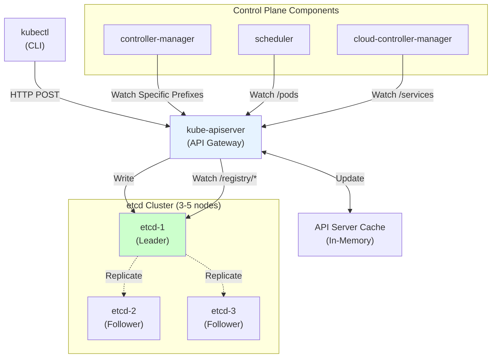
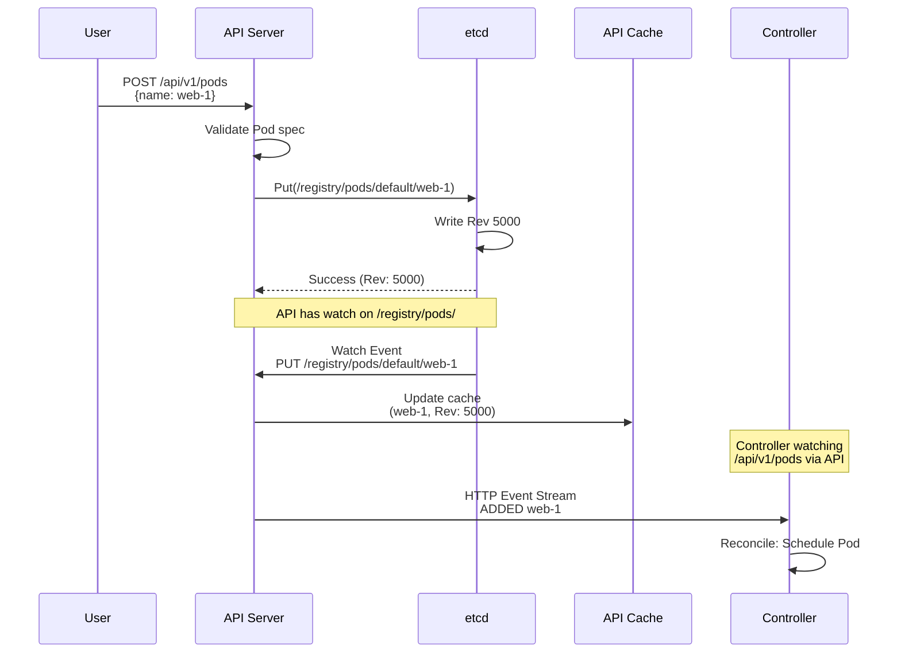
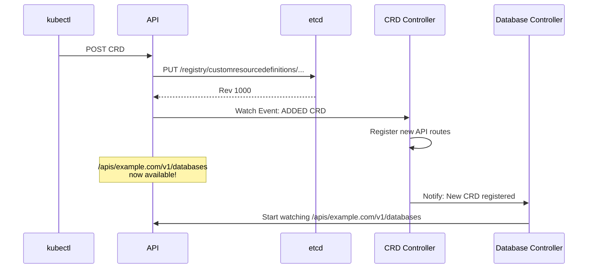

# 01. Kubernetes + etcd Integration: The Control Plane Brain

## 1. Introduction

**Kubernetes** relies on **etcd** as its single source of truth for all cluster state. Every resource—Pods, Services, ConfigMaps, Secrets, Custom Resources—is stored in etcd, and all control plane components (API server, controllers, scheduler) interact through etcd's watch mechanism to maintain desired state.

**Key Differentiator**: Unlike traditional databases where applications query directly, Kubernetes uses a **reactive architecture**: components watch etcd for changes and reconcile state continuously. This watch-driven model enables declarative infrastructure and self-healing systems.

**Industry Adoption**:
- **Every Kubernetes cluster** (GKE, EKS, AKS, on-prem) uses etcd
- **OpenShift**: Red Hat's Kubernetes distribution
- **Rancher**: Multi-cluster management
- **k3s**: Lightweight Kubernetes (with SQLite option, but etcd default)

---

## 2. Core Architecture



### Key Components

1.  **kube-apiserver**: The ONLY component that directly talks to etcd. Acts as a gateway and caching layer.
2.  **etcd Cluster**: Stores all cluster state as key-value pairs under `/registry/` prefix.
3.  **Controllers**: Watch API server (not etcd directly) for resource changes and reconcile state.
4.  **API Server Cache**: In-memory cache of etcd data to reduce etcd load and improve read performance.

---

## 3. How It Works: Storage and Watch Patterns

### A. What Kubernetes Stores in etcd

All resources are stored under `/registry/` prefix with hierarchical structure:

```
/registry/
├── pods/
│   ├── default/
│   │   ├── nginx-7d8f4b9c-abc12
│   │   └── nginx-7d8f4b9c-def34
│   └── kube-system/
│       ├── coredns-5d78c-xyz89
│       └── kube-proxy-4mn2p
├── deployments/
│   └── default/
│       └── nginx
├── services/
│   ├── default/
│   │   └── nginx-service
│   └── kube-system/
│       └── kube-dns
├── configmaps/
│   └── default/
│       └── app-config
├── secrets/
│   └── default/
│       └── db-credentials
├── customresourcedefinitions/
│   └── databases.example.com
└── databases.example.com/  ← CRD instances
    └── default/
        └── my-postgres-db
```

**Storage Format**: Each resource is stored as a Protobuf-serialized blob:

```
Key:   /registry/pods/default/nginx-7d8f4b9c-abc12
Value: <Protobuf bytes>
       {
         apiVersion: "v1"
         kind: "Pod"
         metadata: {
           name: "nginx-7d8f4b9c-abc12"
           namespace: "default"
           uid: "a1b2c3d4-..."
           resourceVersion: "12345"  ← etcd revision!
         }
         spec: {...}
         status: {...}
       }
```

### B. API Server as etcd Proxy with Caching

**Three-Layer Architecture**:

1. **Storage Layer (etcd)**:  Durable, consistent storage
2. **Caching Layer (API Server)**: In-memory cache (Reflector + Informer)
3. **Presentation Layer (REST API)**: HTTP endpoints for clients

**How Reads Work**:

```
Client Request: GET /api/v1/pods/default/nginx

┌──────────────────────────────────────────┐
│ API Server                               │
│                                          │
│ 1. Check cache (hit: return immediately)│
│ 2. If miss: query etcd                  │
│ 3. Update cache                          │
│ 4. Return to client                      │
└──────────────────────────────────────────┘

95%+ requests served from cache (zero etcd load)
```

**How Writes Work**:

```
Client Request: POST /api/v1/pods

┌──────────────────────────────────────────┐
│ API Server                               │
│                                          │
│ 1. Validate (admission controllers)     │
│ 2. Write to etcd                         │
│ 3. Wait for etcd confirmation            │
│ 4. Update local cache                    │
│ 5. Trigger watchers                      │
│ 6. Return to client (201 Created)       │
└──────────────────────────────────────────┘

Latency: ~10-50ms (depends on etcd cluster)
```

### C. Watch Mechanism (API Server ↔ etcd)

**API Server maintains watches on etcd** to keep its cache synchronized:

```
On API Server Startup:

┌──────────────────────────────────────┐
│ API Server Initializes Storage       │
│                                      │
│ For each resource type:              │
│   - pods                             │
│   - services                         │
│   - deployments                      │
│   - ... (50+ built-in types)         │
│   - All CRDs                         │
│                                      │
│ Create etcd watch:                   │
│   Watch("/registry/<type>/",         │
│         WithPrefix(),                │
│         WithRev(0))                  │
└──────────────────────────────────────┘

API Server now receives ALL changes to these prefixes!
```

**Event Flow**:



---

## 4. Deep Dive: Internal Implementation

### A. API Server Cacher (Reflector + Informer)

The API server uses **client-go's caching mechanism** to maintain an in-memory replica of etcd.

**Reflector**: Watches etcd and updates local store

```
┌─────────────────────────────────────────┐
│ Reflector (per resource type)          │
│                                         │
│ etcdWatch := etcd.Watch(                │
│   "/registry/pods/",                    │
│   WithPrefix(),                         │
│   WithRev(lastSyncedRevision)           │
│ )                                       │
│                                         │
│ for event := range etcdWatch {          │
│   switch event.Type {                   │
│   case PUT:                             │
│     store.Add(event.Object)             │
│   case DELETE:                          │
│     store.Delete(event.Object)          │
│   }                                     │
│   lastSyncedRevision = event.Revision   │
│ }                                       │
└─────────────────────────────────────────┘
```

**Store**: Thread-safe in-memory cache

```
type Store struct {
    // Map: namespace/name → object
    items map[string]runtime.Object
    
    // Index for efficient queries
    indexers map[string]IndexFunc
}

Example:
  items["default/nginx-abc"] = Pod{...}
  items["default/nginx-def"] = Pod{...}
```

**Informer**: Distributes events to watchers

```
API Server maintains multiple informers:
  - PodInformer (watches /registry/pods/)
  - ServiceInformer (watches /registry/services/)
  - DeploymentInformer (watches /registry/deployments/)
  - ... one per resource type

When client calls GET /api/v1/pods:
  → PodInformer.Lister().List()
  → Returns from cache (no etcd query!)
```

### B. resourceVersion: The Bridge Between etcd and Kubernetes

**resourceVersion** is how Kubernetes exposes etcd's revision system:

```
etcd Revision 5000 → Kubernetes resourceVersion: "5000"

Every object has resourceVersion:
{
  "apiVersion": "v1",
  "kind": "Pod",
  "metadata": {
    "resourceVersion": "5000"  ← etcd ModRevision
  }
}
```

**Optimistic Concurrency Control**:

```
Client Workflow:

1. GET /api/v1/pods/default/nginx
   Response: {..., resourceVersion: "5000"}

2. Modify locally

3. PUT /api/v1/pods/default/nginx
   Headers: If-Match: "5000"
   
   API Server:
   - Checks current resourceVersion in etcd
   - If still "5000" → Update succeeds
   - If changed to "5001" → Conflict (409)
   
Client must retry: GET → Modify → PUT
```

**List with Pagination**:

```bash
# Get first page
kubectl get pods --limit=100

API translates to:
  etcd.Get("/registry/pods/", WithLimit(100))
  Returns: objects + continueToken="6000"

# Get next page
kubectl get pods --limit=100 --continue=6000

API translates to:
  etcd.Get("/registry/pods/", WithLimit(100), WithRev(6000))
```

### C. Watch Bookmarks (Preventing Stale Watchers)

**Problem**: Long-running watches can fall behind if events accumulate faster than client processes them.

**Solution**: Watch bookmarks

```
API Server sends periodic bookmark events:

┌────────────────────────────────────┐
│ Normal Watch Events:               │
│                                    │
│ Rev 1000: ADDED Pod A              │
│ Rev 1001: MODIFIED Pod B           │
│ Rev 1002: DELETED Pod C            │
│ Rev 1200: BOOKMARK (heartbeat)     │
│ Rev 1205: ADDED Pod D              │
│ Rev 1400: BOOKMARK                 │
└────────────────────────────────────┘

If client disconnects and reconnects:
  → Resume from last bookmark (Rev 1400)
  → Avoid reprocessing old events
```

---

## 5. End-to-End Walkthrough: CRD Lifecycle

Let's trace how a Custom Resource Definition flows through the entire system.

### Step 1: Create CRD

```yaml
# database-crd.yaml
apiVersion: apiextensions.k8s.io/v1
kind: CustomResourceDefinition
metadata:
  name: databases.example.com
spec:
  group: example.com
  names:
    kind: Database
    plural: databases
  scope: Namespaced
  versions:
    - name: v1
      schema:
        openAPIV3Schema:
          type: object
          properties:
            spec:
              type: object
              properties:
                engine: {type: string}
                size: {type: string}
```

```bash
kubectl apply -f database-crd.yaml
```

**API Server Processing**:

1. **Validation**: Check CRD schema is valid
2. **Storage**: Write to etcd

```
PUT /registry/customresourcedefinitions/databases.example.com
Value: <CRD Protobuf>
```

3. **Dynamic Registration**: API server dynamically creates new REST endpoints:
   - `/apis/example.com/v1/databases`
   - `/apis/example.com/v1/namespaces/*/databases`

4. **Schema Storage**: Stores OpenAPI schema for validation

### Step 2: Controller Discovers CRD

```
Database Controller (custom operator):

func main() {
    // Watch for CRDs
    crdInformer := informers.NewSharedInformerFactory(
        client, time.Minute,
    ).Apiextensions().V1().CustomResourceDefinitions()
    
    crdInformer.Informer().AddEventHandler(cache.ResourceEventHandlerFuncs{
        AddFunc: func(obj interface{}) {
            crd := obj.(*apiextensions.CustomResourceDefinition)
            if crd.Spec.Group == "example.com" {
                // Start watching Database resources
                startDatabaseWatcher()
            }
        },
    })
}
```

**Event Flow**:



### Step 3: Create Custom Resource Instance

```bash
kubectl apply -f my-database.yaml
```

```yaml
apiVersion: example.com/v1
kind: Database
metadata:
  name: my-postgres
  namespace: default
spec:
  engine: postgres
  size: 10Gi
```

**Storage in etcd**:

```
PUT /registry/databases.example.com/default/my-postgres
Value: {
  apiVersion: "example.com/v1"
  kind: "Database"
  metadata: {
    name: "my-postgres"
    namespace: "default"
    resourceVersion: "2000"
  }
  spec: {
    engine: "postgres"
    size: "10Gi"
  }
  status: {}  ← Populated by controller
}
```

### Step 4: Controller Reconciliation

```
Database Controller receives event:

┌─────────────────────────────────────────┐
│ Controller Reconcile Loop              │
│                                         │
│ Event: ADDED Database/my-postgres      │
│                                         │
│ Actions:                                │
│ 1. Create StatefulSet for Postgres     │
│ 2. Create Service for database access  │
│ 3. Create PVC for storage              │
│                                         │
│ For each resource:                      │
│   kubectl.Create() → API Server        │
│   → etcd stores under /registry/...    │
│                                         │
│ 4. Update Database status:              │
│   PATCH /apis/example.com/v1/           │
│         namespaces/default/databases/   │
│         my-postgres/status              │
│   {status: {phase: "Creating"}}        │
└─────────────────────────────────────────┘
```

**etcd State After Reconciliation**:

```
/registry/
├── databases.example.com/
│   └── default/
│       └── my-postgres (controller watching)
├── apps/statefulsets/
│   └── default/
│       └── my-postgres-db (created by controller)
├── core/services/
│   └── default/
│       └── my-postgres-svc (created by controller)
└── core/persistentvolumeclaims/
    └── default/
        └── my-postgres-data (created by controller)

All linked by ownerReferences!
```

### Step 5: Status Updates (Subresource)

```
Controller continuously updates status:

While True:
  Check StatefulSet ready replicas
  
  PATCH /apis/example.com/v1/namespaces/default/databases/my-postgres/status
  {
    status: {
      phase: "Running"
      ready: true
      endpoint: "my-postgres-svc:5432"
    }
  }
```

**Why `/status` subresource?**
- Prevents conflicts between user updates (spec) and controller updates (status)
- User cannot modify status directly
- Controller cannot modify spec

---

## 6. Failure Scenarios (The Senior View)

### Scenario A: API Server Cache Desync

**Symptom**: `kubectl get pods` shows Pod, but Pod doesn't actually exist in etcd.

**Cause**: API server cache out of sync after network partition or etcd leadership change.

**Mechanism**:
1. Network partition isolates API server from etcd
2. API server cache still has old data
3. etcd cluster performs compaction, removes old revisions
4. API server reconnects, but bookmark revision was compacted
5. Watch must restart from current revision, losing intermediate events

**The Fix**:
```bash
# API server automatically detects desync
# Logs: "watch event channel was closed, restarting watch"

# API server performs full re-list:
etcd.Get("/registry/pods/", WithPrefix())

# Rebuilds cache from scratch
# Duration: 1-5 seconds for 1000 pods
```

**Prevention**:
- Increase etcd auto-compact retention: `--auto-compaction-retention=8h`
- Monitor `apiserver_watch_events_total` metric

### Scenario B: etcd Out of Space

**Symptom**: All writes fail with `etcdserver: mvcc: database space exceeded`.

**Cause**: etcd database grew past quota (default 2GB).

**Mechanism**:
```
1. Cluster stores 500,000 Pods over time
2. Each Pod = ~5KB storage
3. Total: 2.5GB (exceeds 2GB quota)
4. etcd enters read-only mode
5. All Kubernetes writes fail:
   - Cannot create Pods
   - Cannot update Services
   - Cannot delete resources
```

**The Fix**:
```bash
# 1. Check current DB size
etcdctl endpoint status --write-out=table

# 2. Compact old revisions
CURRENT_REV=$(etcdctl endpoint status --write-out=json | jq '.[] .Status.header.revision')
etcdctl compact $CURRENT_REV

# 3. Defrag all members
etcdctl defrag --cluster

# 4. Disarm alarm
etcdctl alarm disarm

# 5. Increase quota
etcd --quota-backend-bytes=8589934592  # 8GB
```

**Prevention**:
- Set higher quota (8GB for production)
- Monitor `etcd_mvcc_db_total_size_in_bytes`
- Enable auto-compaction

### Scenario C: Controller Thundering Herd

**Symptom**: Sudden spike in API server load, etcd write storms.

**Cause**: Bug in controller causes infinite reconciliation loop.

**Mechanism**:
```
Buggy Controller:

func reconcile(database *Database) {
    // Update status
    database.Status.LastUpdated = time.Now()
    client.Status().Update(database)  ← Triggers watch event!
}

Problem:
  Status update → Watch fires → Reconcile → Status update → ...
  
Result:
  1000 QPS to API server
  API server → etcd: 1000 writes/sec
  etcd disk I/O saturates
```

**The Fix**:
```go
// Only update if status actually changed
func reconcile(database *Database) {
    newStatus := calculateStatus(database)
    
    if reflect.DeepEqual(database.Status, newStatus) {
        return  // No change, skip update
    }
    
    database.Status = newStatus
    client.Status().Update(database)
}
```

---

## 7. Performance Tuning / Scaling Strategies

### A. API Server Configuration

| Configuration | Recommendation | Why? |
| :--- | :--- | :--- |
| `--watch-cache-sizes` | `pods#1000,services#100` | Dedicate more cache to high-churn resources |
| `--max-requests-inflight` | 400 (default 200) | Allow more concurrent API requests |
| `--max-mutating-requests-inflight` | 200 (default 100) | Balance read/write capacity |
| `--default-watch-cache-size` | 100 (default 0) | Enable caching for CRDs |

### B. etcd Cluster Sizing

**For Production Kubernetes**:

| Cluster Size | Nodes | etcd Spec | Max Resources |
| :--- | :--- | :--- | :--- |
| Small | < 100 | 2 CPU, 8GB RAM, 20GB SSD | ~5,000 Pods |
| Medium | < 500 | 4 CPU, 16GB RAM, 50GB SSD | ~25,000 Pods |
| Large | < 5000 | 8 CPU, 32GB RAM, 100GB SSD | ~100,000 Pods |

**Critical**: Use **dedicated SSD** for etcd. NVMe preferred (fsync < 1ms).

---

## 8. Constraints & Limitations

| Constraint | Limit | Why? |
| :--- | :--- | :--- |
| **Max etcd DB Size** | ~8 GB | BoltDB performance degrades; avoid > 10GB |
| **Max Resources per Namespace** | ~10,000 | API server LIST operations become expensive |
| **Max Namespaces** | ~10,000 | Informer cache memory overhead |
| **Max CRDs** | ~1,000 | Each CRD adds API routes and caching overhead |
| **Single etcd Cluster** | ~150,000 objects | Beyond this, consider federation/sharding |

---

## 9. When to Use Different Storage Backends?

| Use Case | Verdict | Why? |
| :--- | :--- | :--- |
| **Production Kubernetes** | **etcd (YES)** | Proven, battle-tested, required for HA |
| **Development (k3s/kind)** | **SQLite (MAYBE)** | Simpler, single-node only |
| **Multi-Cluster (>100k nodes)** | **Federation (YES)** | Single etcd cannot scale beyond limits |
| **Edge Computing** | **k3s + SQLite (YES)** | Lower resource overhead for small deployments |

---

## 10. Production Checklist

1.  [ ] **etcd Cluster**: Deploy 3 or 5 members (odd number for quorum).
2.  [ ] **Dedicated Disks**: etcd on separate SSD (preferably NVMe).
3.  [ ] **Quota**: Set `--quota-backend-bytes=8589934592` (8GB).
4.  [ ] **Auto-Compaction**: Enable `--auto-compaction-retention=8h`.
5.  [ ] **Backups**: Automated snapshots every 6 hours (`etcdctl snapshot save`).
6.  [ ] **Metrics**: Monitor `etcd_disk_wal_fsync_duration_seconds` (p99 < 10ms).
7.  [ ] **API Server Cache**: Verify `--watch-cache-sizes` set for high-volume resources.
8.  [ ] **Network**: Low-latency network between API server and etcd (< 1ms RTT).
