# Kubernetes Services & Networking Deep Dive

**How packets travel from clients to Pods, and the complete control plane that makes it all work.**

*A comprehensive, visual guide to understanding Kubernetes Service networking from first principles.*

---

## Part 1: The Problem - Why Do We Need Services?

### Three Challenges of Pod Networking

You've deployed your microservices to Kubernetes. Now they need to communicate. But you face three critical problems:

**Challenge 1: Pod IPs Change (Ephemeral Addresses)**

```
09:00 AM: api-pod-1 has IP 10.244.1.5
          frontend connects successfully

09:15 AM: api-pod-1 crashes (OOMKilled)
          Kubernetes creates new Pod

09:15:02 AM: New api-pod-1 has IP 10.244.3.20  ← Different IP!
             Frontend still calling 10.244.1.5 → FAILS 💥
```

Pods are ephemeral. When they restart, they get new IPs. **Hardcoding Pod IPs is impossible.**

**Challenge 2: Load Balancing Multiple Replicas**

```
Backend has 5 replicas:
- backend-1: 10.244.1.5
- backend-2: 10.244.1.6
- backend-3: 10.244.2.8
- backend-4: 10.244.2.9
- backend-5: 10.244.3.10

Question: Which IP should frontend call?
Answer: All of them (with load balancing)!

Manual load balancing in application code? 
→ Unmaintainable, doesn't handle failures
```

**Challenge 3: External Access**

```
Users need to access your application
→ But Pods have internal IPs (10.244.x.x)
→ Not routable from internet

How do external requests reach internal Pods?
```

### The Solution: Kubernetes Services

**A Service provides**:
1. **Stable virtual IP** (ClusterIP) that never changes
2. **DNS name** for discovery
3. **Automatic load balancing** across healthy Pods
4. **Automatic failover** when Pods die

**Before Services**:
```python
# Fragile!
backend_ip = "10.244.1.5"  # Changes on restart
response = requests.get(f"http://{backend_ip}:8080/api")
```

**With Services**:
```python
# Stable!
response = requests.get("http://backend-service/api")
# Works forever, even as Pods scale, crash, restart
```

**How does this magic work?** Let's find out.

---

## Part 2: Networking Fundamentals - The Foundation

Before understanding Services, you need to understand Kubernetes has **three layers of networking** working together.

### The Three Network Layers

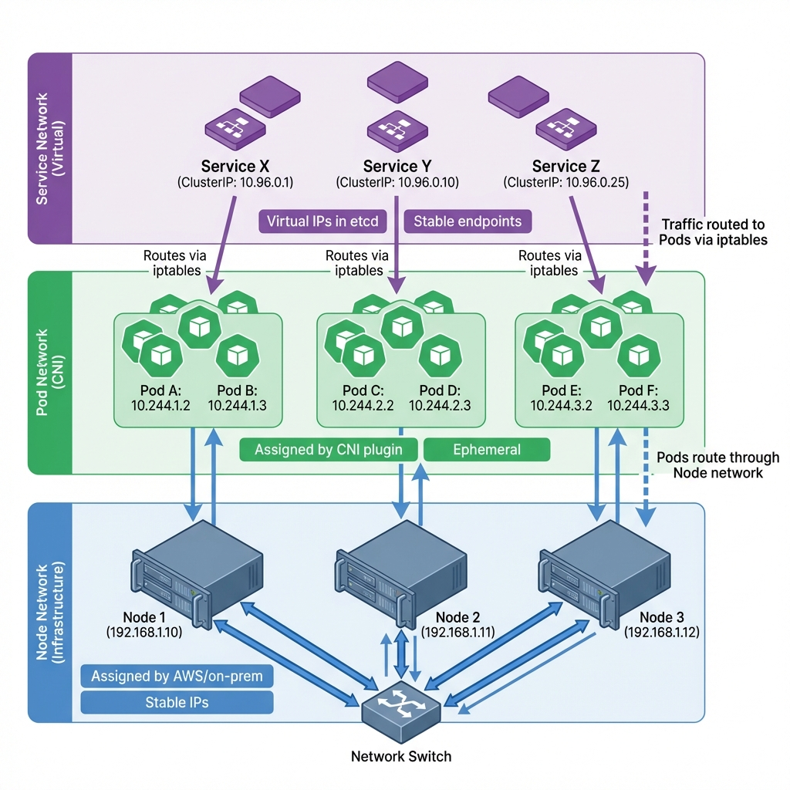

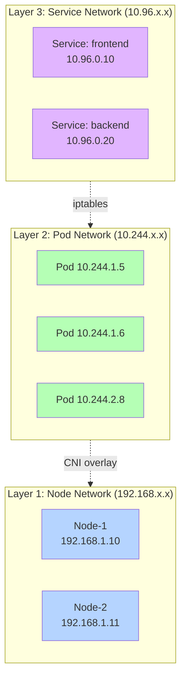

**The three layers explained:**

---

### Layer 1: Node Network (Infrastructure - 192.168.x.x)

**What**: Physical/VM network connecting Kubernetes nodes.

```
Your cluster:
  Node-1: 192.168.1.10
  Node-2: 192.168.1.11
  Node-3: 192.168.1.12

Connected via: AWS VPC, on-prem LAN, etc.
```

**Key characteristics**:
- Assigned by infrastructure (AWS, Azure, DHCP)
- **Stable** - IPs don't change
- Nodes communicate via this network
- Can be accessed externally (if firewall allows)

---

### Layer 2: Pod Network (CNI Overlay - 10.244.x.x)

**What**: Virtual network for Pods, managed by CNI plugin.

```
Node-1's Pods: 10.244.1.0/24 range
  → Pod-A: 10.244.1.5
  → Pod-B: 10.244.1.6

Node-2's Pods: 10.244.2.0/24 range
  → Pod-C: 10.244.2.5
  → Pod-D: 10.244.2.6
```

**Key characteristics**:
- Assigned by CNI plugin (Flannel, Calico, Cilium)
- **Ephemeral** - Pod restart = new IP
- Cluster-wide unique IPs
- Only accessible within cluster

**The critical relationship**: Each node gets a unique Pod subnet!

---

### How Does CNI Know Where Pods Are?

**Question**: When Pod-A (10.244.1.5) wants to reach Pod-C (10.244.2.5), how does CNI know Pod-C is on Node-2?

**Answer**: Each node gets a unique subnet, and CNI maintains routing tables.

**Step 1: Nodes Get Unique Subnets**

```
Kubernetes assigns:
  Node-1 (192.168.1.10) → 10.244.1.0/24
  Node-2 (192.168.1.11) → 10.244.2.0/24
  Node-3 (192.168.1.12) → 10.244.3.0/24
```

**The IP tells you the node!**
- `10.244.1.x` → Must be on Node-1
- `10.244.2.x` → Must be on Node-2

**Step 2: CNI Creates Routing Tables**

On every node:

```bash
# Node-1 routing table:
$ ip route
10.244.1.0/24 dev cni0          # Local Pods
10.244.2.0/24 via 192.168.1.11  # Pods on Node-2
10.244.3.0/24 via 192.168.1.12  # Pods on Node-3
```

**Step 3: Packet Uses Routes**

```
Pod-A (10.244.1.5) → Pod-C (10.244.2.5):

1. Kernel checks: "Where is 10.244.2.5?"
   Route: "10.244.2.0/24 via 192.168.1.11"

2. CNI encapsulates (VXLAN):
   Outer: 192.168.1.10 → 192.168.1.11 (Node IPs!)
   Inner: 10.244.1.5 → 10.244.2.5 (Pod IPs)

3. Packet travels over Node network

4. Node-2 decapsulates, delivers to Pod-C
```

**Pod network overlays Node network!**

---

### Layer 3: Service Network (Virtual - 10.96.x.x)

**What**: Virtual IPs that **don't exist anywhere** - just configuration!

```
Services (stable endpoints):
  frontend-service: 10.96.0.10
  backend-service: 10.96.0.20
  database-service: 10.96.0.30
```

**Key characteristics**:
- Assigned by Kubernetes API  
- **Never change** (until Service deleted)
- Virtual - no physical interface
- Intercepted by iptables rules

**The magic**: Service IPs are fake! They're intercepted by iptables before routing.

---

### Node IP vs Pod IP: The Relationship

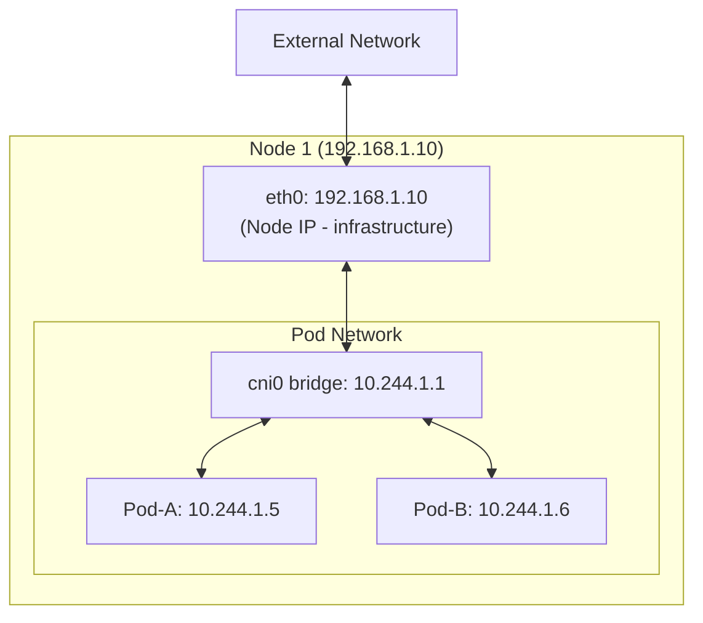

**Node IP**: Stable, infrastructure-assigned, used for node communication  
**Pod IP**: Ephemeral, CNI-assigned, used for Pod communication

**Pods ride on Node network** - Pod traffic tunneled through Node infrastructure.

---

## Part 3: Services - The High-Level View

Now that you understand the three network layers, let's understand Services conceptually before diving into how they work.

### What IS a Kubernetes Service?

**Conceptual view**:

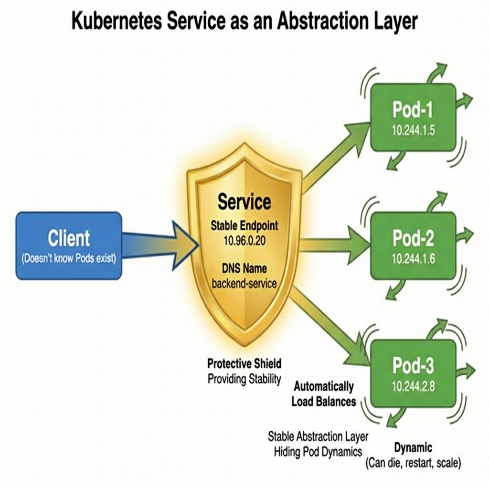

**A Service provides a protective shield**: Stable endpoint that hides Pod dynamics (scaling, crashes, restarts).

**A Service is an abstraction layer**:
- Provides stable endpoint (VIP + DNS name)
- Hides Pod dynamics (scaling, restarts, failures)
- Automatic load balancing
- Automatic health checking

**What a Service is NOT**:
- ❌ Not a Pod
- ❌ Not a container
- ❌ Not a process
- ❌ Not running anywhere

**What it IS**:
- ✅ Configuration in etcd
- ✅ DNS entry
- ✅ iptables rules (or IPVS/eBPF)
- ✅ Endpoints list

---

### Service Types: Progressive Access Levels

Kubernetes has 4 Service types, each providing different levels of access:

#### 1. ClusterIP (Internal Only)

**Accessible**: Only inside cluster  
**Use case**: Microservice-to-microservice communication

```yaml
apiVersion: v1
kind: Service
metadata:
  name: backend
spec:
  type: ClusterIP  # Default
  selector:
    app: backend
  ports:
  - port: 80
    targetPort: 8080
```

**Access**: `http://backend.default.svc.cluster.local:80`

---

#### 2. NodePort (External via Node IP)

**Accessible**: From outside, via any Node IP:port  
**Use case**: Development, testing, simple external access

```yaml
apiVersion: v1
kind: Service
metadata:
  name: web
spec:
  type: NodePort
  selector:
    app: web
  ports:
  - port: 80
    targetPort: 8080
    nodePort: 30080  # 30000-32767
```

**Access**: `http://192.168.1.10:30080` (any node IP works!)

---

#### 3. LoadBalancer (Cloud LB Integration)

**Accessible**: From internet, via cloud load balancer  
**Use case**: Production external access

```yaml
apiVersion: v1
kind: Service
metadata:
  name: web
spec:
  type: LoadBalancer
  selector:
    app: web
  ports:
  - port: 80
    targetPort: 8080
```

**Access**: `http://52.1.2.3` (cloud LB public IP)

---

#### 4. ExternalName (DNS CNAME)

**Accessible**: DNS alias only  
**Use case**: External services (RDS, external APIs)

```yaml
apiVersion: v1
kind: Service
metadata:
  name: external-db
spec:
  type: ExternalName
  externalName: db.external.com
```

---

### Service Type Comparison

| Feature | ClusterIP | NodePort | LoadBalancer | ExternalName |
|:--------|:----------|:---------|:-------------|:-------------|
| **Access** | Internal only | External via Node | Internet | N/A (DNS) |
| **Routing Hops** | 1 | 2 | 3+ | 0 |
| **Cost** | Free | Free | $$ | Free |
| **Port Range** | Any | 30000-32767 | Any (via LB) | N/A |
| **Production?** | Yes (internal) | No (dev only) | Yes (external) | Yes (external services) |

**Progression**: ClusterIP → NodePort → LoadBalancer = increasing accessibility

---

## Part 4: The Control Plane - How Services Actually Get Created

**This is the core section** - understanding how Services work behind the scenes.

Most people skip this and jump to packet flow. But **you can't understand packet flow without understanding how routing rules get created in the first place!**

### The Big Picture: Three Components Working Together

Services require **three separate components** that many people don't realize exist:

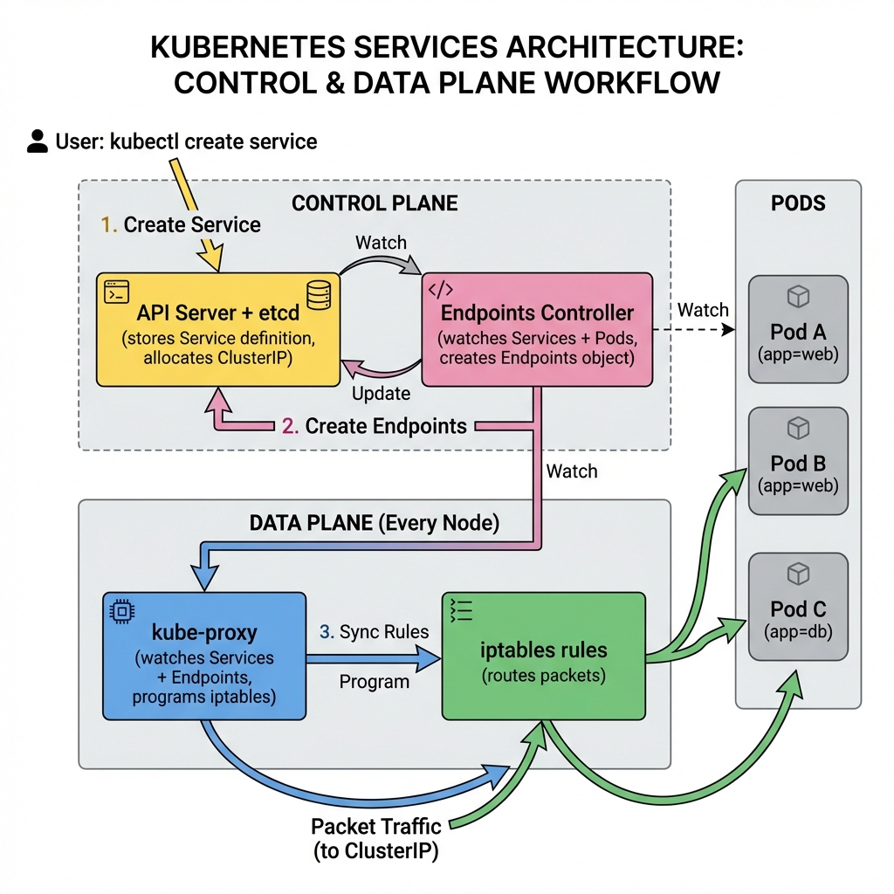

**The three components work together**: User creates Service → API Server stores it → Endpoints Controller discovers Pods → creates Endpoints → kube-proxy watches Endpoints → programs iptables → routing is live!

**The three components**:
1. **API Server + etcd**: Stores Service definition, allocates ClusterIP
2. **Endpoints Controller**: Discovers which Pods match Service (separate from kube-proxy!)
3. **kube-proxy**: Watches Endpoints, programs network rules (iptables/IPVS)

**Let's understand each component deeply.**

---

### Component 1: API Server Stores the Service

When you run:

```bash
$ kubectl create service clusterip backend --tcp=80:8080
```

**What happens in API Server**:

```yaml
# Stored in etcd:
apiVersion: v1
kind: Service
metadata:
  name: backend
  namespace: default
spec:
  selector:
    app: backend  # ← This selector is KEY!
  ports:
  - port: 80
    targetPort: 8080
  type: ClusterIP
  clusterIP: 10.96.0.20  # ← Allocated by API Server
```

**At this point**:
- ✅ Service object created in etcd
- ✅ ClusterIP allocated (10.96.0.20)
- ❌ **NO routing yet!**
- ❌ **NO Pod IPs known!**
- ❌ **NO iptables rules created!**

The Service is just **configuration** - a wish list saying "I want a stable endpoint for Pods labeled `app=backend`"

---

### Component 2: Endpoints Controller Discovers the Pods

**THIS IS THE CRITICAL MISSING PIECE!**

#### What is the Endpoints Controller?

- **Separate component** (not kube-proxy!)
- Runs as part of kube-controller-manager
- **Job**: Watch Services and Pods, create Endpoints objects

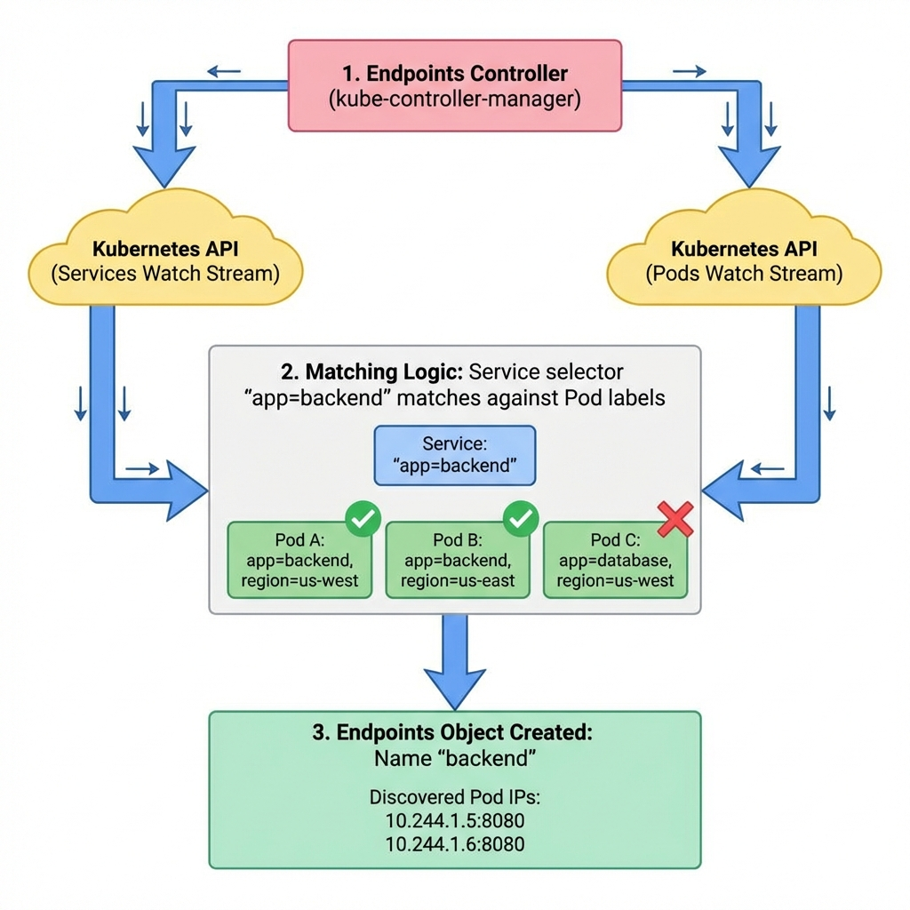

**Step-by-step**: Endpoints Controller watches both Services and Pods → matches selector labels → creates Endpoints object with discovered Pod IPs.

#### How Endpoints Get Created (Step-by-Step)

**1. Service created with selector**:
```yaml
Service "backend":
  selector:
    app: backend  # Looking for this label!
  ports:
  - port: 80
    targetPort: 8080
```

**2. Endpoints Controller queries Pods**:
```bash
# Essentially does:
$ kubectl get pods -l app=backend -o wide
NAME         STATUS    IP
backend-1    Running   10.244.1.5
backend-2    Running   10.244.1.6
backend-3    Running   10.244.2.8
```

**3. Endpoints Controller creates Endpoints object**:
```yaml
apiVersion: v1
kind: Endpoints  # ← Same name as Service!
metadata:
  name: backend
subsets:
- addresses:
  - ip: 10.244.1.5
  - ip: 10.244.1.6
  - ip: 10.244.2.8
  ports:
  - port: 8080  # ← targetPort from Service
```

**You can see this**:
```bash
$ kubectl get endpoints backend
NAME      ENDPOINTS
backend   10.244.1.5:8080,10.244.1.6:8080,10.244.2.8:8080
```

#### The Relationship: Service ↔ Endpoints ↔ Pods

```
Service "backend"
  ├─ ClusterIP: 10.96.0.20
  ├─ Selector: app=backend
  └─ Ports: 80 → 8080

           ↓ (Endpoints Controller creates)

Endpoints "backend"  ← Same name!
  └─ Addresses:
       ├─ 10.244.1.5:8080
       ├─ 10.244.1.6:8080
       └─ 10.244.2.8:8080

           ↓ (kube-proxy reads this!)

iptables rules:
  10.96.0.20:80 → {10.244.1.5, 10.244.1.6, 10.244.2.8}:8080
```

**Key insight**: The Endpoints object is the **bridge** between Service (stable VIP) and Pods (ephemeral IPs)!

**Endpoints Controller constantly updates this** as Pods come and go.

---

### Component 3: kube-proxy Programs the Network Rules

Now we get to kube-proxy - but you can see it's the **third step**, not the first!

#### What kube-proxy Actually Does

**NOT what the name suggests**:
- ❌ Does NOT proxy traffic
- ❌ Does NOT sit in packet path
- ❌ Does NOT handle packets

**What it ACTUALLY does**:
- ✅ Watches Service objects (gets ClusterIP, ports)
- ✅ Watches Endpoints objects (gets Pod IPs!) ← **THIS IS HOW IT KNOWS!**
- ✅ Programs network rules (iptables/IPVS/eBPF)
- ✅ Runs on EVERY node

#### How kube-proxy Discovers Pod IPs

**Answer**: It watches the **Endpoints object**!

```
kube-proxy watch event:
  Endpoints "backend" ADDED
  
  Data:
    Addresses:
      - 10.244.1.5:8080
      - 10.244.1.6:8080
      - 10.244.2.8:8080

kube-proxy action:
  "Service 'backend' needs iptables rules for these 3 Pod IPs"
  → Program iptables!
```

**kube-proxy doesn't discover Pods itself** - it just watches the Endpoints object that the Endpoints Controller maintains!

---

### How kube-proxy Programs iptables Rules

**The 5-step process**:

**Step 1: Watch Kubernetes API**

kube-proxy maintains in-memory state:

```go
type ServiceInfo struct {
    ClusterIP   string   // 10.96.0.20
    Port        int      // 80
    Endpoints   []string // [10.244.1.5:8080, ...]
}
```

**Step 2: Generate desired iptables rules**

```bash
# For Service "backend":

# Main entry
-A KUBE-SERVICES -d 10.96.0.20/32 -p tcp --dport 80 -j KUBE-SVC-BACKEND

# Load balancing (random selection)
-A KUBE-SVC-BACKEND -m statistic --probability 0.33 -j KUBE-SEP-POD1
-A KUBE-SVC-BACKEND -m statistic --probability 0.50 -j KUBE-SEP-POD2
-A KUBE-SVC-BACKEND -j KUBE-SEP-POD3

# DNAT to Pod IPs
-A KUBE-SEP-POD1 -j DNAT --to-destination 10.244.1.5:8080
-A KUBE-SEP-POD2 -j DNAT --to-destination 10.244.1.6:8080
-A KUBE-SEP-POD3 -j DNAT --to-destination 10.244.2.8:8080
```

**Step 3: Read current iptables state**

```bash
$ iptables-save > /tmp/current-rules
```

**Step 4: Compute diff**

Compare current vs desired, find rules to add/delete.

**Step 5: Apply atomically**

```bash
$ iptables-restore --noflush < /tmp/new-rules
```

**Why iptables-restore?** Atomic updates - all rules applied at once, no partial state.

---

### iptables Chain Structure Visualized

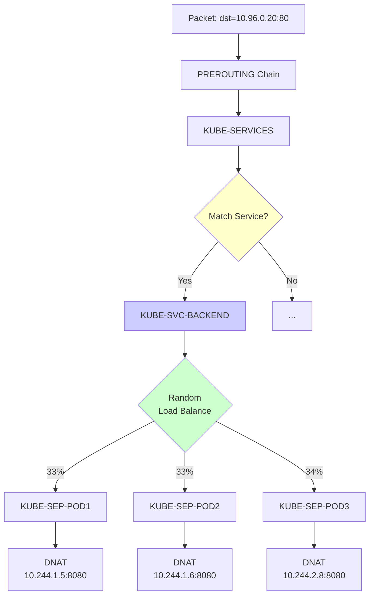

**View actual chains**:

```bash
$ sudo iptables -t nat -L KUBE-SVC-BACKEND -n
Chain KUBE-SVC-BACKEND
target         proto  source       destination
KUBE-SEP-POD1  all    0.0.0.0/0    0.0.0.0/0  statistic mode random probability 0.33333
KUBE-SEP-POD2  all    0.0.0.0/0    0.0.0.0/0  statistic mode random probability 0.50000
KUBE-SEP-POD3  all    0.0.0.0/0    0.0.0.0/0
```

**Probability math**: 
- Pod 1: 33.3% (1/3)
- Pod 2: 50% of remaining 66.7% = 33.3% (1/2 of 2)  
- Pod 3: 100% of remaining 33.3% = 33.3%
- **Result**: Perfect 33/33/33 distribution!

---

### Complete Service Creation Flow (End-to-End)

**Timeline**:

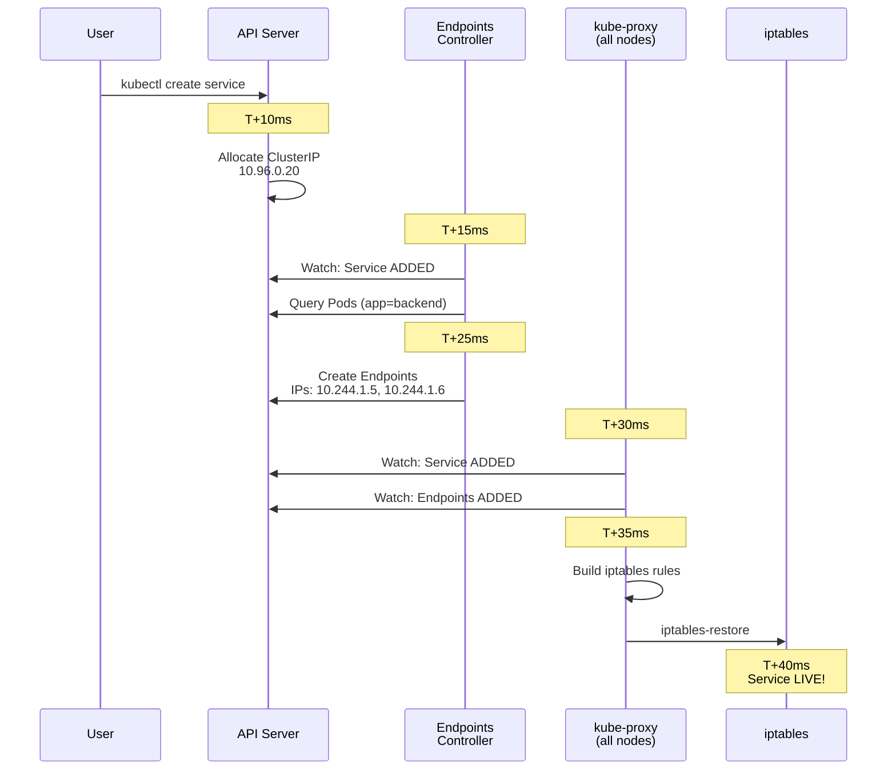

**Happens in ~40 milliseconds!**

---

### What Happens When a Pod Dies?

**Complete update flow**:

```
T+0ms:    Pod backend-2 (10.244.1.6) crashes

T+50ms:   kubelet detects failure
          Reports to API: Pod status → Failed

T+100ms:  Endpoints Controller watches Pods
          Sees: backend-2 failed
          
T+150ms:  Endpoints Controller updates:
          OLD: [10.244.1.5, 10.244.1.6, 10.244.2.8]
          NEW: [10.244.1.5, 10.244.2.8]  ← Removed .1.6

T+200ms:  kube-proxy (ALL nodes) watches Endpoints
          Sees: Endpoints "backend" UPDATED
          
T+250ms:  kube-proxy regenerates iptables:
          Removes KUBE-SEP-POD2 chain
          Updates probabilities (50/50 instead of 33/33/33)

T+300ms:  iptables-restore applied
          
T+350ms:  Traffic automatically goes to remaining 2 Pods!
```

**From Pod death to routing update: ~350 milliseconds!**

Clients never notice - existing connections continue, new requests go to healthy Pods.

---

### Summary: Control Plane Components

**What we learned**:

1. **API Server**: Stores Service definition, allocates ClusterIP
2. **Endpoints Controller**: Discovers Pods by label selector, creates Endpoints object
3. **kube-proxy**: Watches Endpoints (gets Pod IPs!), programs iptables rules

**The flow**:
```
User creates Service
  ↓
API Server stores it
  ↓
Endpoints Controller finds matching Pods
  ↓
Endpoints Controller creates Endpoints object
  ↓
kube-proxy sees Endpoints (with Pod IPs!)
  ↓
kube-proxy programs iptables
  ↓
Routing is live!
```

**Key insights**:
- ✅ Endpoints Controller discovers Pods (not kube-proxy!)
- ✅ Endpoints API object is the bridge (Service ↔ Pods)
- ✅ kube-proxy watches Endpoints to know where to route
- ✅ iptables rules do the actual packet routing

**Now you understand the control plane. Let's see the data plane!**

---

## Part 5: The Data Plane - How Packets Actually Travel

Now that you understand how Services get created and routing rules programmed, let's see how packets actually flow.

### ClusterIP: Internal Traffic Flow

**Scenario**: Frontend Pod calls backend Service

```
Frontend Pod: 10.244.1.3 (on Node-1)
Service: backend (ClusterIP: 10.96.0.20)
Backend Pods: 10.244.1.5, 10.244.1.6, 10.244.2.8
```

**Complete packet journey**:

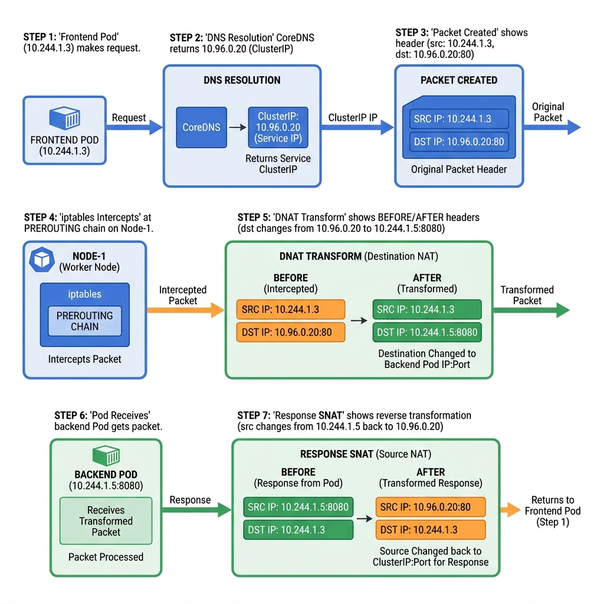

**Complete journey**: DNS resolution → packet creation → iptables intercepts → DNAT transforms ClusterIP to Pod IP → Pod receives → response uses SNAT back to ClusterIP.

**Step-by-step**:

**1. DNS Resolution**
```bash
$ nslookup backend.default.svc.cluster.local
Server:    10.96.0.1  # CoreDNS
Address:   10.96.0.20  # Service ClusterIP
```

**2. Packet Created**
```
Source:      10.244.1.3:54321
Destination: 10.96.0.20:80
```

**3. iptables Intercepts (PREROUTING)**
```
Kernel: "Packet for 10.96.0.20:80"
→ Check iptables NAT table
→ Match: KUBE-SERVICES rule
→ Jump to KUBE-SVC-BACKEND
```

**4. Load Balancing (Random Selection)**
```
Random number: 0.25 (< 0.33)
→ Jump to KUBE-SEP-POD1
```

**5. DNAT Transformation**
```
BEFORE:
  Src: 10.244.1.3:54321
  Dst: 10.96.0.20:80

AFTER (DNAT):
  Src: 10.244.1.3:54321  (unchanged)
  Dst: 10.244.1.5:8080   (changed!)
```

**6. Routing to Pod**
```
Kernel routing: 10.244.1.5 is on this node (Node-1)
→ Deliver via cni0 bridge
→ Pod receives packet
```

**7. Response Path (Reverse)**
```
Pod sends:
  Src: 10.244.1.5:8080
  Dst: 10.244.1.3:54321

iptables connection tracking (conntrack):
  "This is response to packet we modified"
  → Reverse the DNAT (becomes SNAT on response)

SNAT transformation:
  Src: 10.96.0.20:80  (changed back!)
  Dst: 10.244.1.3:54321

Frontend sees:
  Response from Service VIP (10.96.0.20)
  → Completely transparent!
```

---

### NodePort: External Access Flow

**Scenario**: External user accesses web Service

```
Client: 203.0.113.100 (internet)
Service: web (NodePort: 30080, ClusterIP: 10.96.0.10)
Nodes: 192.168.1.10, 192.168.1.11
Backend Pod: 10.244.2.5:8080 (on Node-2)
```

**Complete multi-hop journey**:

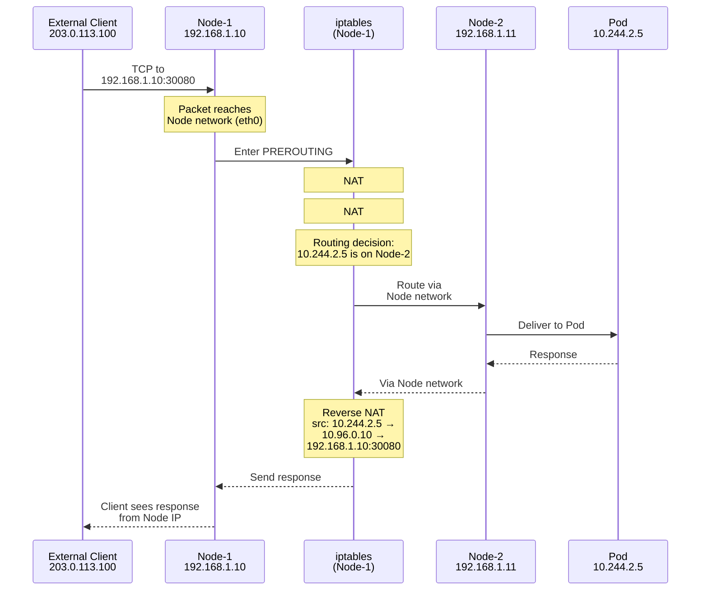

**Step-by-step with ALL hops**:

**Hop 1: External → Node IP**
```
Client creates:
  Src: 203.0.113.100:54321
  Dst: 192.168.1.10:30080  ← Node IP!

Packet travels over internet → Node-1 eth0
```

**Hop 2: NodePort → ClusterIP (First NAT)**
```
iptables rule:
  -A KUBE-SERVICES -d 192.168.1.10 --dport 30080 -j KUBE-SVC-WEB

Transform:
  Dst: 192.168.1.10:30080 → 10.96.0.10:80
```

**Hop 3: ClusterIP → Pod IP (Second NAT)**
```
iptables rule:
  -A KUBE-SVC-WEB ... -j KUBE-SEP-POD1
  -A KUBE-SEP-POD1 -j DNAT --to-destination 10.244.2.5:8080

Transform:
  Dst: 10.96.0.10:80 → 10.244.2.5:8080
```

**Hop 4: Routing via Node Network**
```
Destination: 10.244.2.5
CNI routing: "10.244.2.0/24 via Node-2 (192.168.1.11)"

Encapsulation (VXLAN):
  Outer: 192.168.1.10 → 192.168.1.11 (Node network)
  Inner: 203.0.113.100 → 10.244.2.5 (original)

Packet travels: Node-1 → Node-2
```

**Hop 5: Pod Receives**
``

`
Node-2 decapsulates
Delivers to Pod: 10.244.2.5
```

**Response path (reverse all NATs)**:
```
Pod → Node-2 → Node-1 → Client
With reverse transformations at each hop
Client sees response from: 192.168.1.10:30080
```

**Key insight**: Packet goes through Node network to reach Pod on different node!

---

### LoadBalancer: Production Flow

**Scenario**: Internet user accesses production app

```
Cloud LB: 52.1.2.3 (AWS ELB)
Nodes: 192.168.1.10, 192.168.1.11, 192.168.1.12
Service: web (LoadBalancer, auto-assigned NodePort: 32456)
Pods: distributed across nodes
```

**Multi-hop journey**:

```
Internet User (Client)
      ↓
  [Cloud Load Balancer]
      Public IP: 52.1.2.3
      ↓
  Forwards to NodePort on nodes
      ↓
  [Node IP:NodePort]
      192.168.1.10:32456 (randomly selected)
      ↓
  [iptables NAT #1]
      NodePort → ClusterIP
      ↓
  [iptables NAT #2]
      ClusterIP → Pod IP
      ↓
  [Node Network Routing]
      (if Pod on different node)
      ↓
  [Pod]
      Receives request
```

**Hops**:
1. Internet → Cloud LB (public IP)
2. Cloud LB → Node IP:NodePort (cloud LB chooses node)
3. NodePort → ClusterIP (iptables NAT)
4. ClusterIP → Pod IP (iptables NAT)
5. Node network routing (if cross-node)

**3-4 hops total!** But automatic and transparent.

---

## Part 6: Advanced Topics

### kube-proxy Modes: iptables vs IPVS vs eBPF

**Three modes available**:

#### 1. iptables mode (default)

**How it works**: Programs Linux iptables rules

**Pros**:
- ✅ Mature, stable
- ✅ Works everywhere
- ✅ No dependencies

**Cons**:
- ❌ O(n) rule matching (slow with many Services)
- ❌ Random load balancing only
- ❌ No health checking

**Use**: Most clusters

---

#### 2. IPVS mode

**How it works**: Uses Linux IPVS (IP Virtual Server)

```bash
$ ipvsadm -ln
IP Virtual Server version 1.2.1
TCP  10.96.0.20:80 rr
  -> 10.244.1.5:8080  Masq  1
  -> 10.244.1.6:8080  Masq  1
```

**Pros**:
- ✅ O(1) lookup
- ✅ Better load balancing (round-robin, least-connection, etc.)  
- ✅ Scales to 100,000+ Services

**Cons**:
- ❌ Requires kernel modules

**Use**: Large clusters (>5,000 Services)

---

#### 3. eBPF mode (Cilium)

**How it works**: Berkeley Packet Filter in kernel

**Pros**:
- ✅ Fastest performance
- ✅ Built-in observability
- ✅ Modern

**Cons**:
- ❌ Requires recent kernel (4.19+)

**Use**: Cutting-edge clusters, need observability

---

### Session Affinity

**Problem**: Sometimes you need requests from same client to go to same Pod (stateful apps, caching).

**Solution**: Session affinity (sticky sessions)

```yaml
apiVersion: v1
kind: Service
spec:
  sessionAffinity: ClientIP
  sessionAffinityConfig:
    clientIP:
      timeoutSeconds: 10800  # 3 hours
```

**How it works**:
```bash
# iptables adds "recent" module
-A KUBE-SEP-POD1 -m recent --name KUBE-SEP-XXX --set

# Future requests from same IP → same Pod
```

**Use cases**:
- Shopping carts
- WebSocket connections
- Cached state

---

### ExternalTrafficPolicy: Local vs Cluster

**Problem**: With NodePort, packet may hop to different node before reaching Pod.

**Two modes**:

#### Cluster (default)

```yaml
spec:
  externalTrafficPolicy: Cluster
```

**Behavior**: Packet can be forwarded to Pod on any node

**Pros**: ✅ Even load distribution  
**Cons**: ❌ Extra hop, ❌ Source IP lost (SNAT)

---

#### Local

```yaml
spec:
  externalTrafficPolicy: Local
```

**Behavior**: Packet only goes to Pods on the node it arrived at

**Pros**: ✅ No extra hop, ✅ Preserves source IP  
**Cons**: ❌ Uneven load (depends on Pod distribution)

**Use case**: Need client source IP (logging, geo-routing)

---

## Part 7: Troubleshooting

### Common Issues & How to Debug

#### Issue 1: Can't Reach Service

**Symptoms**: `curl backend-service` fails

**Debug steps**:

**1. Check DNS**:
```bash
$ kubectl run test --image=busybox -it --rm -- nslookup backend-service
Server:    10.96.0.1  ← Should be CoreDNS
Address:   10.96.0.20  ← Should resolve
```

**2. Check Endpoints**:
```bash
$ kubectl get endpoints backend-service
NAME      ENDPOINTS
backend   10.244.1.5:8080,10.244.1.6:8080

# No endpoints? Check labels!
$ kubectl get pods --show-labels
# Ensure Pod labels match Service selector
```

**3. Check Service**:
```bash
$ kubectl describe service backend-service
Selector:  app=backend  ← Must match Pod labels
Endpoints: 10.244.1.5:8080  ← Should list Pod IPs
```

---

#### Issue 2: NodePort Not Accessible

**Symptoms**: Can't access from external IP

**Debug steps**:

**1. Check Service type**:
```bash
$ kubectl get svc web
NAME   TYPE       PORT(S)
web    NodePort   80:30080/TCP  ← Check NodePort
```

**2. Check firewall**:
```bash
# Security group must allow NodePort range (30000-32767)
$ curl http://NODE_IP:30080
```

**3. Check kube-proxy**:
```bash
$ kubectl -n kube-system get pods | grep kube-proxy
kube-proxy-xxxxx  1/1  Running

$ kubectl -n kube-system logs kube-proxy-xxxxx
```

---

#### Issue 3: Uneven Load Distribution

**Symptoms**: Some Pods get all traffic

**Possible causes**:

**1. Session affinity enabled**:
```bash
$ kubectl get svc backend -o yaml | grep sessionAffinity
sessionAffinity: ClientIP  ← This causes stickiness
```

**2. Health check failures**:
```bash
$ kubectl get endpoints backend
# Check if all Pods listed
```

**3. Check iptables probabilities**:
```bash
$ sudo iptables -t nat -L KUBE-SVC-XXX -n
# Should see even probabilities
```

---

### Troubleshooting Flowchart

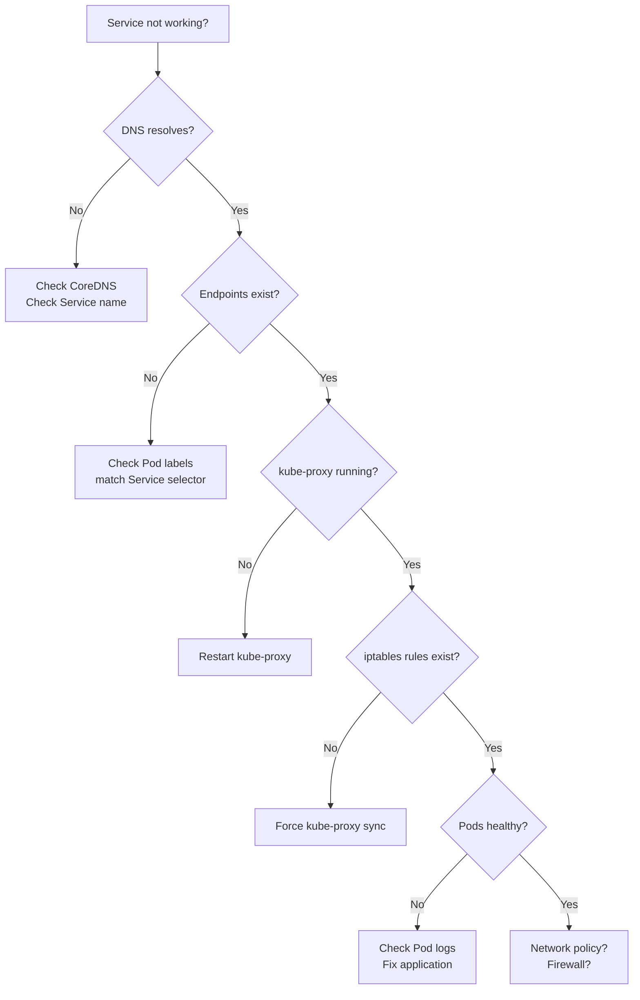

---

## Part 8: Summary & Key Takeaways

### The Complete Picture

**Services provide stable endpoints for dynamic Pods through a three-component system:**

**1. Control Plane** (how routing gets created):
- API Server stores Service definition
- Endpoints Controller discovers Pods, creates Endpoints object
- kube-proxy watches Endpoints, programs iptables

**2. Data Plane** (how packets flow):
- DNS resolves Service name → ClusterIP
- iptables intercepts packets (PREROUTING)
- DNAT transforms ClusterIP → Pod IP
- Kernel routes to Pod (via CNI if cross-node)
- Response uses reverse SNAT

**3. Progressive Accessibility**:
- ClusterIP: Internal only
- NodePort: External via Node IP
- LoadBalancer: Internet via cloud LB

---

### Key Insights You Learned

✅ **Services are NOT Pods** - just configuration + iptables rules

✅ **Endpoints Controller discovers Pods** - not kube-proxy!

✅ **Endpoints API object is the bridge** - Service ↔ Pods

✅ **kube-proxy watches Endpoints** - that's how it gets Pod IPs

✅ **iptables does routing** - kernel-level packet transformation

✅ **3 network layers work together** - Node, Pod, Service networks

✅ **SNAT on response is critical** - maintains illusion of Service VIP

✅ **Updates happen in ~350ms** - from Pod death to routing update

---

### The Complete Flow (One Sentence)

**User creates Service → API stores it → Endpoints Controller finds Pods → creates Endpoints → kube-proxy sees Endpoints → programs iptables → packets flow via DNAT/SNAT → automatic load balancing and failover = stable endpoint for dynamic Pods!**

---

**You now understand Kubernetes Service networking from first principles. No mysteries remaining!**
