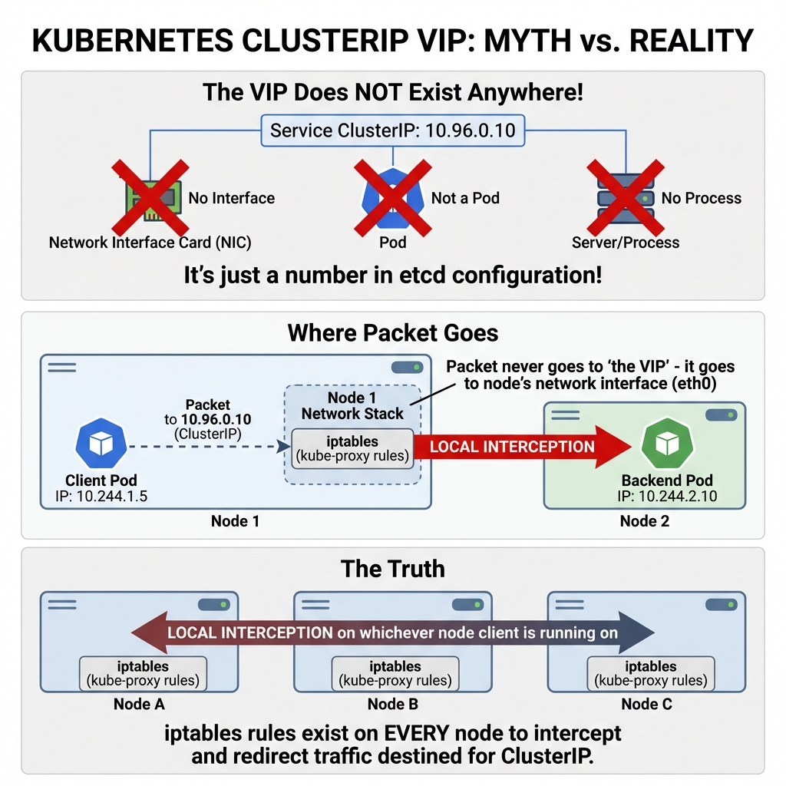
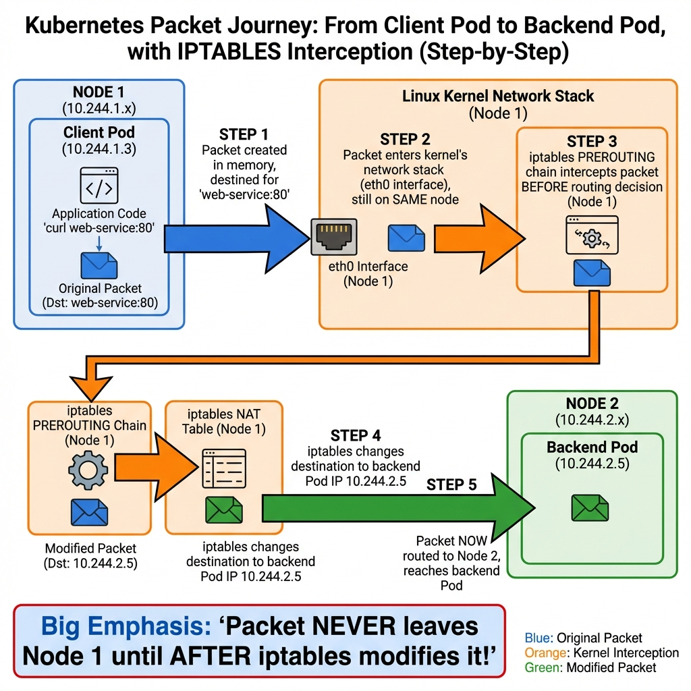
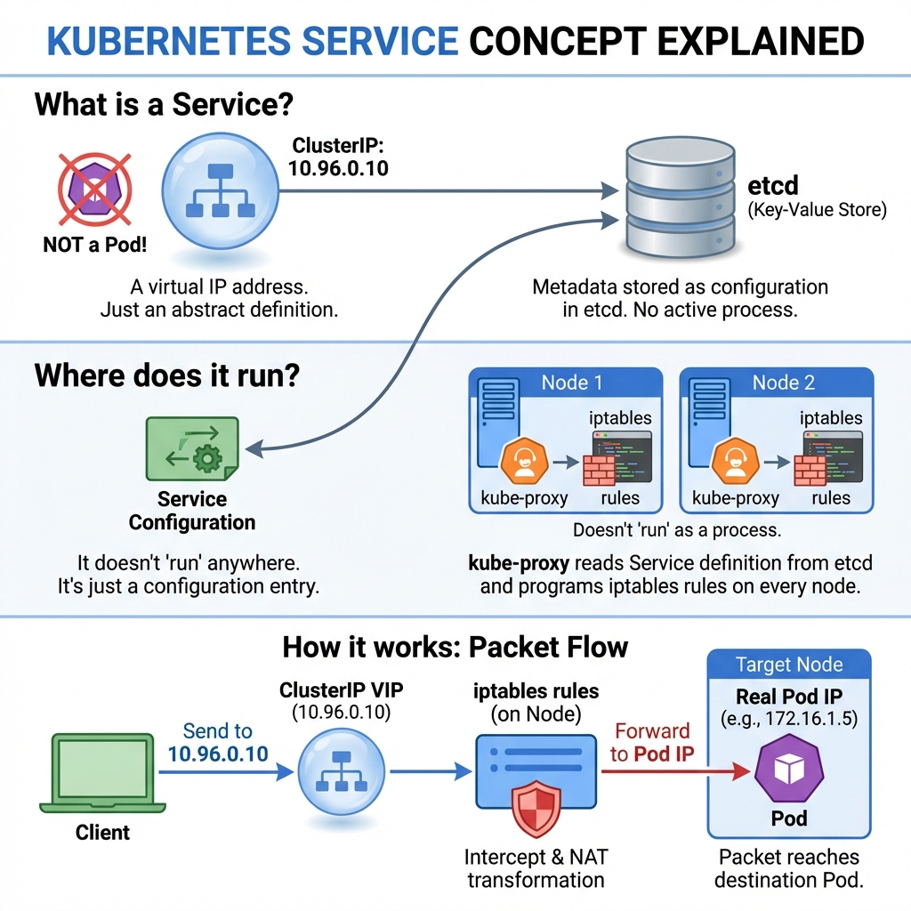
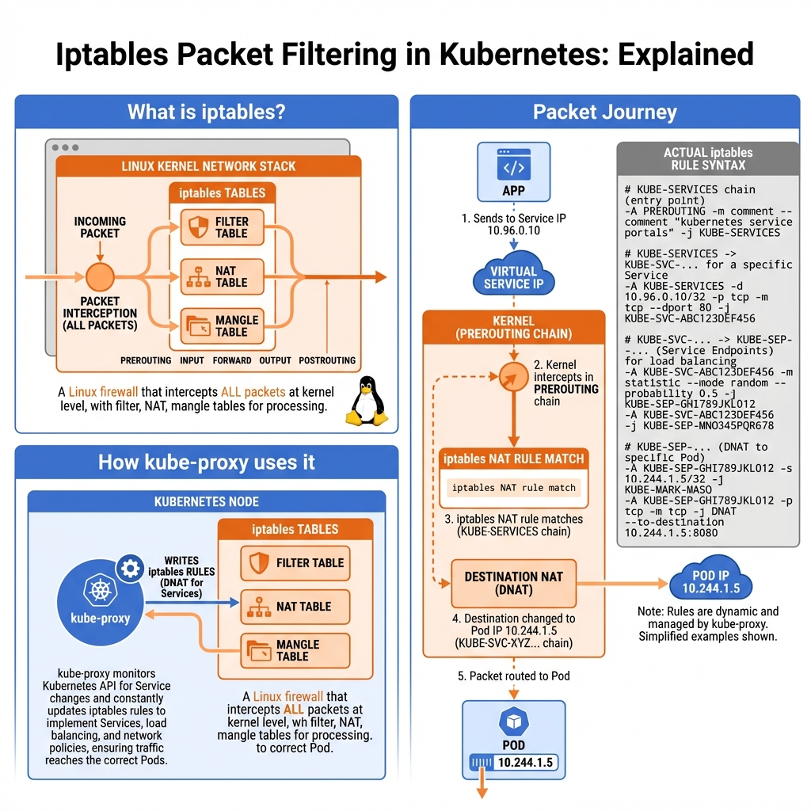
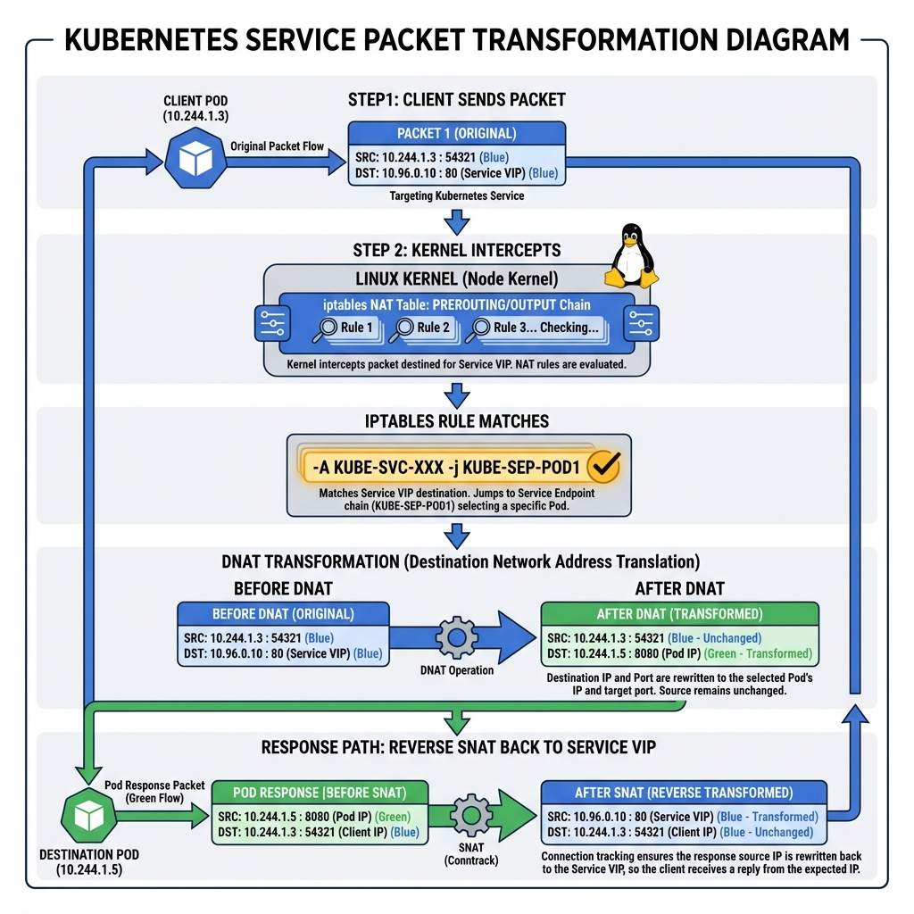
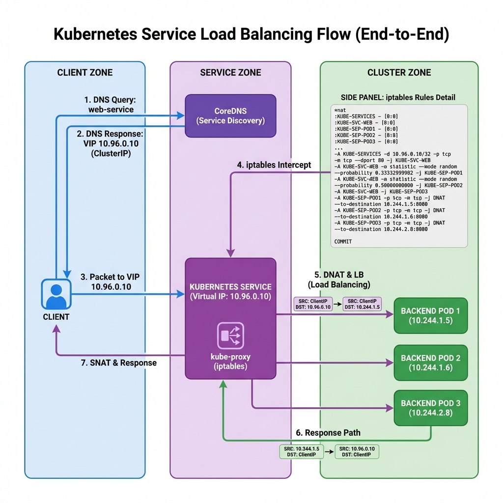

# Kubernetes Services & Networking: The Complete Guide to kube-proxy and Packet Routing

## Introduction

### The Service Discovery Problem

**Scenario**: You have a 3-tier web application in Kubernetes:

```
Frontend Pods:  Pod-A (10.244.1.5), Pod-B (10.244.2.8), Pod-C (10.244.3.2)
Backend API:    Pod-1 (10.244.1.10), Pod-2 (10.244.2.15), Pod-3 (10.244.3.20)
```

**Problem**: Frontend needs to call Backend, but:
- Pod IPs change when Pods restart (10.244.1.10 → 10.244.4.30 after restart)
- Which Pod should Frontend call? Need load balancing
- Frontend hardcoding backend IPs = disaster when Pods scale/move

**Without Kubernetes Services**:
```
Frontend code:
  backend_ip = "10.244.1.10"  # Hardcoded!
  http.get(backend_ip + "/api/users")

Backend Pod-1 crashes:
  → Kubernetes creates new Pod-1 with IP 10.244.4.30
  → Frontend still calling 10.244.1.10
  → Connection fails! 💥
```

**With Kubernetes Services**:
```
Frontend code:
  http.get("backend-service/api/users")  # Uses Service name!

Backend Pods crash/restart/scale:
  → Service VIP stays same: 10.96.0.50
  → Frontend never notices
  → Automatic load balancing ✓
```

**What is a Kubernetes Service?**

A Service provides:
1. **Stable virtual IP** (ClusterIP) that never changes
2. **DNS name** (`backend-service.default.svc.cluster.local`)
3. **Automatic load balancing** across healthy Pods
4. **Service discovery** (other apps can find it by name)

---

## The BIG Confusion: Where IS This ClusterIP VIP?

**This is the #1 question that confuses everyone. Let's answer it definitively:**



**THE TRUTH (this will blow your mind):**

**The ClusterIP VIP (`10.96.0.10`) does NOT exist ANYWHERE!**

❌ **NOT on a network interface card** - Run `ifconfig`, you won't find `10.96.0.10`
❌ **NOT a Pod** - There's no "Service Pod" running
❌ **NOT a process** - Can't SSH to it, can't `ps aux | grep` it
❌ **NOT on any physical machine** - Doesn't "live" on master or worker nodes

**✅ IT'S JUST A NUMBER** stored in etcd configuration!

**Think of it like a phone number that was never assigned to a real phone—it's just written in a directory.**

---

## Where Does The Packet Actually Go First?

**This is KEY to understanding:**



**STEP-BY-STEP (follow the diagram):**

**STEP 1: Packet Created in Client Pod**
```bash
# Inside Client Pod on Node 1
$ curl web-service:80

# Application code does:
connect(10.96.0.10, 80)

# Packet created in memory:
Src: 10.244.1.3:54321  (client Pod IP)
Dst: 10.96.0.10:80     (Service VIP)
```

**STEP 2: Packet Enters NODE 1's Network Stack**

```
Packet goes to Node 1's eth0 interface
(The node where the client Pod is running!)

NOT to "the VIP"
NOT to another node
NOT to master node
→ STAYS ON NODE 1 (locally!)
```

**STEP 3: iptables INTERCEPTS on Node 1 (BEFORE routing!)**

```
Linux kernel on Node 1:
  "I have a packet destined for 10.96.0.10"
  → Check iptables PREROUTING chain
  → Find kube-proxy rules
```

**Key Point**: Packet **NEVER leaves Node 1** until iptables modifies it!

**STEP 4: iptables Changes Destination**

```
iptables NAT rule on Node 1:
  "Change destination from 10.96.0.10 to 10.244.2.5"

Modified packet:
Src: 10.244.1.3:54321  (UNCHANGED)
Dst: 10.244.2.5:8080  (CHANGED - real Pod IP on Node 2!)
```

**STEP 5: NOW Packet Routes to Node 2**

```
Kernel routing decision:
  Dst: 10.244.2.5 → That's on Node 2!
  → Send packet over network to Node 2
  → Node 2 delivers to backend Pod
```

**The Critical Insight:**

```
❌ WRONG mental model:
  Client → "Service VIP server" → Backend Pod
  (There IS no "Service VIP server"!)

✅ CORRECT mental model:
  Client → Node's local iptables → Backend Pod
  (Interception happens LOCALLY on client's node!)
```

---

## What IS a Kubernetes Service? (It's Not a Pod!)



**Critical Understanding**:

**❌ Service is NOT**:
- NOT a Pod running somewhere
- NOT a container
- NOT a process you can SSH into

**✅ Service IS**:
- A **virtual IP address** (ClusterIP like `10.96.0.10`)
- Just **metadata stored in etcd** (configuration only)
- A **set of iptables rules** programmed on every node

**The diagram shows three key points:**

1. **What is it?**: Virtual IP stored as configuration in etcd
2. **Where does it run?**: Doesn't "run" anywhere! kube-proxy reads the Service definition and programs iptables rules
3. **How it works?**: iptables rules intercept packets and transform them

**Analogy**: A Service is like a **phone switchboard operator** from the 1950s:
- You call one number (Service VIP)
- Operator patches your call through to an available person (Pod)
- People (Pods) can change shifts, operator number stays the same

---

## What is iptables? (The Magic Behind Services)



**iptables Definition**: A Linux **firewall/packet filter** built into the kernel that can intercept and modify **EVERY network packet**.

**Think of it as airport security for packets:**
- Every packet must pass through security checkpoints
- Security checks rules: "Is this packet allowed?", "Should I redirect it?"
- Can modify, redirect, or block packets

**Three iptables Tables** (rule categories):

**1. Filter Table**: Allow or block packets
```bash
# Example: Block all traffic from IP 1.2.3.4
-A INPUT -s 1.2.3.4 -j DROP
```

**2. NAT Table** (← Kubernetes uses THIS!):
```bash
# Example: Change destination from Service IP to Pod IP
-A PREROUTING -d 10.96.0.10 -j DNAT --to-destination 10.244.1.5:8080
```

**3. Mangle Table**: Modify packet headers (advanced)

**Where iptables intercepts packets** (packet journey through kernel):

```
Application sends packet
     ↓
[PREROUTING] ← iptables intercepts HERE (NAT happens)
     ↓
Routing decision (where should packet go?)
     ↓
[FORWARD] ← For packets being forwarded
     ↓
[POSTROUTING] ← Source NAT happens here
     ↓
Packet leaves to network
```

**How kube-proxy uses iptables**:

```bash
# When you create a Service, kube-proxy does this:

# 1. Create chain for Service
iptables -t nat -N KUBE-SVC-WEB  # "WEB" service chain

# 2. Add rule to jump to Service chain
iptables -t nat -A PREROUTING \
  -d 10.96.0.10 -p tcp --dport 80 \
  -j KUBE-SVC-WEB

# 3. Create chains for each Pod (Service Endpoints)
iptables -t nat -N KUBE-SEP-POD1  # Pod 1
iptables -t nat -N KUBE-SEP-POD2  # Pod 2  
iptables -t nat -N KUBE-SEP-POD3  # Pod 3

# 4. Load balance: Randomly pick one Pod
iptables -t nat -A KUBE-SVC-WEB \
  -m statistic --mode random --probability 0.33 \
  -j KUBE-SEP-POD1

iptables -t nat -A KUBE-SVC-WEB \
  -m statistic --mode random --probability 0.50 \
  -j KUBE-SEP-POD2

iptables -t nat -A KUBE-SVC-WEB \
  -j KUBE-SEP-POD3

# 5. Each Pod chain does DNAT (change destination to Pod IP)
iptables -t nat -A KUBE-SEP-POD1 \
  -j DNAT --to-destination 10.244.1.5:8080
```

**View actual rules**:
```bash
$ iptables -t nat -L -n | grep KUBE
# You'll see hundreds of rules created by kube-proxy!
```

**Key Insight**: kube-proxy doesn't forward packets itself. It just **programs iptables rules**, then the **kernel** does the actual packet forwarding.

---

## The Complete Packet Journey: From Service VIP to Pod



**Let's trace a real packet** through the entire flow:

**Scenario**: Frontend Pod calls `web-service:80`

**STEP 1: Client sends packet**

```
Source IP:        10.244.1.3 (frontend Pod)
Source Port:      54321 (random client port)
↓
Destination IP:   10.96.0.10 (Service VIP)
Destination Port: 80
```

**STEP 2: Kernel intercepts in PREROUTING chain**

```
Linux kernel network stack:
  "Packet destined for 10.96.0.10:80"
  → Check iptables NAT table PREROUTING rules
```

**STEP 3: iptables rule matches**

```bash
# Rule matches!
-A KUBE-SERVICES -d 10.96.0.10/32 -p tcp -m tcp --dport 80 \
  -j KUBE-SVC-XXX

# Jump to Service chain, randomly select Pod
-A KUBE-SVC-XXX -m statistic --mode random --probability 0.33 \
  -j KUBE-SEP-POD1

# Let's say Pod 1 selected
```

**STEP 4: DNAT transformation** (Destination NAT)

```
BEFORE (original packet):
  Source:      10.244.1.3:54321 (frontend)
  Destination: 10.96.0.10:80    (Service VIP)

iptables rule: -j DNAT --to-destination 10.244.1.5:8080

AFTER (transformed packet):
  Source:      10.244.1.3:54321 (UNCHANGED)
  Destination: 10.244.1.5:8080  (CHANGED to Pod IP!)
```

**STEP 5: Packet routed to Pod**

```
Kernel routing:
  Destination 10.244.1.5 → Route to docker0 bridge → Pod receives packet

Pod application:
  Sees connection from 10.244.1.3:54321 ← Thinks client connected directly!
```

**STEP 6: Response path (reverse transformation)**

```
Pod sends response:
  Source:      10.244.1.5:8080  (Pod IP)
  Destination: 10.244.1.3:54321 (frontend)

iptables connection tracking (conntrack) remembers the original request:
  "This is a response to a packet we modified"
  → Reverse the DNAT

SNAT (Source NAT) transformation:
  Source:      10.96.0.10:80     (CHANGED back to Service VIP!)
  Destination: 10.244.1.3:54321  (UNCHANGED)

Frontend receives response:
  Thinks it came from Service 10.96.0.10 ← Completely transparent!
```

**Why SNAT is crucial**:

Without SNAT:
```
Frontend calls: web-service (10.96.0.10)
Response from:  10.244.1.5 (Pod IP)  ← Different IP!
Frontend: "Wait, I didn't connect to .1.5, I connected to .0.10!"
         → Connection rejected
```

With SNAT:
```
Frontend calls: web-service (10.96.0.10)
Response from:  web-service (10.96.0.10)  ← Same IP
Frontend: "Perfect! Response from who I called"
         → Connection succeeds ✓
```

**Connection Tracking** (how kernel remembers):

```bash
$ conntrack -L | grep 10.96.0.10
tcp  120 ESTABLISHED src=10.244.1.3 dst=10.96.0.10 \
                     src=10.244.1.5 dst=10.244.1.3 [ASSURED]
# Kernel maintains state table of active connections
```

**The Magic**: From the frontend's perspective:
- Connected to Service `10.96.0.10:80`
- Response came from Service `10.96.0.10:80`
- **Never knew** actual Pod `10.244.1.5` handled it

**Even if Pod 1 dies**, next request goes to Pod 2 or 3 automatically. Frontend never notices!

---

## Service Load Balancing Deep Dive



### How kube-proxy Implements Load Balancing

**Random selection** using iptables statistics module:

```bash
# For 3 backend Pods, probability math:
# Pod 1: 33.3% chance (1/3)
# Pod 2: 50% of remaining (1/2 of remaining 2)
# Pod 3: 100% of remaining (last one)

-A KUBE-SVC-XXX -m statistic --mode random --probability 0.33333 -j KUBE-SEP-POD1
-A KUBE-SVC-XXX -m statistic --mode random --probability 0.50000 -j KUBE-SEP-POD2
-A KUBE-SVC-XXX -j KUBE-SEP-POD3
```

**Distribution over 10,000 requests**:
- Pod 1: ~3,333 requests
- Pod 2: ~3,333 requests
- Pod 3: ~3,334 requests

**Session Affinity** (optional):

```yaml
apiVersion: v1
kind: Service
spec:
  sessionAffinity: ClientIP  # Same client → same Pod
  sessionAffinityConfig:
    clientIP:
      timeoutSeconds: 10800  # 3 hours
```

How it works:
```bash
# iptables adds "recent" module
-A KUBE-SEP-POD1 -m recent --name KUBE-SEP-XXX --set
-A KUBE-SEP-POD1 -j DNAT --to-destination 10.244.1.5:8080

# Future requests from same client IP → same Pod
```

---

## kube-proxy Modes

### Mode 1: iptables (Default)

**How it works**: Programs iptables rules on every node

**Advantages**:
✅ Kernel-level (fast)
✅ No single point of failure
✅ Mature, battle-tested

**Disadvantages**:
❌ O(n) rule matching (slow with 10,000+ Services)
❌ Random load balancing only
❌ No health checking (relies on Endpoints)

**When to use**: Most clusters (<5,000 Services)

---

### Mode 2: IPVS (IP Virtual Server)

**How it works**: Uses Linux IPVS kernel module for load balancing

```bash
# Check IPVS rules
$ ipvsadm -ln
IP Virtual Server version 1.2.1
Prot LocalAddress:Port Scheduler Flags
  -> RemoteAddress:Port           Forward Weight
TCP  10.96.0.10:80 rr
  -> 10.244.1.5:8080              Masq    1
  -> 10.244.1.6:8080              Masq    1
  -> 10.244.2.8:8080              Masq    1
```

**Load balancing algorithms**:
- **rr** (round robin): Even distribution
- **lc** (least connection): Least active connections
- **sh** (source hashing): Session affinity

**Advantages**:
✅ O(1) lookup (constant time)
✅ Better load balancing algorithms
✅ Scales to 100,000+ Services

**Disadvantages**:
❌ Requires kernel modules
❌ More complex setup

**When to use**: Large clusters (>5,000 Services), need advanced load balancing

---

### Mode 3: eBPF (Cilium)

**How it works**: Uses Berkeley Packet Filter at kernel level

**Advantages**:
✅ Fastest performance
✅ Built-in observability
✅ Network policies integrated

**When to use**: Cutting-edge clusters, need observability

---

## Service Types

### 1. ClusterIP (Default)

**What**: Internal-only virtual IP

```yaml
apiVersion: v1
kind: Service
metadata:
  name: backend-service
spec:
  type: ClusterIP  # Default, can omit
  selector:
    app: backend
  ports:
  - port: 80
    targetPort: 8080
```

**Access**: Only within cluster
**Use case**: Internal microservice communication

---

### 2. NodePort

**What**: Exposes Service on each node's IP at a static port

```yaml
apiVersion: v1
kind: Service
metadata:
  name: web-service
spec:
  type: NodePort
  selector:
    app: web
  ports:
  - port: 80
    targetPort: 8080
    nodePort: 30080  # 30000-32767
```

**Access**: `<NodeIP>:30080` from outside cluster

**How it works**:
```
External → Node:30080 → iptables → ClusterIP:80 → Pod:8080
```

**Use case**: Development, testing, demo apps

---

### 3. LoadBalancer

**What**: Provisions cloud load balancer (AWS ELB, Azure LB, GCP LB)

```yaml
apiVersion: v1
kind: Service
metadata:
  name: web-service
spec:
  type: LoadBalancer
  selector:
    app: web
  ports:
  - port: 80
    targetPort: 8080
```

**What happens**:
1. Cloud controller creates external load balancer
2. LB gets public IP (e.g., `52.12.34.56`)
3. LB forwards to NodePorts on nodes
4. NodePort forwards to ClusterIP
5. ClusterIP forwards to Pods

**Use case**: Production external access

---

### 4. ExternalName

**What**: DNS CNAME alias to external service

```yaml
apiVersion: v1
kind: Service
metadata:
  name: database
spec:
  type: ExternalName
  externalName: db.example.com
```

**How it works**:
```bash
$ nslookup database.default.svc.cluster.local
# Returns: CNAME db.example.com
```

**Use case**: Accessing external databases, APIs

---

## Troubleshooting Services

### 1. Service not routing traffic

**Check Endpoints**:
```bash
$ kubectl get endpoints web-service
NAME          ENDPOINTS
web-service   10.244.1.5:8080,10.244.1.6:8080

# No endpoints? Check label selector!
$ kubectl get pods --show-labels
```

**Common issue**: Service selector doesn't match Pod labels

```yaml
# Service
selector:
  app: web  # Looking for this

# Pod
labels:
  app: nginx  # MISMATCH!
```

---

### 2. Can't reach Service from Pod

**Test DNS**:
```bash
$ kubectl run test --image=busybox -it --rm -- sh
/ # nslookup web-service
# Should resolve to ClusterIP

/ # wget -O- web-service:80
# Should get response
```

**Check kube-proxy**:
```bash
$ kubectl -n kube-system get pods | grep kube-proxy
kube-proxy-xxxxx  1/1  Running

$ kubectl -n kube-system logs kube-proxy-xxxxx
```

---

### 3. iptables rules not created

**Check kube-proxy mode**:
```bash
$ kubectl -n kube-system get cm kube-proxy -o yaml | grep mode
mode: "iptables"
```

**View rules manually**:
```bash
$ sudo iptables-save | grep KUBE-SERVICES
# Should see Service chains
```

---

## Summary

**What Happens When You Create a Service**:

1. **API server** creates Service object in etcd (allocates ClusterIP)
2. **CoreDNS** registers DNS name → Service IP
3. **kube-proxy** on EVERY node watches Service + Endpoints
4. **kube-proxy** programs **iptables/IPVS rules** on EVERY node
5. **Client** sends to Service VIP
6. **Kernel iptables** intercepts packet (on client's node!), applies DNAT to random Pod IP
7. **Pod** responds, kernel applies reverse SNAT
8. **Client** sees response from Service VIP (stable, consistent)

**Key Takeaways**:
✅ Service = Virtual IP + iptables rules (NOT a Pod!)
✅ kube-proxy programs rules, kernel does routing
✅ Interception happens on CLIENT's node (local!)
✅ DNAT changes destination (Service → Pod)
✅ SNAT changes source back (Pod → Service) for responses
✅ Connection tracking makes round-trip transparent

**No Service "Pod" running anywhere** - it's ALL iptables rules + kernel magic!

---
