# Kubernetes Services & Networking: Understanding the Complete Picture

**A beginner-friendly, in-depth guide to how packets travel from clients to Pods, and why we need three layers of networking.**

---

## Introduction: The Three-Layer Networking Challenge

### The Problem: "My Frontend Can't Find My Backend!"

You've deployed a microservices application to Kubernetes:
- **Frontend**: 3 replicas (web-pod-1, web-pod-2, web-pod-3)
- **Backend API**: 5 replicas (api-pod-1 through api-pod-5)
- **Database**: 1 replica (db-pod-1)

**Question**: How does the frontend find and call the backend?

**Challenge #1**: Pod IPs are ephemeral
```
09:00 AM: api-pod-1 has IP 10.244.1.5
09:15 AM: api-pod-1 crashes, Kubernetes creates new Pod
09:15:02 AM: New api-pod-1 has IP 10.244.3.20  ← Different IP!
Frontend still calling 10.244.1.5 → FAILS 💥
```

**Challenge #2**: Which replica to call?
```
Backend has 5 replicas with 5 different IPs:
- 10.244.1.5
- 10.244.1.6
- 10.244.2.8
- 10.244.2.9
- 10.244.3.10

Frontend needs load balancing. Hardcode all 5 IPs? Impossible to maintain!
```

**Challenge #3**: External access
```
Users on internet need to access frontend
But Pods have internal IPs (10.244.x.x)
How do external requests reach internal Pods?
```

**The Solution**: Kubernetes uses **three layers of networking** working together. Let's understand each layer before diving into Services.

---

## The Three Layers of Kubernetes Networking


**The diagram shows how three network layers work together.** Let's break down each layer:

###Layer 1: Node Network (Infrastructure Layer - 192.168.x.x)

**What it is**: The physical/VM network connecting your Kubernetes nodes.

```
Your cluster has 3 worker nodes:
Node-1: 192.168.1.10
Node-2: 192.168.1.11  
Node-3: 192.168.1.12

Connected via standard network (AWS VPC, on-prem LAN, etc.)
```

**Characteristics**:
- **Assigned by**: Infrastructure (AWS, Azure, on-prem DHCP)
- **Stability**: IPs don't change (unless node replaced)
- **Purpose**: Nodes communicate with each other
- **Accessible from**: Outside cluster (if firewall allows)

**Example - Node-to-Node communication**:
```bash
# From Node-1
$ ping 192.168.1.11
PING 192.168.1.11: 64 bytes time=0.5ms
# Nodes can reach each other via normal network
```

---

### Layer 2: Pod Network (Container Layer - 10.244.x.x)

**What it is**: Virtual network for Pods, managed by CNI (Container Network Interface) plugin.

```
Node-1's Pods: 10.244.1.0/24 range
  - Pod-A: 10.244.1.5
  - Pod-B: 10.244.1.6
  - Pod-C: 10.244.1.7

Node-2's Pods: 10.244.2.0/24 range
  - Pod-D: 10.244.2.5
  - Pod-E: 10.244.2.6

Node-3's Pods: 10.244.3.0/24 range
  - Pod-F: 10.244.3.5
```

**Characteristics**:
- **Assigned by**: CNI plugin (Calico, Flannel, Cilium, etc.)
- **Stability**: Ephemeral - Pod restart = new IP
- **Purpose**: Pod-to-Pod communication cluster-wide
- **Accessible from**: Only within cluster

**Pod IPs are cluster-wide unique** - no two Pods ever have same IP at same time.

---

### Layer 3: Service Network (Virtual Layer - 10.96.x.x)

**What it is**: Virtual IPs (VIPs) that **don't actually exist anywhere** - just configuration in etcd!

```
Services (stable endpoints):
  frontend-service: 10.96.0.10
  backend-service: 10.96.0.20
  database-service: 10.96.0.30
```

**Characteristics**:
- **Assigned by**: Kubernetes API server from service CIDR range
- **Stability**: Never change (until Service deleted)
- **Purpose**: Stable endpoints for dynamic Pod groups
- **Accessible from**: Only within cluster (for ClusterIP type)

**The magic**: Service IPs don't bind to any network interface - they're intercepted by iptables!

---

## Understanding Node IP vs Pod IP (The Foundation)

**This is crucial**: Before understanding Services, you MUST understand the relationship between Node IPs and Pod IPs.

### Node IP: The Physical Address


**Node IP (192.168.1.10)**:
- Assigned to node's physical network interface (`eth0`)
- Used for node-to-node communication
- Used for external access (if exposed)
- Stable - doesn't change

**Pod IPs (10.244.1.x)**:
- Assigned to virtual interfaces inside containers
- Not routable outside the cluster (private range)
- Must go through Node's network interface to communicate externally

### The Relationship: Pods Ride on Node Network

**Key Insight**: Pod network is an **overlay** on top of Node network.

**Pod-to-Pod communication across nodes**:

```
Pod-A (10 .244.1.5 on Node-1) wants to reach Pod-D (10.244.2.5 on Node-2)

Step 1: Pod-A sends packet:
  Src: 10.244.1.5
  Dst: 10.244.2.5

Step 2: CNI plugin encapsulates packet:
  Outer header added:
    Src: 192.168.1.10  (Node-1 IP!)
    Dst: 192.168.1.11  (Node-2 IP!)
  Inner packet: Original 10.244.1.5 → 10.244.2.5

Step 3: Packet travels over Node network:
  Node-1 eth0 → network switch → Node-2 eth0

Step 4: Node-2 CNI decapsulates:
  Removes outer header
  Delivers inner packet to Pod-D (10.244.2.5)
```

**This is called VXLAN encapsulation** - Pod IPs tunnel through Node IPs!

---

## Why Do We Need Services? (Building the Need)

Now that you understand Node IPs and Pod IPs, let's see why Services are necessary:

### Problem 1: Pod IPs Change

```yaml
# Deployment creates Pod
apiVersion: apps/v1
kind: Deployment
spec:
  replicas: 1
  template:
    metadata:
      labels:
        app: backend
```

**What happens**:
```
10:00 AM - Pod created: backend-pod-abc123
          IP: 10.244.1.5

10:30 AM - Pod crashes (OOMKilled)

10:30:01 AM - Kubernetes creates NEW Pod: backend-pod-def456
              IP: 10.244.2.20  ← DIFFERENT IP!
```

**Frontend code breaks**:
```python
# Frontend hardcoded IP
backend_url = "http://10.244.1.5:8080/api"
response = requests.get(backend_url)  # FAILS! Pod moved to 10.244.2.20
```

### Problem 2: Multiple Replicas Need Load Balancing

```yaml
replicas: 5  # 5 backend Pods
```

**5 different IPs**:
```
backend-pod-1: 10.244.1.5
backend-pod-2: 10.244.1.6
backend-pod-3: 10.244.2.8
backend-pod-4: 10.244.2.9
backend-pod-5: 10.244.3.10
```

**How does frontend distribute load?**
```python
# Manual load balancing? NO!
backend_ips = ["10.244.1.5", "10.244.1.6", "10.244.2.8", ...]
random_ip = random.choice(backend_ips)
# What if that Pod just died? What if IP changed?
```

### The Service Solution

**Services provide**:
1. **Stable virtual IP** that never changes
2. **DNS name** for discovery
3. **Automatic load balancing** across healthy Pods
4. **Automatic health checking** (via Endpoints)

```yaml
apiVersion: v1
kind: Service
metadata:
  name: backend-service
spec:
  selector:
    app: backend  # Routes to Pods with this label
  ports:
  - port: 80
    targetPort: 8080
  type: ClusterIP
```

**Frontend code (fixed)**:
```python
# Use Service name!
backend_url = "http://backend-service/api"
response = requests.get(backend_url)
# Works forever, even as Pods come and go!
```

---

## Service Types: From Simple to Complex

Kubernetes has 4 Service types. Let's understand each with **complete packet flow**.

### Type 1: ClusterIP (Internal Only)

**What**: Virtual IP accessible only inside cluster.

```yaml
apiVersion: v1
kind: Service
metadata:
  name: backend-service
spec:
  type: ClusterIP  # Default, can omit
  selector:
    app: backend
  ports:
  - port: 80        # Service port
    targetPort: 8080  # Pod port
```

**What happens**:
1. Kubernetes allocates ClusterIP: `10.96.0.20`
2. CoreDNS registers: `backend-service.default.svc.cluster.local` → `10.96.0.20`
3. kube-proxy programs iptables rules on ALL nodes

**Complete Packet Flow**:

```
┌─────────────────────────────────────────┐
│ Frontend Pod (10.244.1.3) on Node-1     │
│ Code: http.get("backend-service:80")    │
└──────────────────┬──────────────────────┘
                   │
                   ▼
         ┌─────────────────────┐
         │ DNS Resolution      │
         │ backend-service →  │
         │ 10.96.0.20          │
         └──────────┬──────────┘
                    │
                    ▼
          ┌─────────────────────┐
          │ Packet Created      │
          │ Src: 10.244.1.3     │
          │ Dst: 10.96.0.20:80  │
          └──────────┬──────────┘
                     │
                     ▼
    ┌────────────────────────────────────┐
    │ iptables on Node-1 (PREROUTING)    │
    │ Intercepts packet BEFORE routing   │
    └──────────┬─────────────────────────┘
               │
               ▼
    ┌──────────────────────────┐
    │ iptables NAT (DNAT)      │
    │ Change destination:      │
    │ 10.96.0.20:80 →          │
    │ 10.244.2.5:8080 (Pod IP) │
    └──────────┬───────────────┘
               │
               ▼
    ┌──────────────────────────┐
    │ Routing Decision         │
    │ Dst: 10.244.2.5 is on:   │
    │ - Same node? Local       │
    │ - Node-2? Route via      │
    │   Node network           │
    └──────────┬───────────────┘
               │
               ▼  (Packet reaches Node-2 via 192.168.1.x network)
               │
    ┌──────────────────────────┐
    │ Pod receives packet      │
    │ Backend Pod              │
    │ IP: 10.244.2.5:8080      │
    └──────────────────────────┘
```

**Use Case**: Internal microservice communication

---

### Type 2: NodePort (External via Node IP)

**What**: Exposes Service on EACH node's IP at a static port (30000-32767).

```yaml
apiVersion: v1
kind: Service
metadata:
  name: web-service
spec:
  type: NodePort
  selector:
    app: web
  ports:
  - port: 80
    targetPort: 8080
    nodePort: 30080  # Opens port 30080 on ALL nodes
```

**What happens**:
1. Creates ClusterIP: `10.96.0.10`
2. Opens port 30080 on ALL node IPs
3. iptables forwards NodePort → ClusterIP → Pods

**Complete Packet Flow** (THIS IS KEY - shows Node IP involvement!):

```
External Client (203.0.113.100)
           │
           │ curl http://192.168.1.10:30080
           ▼
    Internet/Network
           │
           ▼
┌──────────────────────────────┐
│ Node-1 eth0                  │
│ IP: 192.168.1.10:30080       │  ← Packet reaches NODE first!
└──────────┬───────────────────┘
           │
           ▼
┌──────────────────────────────────┐
│ iptables on Node-1               │
│ STEP 1: NodePort → ClusterIP     │
│ dst: 192.168.1.10:30080 →        │
│      10.96.0.10:80               │
└──────────┬───────────────────────┘
           │
           ▼
┌──────────────────────────────────┐
│ iptables on Node-1               │
│ STEP 2: ClusterIP → Pod IP       │
│ dst: 10.96.0.10:80 →             │
│      10.244.2.5:8080 (on Node-2!)│
└──────────┬───────────────────────┘
           │
           ▼
┌──────────────────────────────────┐
│ Packet routes to Node-2          │
│ Via Node network:                │
│ 192.168.1.10 → 192.168.1.11      │
└──────────┬───────────────────────┘
           │
           ▼
┌──────────────────────────────────┐
│ Pod on Node-2                    │
│ IP: 10.244.2.5:8080              │
└──────────────────────────────────┘
```

**Key Points**:
- Packet **first reaches Node IP** (192.168.1.10)
- **Two NAT transformations**: NodePort→ClusterIP→Pod
- Can access via **ANY node IP + NodePort**
- Node network layer critical for routing!

**Use Case**: Development, simple external access, testing

---

### Type 3: LoadBalancer (Production External Access)

**What**: Cloud provider creates external load balancer pointing to NodePorts.

```yaml
apiVersion: v1
kind: Service
metadata:
  name: web-service
spec:
  type: LoadBalancer
  selector:
    app: web
  ports:
  - port: 80
    targetPort: 8080
```

**What happens**:
1. Creates NodePort Service (automatically)
2. Cloud controller provisions external LB (AWS ELB, Azure LB, GCP LB)
3. LB gets public IP: `52.1.2.3`
4. LB forwards to NodePorts on all nodes

**Complete Packet Flow** (Multi-hop!):

```
Internet User
     │
     │ curl http://52.1.2.3
     ▼
┌─────────────────────────┐
│ Cloud Load Balancer     │
│ Public IP: 52.1.2.3     │  ← Cloud-managed
└──────────┬──────────────┘
           │
           │ Forwards to one of the node IPs
           ▼
┌──────────────────────────┐
│ Node-1: 192.168.1.10:32456│  ← NodePort (auto-assigned)
│ Node-2: 192.168.1.11:32456│
│ Node-3: 192.168.1.12:32456│
└──────────┬───────────────┘
           │
           ▼
┌──────────────────────────┐
│ iptables NAT #1:         │
│ NodePort → ClusterIP     │
│ 192.168.1.10:32456 →     │
│ 10.96.0.10:80            │
└──────────┬───────────────┘
           │
           ▼
┌──────────────────────────┐
│ iptables NAT #2:         │
│ ClusterIP → Pod IP       │
│ 10.96.0.10:80 →          │
│ 10.244.2.5:8080          │
└──────────┬───────────────┘
           │
           ▼
┌──────────────────────────┐
│ Pod                      │
│ 10.244.2.5:8080          │
└──────────────────────────┘
```

**Routing hops**:
1. Internet → Cloud LB (public IP)
2. Cloud LB → Node IP:NodePort
3. NodePort → ClusterIP (iptables)
4. ClusterIP → Pod IP (iptables)

**Use Case**: Production apps needing external access

---

### Type 4: ExternalName (DNS CNAME)

**What**: Returns a CNAME record to external service.

```yaml
apiVersion: v1
kind: Service
metadata:
  name: external-db
spec:
  type: ExternalName
  externalName: db.external.com
```

**How it works**:
```bash
$ nslookup external-db.default.svc.cluster.local
CNAME: db.external.com
```

**Use Case**: Accessing external databases, third-party APIs

---

## Service Type Comparison Table

| Feature | ClusterIP | NodePort | LoadBalancer | ExternalName |
|:--------|:----------|:---------|:-------------|:-------------|
| **Accessible from** | Inside cluster only | Outside via Node IP | Internet | N/A (DNS only) |
| **IP Type** | Virtual (10.96.x.x) | Virtual + Node IPs | Public + Node + Virtual | None |
| **Routing Hops** | 1 (ClusterIP→Pod) | 2 (NodePort→ClusterIP→Pod) | 3 (LB→NodePort→ClusterIP→Pod) | 0 (DNS) |
| **Cost** | Free | Free | $$ (cloud LB charges) | Free |
| **Port Range** | Any | 30000-32767 | 80, 443, etc. (LB) | N/A |
| **Use Case** | Internal services | Dev/test | Production | External integration |
| **Load Balancing** | Yes (iptables) | Yes (client chooses node) | Yes (cloud LB) | No |

---

## How Packets Travel: The Complete Picture

Let's trace a **NodePort** request showing all three network layers:

### Scenario: External user calls web-service

**Setup**:
- Service: `web-service` (NodePort: 30080, ClusterIP: 10.96.0.10)
- Backend Pods: 10.244.1.5, 10.244.2.6, 10.244.3.7
- Nodes: 192.168.1.10, 192.168.1.11, 192.168.1.12

**User request**: `curl http://192.168.1.10:30080`

```mermaid
sequenceDiagram
    participant Client as External Client<br/>203.0.113.100
    participant NodeNet as Node Network<br/>192.168.1.10
    participant IPTables as iptables<br/>(on Node-1)
    participant PodNet as Pod Network<br/>CNI Routing
    participant Pod as Backend Pod<br/>10.244.2.6

    Client->>NodeNet: TCP SYN<br/>Dst: 192.168.1.10:30080
    Note over NodeNet: Packet reaches Node-1 eth0
    
    NodeNet->>IPTables: Packet enters<br/>PREROUTING chain
    
    Note over IPTables: NAT Rule 1: NodePort→ClusterIP<br/>dst: 192.168.1.10:30080 → 10.96.0.10:80
    
    Note over IPTables: NAT Rule 2: ClusterIP→Pod<br/>dst: 10.96.0.10:80 → 10.244.2.6:8080
    
    IPTables->>PodNet: Routing decision:<br/>10.244.2.6 on Node-2
    
    Note over PodNet: Encapsulate:<br/>Outer: 192.168.1.10 → 192.168.1.11<br/>Inner: client → 10.244.2.6
    
    PodNet->>Pod: Packet arrives at Pod
    
    Pod-->>PodNet: Response
    
    Note over PodNet: Reverse NAT (SNAT):<br/>src: 10.244.2.6 → 10.96.0.10
    
    PodNet-->>IPTables: Response packet
    
    Note over IPTables: Reverse NAT:<br/>src: 10.96.0.10 → 192.168.1.10:30080
    
    IPTables-->>NodeNet: Send response
    
    NodeNet-->>Client: TCP Response
```



**Step-by-Step with All 3 Layers**:

**Step 1**: Client sends to Node IP
```
Packet: 203.0.113.100:54321 → 192.168.1.10:30080
Layer: NODE NETWORK
```

**Step 2**: Node-1 eth0 receives packet
```
Interface: Node-1 eth0 (192.168.1.10)
Layer: NODE NETWORK
```

**Step 3**: iptables intercepts (PREROUTING)
```
Location: Node-1 kernel
Layer: Transition point
```

**Step 4**: First NAT - NodePort to ClusterIP
```
BEFORE: dst = 192.168.1.10:30080
AFTER:  dst = 10.96.0.10:80
Layer: SERVICE NETWORK (virtual)
```

**Step 5**: Second NAT - ClusterIP to Pod IP
```
BEFORE: dst = 10.96.0.10:80
AFTER:  dst = 10.244.2.6:8080
Layer: POD NETWORK
```

**Step 6**: Routing decision
```
Destination: 10.244.2.6
CNI routing table: "10.244.2.0/24 via Node-2 (192.168.1.11)"
Layer: POD NETWORK routing through NODE NETWORK
```

**Step 7**: Encapsulation for inter-node travel
```
Outer header:
  Src: 192.168.1.10 (Node-1)
  Dst: 192.168.1.11 (Node-2)
Inner packet:
  Src: 203.0.113.100:54321
  Dst: 10.244.2.6:8080
Layer: NODE NETWORK (carrying Pod network)
```

**Step 8**: Packet travels via Node network
```
Physical path: Node-1 → network switch → Node-2
Layer: NODE NETWORK
```

**Step 9**: Node-2 decapsulates
```
Removes outer header
Delivers inner packet to Pod
Layer: POD NETWORK
```

**Step 10**: Pod receives request
```
Pod sees: 203.0.113.100:54321 → 10.244.2.6:8080
Layer: POD NETWORK (application level)
```

---

## What IS a Service? (The Technical Truth)

Now that you understand the complete flow, here's the technical reality:

**A Service is:**
1. **Metadata in etcd** - ClusterIP, selector, ports stored as configuration
2. **DNS entry** - CoreDNS maps name → ClusterIP
3. **iptables rules** - Programmed on EVERY node by kube-proxy
4. **Endpoints** - List of healthy Pod IPs watched by kube-proxy

**A Service is NOT:**
- NOT a Pod
- NOT a process
- NOT a physical network interface
- NOT running anywhere

**Previous diagrams** (from earlier in doc):
- [Where ClusterIP VIP exists](./images/k8s_clusterip_location.png) - It doesn't!
- [How iptables intercepts](./images/k8s_iptables_explained.png)
- [Packet transformation](./images/k8s_service_packet_flow.png)

---

## kube-proxy: The Traffic Controller

**Role**: Programs network rules to implement Services.

**Three modes**:

1. **iptables mode** (default)
   - Programs Linux iptables rules
   - Kernel-level packet filtering
   - Random load balancing
   - O(n) rule matching

2. **IPVS mode**
   - Uses Linux IPVS (IP Virtual Server)
   - Better load balancing algorithms (round-robin, least-connection)
   - O(1) lookup
   - Better for large clusters

3. **eBPF mode** (Cilium)
   - Uses Berkeley Packet Filter
   - Fastest performance
   - Built-in observability

**iptables rules example**:
```bash
# View kube-proxy generated rules
$ sudo iptables -t nat -L -n | grep KUBE

# Example chain for a Service
-A KUBE-SERVICES -d 10.96.0.10/32 -p tcp -m tcp --dport 80 -j KUBE-SVC-XXX
-A KUBE-SVC-XXX -m statistic --mode random --probability 0.33 -j KUBE-SEP-POD1
-A KUBE-SVC-XXX -m statistic --mode random --probability 0.50 -j KUBE-SEP-POD2
-A KUBE-SVC-XXX -j KUBE-SEP-POD3
-A KUBE-SEP-POD1 -j DNAT --to-destination 10.244.1.5:8080
```

---

## Troubleshooting Services

### Problem: Can't reach Service

**Check DNS**:
```bash
$ kubectl run test --image=busybox -it --rm -- nslookup backend-service
Server:    10.96.0.1  ← CoreDNS
Name:      backend-service.default.svc.cluster.local
Address:   10.96.0.20  ← ClusterIP resolved
```

**Check Endpoints**:
```bash
$ kubectl get endpoints backend-service
NAME               ENDPOINTS
backend-service    10.244.1.5:8080,10.244.1.6:8080

# No endpoints? Check Pod labels match Service selector!
```

**Check kube-proxy**:
```bash
$ kubectl -n kube-system get pods | grep kube-proxy
kube-proxy-xxxxx  1/1  Running

$ kubectl -n kube-system logs kube-proxy-xxxxx | grep backend-service
```

### Problem: NodePort not accessible

**Check firewall**:
```bash
# Node port should be open
$ sudo iptables -L -n | grep 30080

# Cloud security group must allow NodePort range (30000-32767)
```

**Check Service type**:
```bash
$ kubectl get svc backend-service
NAME        TYPE        CLUSTER-IP     PORT(S)
backend     NodePort    10.96.0.20     80:30080/TCP
```

---

## Summary: The Complete Picture

**Three Network Layers**:
1. **Node Network** (192.168.x.x) - Physical infrastructure
2. **Pod Network** (10.244.x.x) - Virtual overlay via CNI
3. **Service Network** (10.96.x.x) - Virtual IPs via iptables

**Service Types (Progressive Access)**:
1. **ClusterIP**: Internal only (Pod→Service→Pod)
2. **NodePort**: External via Node IP (Client→NodeIP→Service→Pod)
3. **LoadBalancer**: Internet via cloud LB (Internet→LB→NodeIP→Service→Pod)

**How Packets Travel**:
1. Packet reaches **Node IP** first (Node network layer)
2. iptables intercepts on that node
3. NAT transformations apply (NodePort→ClusterIP→Pod)
4. If Pod on different node, route via **Node network**
5. CNI delivers to Pod via **Pod network**

**Key Insights**:
✅ Services are just iptables rules + metadata
✅ Node network is foundation for Pod network
✅ All traffic flows through Node IPs between nodes
✅ Three layers work together to enable communication

---
