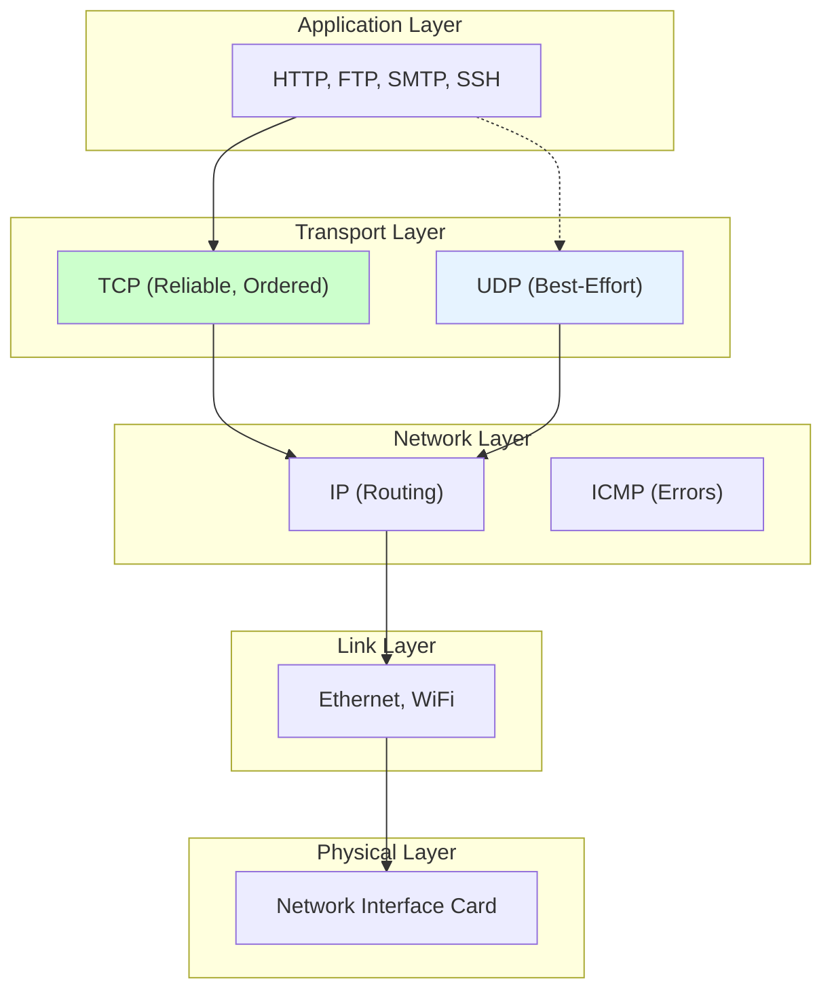
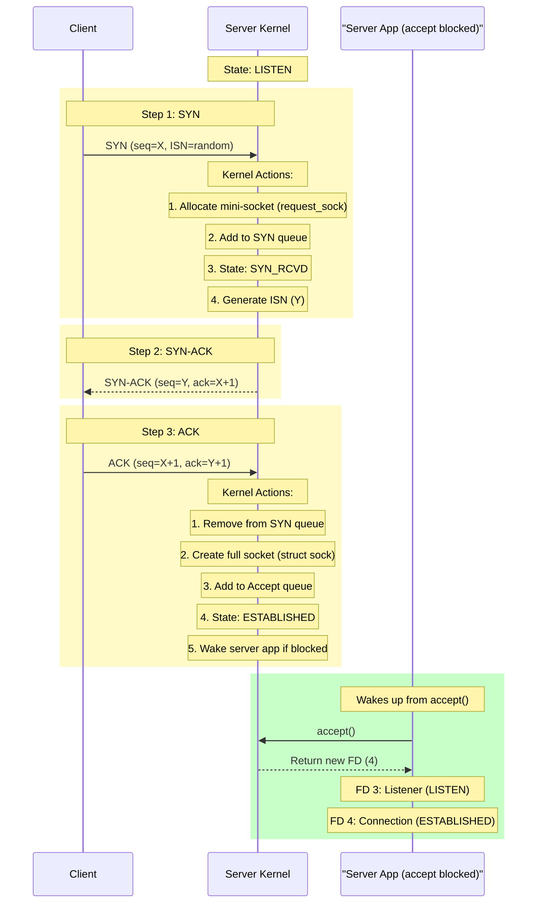
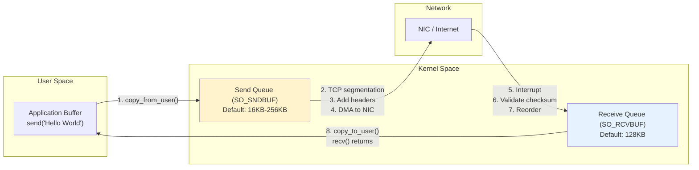
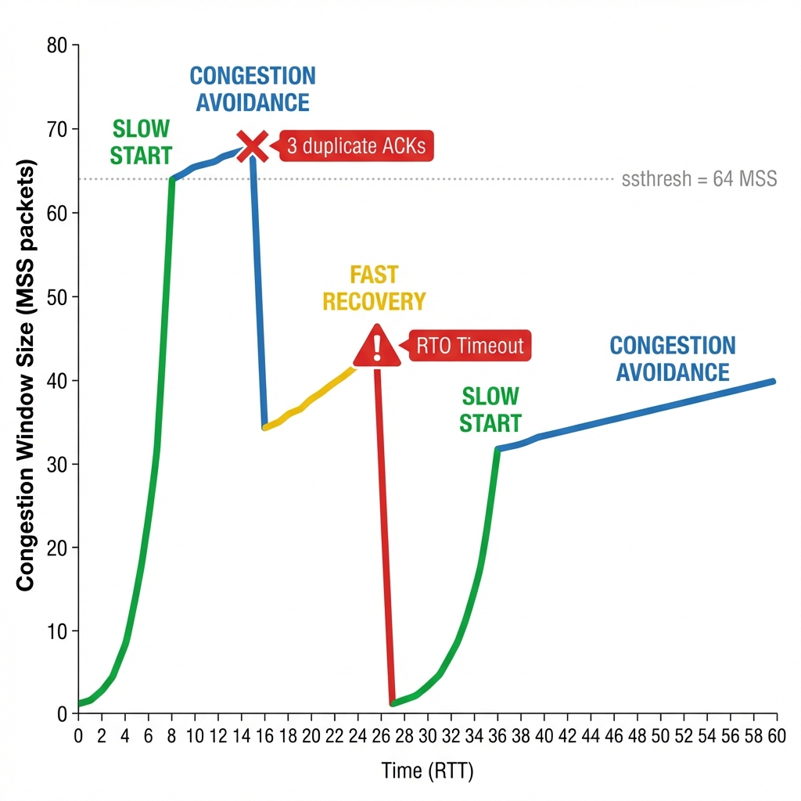
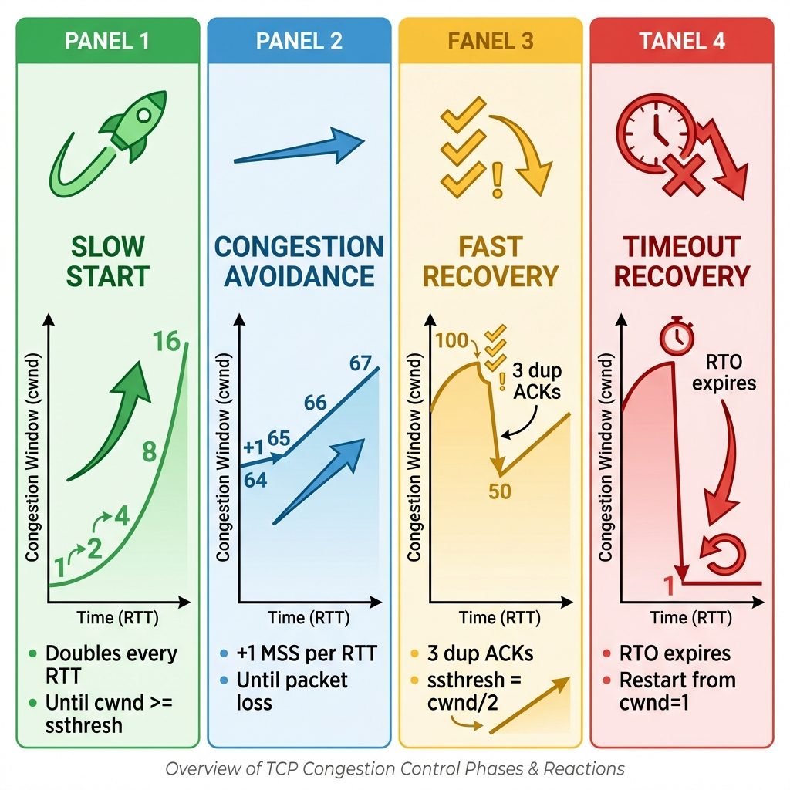
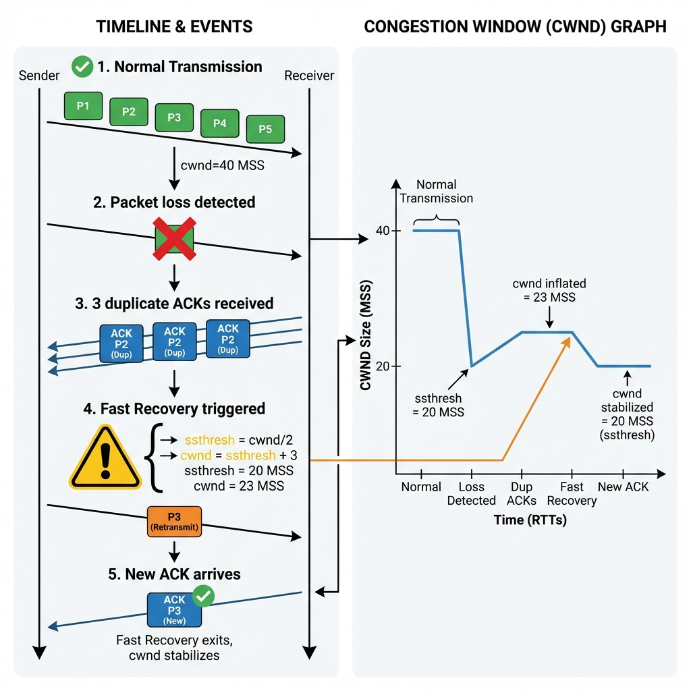
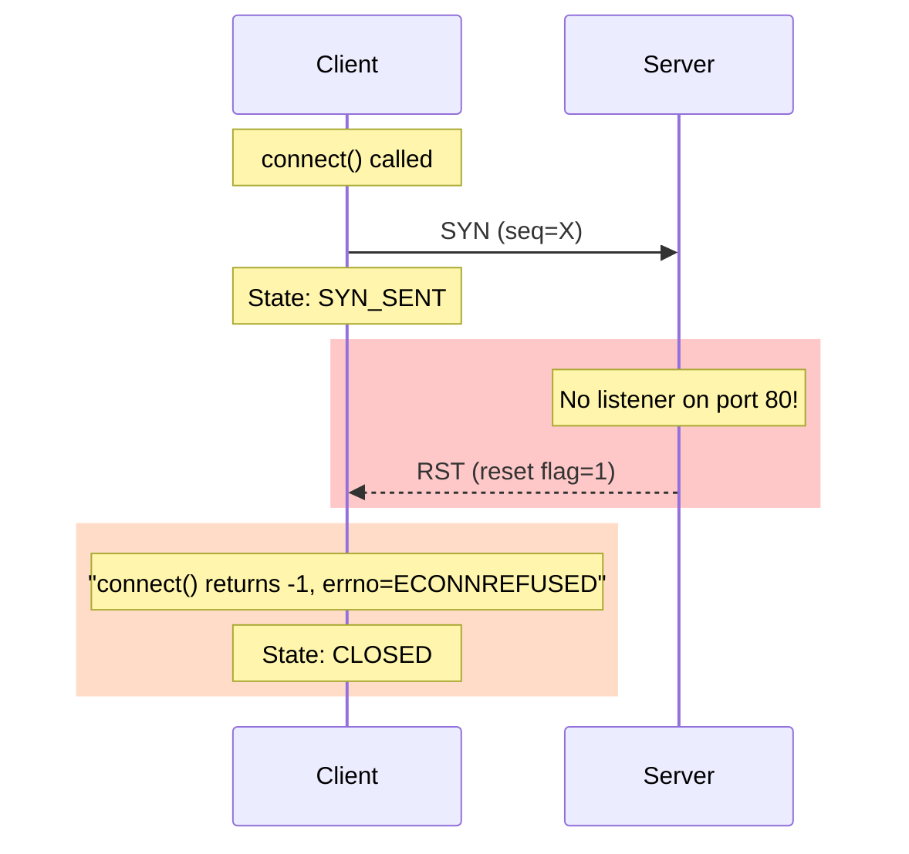
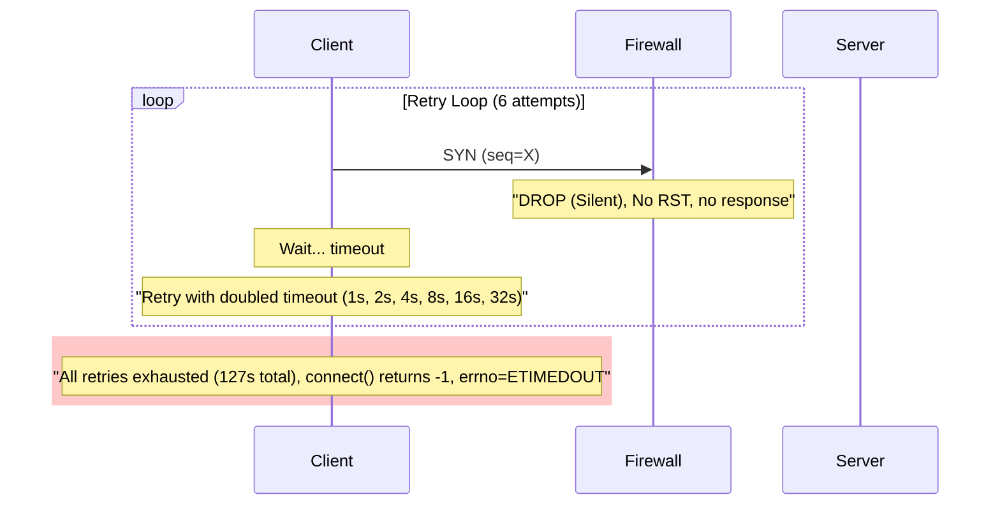
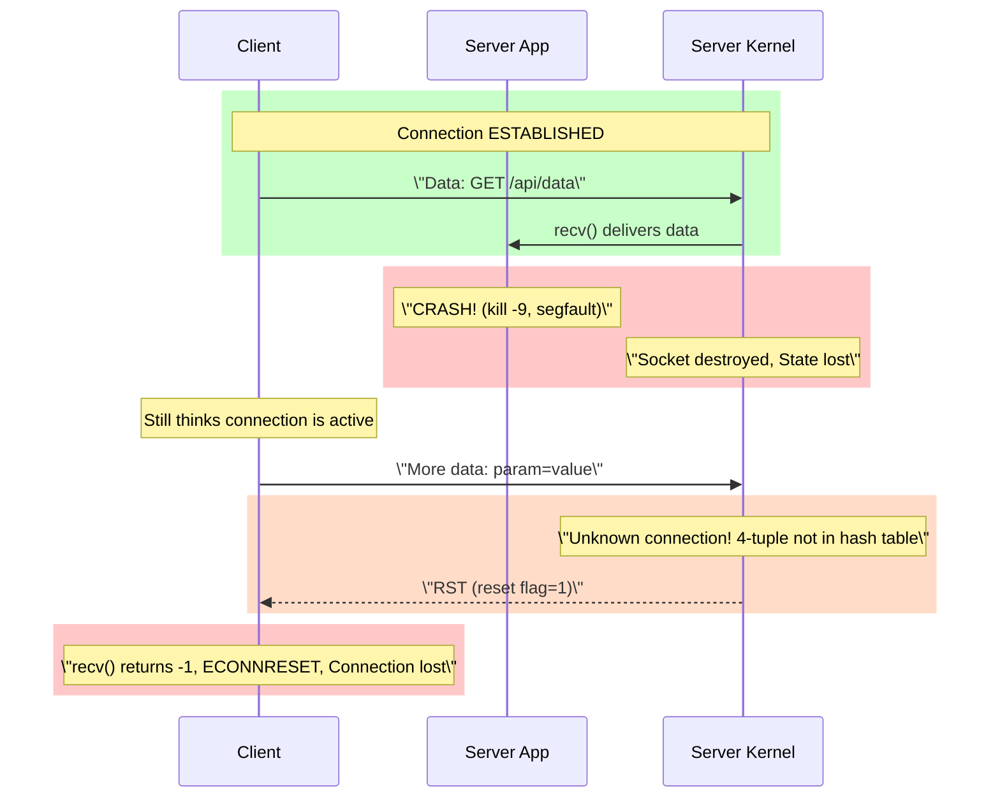

# 01. TCP/IP: Kernel-Level Deep Dive into Reliable Networking

## 1. Introduction

**TCP (Transmission Control Protocol)** is the fundamental transport layer protocol that provides **reliable, ordered, connection-oriented** communication over unreliable IP networks. Specified in RFC 793 (1981) by Vint Cerf and Bob Kahn, TCP powers most of the internet's critical applications: HTTP, SSH, databases, file transfers, and email.

**Problem It Solves**:
- **Reliability**: Guarantees delivery despite packet loss on the internet
- **Ordering**: Ensures bytes arrive in the exact order sent
- **Flow Control**: Prevents fast senders from overwhelming slow receivers
- **Congestion Control**: Adapts to network capacity to prevent collapse

**Key Differentiator**: Unlike UDP (fire-and-forget), TCP provides **guaranteed delivery with automatic retransmission**, **in-order byte streams**, and **bidirectional flow control**. The trade-off is higher latency (connection setup + retransmissions) and overhead (headers, ACKs, state management).

**Industry Adoption**:
- **Linux TCP Stack**: Powers most internet servers, routers, Android devices
- **Windows TCP/IP**: Native implementation in all Windows versions
- **BSD Sockets API**: Standard interface across all operating systems
- **Embedded TCP/IP**: lwIP, uIP for IoT and microcontrollers

**Historical Context**: Before TCP, early networks (ARPANET) used NCP (Network Control Program) which lacked error recovery and couldn't scale across heterogeneous networks. TCP/IP's layered design and end-to-end reliability enabled the internet to grow from hundreds to billions of devices.

---

## 2. Core Architecture

TCP operates in the transport layer of the TCP/IP stack, sitting between application protocols and IP routing.



### Key Components

**1. Socket API** (BSD sockets):
- **Interface**: System calls bridging user space and kernel
- **Operations**: `socket()`, `bind()`, `listen()`, `connect()`, `send()`, `recv()`, `close()`
- **Abstraction**: File descriptor (integer) representing network endpoint

**2. TCP Control Block** (`struct sock` in Linux):
- **State**: LISTEN, SYN_SENT, ESTABLISHED, FIN_WAIT, etc.
- **Buffers**: Send queue (outgoing), Receive queue (incoming)
- **Timers**: Retransmission, keepalive, TIME_WAIT
- **Metrics**: RTT, cwnd (congestion window), ssthresh

**3. Connection Queues**:
- **SYN Queue**: Incomplete handshakes (SYN received, not ACKed)
- **Accept Queue**: Completed connections waiting for `accept()`
- **Send Queue**: Application data waiting for transmission
- **Receive Queue**: Network data waiting for application
- **Out-of-Order Queue**: Segments awaiting missing predecessors

**4. State Machine** (11 states):
- **CLOSED**: Initial state, no connection
- **LISTEN**: Server waiting for connections
- **SYN_SENT**: Client sent SYN, waiting for SYN-ACK
- **SYN_RCVD**: Server received SYN, sent SYN-ACK
- **ESTABLISHED**: Connection active, data transfer
- **FIN_WAIT_1**: Sent FIN, waiting for ACK
- **FIN_WAIT_2**: FIN ACKed, waiting for remote FIN
- **CLOSE_WAIT**: Received FIN, app hasn't closed yet
- **CLOSING**: Both sides sent FIN simultaneously
- **LAST_ACK**: Sent FIN after FIN_WAIT, waiting for final ACK
- **TIME_WAIT**: All done, waiting 2*MSL to drain stray packets

---

## 3. How It Works: Connection Establishment

### A. Server Setup (Passive Open)

**Steps**:

**1. socket() - Allocate Resources**
```
Application: fd = socket(AF_INET, SOCK_STREAM, 0)

Kernel:
1. Allocate memory for struct sock
2. State: CLOSED
3. No address, no queues yet
4. Return: File Descriptor (e.g., 3)

Result: Socket exists but inactive
```

**2. bind() - Claim Address**
```
Application: bind(fd, {IP=0.0.0.0, PORT=80}, sizeof(addr))

Kernel:
1. Check Global Socket Hash Table
2. If port 80 already bound: Return EADDRINUSE
3. If free:
   - Add entry: PORT 80 → Socket FD 3
   - Update struct sock: Local address = 0.0.0.0:80
4. Return: 0 (success)

Result: Socket owns port 80
```

**3. listen() - Enter Passive State**
```
Application: listen(fd, backlog=128)

Kernel:
1. Transition state: CLOSED → LISTEN
2. Allocate SYN queue (size = max(backlog, somaxconn))
3. Allocate Accept queue (size = backlog)
4. Mark socket as passive (accepting connections)

Result: Socket ready to receive SYN packets
```

---

### B. Three-Way Handshake (Kernel Autopilot)

**Critical**: The application is typically blocked on `accept()` or doing other work. The kernel handles the entire handshake autonomously.



**Detailed Steps**:

**Step 1: Client sends SYN**
```
Client kernel:
1. socket() allocates struct sock
2. connect() initiates handshake
3. Generate ISN (Initial Sequence Number):
   - Random value (security against spoofing)
   - Typically: hash(src IP, src port, dst IP, dst port, secret)
4. Build packet:
   - SYN flag = 1
   - seq = X (ISN)
5. Send to server IP:port
6. State: CLOSED → SYN_SENT
7. Start retransmission timer (1s, doubles on timeout)
```

**Step 2: Server receives SYN**
```
Server kernel interrupt handler:
1. Packet arrives at NIC
2. IP layer routes to TCP layer
3. Lookup: Destination port 80 → Listener socket (FD 3)
4. Check SYN queue size < max:
   - If full: Drop (SYN flood protection) or use SYN cookies
   - If space: Continue
5. Allocate request_sock (mini-socket, lightweight)
6. Generate server ISN (Y)
7. Send SYN-ACK:
   - SYN flag = 1
   - ACK flag = 1
   - seq = Y
   - ack = X+1 (acknowledging client's ISN)
8. Add request_sock to SYN queue
9. Mini-socket state: SYN_RCVD
10. Start SYN-ACK retransmission timer

Application: Still blocked on accept(), unaware
```

**Step 3: Client receives SYN-ACK**
```
Client kernel:
1. Packet arrives
2. Validates: ack == X+1 (our seq + 1)
3. Send final ACK:
   - ACK flag = 1
   - seq = X+1
   - ack = Y+1
4. State: SYN_SENT → ESTABLISHED
5. connect() syscall returns to application

Application: connect() completes, can now send()
```

**Step 4: Server receives final ACK**
```
Server kernel:
1. Packet arrives
2. Lookup SYN queue by 4-tuple
3. Find request_sock
4. Validate: seq == X+1, ack == Y+1
5. Remove from SYN queue
6. Promote to full struct sock
7. Add to Accept queue
8. State: SYN_RCVD → ESTABLISHED
9. Wake application thread blocked on accept()

Application: accept() returns with new FD 4
```

**Timing**:
- **1 RTT (Round-Trip Time)**: Minimum to establish connection
- **Local network**: ~1-5ms
- **Cross-country**: ~50-100ms  
- **International**: ~150-300ms

---

### C. Client Connection (Active Open)

**Steps**:
```
1. socket() - Allocate socket (same as server)

2. connect(fd, {IP=93.184.216.34, PORT=80})
   Kernel:
   - Bind ephemeral port (random 32768-60999)
   - Send SYN packet
   - State: CLOSED → SYN_SENT
   - Block application (or return EINPROGRESS if non-blocking)
   
3. Wait for SYN-ACK (with retries)
   - Timeout 1: Retry after 1s
   - Timeout 2: Retry after 2s
   - Timeout 3: Retry after 4s
   - ... up to net.ipv4.tcp_syn_retries (default: 6)
   - Total wait: ~127s before returning ETIMEDOUT

4. Receive SYN-ACK, send ACK
   - State: SYN_SENT → ESTABLISHED
   - connect() returns 0 (success)
   
5. Application can now send()/recv()
```

---

## 4. Deep Dive: Internal Implementation

### A. Socket Multiplexing (The 4-Tuple Lookup)

**Problem**: How does the kernel route an incoming packet to the correct socket when thousands of connections share port 80?

**Solution: 4-Tuple Hash Table**

**4-Tuple**: `{Source IP, Source Port, Destination IP, Destination Port}`

**Lookup Algorithm**:
```
Steps:
1. Packet arrives: SRC=203.0.113.50:54321, DST=192.168.1.100:80

2. Kernel computes hash:
   hash = hash_func(203.0.113.50, 54321, 192.168.1.100, 80)

3. Lookup in socket hash table:
   Priority 1: Exact match (ESTABLISHED connection)
     Match {203.0.113.50, 54321, 192.168.1.100, 80} → Socket FD 5 ✅
   
   Priority 2: Wildcard match (LISTEN socket)
     Match {0.0.0.0, 0, 192.168.1.100, 80} → Socket FD 3 (listener)

4. If exact match found:
   - Route packet to established connection's Recv queue
   
5. If only wildcard match:
   - This is a new connection (SYN packet)
   - Begin 3-way handshake using listener socket
```

**Example: Multiple Clients**

```
Server: 192.168.1.100:80 (FD 3 in LISTEN state)

Client A connects: 203.0.113.10:54001
  → Handshake completes
  → New socket FD 4: {203.0.113.10, 54001, 192.168.1.100, 80}

Client B connects: 203.0.113.20:54002
  → Handshake completes
  → New socket FD 5: {203.0.113.20, 54002, 192.168.1.100, 80}

Client C connects: 203.0.113.10:54003 (same IP as A, different port)
  → Handshake completes
  → New socket FD 6: {203.0.113.10, 54003, 192.168.1.100, 80}

Hash table:
  {203.0.113.10, 54001, 192.168.1.100, 80} → FD 4
  {203.0.113.20, 54002, 192.168.1.100, 80} → FD 5
  {203.0.113.10, 54003, 192.168.1.100, 80} → FD 6
  {0.0.0.0, 0, 192.168.1.100, 80} → FD 3 (listener)

All clients use server port 80, differentiated by 4-tuple ✅
```

**Connection Limits**:
- **Myth**: "65,535 connection limit per server port"
- **Reality**: Limit is 2^32 unique 4-tuples (4 billion combinations)
- **Actual limits**:
  - File descriptors: `ulimit -n` (default 1024, can raise to millions)
  - RAM: Each socket ~4-10KB kernel memory
  - Example: 100k connections = ~500MB-1GB RAM

---

### B. Data Transmission (Send and Receive)

**Memory Architecture**:



**Sending Data**:

```
Application: send(fd, "Hello World", 11, 0)

Kernel steps:
1. Validate: Socket is ESTABLISHED
2. Check Send queue space:
   - If full (window=0): Block (or return EWOULDBLOCK if non-blocking)
   - If space available: Continue
3. Copy from user space to kernel:
   - copy_from_user(send_buffer, "Hello World", 11)
4. Update Send queue: Add 11 bytes
5. send() RETURNS IMMEDIATELY (data in kernel, not sent yet!)
6. Asynchronous transmission:
   - TCP segments data (MSS = ~1460 bytes for Ethernet)
   - Add TCP header (20 bytes): src port, dst port, seq, ack, flags
   - Add IP header (20 bytes): src IP, dst IP
   - Add Ethernet frame (14 bytes header + 4 bytes FCS)
   - DMA transfer to NIC
7. Start retransmission timer
8. Wait for ACK
```

**Receiving Data**:

```
Network: Packet arrives at NIC

Kernel steps:
1. Interrupt: NIC signals CPU
2. DMA: Packet copied to kernel ring buffer
3. IP layer: Validates checksum, routes to TCP
4. TCP layer:
   - Lookup socket by 4-tuple
   - Validate sequence number (in-order?)
   - If in-order:
     * Copy to Recv queue
     * Send ACK
     * Wake application if blocked on recv()
   - If out-of-order:
     * Add to Out-of-Order queue
     * Send duplicate ACK (fast retransmit trigger)
5. Application: recv(fd, buffer, 1024, 0)
   - If Recv queue empty: Block (or return EAGAIN)
   - If data available:
     * copy_to_user(buffer, recv_queue, bytes)
     * Remove from Recv queue
     * Update advertised window
     * Return bytes read

Application sees: Continuous byte stream (no message boundaries)
```

**Key Insight**: send() copies to kernel, doesn't wait for network transmission. recv() copies from kernel, application must frame messages.

---

### C. Flow Control (TCP Window)

**Problem**: Sender transmits at 1 Gbps, receiver processes at 10 Mbps → Receive queue overflows

**Solution: Sliding Window Protocol**

**Mechanism**:
```
Steps:
1. Receiver advertises window size in every ACK:
   - Window = Recv queue free space
   - Example: SO_RCVBUF=128KB, 100KB used → Window=28KB

2. Sender limits transmission:
   - Can send: min(Congestion Window, Receiver Window)
   - Example: cwnd=64KB, rwnd=28KB → Send max 28KB

3. Receiver stops reading (app busy):
   - Recv queue fills: 128KB/128KB used
   - Advertised window: 0 bytes

4. Sender receives Window=0:
   - STOPS sending data
   - Sends periodic "window probes" (zero window probe)
   - Waits for window update

5. Application resumes reading:
   - recv() frees 50KB from queue
   - Receiver sends update: Window=50KB

6. Sender resumes transmission
```

**Window Scaling**:
```
Problem: Original TCP window field = 16 bits = 65535 bytes max

For high-bandwidth links:
  10 Gbps * 100ms RTT = 125 MB required window
  65KB window is insufficient

Solution: Window Scale option (TCP option in SYN)
  - Advertise scale factor (0-14)
  - Actual window = value * 2^scale
  - Example: Window=65535, scale=7 → 65535 * 128 = 8 MB

Configuration:
  net.ipv4.tcp_window_scaling = 1 (enable)
  net.ipv4.tcp_rmem = 4096 131072 6291456 (min, default, max)
```

---

### D. Reliability (Retransmission and Recovery)

**TCP guarantees delivery using**:
- Sequence numbers (SEQ)
- Acknowledgments (ACK)
- Retransmission timeout (RTO)
- Selective acknowledgment (SACK)

**Packet Loss Scenario**:

```
Goal: Send 5000 bytes, MSS=1460

Segments:
  P1: seq=0, len=1460 (bytes 0-1459)
  P2: seq=1460, len=1460 (bytes 1460-2919)
  P3: seq=2920, len=1460 (bytes 2920-4379)
  P4: seq=4380, len=620 (bytes 4380-4999)

Timeline:
t=0: Sender transmits P1, P2, P3, P4
t=10ms: Receiver gets P1
  - In-order, add to Recv queue
  - Send ACK=1460 (acknowledging bytes 0-1459)
t=10ms: Receiver gets P2
  - In-order, add to Recv queue
  - Send ACK=2920
t=10ms: P3 DROPPED by network ❌
t=10ms: Receiver gets P4
  - Out-of-order! (gap: 2920-4379 missing)
  - Add P4 to Out-of-Order queue (not Recv queue)
  - Send duplicate ACK=2920 (still waiting for seq 2920)
  - Application blocked (can't read past byte 2919)
  
t=11ms: Sender receives ACK=1460 ✅
t=11ms: Sender receives ACK=2920 ✅
t=11ms: Sender receives ACK=2920 (duplicate #1)
t=12ms: Sender receives ACK=2920 (duplicate #2)
t=13ms: Sender receives ACK=2920 (duplicate #3)
  - Fast Retransmit triggered! (3 duplicate ACKs)
  - Retransmit P3 immediately (don't wait for timeout)
  
t=25ms: Receiver gets P3 (retransmission)
  - Gap filled!
  - Merge P3 into Recv queue
  - Check Out-of-Order queue: P4 can now be added
  - Recv queue now has bytes 0-4999
  - Send ACK=5000 (cumulative acknowledgment)
  - Wake application
  
t=25ms: Application: recv() returns 5000 bytes ✅

Total delay: 25ms (vs 10ms without loss)
```

**Retransmission Timeout (RTO) Calculation**:

```
Steps:
1. Measure RTT (Round-Trip Time) for each ACK:
   - Send segment with seq=X at t=0
   - Receive ACK=X+len at t=50ms
   - Measured RTT = 50ms

2. Smooth RTT (SRTT):
   - SRTT = (7/8) * old_SRTT + (1/8) * measured_RTT
   - Dampens noise from varying network conditions

3. RTT Variation (RTTVAR):
   - RTTVAR = (3/4) * old_RTTVAR + (1/4) * |SRTT - measured_RTT|
   - Captures jitter

4. Calculate RTO:
   - RTO = SRTT + 4 * RTTVAR
   - Minimum: 200ms (per RFC)
   - Maximum: 120s

5. If timeout expires:
   - Retransmit segment
   - Double RTO (exponential backoff)
   - Restart: If RTO exceeds max retries, close connection


Example:
  SRTT = 50ms, RTTVAR = 10ms
  RTO = 50ms + 4*10ms = 90ms
  
  But RTO < 200ms → Use 200ms minimum
  
If packet lost and timeout:
  Attempt 1: Wait 200ms, retransmit
  Attempt 2: Wait 400ms, retransmit
  Attempt 3: Wait 800ms, retransmit
  Attempt 4: Wait 1.6s, retransmit
  ... (up to 15 retries over ~13 minutes)
```

---

### E. Congestion Control

**The Core Problem**: Imagine you're sending water through a pipe. If you pump too fast, the pipe bursts. If you pump too slow, you waste capacity. But here's the catch: **you don't know the pipe's capacity**, and it changes constantly (other people sharing the same Internet "pipe").

**TCP's Solution**: Start slowly, increase speed until you detect congestion (packet loss), then back off. Repeat forever.

**Visual Overview of All 4 Phases:**



**The graph above shows the complete lifecycle** of TCP's congestion window (cwnd) over time. Let's break down each phase:



---

#### Phase 1: Slow Start (Exponential Growth) 🚀

**Goal**: Quickly find the network's capacity

**How it works**:
```
Start conservatively: cwnd = 1 MSS (1 packet)
↓
Send 1 packet
↓
Receive ACK → Double window: cwnd = 2 MSS
↓
Send 2 packets
↓
Receive 2 ACKs → Double again: cwnd = 4 MSS
↓
Send 4 packets
...continues doubling every RTT...
1 → 2 → 4 → 8 → 16 → 32 → 64...
```

**Why "Slow Start"?** It's actually exponential (very fast!). The name is historical—it was "slow" compared to the original TCP that sent everything at once and flooded the network.

**When does it stop?** When `cwnd >= ssthresh` (slow start threshold), switch to Congestion Avoidance.

**Real-world timing**:
- RTT = 50ms
- After 6 RTTs (300ms): cwnd grows from 1 to 64 packets
- That's going from 1.4KB/sec to 91KB/sec in 0.3 seconds!

---

#### Phase 2: Congestion Avoidance (Linear Growth) 📈

**Goal**: Carefully probe for more capacity without causing congestion

**How it works**:
```
cwnd = 64 MSS (reached ssthresh)
↓
For each ACK:
  cwnd += MSS / cwnd
  (adds approximately 1 MSS per RTT)
↓
Growth becomes linear: 64 → 65 → 66 → 67 → 68...
```

**Why linear?** We're near the network's capacity. Growing too fast would cause packet loss. This is the "cruise control" phase.

**How long does it last?** Until packet loss is detected (either by 3 duplicate ACKs or timeout).

**Example**:
- Current cwnd = 100 MSS
- Network can handle 120 MSS
- Linear growth will probe upward slowly
- Eventually hits limit → packet loss at ~120 MSS

---

#### Phase 3: Fast Recovery (Partial Backoff) ⚡

**Trigger**: Receiver sends 3 duplicate ACKs (same ACK number repeated 3 times)

**What this means**: "I got packets 1, 2, 4, 5, 6 but NOT packet 3. Send packet 3 again!"

**Visual walkthrough**:



**Steps**:
```
1. Normal transmission: cwnd = 40 MSS ✅

2. Packet 3 lost in network ❌
   Other packets (4, 5, 6) arrive out of order

3. Receiver sends duplicate ACKs:
   ACK=3 (dup #1): "Still waiting for packet 3"
   ACK=3 (dup #2): "Still waiting for packet 3"
   ACK=3 (dup #3): "Still waiting for packet 3"

4. Sender detects 3 duplicate ACKs:
   - This is MILD congestion (not severe)
   - Packets are still flowing (just one loss)
   
   Actions:
   ssthresh = cwnd / 2 = 20 MSS
   cwnd = ssthresh + 3 = 23 MSS
   Retransmit packet 3 immediately 🔄

5. For each additional duplicate ACK:
   cwnd += 1 MSS (temporary inflation)
   
6. New ACK arrives (acknowledging retransmitted packet 3):
   cwnd = ssthresh = 20 MSS
   Resume Congestion Avoidance ✅
```

**Why not reset to cwnd=1?** Because the network isn't dead—it's just congested. Packets are still flowing. We cut the window in half and continue.

**Key insight**: Fast Recovery is TCP saying "oops, slow down a bit" rather than "panic and start over."

---

#### Phase 4: Timeout Recovery (Severe Congestion) 🔴

**Trigger**: Retransmission Timeout (RTO) expires—no ACK received for a long time

**What this means**: The network might be severely congested or broken. No packets are getting through.

**Steps**:
```
1. RTO expires (default ~200ms minimum) ⏰

2. TCP panics:
   - ssthresh = cwnd / 2
   - cwnd = 1 MSS (restart from scratch!)
   - Enter Slow Start again 🚀

3. Result: Back to exponential growth from 1 MSS
```

**Why so drastic?** A timeout suggests severe congestion. Better to be conservative and rebuild slowly.

**Example timeline**:
```
t=0: cwnd = 64 MSS, send packets
t=50ms: No ACK arrives
t=100ms: Still no ACK
t=200ms: Timeout! RTO expired
         → cwnd crashes to 1 MSS
         → ssthresh = 32 MSS
         → Start over with Slow Start
```

---

#### Comparison: Fast Recovery vs Timeout Recovery

| Scenario | Signal | Response | Recovery Time |
|----------|--------|----------|---------------|
| **Fast Recovery** | 3 duplicate ACKs | Partial backoff (cwnd/2) | ~1-2 RTTs |
| **Timeout** | No ACK received | Full reset (cwnd=1) | ~6-10 RTTs |

**Fast Recovery** = Minor congestion, quick recovery
**Timeout** = Severe congestion, slow recovery

---

**Modern Algorithms**:

**Modern Algorithms**:

- **Cubic** (Linux default since 2.6.19):
  - Window growth function: W(t) = C(t - K)³ + W_max
  - Faster recovery after loss
  - Better for high-bandwidth networks

- **BBR** (Bottleneck Bandwidth and RTT):
  - Model network capacity directly
  - Measure actual bandwidth and RTT
  - Avoids packet loss as congestion signal
  - Superior on lossy links (WiFi, cellular)

**Configuration**:
```
View: cat /proc/sys/net/ipv4/tcp_congestion_control
  cubic

Change: sysctl -w net.ipv4.tcp_congestion_control=bbr

Available: cat /proc/sys/net/ipv4/tcp_available_congestion_control
  reno cubic bbr
```

---

## 5. End-to-End Walkthrough: HTTP Request

### Scenario: `curl http://example.com`

**Complete trace from application to response**:

### Step 1: DNS Resolution
```
Application: curl http://example.com
Subprocess: getaddrinfo("example.com", "80", &hints, &result)
Result: 93.184.216.34
Time: 50ms (uncached)
```

### Step 2: Create Socket
```
Syscall: socket(AF_INET, SOCK_STREAM, 0)
Kernel:
  - Allocate struct sock
  - State: CLOSED
  - Return: FD 3
Time: <1ms
```

### Step 3: Connect (3-Way Handshake)
```
Syscall: connect(3, {IP=93.184.216.34, PORT=80}, sizeof(addr))

Kernel:
  - Bind ephemeral port: 54321
  - Generate ISN: random (X=1234567890)
  - Send SYN packet:
    * SRC: 192.168.1.100:54321
    * DST: 93.184.216.34:80
    * SEQ: 1234567890
    * Flags: SYN=1
  - State: CLOSED → SYN_SENT
  - Block application

Network:
  RTT = 100ms (cross-country)

t=0: Client sends SYN
t=50ms: Server receives SYN
  - Allocate request_sock
  - Add to SYN queue
  - Generate ISN (Y=9876543210)
  - Send SYN-ACK (seq=Y, ack=X+1)
  - State: SYN_RCVD

t=100ms: Client receives SYN-ACK
  - Send ACK (seq=X+1, ack=Y+1)
  - State: SYN_SENT → ESTABLISHED
  - connect() returns 0

t=150ms: Server receives ACK
  - Remove from SYN queue
  - Add to Accept queue
  - State: SYN_RCVD → ESTABLISHED
  - accept() returns new FD

Total: 1 RTT = 100ms
```

### Step 4: Send HTTP Request
```
Application: send(3, "GET / HTTP/1.1\r\nHost: example.com\r\n\r\n", 39, 0)

Kernel:
1. Copy 39 bytes from user space to Send queue
2. send() returns 39 (immediately, data in kernel)

TCP Segmentation:
  - Data fits in 1 segment (< MSS)
  - Add TCP header (20 bytes)
  - seq = X+1 (next sequence number)
  - PSH flag = 1 (push to application)

IP Layer:
  - Add IP header (20 bytes)
  - Total packet: 20 (IP) + 20 (TCP) + 39 (data) = 79 bytes

Ethernet:
  - Add frame header (14 bytes) + FCS (4 bytes)
  - Total frame: 97 bytes

NIC:
  - DMA transfer
  - Transmit on wire

t=150ms: Client sends data
t=200ms: Server receives data
  - Checksum valid
  - Sequence in order (seq = X+1)
  - Add to Recv queue
  - Send ACK (ack = X+40)
  - Wake server application

Server App:
  - recv() reads "GET / HTTP/1.1..."
  - Process request
  - Generate response (HTML, 1256 bytes)

Time: 50ms (latency) + processing
```

### Step 5: Receive HTTP Response
```
Server: send(fd, "HTTP/1.1 200 OK\r\n...(1256 bytes total)", 1256, 0)

TCP Segmentation:
  - Fits in 1 segment (1256 < 1460 MSS)
  - seq = Y+1
  - PSH flag = 1

t=250ms: Server sends response
t=300ms: Client receives response
  - Validate checksum, sequence
  - Add to Recv queue
  - Send ACK (ack = Y+1257)

Client App:
  - recv(3, buffer, 4096, 0) returns 1256
  - Display HTML

Time: 50ms (latency)
```

### Step 6: Connection Close (4-Way Handshake)
```
Client: close(3)

Kernel:
  - Send FIN packet (seq = X+40)
  - State: ESTABLISHED → FIN_WAIT_1

t=300ms: Client sends FIN
t=350ms: Server receives FIN
  - Send ACK (ack = X+41)
  - State: ESTABLISHED → CLOSE_WAIT
  - Notify application (recv() returns 0)

Server App:
  - Calls close(fd)
  - Send FIN (seq = Y+1257)
  - State: CLOSE_WAIT → LAST_ACK

t=350ms: Server sends FIN + ACK
t=400ms: Client receives ACK
  - State: FIN_WAIT_1 → FIN_WAIT_2
Client receives FIN
  - Send final ACK (ack = Y+1258)
  - State: FIN_WAIT_2 → TIME_WAIT
  - Start timer: 2*MSL (60s default)

t=450ms: Server receives final ACK
  - State: LAST_ACK → CLOSED
  - Socket destroyed

t=460s (60s later): Client socket finally CLOSED

Time: 2 RTT for graceful close + 60s TIME_WAIT
```

**Summary**:
- Total connection time: 100ms (handshake) + 50ms (request) + 50ms (response) + 100ms (close) = 300ms
- TIME_WAIT delay: 60s before port reuse
- Total data: 39 bytes sent, 1256 bytes received
- Overhead: ~80 bytes of headers per direction

---

## 6. Failure Scenarios (The Senior View)

### Scenario A: Connection Refused (ECONNREFUSED)

**Symptom**: `curl: (7) Failed to connect to example.com port 80: Connection refused`

**Cause**: No process listening on destination port

#### The Mechanism

**Timeline**:
```
t=0: Client calls connect(fd, {IP=192.168.1.100, PORT=80})
  - Send SYN packet
  - State: SYN_SENT

t=50ms: Server receives SYN at port 80
  - Kernel checks socket hash table
  - No socket in LISTEN state for port 80
  - Immediate response: RST (Reset) packet

t=100ms: Client receives RST
  - connect() returns -1
  - errno = ECONNREFUSED (111)
  - State: SYN_SENT → CLOSED (immediate)

Total time: 1 RTT (~100ms)
```



#### The Fix

**Verify server is running**:
```
Server side:
  netstat -tln | grep :80
  (empty = no listener)

  ps aux | grep nginx
  (not running)

Solution:
  sudo systemctl start nginx
  sudo systemctl enable nginx
```

**Verify port binding**:
```
Check: ss -tln | grep :80
  LISTEN 0 128 0.0.0.0:80 0.0.0.0:*

If not present:
  - Check nginx config: listen 80;
  - Check permissions: non-root can't bind <1024
  - Check port conflicts: Another service using port 80
```

---

### Scenario B: Connection Timeout (ETIMEDOUT)

**Symptom**: Connection hangs for 2+ minutes, then fails with timeout error

**Cause**: SYN packets dropped by firewall, no RST response

#### The Problem

**Timeline**:
```
t=0: Client sends SYN
  - State: SYN_SENT
  - Set retransmission timer: 1s

t=1s: No response, timeout expires
  - Retry #1: Send SYN again
  - Double timeout: 2s

t=3s: No response
  - Retry #2: Send SYN
  - Double timeout: 4s

t=7s: No response
  - Retry #3: Send SYN
  - Double timeout: 8s

t=15s: No response
  - Retry #4: Send SYN
  - Double timeout: 16s

t=31s: No response
  - Retry #5: Send SYN
  - Double timeout: 32s

t=63s: No response
  - Retry #6: Send SYN (last attempt, default net.ipv4.tcp_syn_retries=6)

t=127s: Final timeout
  - connect() returns -1
  - errno = ETIMEDOUT (110)
  - State: SYN_SENT → CLOSED

Total wait: 127 seconds (2+ minutes)
```



#### The Fix

**Option 1: Reduce Timeout (Application Level)**
```
Set socket option before connect():

struct timeval timeout;
timeout.tv_sec = 5;  // 5-second timeout
timeout.tv_usec = 0;
setsockopt(fd, SOL_SOCKET, SO_SNDTIMEO, &timeout, sizeof(timeout));

Result: connect() fails after 5s instead of 127s
```

**Option 2: Reduce SYN Retries (System Level)**
```
Current: sysctl net.ipv4.tcp_syn_retries
  6 (default)

Change: sysctl -w net.ipv4.tcp_syn_retries=3
  Timeout: 1 + 2 + 4 + 8 = 15 seconds

Trade-off: Faster failure but less resilient to temporary network issues
```

**Option 3: Check Firewall**
```
Verify connectivity:
  telnet 192.168.1.100 80
  (hangs = blocked)

  nc -zv 192.168.1.100 80
  (timeout = no route or firewall)

Server firewall:
  sudo iptables -L -n | grep 80
  (check for DROP rules)

  sudo iptables -I INPUT -p tcp --dport 80 -j ACCEPT
  (allow port 80)

Network firewall:
  Check corporate/cloud security groups
  AWS: Security Group inbound rules must allow TCP:80
```

---

### Scenario C: Connection Reset (RST)

**Symptom**: Established connection suddenly fails with "Connection reset by peer"

**Cause**: Server crashes, application closes ungracefully, or deliberate RST

#### The Mechanism

**Timeline**:
```
t=0: Connection ESTABLISHED, application exchanging data
  - Client sends: "GET /api/data"
  - Server receives, processing...

t=5s: Server application crashes (segfault, kill -9)
  - Kernel: Connection state lost
  - Socket FD destroyed
  - No graceful FIN sent ❌

t=10s: Client sends more data: "param=value"
  - Kernel routes to server

t=10.05s: Server receives packet for unknown connection
  - Lookup socket by 4-tuple: NOT FOUND
  - Response: RST packet (reset flag=1)

t=10.1s: Client receives RST
  - send() or recv() returns -1
  - errno = ECONNRESET (104)
  - State: ESTABLISHED → CLOSED (immediate)
  - Socket destroyed

Application error: "Connection reset by peer"
```



#### The Fix

**Option 1: Implement Reconnection Logic**
```
Application-level retry:

int connect_with_retry(const char *host, int port) {
    int fd;
    int attempts = 0;
    int max_attempts = 5;
    
    while (attempts < max_attempts) {
        fd = socket(AF_INET, SOCK_STREAM, 0);
        
        if (connect(fd, ...) == 0) {
            return fd;  // Success
        }
        
        if (errno == ECONNRESET || errno == ECONNREFUSED) {
            close(fd);
            attempts++;
            sleep(2);  // Wait before retry
            continue;
        }
        
        // Other error, give up
        return -1;
    }
    
    return -1;  // All attempts failed
}
```

**Option 2: Application-Level Keep-Alive (Heartbeat)**
```
Protocol-level ping:

Client:
  Every 30s: send("PING\n")
  If no "PONG\n" within 10s: Close and reconnect

Server:
  On "PING\n": send("PONG\n")

Benefit: Detect dead connections before sending real data
```

**Option 3: TCP Keep-Alive (OS Level)**
```
Enable on socket:

int enable = 1;
setsockopt(fd, SOL_SOCKET, SO_KEEPALIVE, &enable, sizeof(enable));

Configure timing:
  net.ipv4.tcp_keepalive_time = 120  (2 minutes idle before probe)
  net.ipv4.tcp_keepalive_intvl = 30  (30s between probes)
  net.ipv4.tcp_keepalive_probes = 3  (3 failed probes = dead)

Total: 120s + (30s * 3) = 210s to detect dead connection

Trade-off: Long detection time but minimal overhead
```

---

### Scenario D: SYN Flood Attack (DDoS)

**Symptom**: Legitimate clients get connection refused despite server running

**Cause**: Attacker floods SYN queue, preventing real connections

#### The Attack

**Mechanism**:
```
Attacker (botnet):
1. Send 100,000 SYN packets/sec from spoofed IPs:
   - SRC: 203.0.113.1:random_port → SYN
   - SRC: 203.0.113.2:random_port → SYN
   - ... (all fake IPs)

Server:
1. For each SYN:
   - Allocate request_sock (512 bytes memory)
   - Add to SYN queue
   - Send SYN-ACK (to spoofed IP, no response)
   - Wait for ACK (never arrives)
   - Timeout after 60s

2. SYN queue fills:
   - Size: somaxconn = 128 (default)
   - Filled in <1 second (100k SYNs/sec)

3. New legitimate SYN arrives:
   - SYN queue full → DROP packet
   - Client receives no SYN-ACK
   - Timeout after retries

Result: Server unavailable to legitimate users ❌
```

#### The Fix

**Option 1: Increase Queue Sizes** (Limited effectiveness)
```
sysctl -w net.core.somaxconn=4096
sysctl -w net.ipv4.tcp_max_syn_backlog=8192

Benefit: Delays exhaustion
Drawback: Uses more memory, doesn't solve root cause
```

**Option 2: Enable SYN Cookies** (Recommended)
```
sysctl -w net.ipv4.tcp_syncookies=1

Mechanism:
1. SYN arrives
2. Instead of allocating request_sock:
   - Compute cookie: hash(src_ip, src_port, dst_ip, dst_port, secret, timestamp)
   - Encode cookie in ISN (Initial Sequence Number)
   - Send SYN-ACK with seq = cookie
3. Client sends ACK with ack = cookie+1
4. Server validates:
   - Recompute cookie from packet headers
   - Match: Create full socket (no SYN queue needed!)
   - Mismatch: Drop (spoofed ACK)

Benefits:
  - No memory allocation before handshake completes
  - SYN queue never fills
  - Legitimate clients succeed even during attack

Drawbacks:
  - Loses TCP options (timestamps, window scale)
  - Slight performance penalty
```

**Option 3: Rate Limiting (Firewall)**
```
iptables:
  iptables -A INPUT -p tcp --syn --dport 80 -m limit --limit 100/sec -j ACCEPT
  iptables -A INPUT -p tcp --syn --dport 80 -j DROP

Result: Limit SYN rate to 100/sec, drop excess

Cloud:
  AWS Shield, Cloudflare DDoS protection
  Absorb attack at edge before reaching server
```

**Monitoring**:
```
Check SYN queue overflows:
  netstat -s | grep "SYNs to LISTEN"
  123456 SYNs to LISTEN sockets dropped

Alert if > 100/min
```

---

## 7. Performance Tuning / Scaling Strategies

### Configuration Table

| Parameter | Recommendation | Why? |
|:----------|:---------------|:-----|
| `net.core.somaxconn` | 1024-4096 | Accept queue size; default 128 too small for high-traffic servers |
| `net.ipv4.tcp_max_syn_backlog` | 2048-8192 | SYN queue size; prevents drops during connection spikes |
| `net.ipv4.tcp_fin_timeout` | 30s (default: 60s) | Reduce TIME_WAIT duration to free ports faster |
| `net.ipv4.tcp_tw_reuse` | 1 (enable) | Reuse TIME_WAIT sockets for new outbound connections |
| `net.core.rmem_max` | 16777216 (16MB) | Maximum receive buffer size for high-bandwidth links |
| `net.core.wmem_max` | 16777216 (16MB) | Maximum send buffer size |
| `net.ipv4.tcp_rmem` | 4096 131072 16777216 | Auto-tuning: min, default, max receive buffer |
| `net.ipv4.tcp_wmem` | 4096 65536 16777216 | Auto-tuning: min, default, max send buffer |
| `net.ipv4.tcp_congestion_control` | bbr or cubic | BBR for lossy links, Cubic for general use |
| `net.ipv4.tcp_fastopen` | 3 (client+server) | 0-RTT data transmission for repeat connections |
| `net.ipv4.tcp_slow_start_after_idle` | 0 (disable) | Don't reset cwnd after idle (better for persistent connections) |

### A. File Descriptor Limits

**Problem**: Default limit=1024 prevents handling many connections

**Fix**:
```
View current:
  ulimit -n
  1024

Temporary (session):
  ulimit -n 65535

Permanent (add to /etc/security/limits.conf):
  * soft nofile 65535
  * hard nofile 65535

Verify:
  cat /proc/sys/fs/file-max
  9223372036854775807 (kernel max)
```

### B. Zero-Copy Transmission

**Problem**: Traditional send() copies data twice (user → kernel → NIC)

**Solution: sendfile() syscall**
```
Use case: Serving static files (images, videos, downloads)

Traditional:
  read(file_fd, buffer, size);      // Kernel → User
  send(sock_fd, buffer, size);      // User → Kernel
  (2 copies + 2 syscalls)

Zero-copy:
  sendfile(sock_fd, file_fd, offset, size);
  (Direct kernel → NIC, 0 copies to user space)

Performance: 2-3x faster for large files
```

### C. Connection Pooling

**Problem**: Creating new TCP connection costs 1 RTT + TIME_WAIT resources

**Solution: HTTP/1.1 Keep-Alive**
```
Traditional HTTP/1.0:
  Request 1: connect → request → response → close (1 RTT overhead)
  Request 2: connect → request → response → close (1 RTT overhead)
  Total: 2 RTTs wasted

HTTP/1.1 Keep-Alive:
  connect (1 RTT)
  Request 1: request → response
  Request 2: request → response (reuse connection!)
  Request 3: request → response
  close
  Total: 1 RTT for all requests

Header:
  Connection: keep-alive
  Keep-Alive: timeout=5, max=100
```

### D. Load Balancing

**Distribute connections across servers**:

**Layer 4 (TCP) Load Balancer**:
```
Client → LB (nginx, HAProxy, AWS ALB) → Server pool

Mechanism:
  1. Client connects to LB:80
  2. LB selects backend server (round-robin, least-conn)
  3. LB proxies connection: separate connections
     - Client ←→ LB (connection 1)
     - LB ←→ Server (connection 2)
  4. LB forwards packets between connections

Benefit: Even distribution
Drawback: 2x connections (LB overhead)
```

**Layer 7 (HTTP) Load Balancer**:
```
Parse HTTP headers, route by URL path, domain, etc.

Example:
  /api/* → API servers
  /static/* → CDN
  /admin/* → Admin servers
```

---

## 8. Constraints & Limitations

| Constraint | Limit | Why? |
|:-----------|:------|:-----|
| **Window size (classic)** | 65,535 bytes | 16-bit field in TCP header |
| **Window size (with scaling)** | 1 GB (2^30 bytes) | Window scale option enables 14-bit shift |
| **MSS (Maximum Segment Size)** | ~1460 bytes | MTU (1500) - IP header (20) - TCP header (20) |
| **Connection setup latency** | 1 RTT minimum | 3-way handshake cannot be avoided (TCP Fast Open reduces by 1 RTT) |
| **TIME_WAIT duration** | 2*MSL (30-120s) | Drain stray packets; cannot be eliminated |
| **Concurrent connections/port** | ~65,535 clients | Limited by source port range (not a server limit) |
| **File descriptors** | OS limit (ulimit -n) | Default 1024, can raise to millions |
| **Retransmission overhead** | ~1-5% bandwidth | Reliability cost; loss expensive on high-latency links |

### Why TIME_WAIT Cannot Be Eliminated

**Problem**: Old connection's delayed packets could corrupt new connection

**Scenario without TIME_WAIT**:
```
t=0: Connection 1 established:
  Client:54321 ←→ Server:80
  Exchange data
  
t=10s: Connection 1 closes gracefully
  State: CLOSED (immediately)
  
t=10.1s: NEW connection 2 opens (same port reused):
  Client:54321 ←→ Server:80
  (Same 4-tuple!)
  
t=10.2s: Delayed packet from OLD connection 1 arrives
  - Sent at t=9.9s, delayed 300ms in network
  - Has same 4-tuple as new connection
  - Kernel routes to connection 2 ❌
  - Corrupts data with old bytes!

Result: Data corruption
```

**Solution: TIME_WAIT (2*MSL delay)**:
```
MSL (Maximum Segment Lifetime): 30-60s
  - Longest time a packet can survive in network
  
TIME_WAIT = 2*MSL (60-120s):
  - Ensures all delayed packets expire
  - Before port can be reused for same 4-tuple
  
Result: No corruption, but ports locked for 60s
```

**Mitigation: tcp_tw_reuse**:
```
Enable for clients only:
  sysctl -w net.ipv4.tcp_tw_reuse=1
  
Allows reusing TIME_WAIT sockets if:
  - Timestamp option enabled
  - New connection's timestamp > old connection's
  
Safe for outbound connections (client)
Unsafe for servers (breaks TIME_WAIT protection)
```

---

## 9. When to Use TCP vs UDP?

| Use Case | Verdict | Why? |
|:---------|:--------|:-----|
| **HTTP/HTTPS** | **TCP** | Requires complete data, in-order delivery |
| **Database Queries** | **TCP** | Cannot tolerate loss or reordering |
| **File Transfer (FTP, SFTP)** | **TCP** | Data integrity critical |
| **Email (SMTP, IMAP)** | **TCP** | Messages must arrive complete |
| **SSH / Remote Terminal** | **TCP** | Every keystroke matters, order critical |
| **Real-time Gaming** | **UDP** | Low latency > reliability, can interpolate |
| **Live Video Streaming** | **UDP** | Old frames worthless, latency kills experience |
| **VoIP (Phone Calls)** | **UDP** | Late packets worse than lost packets |
| **DNS Queries** | **UDP** (default) | Single request/response, fast failover better |
| **NTP (Time Sync)** | **UDP** | Timestamp precision requires minimal overhead |
| **QUIC (HTTP/3)** | **UDP** | Reimplements reliability in user space with less overhead |

### TCP vs UDP Comparison

| Aspect | TCP | UDP |
|:-------|:----|:----|
| **Reliability** | Guaranteed delivery with retransmission | Best-effort, no guarantees |
| **Ordering** | Strict in-order delivery | Packets may arrive out-of-order |
| **Connection** | Connection-oriented (setup required) | Connectionless (no handshake) |
| **Overhead** | 20+ bytes header, ACKs, retransmits | 8 bytes header, no ACKs |
| **Latency** | Higher (3-way handshake, retransmission) | Lower (immediate send) |
| **Flow Control** | Yes (window management) | No |
| **Congestion Control** | Yes (adaptive rate) | No |
| **Use When** | Data integrity > latency | Latency > reliability |
| **Application Examples** | Web, email, file transfer | Video, gaming, VoIP |

---

## 10. Production Checklist

1. [ ] **Tune socket buffers**: `SO_SNDBUF`/`SO_RCVBUF` to 4-16MB for bulk data transfer
2. [ ] **Increase connection limits**: `ulimit -n 65535`, `somaxconn=4096`, `tcp_max_syn_backlog=8192`
3. [ ] **Enable TCP Fast Open**: `net.ipv4.tcp_fastopen=3` for 0-RTT repeat connections
4. [ ] **Monitor connection states**: Track ESTABLISHED, TIME_WAIT, CLOSE_WAIT counts
5. [ ] **Set application timeouts**: connect timeout <5s, read/write with SO_RCVTIMEO/SO_SNDTIMEO
6. [ ] **Enable keepalive for long connections**: `SO_KEEPALIVE`, tune timing for network type
7. [ ] **Use modern congestion control**: BBR for lossy networks (WiFi, cellular), Cubic for wired
8. [ ] **Monitor retransmission rate**: Alert if >1% indicates network issues
9. [ ] **Reduce TIME_WAIT impact**: Enable `tcp_tw_reuse` for clients, monitor tw count
10. [ ] **Enable SYN cookies**: `net.ipv4.tcp_syncookies=1` for DDoS protection
11. [ ] **Log connection failures**: Track ECONNREFUSED, ETIMEDOUT,  ECONNRESET for debugging
12. [ ] **Implement connection pooling**: Reuse HTTP connections, close idle after timeout

### Critical Metrics

```
tcp_established_connections: Monitor baseline (e.g., 5k-50k)
tcp_time_wait_connections: < 10k (high = port exhaustion risk)
tcp_close_wait_connections: < 1k (high = app not closing sockets)
tcp_syn_recv_connections: < 1k (high = handshake backlog)
tcp_retransmission_rate: < 1% (high = network loss or congestion)
tcp_syn_queue_drops: 0 (indicates SYN flood if > 0)
tcp_accept_queue_drops: 0 (app not calling accept() fast enough)
tcp_connection_duration_p50/p99: Application baseline
tcp_active_opens: Rate of outbound connections
tcp_passive_opens: Rate of inbound connections
```

### Security Monitoring

```
Alerts:
  - tcp_syn_recv > 1000 → Possible SYN flood attack
  - tcp_retransmit_rate > 5% → Network congestion or attack
  - tcp_connection_failures > 100/min → Backend issue or attack
  - tcp_reset_count > 1000/min → Application crashes or attacks

Response:
  - Enable SYN cookies
  - Rate limit with iptables
  - Check application health (crashes, OOM)
  - Verify firewall rules
```

### Syscall Tuning

```
Essential sysctls (add to /etc/sysctl.conf):

# Connection queue sizes
net.core.somaxconn = 4096
net.ipv4.tcp_max_syn_backlog = 8192

# Buffer sizes
net.core.rmem_max = 16777216
net.core.wmem_max = 16777216
net.ipv4.tcp_rmem = 4096 131072 16777216
net.ipv4.tcp_wmem = 4096 65536 16777216

# TIME_WAIT optimization
net.ipv4.tcp_fin_timeout = 30
net.ipv4.tcp_tw_reuse = 1

# Modern features
net.ipv4.tcp_fastopen = 3
net.ipv4.tcp_slow_start_after_idle = 0

# Congestion control
net.ipv4.tcp_congestion_control = bbr

# Security
net.ipv4.tcp_syncookies = 1

Apply: sysctl -p
```

---

**Remember**: TCP provides reliability at the cost of latency and overhead. Understanding kernel internals enables optimal configuration for your workload—whether bulk transfers (tune buffers), many short connections (enable fast open, reuse), or high-traffic servers (scale queues, monitor metrics).
