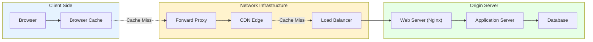
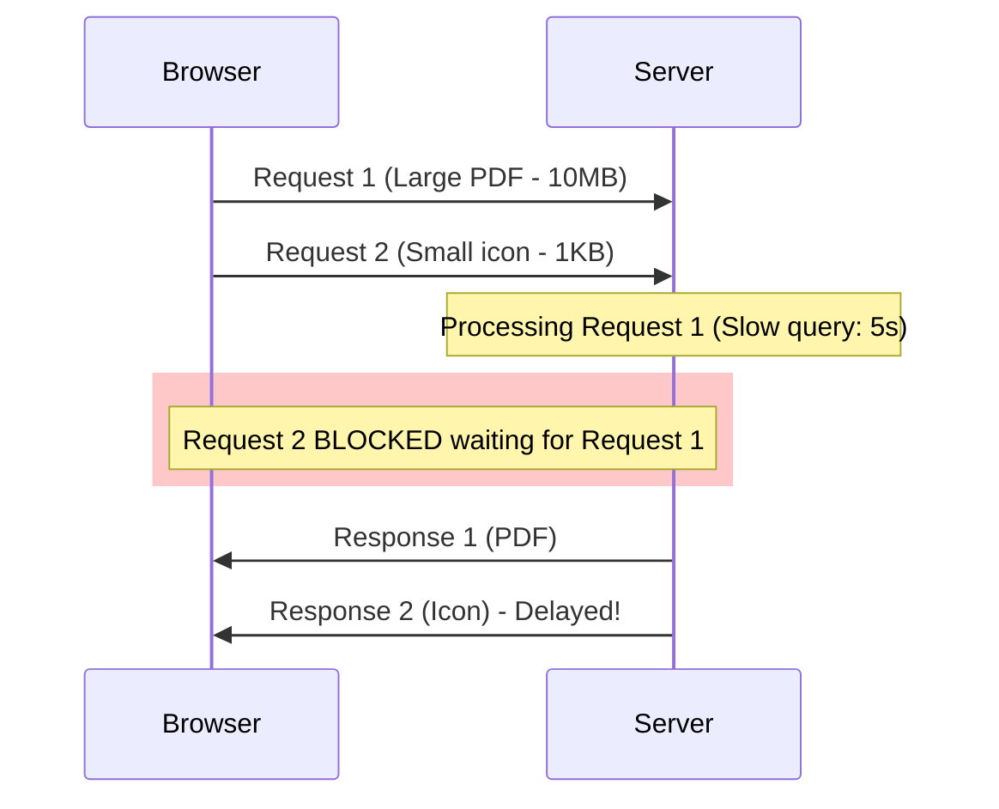

# HTTP Deep Dive: From Text to Binary and Beyond

## 1. Introduction

**HTTP (HyperText Transfer Protocol)** is the foundation of data communication on the World Wide Web. It defines how messages are formatted and transmitted, and what actions web servers and browsers should take in response to various commands.

**Problem It Solves**: How do distributed clients (browsers, apps) and servers communicate reliably over unreliable networks while:
- Remaining stateless for scalability
- Supporting different content types (HTML, images, video, JSON)
- Enabling caching and compression
- Working through firewalls and proxies

**Key Differentiator**: Unlike raw TCP sockets, HTTP provides:
- **Request-Response Model**: Structured communication with methods (GET, POST) and status codes (200, 404)
- **Content Negotiation**: Client and server agree on formats (JSON vs XML)
- **Stateless by Design**: Each request is independent, enabling horizontal scaling
- **Evolution Path**: From simple text (HTTP/1.0) to binary multiplexing (HTTP/2) to UDP-based (HTTP/3)

**Industry Adoption**:
- **HTTP/1.1**: 97% of all websites (legacy standard since 1997)
- **HTTP/2**: 50% of top 10M websites (Google, Facebook, Netflix)
- **HTTP/3**: 25% adoption (Cloudflare, Google, Facebook push aggressively)

**Historical Context**:
- **1991**: HTTP/0.9 by Tim Berners-Lee (single-line protocol, GET only)
- **1996**: HTTP/1.0 (RFC 1945) - headers, POST, status codes
- **1997**: HTTP/1.1 (RFC 2616) - persistent connections, chunked encoding
- **2015**: HTTP/2 (RFC 7540) - binary framing, multiplexing, HPACK
- **2022**: HTTP/3 (RFC 9114) - QUIC transport, 0-RTT, head-of-line blocking fix

**Current Version**: HTTP/3 over QUIC (2022) features:
- **0-RTT Connection**: Resume connections instantly (no TCP handshake)
- **Independent Streams**: No head-of-line blocking at transport layer
- **Built-in Encryption**: TLS 1.3 is mandatory
- **Connection Migration**: Survives IP address changes (mobile networks)

**HTTP vs Raw Sockets**:
| Aspect | HTTP | Raw TCP Socket |
|:-------|:-----|:---------------|
| **Structure** | Request-Response with headers | Arbitrary byte streams |
| **Stateless** | Yes (scales easily) | Stateful (complex scaling) |
| **Caching** | Native (Cache-Control) | Manual implementation |
| **Proxies** | First-class support | Requires custom protocol |
| **Security** | HTTPS (TLS) standard | Custom encryption needed |

---

## 2. Core Architecture

HTTP operates as a client-server protocol with multiple intermediaries and caching layers.



### Key Components

**1. Client (Browser/App)**:
- Initiates HTTP requests
- Manages cookies and sessions
- Implements browser cache (memory + disk)
- Supports HTTP/1.1, HTTP/2, HTTP/3

**2. Proxy (Forward/Reverse)**:
- **Forward Proxy**: Client-side (corporate proxy, VPN)
- **Reverse Proxy**: Server-side (Nginx, HAProxy)
- Functions: Caching, SSL termination, load balancing

**3. CDN (Content Delivery Network)**:
- Geographic distribution of cached content
- Reduces latency by serving from edge locations
- Implements sophisticated cache eviction policies

**4. Web Server (Nginx, Apache)**:
- Handles HTTP protocol parsing
- Serves static files
- Reverse proxies to application servers
- SSL/TLS termination

**5. Application Server**:
- Business logic execution
- Dynamic content generation
- Database queries

**6. HTTP Versions Coexistence**:
- Single server supports HTTP/1.1, HTTP/2, HTTP/3
- ALPN (Application-Layer Protocol Negotiation) during TLS handshake
- Alt-Svc header advertises HTTP/3 availability

---

## 3. How It Works: HTTP Evolution

### A. HTTP/1.1: Text-Based Protocol

**Wire Format** (text):
```http
GET /api/users HTTP/1.1
Host: example.com
User-Agent: Mozilla/5.0
Accept: application/json
```

**Parsing**:
- Read bytes until `\r\n` (CRLF)
- Split by `:` to get header name/value
- Body starts after empty line (`\r\n\r\n`)

**Problem: Head-of-Line (HOL) Blocking**:
```
Browser sends 6 requests (for HTML, CSS, 4 images)
Serialized processing:

Request 1 (HTML) → Wait 500ms → Response 1
Request 2 (CSS)  → Wait 100ms → Response 2
Request 3 (img)  → Wait 50ms  → Response 3
...

Total time: 500 + 100 + 50 + ... = 800ms
```

**Workaround: Multiple Connections**:
- Browsers open 6 parallel connections per domain
- Problem: TCP slow-start penalty × 6, server overhead

---

### B. HTTP/2: Binary Framing and Multiplexing

**Paradigm Shift**: From text lines to binary frames

**Frame Structure**:
```
+-----------------------------------------------+
|                 Length (24 bits)              |
+---------------+---------------+---------------+
|   Type (8)    |   Flags (8)   |
+-+-------------+---------------+-------------------------------+
|R|                 Stream Identifier (31 bits)                 |
+=+=============================================================+
|                   Frame Payload (0...)                        |
+---------------------------------------------------------------+
```

**Frame Types**:
- `0x00` DATA - Actual content
- `0x01` HEADERS - Request/response headers
- `0x02` PRIORITY - Stream priority
- `0x03` RST_STREAM - Terminate stream
- `0x04` SETTINGS - Connection parameters
- `0x05` PUSH_PROMISE - Server push
- `0x06` PING - Heartbeat
- `0x07` GOAWAY - Graceful shutdown
- `0x08` WINDOW_UPDATE - Flow control

**Multiplexing Example**:
```
Single TCP connection:

Time    Stream  Action
0ms     1       HEADERS (GET /index.html)
0ms     3       HEADERS (GET /style.css)
10ms    3       DATA (CSS chunk 1 - 16KB)
15ms    1       DATA (HTML chunk 1 - 16KB)
20ms    3       DATA (CSS chunk 2, END_STREAM)
30ms    1       DATA (HTML chunk 2, END_STREAM)

Result: Parallel processing, optimal network utilization
```

**HPACK Compression**:
```
Static Table (predefined):
Index 2: :method GET
Index 7: :scheme https
Index 15: accept-encoding gzip, deflate

Dynamic Table (learned):
Index 62: user-agent: Mozilla/5.0 Chrome/90...

Request 1: Send full headers (200 bytes)
Request 2: Send indexes only (10 bytes)
Savings: 95%
```

---

### C. HTTP/3: QUIC Transport

**Problem with HTTP/2**: Still suffers from TCP head-of-line blocking at **transport layer**

**Scenario**:
```
HTTP/2 over TCP:
Stream 1: Transferring large video
Stream 3: Transferring small API response

TCP packet loss (1 packet from video) →
TCP blocks ALL streams until retransmission complete →
API response delayed despite being ready

Problem: TCP is stream-oriented, not message-oriented
```

**HTTP/3 Solution**: QUIC (UDP-based)

**QUIC Features**:
1. **Independent Streams**: Packet loss on stream 1 doesn't block stream 3
2. **0-RTT**: Resume connections without handshake (TLS session ticket)
3. **Connection Migration**: Survives IP changes (mobile wifi → cellular)
4. **Built-in TLS 1.3**: Encryption is mandatory

**QUIC Frame Encapsulation**:
```
UDP Packet:
+-------------------+
| UDP Header        |
+-------------------+
| QUIC Header       |  ← Connection ID, packet number
+-------------------+
| QUIC Frame 1      |  ← Stream 1 data
+-------------------+
| QUIC Frame 2      |  ← Stream 3 data
+-------------------+
```

---

## 4. Deep Dive: Internal Mechanisms

### A. Connection Establishment

**HTTP/1.1 over TCP**:
```
Client                            Server
  |                                 |
  |--- SYN -->                     |  (50ms RTT)
  |                                 |
  |<-- SYN-ACK ---                 |  (50ms)
  |                                 |
  |--- ACK + HTTP GET -->          |  (50ms)
  |                                 |
  |<-- HTTP 200 OK ---             |  (50ms)
  
Total: 2 RTT (200ms) until first byte
```

**HTTP/2 over TCP + TLS 1.2**:
```
Total: 3 RTT
1. TCP handshake (SYN, SYN-ACK, ACK)
2. TLS handshake (ClientHello, ServerHello, Certificate, Finished)
3. HTTP request
```

**HTTP/3 over QUIC + TLS 1.3 (0-RTT)**:
```
Client has previous session ticket:

Client                            Server
  |                                 |
  |--- QUIC Initial + TLS 1.3 0-RTT + HTTP GET --> |
  |                                 |
  |<-- HTTP 200 OK ---             |

Total: 0 RTT! (First packet contains request)
```

---

### B. HTTP/2 Flow Control

**Problem**: Fast server overwhelms slow client

**Solution**: Window-based flow control

**Mechanism**:
```
Initial window size: 65,535 bytes (both connection and per-stream)

Client sends WINDOW_UPDATE:
[Type: WINDOW_UPDATE] [Stream: 0] [Increment: 1MB]
→ Connection-level window increased

Server can now send 1MB of data

Per-stream control:
[Type: WINDOW_UPDATE] [Stream: 5] [Increment: 32KB]
→ Stream 5 can receive 32KB more
```

**Implementation (kernel-level)**:
```c
// Simplified socket send buffer check
int http2_send_data(stream_t *stream, uint8_t *data, size_t len) {
    if (stream->send_window < len) {
        return -EAGAIN;  // Would block, wait for WINDOW_UPDATE
    }
    
    int sent = write(stream->socket_fd, data, len);
    stream->send_window -= sent;
    
    return sent;
}
```

---

### C. Server Push (HTTP/2)

**Scenario**: Server knows client will need `style.css` after requesting `index.html`

**Wire Protocol**:
```
Client → Server: [Stream 1] GET /index.html

Server → Client:
  [Stream 1] PUSH_PROMISE
    :method: GET
    :path: /style.css
    promised_stream_id: 2
  
  [Stream 1] HEADERS
    :status: 200
    content-type: text/html
  
  [Stream 1] DATA
    <html>...
  
  [Stream 2] HEADERS  ← Pushing /style.css without request
    :status: 200
    content-type: text/css
  
  [Stream 2] DATA
    body { ... }
```

**Client Behavior**:
- Receives PUSH_PROMISE before seeing `<link>` tag
- Caches stream 2 data
- When parser encounters `<link rel="stylesheet" href="/style.css">`, uses cached data
- Can RST_STREAM (reject) unwanted pushes

---

### D. HTTP/3 Connection Migration

**Problem**: Mobile user switches from WiFi (IP: 192.168.1.5) to Cellular (IP: 10.0.0.50)

**TCP Behavior**: Connection breaks (4-tuple changed)

**QUIC Solution**: Connection ID decouples from IP address

**Mechanism**:
```
Initial connection:
Client IP: 192.168.1.5
Server IP: 203.0.113.10
Connection ID: 0x123ABC (randomly generated)

Network change:
Client IP: 10.0.0.50 (changed!)
Server IP: 203.0.113.10
Connection ID: 0x123ABC (same!)

Server:
  Receives packet with Connection ID 0x123ABC
  Looks up connection in hash map: conn_map[0x123ABC]
  Finds existing connection, updates peer address
  Connection continues seamlessly
```

---

## 5. End-to-End Walkthrough: HTTP/2 Request

**Scenario**: User loads https://example.com (HTTP/2)

### Step 1: DNS Resolution (t=0ms)
```
Browser cache miss
Query DNS resolver: example.com → 203.0.113.10
Time: 20ms
```

### Step 2: TCP + TLS Handshake (t=20ms)
```
TCP SYN → SYN-ACK → ACK (1 RTT = 50ms)
TLS 1.3 ClientHello + ServerHello, Certificate, Finished (1 RTT = 50ms)
ALPN: Client offers [h2, http/1.1], Server selects h2

Total: t=120ms
```

### Step 3: HTTP/2 Connection Preface (t=120ms)
```
Client sends:
  PRI * HTTP/2.0\r\n\r\nSM\r\n\r\n
  SETTINGS frame: SETTINGS_MAX_CONCURRENT_STREAMS=100

Server sends:
  SETTINGS frame: SETTINGS_MAX_CONCURRENT_STREAMS=128
  SETTINGS_INITIAL_WINDOW_SIZE=1MB
```

### Step 4: Request HTML (t=125ms)
```
Client sends (Stream 1):
  HEADERS frame:
    :method: GET
    :scheme: https
    :authority: example.com
    :path: /
    accept: text/html
```

### Step 5: Server Processing (t=175ms)
```
Server:
  1. Consults cache: miss
  2. Executes application logic (50ms)
  3. Generates HTML (5KB)
  4. Decides to push CSS and JS
```

### Step 6: Server Push + Response (t=180ms)
```
Server sends:
  [Stream 1] PUSH_PROMISE (promised_stream_id=2, path=/style.css)
  [Stream 1] PUSH_PROMISE (promised_stream_id=4, path=/app.js)
  
  [Stream 1] HEADERS (:status=200, content-type=text/html)
  [Stream 1] DATA (HTML 5KB)
  
  [Stream 2] HEADERS (:status=200, content-type=text/css)
  [Stream 2] DATA (CSS 3KB)
  
  [Stream 4] HEADERS (:status=200, content-type=application/javascript)
  [Stream 4] DATA (JS 10KB)

Frames interleaved on wire
```

### Step 7: Browser Processing (t=230ms)
```
1. Parser sees <head> → requests already in cache (pushed)
2. CSSOM construction (10ms)
3. DOM construction (20ms)
4. Render tree (15ms)
5. Paint (25ms)

First paint: t=300ms
```

---

## 6. Failure Scenarios

### Scenario A: HTTP/1.1 Head-of-Line Blocking

**Symptom**: Fast resources delayed behind slow resource

**Cause**: Strict FIFO processing on single connection

#### The Mechanism



**Timeline**:
```
t=0ms:   Request 1 sent (PDF)
t=1ms:   Request 2 sent (Icon)
t=5000ms: Response 1 arrives
t=5001ms: Response 2 arrives ← 5 second delay for 1KB file!
```

#### The Fix

**Option 1**: Open multiple connections (HTTP/1.1 workaround)
```javascript
// Browser automatically opens 6 connections per domain
// Distributes requests across connections
```

**Option 2**: Upgrade to HTTP/2 (recommended)
```
Same scenario with HTTP/2:
t=0ms:   Request 1 sent (Stream 1)
t=1ms:   Request 2 sent (Stream 3)
t=2ms:   Response 2 arrives (Icon ready first!)
t=5000ms: Response 1 arrives (PDF)

No blocking!
```

---

### Scenario B: HPACK Table Corruption

**Symptom**: HTTP/2 connection fails with COMPRESSION_ERROR

**Cause**: Client and server HPACK dynamic tables out of sync

#### The Mechanism

```
Client State:
Dynamic Table Index 62: user-agent: Chrome/90

Client sends:
[HEADERS] [Index: 62] (compresses to 1 byte)

Network glitch: SETTINGS frame lost

Server State:
Dynamic Table: EMPTY (SETTINGS never received)

Server receives:
[HEADERS] [Index: 62]
Lookup: Index 62 → NOT FOUND
Error: COMPRESSION_ERROR
Action: Send GOAWAY, close connection
```

#### The Fix

**Server-side protection**:
```nginx
# Nginx configuration
http2_max_concurrent_pushes 0;  # Disable problematic server push
http2_recv_timeout 30s;          # Detect stalled connections
```

**Client retry logic**:
```javascript
fetch(url).catch(err => {
    if (err.code === 'HTTP2_ERROR') {
        // Retry with HTTP/1.1
        return fetch(url, {version: '1.1'});
    }
});
```

---

### Scenario C: HTTP/3 UDP Blocking

**Symptom**: HTTP/3 connections fail, fallback to HTTP/2

**Cause**: Corporate firewall blocks UDP port 443

#### The Mechanism

```
Client                Corporate Firewall        Server
  |                          |                     |
  |-- QUIC Initial (UDP) -->|                     |
  |                          |                     |
  |                          X  BLOCKED            |
  |                          |                     |
  |<-- Timeout (3s) ---------|                     |
  |                          |                     |
  |-- TCP SYN ------------->|------------------>  |
  |                          |                     |
  |                   Fallback to HTTP/2 over TCP  |
```

**Detection**:
```bash
# Test UDP connectivity
nc -u -v example.com 443

# tcpdump to see packets
sudo tcpdump -i any 'udp port 443'
```

#### The Fix

**Server advertisement**:
```
HTTP/2 response includes:
Alt-Svc: h3=":443"; ma=2592000

Meaning: "HTTP/3 available on UDP port 443 for next 30 days"

Client:
  - Attempts UDP connection
  - If fails after 3s: Uses primary HTTP/2 connection
  - Marks Alt-Svc as failed, won't retry for 24h
```

**Network configuration**:
```bash
# Allow UDP 443 for QUIC
iptables -A INPUT -p udp --dport 443 -j ACCEPT
iptables -A OUTPUT -p udp --sport 443 -j ACCEPT
```

---

### Scenario D: Connection Pool Exhaustion

**Symptom**: Requests timeout with "Too many connections"

**Cause**: HTTP/1.1 connection limits reached

#### The Mechanism

```
Application server config:
max_connections: 1000

Current state:
Active HTTP/1.1 connections: 998
Each connection handles 1 request at a time (HOL blocking)

New request arrives:
Connection pool: FULL
Action: Wait in queue
Timeout after 30s → 504 Gateway Timeout
```

#### The Fix

**Upgrade to HTTP/2**:
```
HTTP/2:
Single connection handles 128 concurrent streams
Result: 1000 connections → 128,000 concurrent requests

Massive scalability improvement
```

**HTTP/1.1 tuning**:
```nginx
# Nginx configuration
worker_connections 10000;
keepalive_timeout 65;
keepalive_requests 1000;  # Reuse connection for 1000 requests
```

**Application-level**:
```python
# Connection pool management
import requests
from requests.adapters import HTTPAdapter

session = requests.Session()
adapter = HTTPAdapter(
    pool_connections=100,
    pool_maxsize=100,
    max_retries=3
)
session.mount('https://', adapter)
```

---

## 7. Performance Tuning / Scaling Strategies

### Configuration Table

| Configuration | Recommended | Why? |
|:--------------|:------------|:-----|
| **HTTP Version** | HTTP/2 or HTTP/3 | Multiplexing eliminates HOL blocking |
| **Keep-Alive Timeout** | 65-120 seconds | Balance connection reuse vs memory |
| **Max Concurrent Streams** (H2) | 100-128 | HTTP/2 multiplexing capacity |
| **Initial Window Size** (H2) | 1-16 MB | Flow control, larger for high-bandwidth |
| **HPACK Table Size** | 4096 bytes (default) | Header compression efficiency |
| **TLS Session Cache** | 10MB, 5min TTL | Resume connections quickly |
| **Connection Timeout** | 10-30 seconds | Detect dead connections |
| **gzip Compression** | Enabled (level 6) | Reduce payload size (CPU tradeoff) |
| **Brotli Compression** | Enabled (level 4) | Better than gzip (11% smaller) |
| **TCP Fast Open** | Enabled | Save 1 RTT on connection |
| **TCP BBR Congestion Control** | Enabled | Better throughput on lossy networks |
| **DNS TTL** | 60-300 seconds | Balance freshness vs DNS queries |

### Scaling Strategies

**1. Connection Pooling (Client)**:
```python
# Bad: Creates new connection per request
for i in range(1000):
    requests.get('https://api.example.com/data')
    # Each request: TCP + TLS handshake (200ms overhead)

# Good: Reuse connections
session = requests.Session()
for i in range(1000):
    session.get('https://api.example.com/data')
    # First request: 200ms, subsequent: 20ms
```

**2. HTTP/2 Server Push**:
```nginx
# Nginx configuration
location / {
    http2_push /style.css;
    http2_push /app.js;
    proxy_pass http://app_server;
}
```

**3. CDN Offloading**:
```
Before (all requests hit origin):
  10,000 req/s × 100KB = 1 GB/s bandwidth
  
After (CDN cache hit ratio 95%):
  500 req/s × 100KB = 50 MB/s origin bandwidth
  Savings: 95% reduction
```

**4. HTTP/3 for Mobile**:
```
Mobile scenario (unstable network):
  HTTP/2 over TCP: Packet loss 1% → 10% throughput reduction
  HTTP/3 over QUIC: Packet loss 1% → Independent stream recovery
  
  Result: 30-50% faster on lossy networks
```

---

## 8. Constraints & Limitations

| Constraint | Limit | Why? |
|:-----------|:------|:-----|
| **HTTP/2 Max Streams** | 128 (typical) | Server memory, processing limit |
| **Header Size** | 8 KB (default) | Prevent memory exhaustion attacks |
| **Request Line Length** | 8 KB | URL + method + version limit |
| **Connection Timeout** | 300s (typical) | Balance keep-alive vs resource cleanup |
| **TCP HOL Blocking** (H2) | Transport layer | Packet loss blocks all streams |
| **UDP Firewalls** (H3) | Corporate networks | Many block UDP 443 |
| **Server Push Adoption** | Low (~5%) | Complexity, limited browser support |
| **Cookie Size** | 4096 bytes per cookie | Browser storage limits |
| **Concurrent Connections** | 6 per domain (H1.1) | Browser limitation |
| **Max Request Size** | 2 GB (Nginx default) | Server configuration |

### Why Not HTTP/3?

| Use Case | Better Alternative | Reason |
|:---------|:-------------------|:-------|
| **Intranet** | HTTP/2 | No packet loss, TCP overhead negligible |
| **Static sites** | HTTP/2 + CDN | UDP blocked in many networks |
| **Legacy clients** | HTTP/1.1 | Older browsers/libraries don't support H3 |
| **IoT devices** | MQTT, CoAP | Lower overhead protocols for constrained devices |

---

## 9. When to Use HTTP?

| Use Case | HTTP Version | Why? |
|:---------|:-------------|:-----|
| **Web Browsing** | HTTP/2 ✅ | Universal support, multiplexing |
| **Mobile Apps** | HTTP/3 ✅ | Connection migration, 0-RTT |
| **REST APIs** | HTTP/2 ✅ | Header compression, keep-alive |
| **GraphQL** | HTTP/2 ✅ | Single connection, multiple queries |
| **File Downloads** | HTTP/1.1 ⚠️ | Simpler, widely supported |
| **Real-Time Chat** | WebSocket ✅ | Full duplex, low latency |
| **Streaming Video** | HTTP/3 ✅ | Independent chunks, packet loss resilience |
| **IoT Telemetry** | MQTT ❌ | Lower overhead, publish-subscribe |

### HTTP vs Alternatives

| Protocol | Latency | Throughput | Use Case |
|:---------|:--------|:-----------|:---------|
| **HTTP/2** | 50-200ms | High | General web, APIs |
| **HTTP/3** | 0-100ms (0-RTT) | Very High | Mobile, video streaming |
| **WebSocket** | 1-50ms | Medium | Real-time bidirectional |
| **gRPC** | 10-100ms | Very High | Microservices RPC |
| **Raw TCP** | 1-10ms | Highest | Custom protocols |

---

## 10. Production Checklist

1. [ ] **Enable HTTP/2** minimum (HTTP/3 if mobile-heavy): Multiplexing eliminates HOL blocking
2. [ ] **Configure TLS 1.3**: 0-RTT reduces connection latency by 1 RTT
3. [ ] **Enable compression** (gzip level 6 or Brotli level 4): Reduces bandwidth 60-80%
4. [ ] **Set Keep-Alive timeout 65s**: Reuses connections, reduces handshake overhead
5. [ ] **Implement connection pooling** (client-side): Reuse connections across requests
6. [ ] **Configure CDN** with 95%+ cache hit ratio: Offload origin traffic
7. [ ] **Monitor response time** p99 < 500ms: Detect performance degradation
8. [ ] **Set request timeouts** (connect: 10s, read: 30s): Prevent hanging connections
9. [ ] **Enable HTTP/2 Server Push** for critical CSS/JS: Eliminate round-trip for critical resources
10. [ ] **Test HTTP/3 fallback**: Ensure graceful degradation when UDP blocked

**Critical Metrics**:

```
# Performance Metrics
http_request_duration_seconds:
  p50 < 100ms (fast), p90 < 300ms, p99 < 500ms (acceptable)
  
http_requests_total:
  rate(5m) by status code - baseline traffic patterns
  
http_connections_active:
  Monitor concurrent connections (H1.1: max 6/domain, H2: 1/domain)

# Protocol Version Distribution  
http_version{version="1.1|2.0|3.0"}:
  Track adoption (target: 50%+ HTTP/2)
  
http2_streams_active:
  Monitor multiplexing usage (target: 10-50 streams/connection)

# Error Metrics
http_requests_total{status="5xx"}:
  < 1% error rate (alert if > 5%)
  
http_timeouts_total:
  Connection/read timeouts (should be < 0.1%)

# Performance Indicators
http_compression_ratio:
  gzip: 60-80% reduction, Brotli: 70-85%
  
http_cache_hit_ratio:
  CDN: > 95%, Browser: > 80%
  
http_connection_reuse_ratio:
  H1.1 Keep-Alive: > 90%, H2: 100%
  
tls_handshake_duration_seconds:
  TLS 1.3: p50 < 50ms, TLS 1.2: p50 < 100ms

# HTTP/3 Specific
quic_packet_loss_rate:
  < 1% (good network), 1-5% (acceptable mobile)
  
quic_connection_migration_total:
  Mobile apps: high (network switches)
  
http3_0rtt_success_rate:
  > 80% for returning users
```

---

**Conclusion**: HTTP has evolved from a simple text protocol to a sophisticated binary multiplexing system with UDP transport. HTTP/2 solves head-of-line blocking at the application layer, while HTTP/3 eliminates it at the transport layer. Understanding these layers enables building high-performance, scalable web applications.
