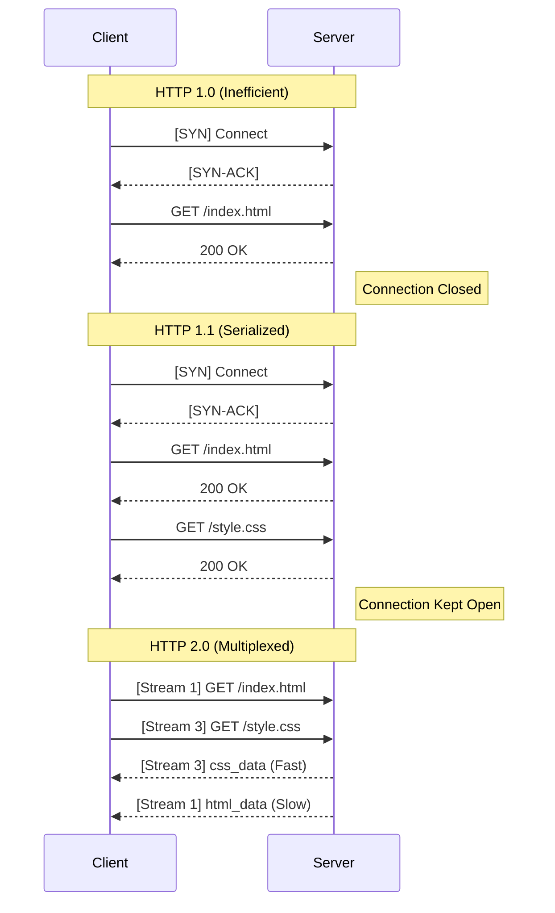
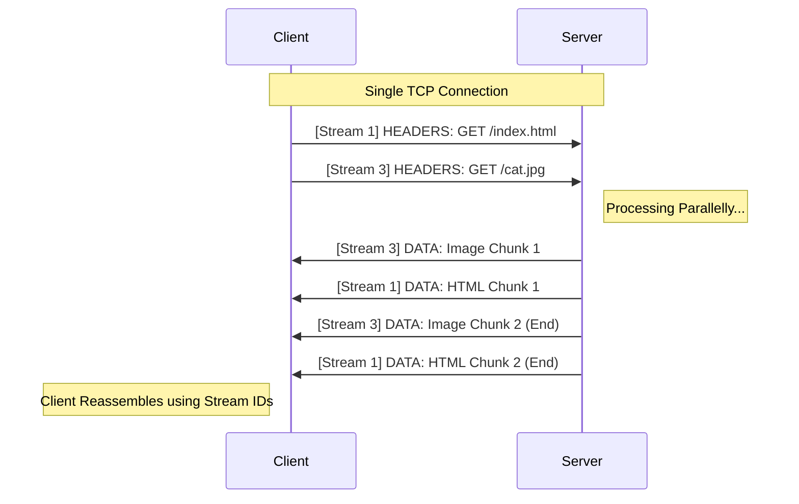

# HTTP Deep Dive: From Text to Binary

This document traces the evolution of HTTP from a simple text-based protocol to the complex binary multiplexing engine used today. It focuses on the **mechanics** of how data moves over the wire.

---

## 1. The Eras of HTTP: A Visual History

The fundamental difference between versions is how they utilize the underlying TCP connection.



---

## 2. HTTP 1.1: The Era of Text & Serialization

HTTP 1.1 (1997) introduced **Persistent Connections** (`Keep-Alive`), allowing us to reuse a single TCP connection for multiple files.

### The Mechanics: Text & Newlines
*   **Format:** Human-readable Text.
*   **Parsing:** The machine reads byte-by-byte looking for a delimiter (CRLF `\r\n`).
*   **Example:**
    ```http
    GET /index.html HTTP/1.1
    Host: example.com
    ```

### The Problem: Head-of-Line (HOL) Blocking
While we reuse the connection, the request/response pairing relies on **Strict FIFO (First-In-First-Out)**.

*   **The Issue:** The server must reply to requests in the exact order they were received.
*   **The Scenario:**
    1.  Browser sends `Request A` (Large HTML Page).
    2.  Browser sends `Request B` (Small Image).
    3.  If `A` takes 5 seconds to generate, `B` **must wait** behind it.
*   **The Result:** The connection is effectively "blocked" by the slow first request. The small image is delayed even though the network is free.

---

## 3. HTTP 2.0: The Era of Binary & Multiplexing

HTTP 2.0 (2015) solves HOL Blocking by changing the fundamental unit of communication.

### The Paradigm Shift: Binary Frames
Instead of sending "Text Lines", we send "Binary Frames".

*   **Why Binary?**
    *   **Speed:** Machines can read a "Length Header" (e.g., 3 bytes) and instantly jump forward. No need to scan for newlines.
    *   **Robustness:** No ambiguity about whitespace or encoding.

#### The Frame Structure
Every slice of data is wrapped in an envelope:
```text
+-----------------------+-----------------------------+
| Length (24 bits)      | Type (Headers/Data) (8 bits)|
+-----------------------+-----------------------------+
| Stream ID (31 bits)   | Payload...                  |
+-----------------------+-----------------------------+
```

#### Example: Splitting a Large JSON Response
Imagine the Server wants to send a 20KB JSON file on **Stream 5**. It cannot send it as one giant block (that would block other streams). It splits it into frames.

**1. The Logical Data:**
`HTTP/2 200 OK` ... `{"users": [ ... huge list ... ]}`

**2. The Physical Frames on the Wire:**

**Frame 1: The Headers (Type=0x01)**
```text
[Length: 10] [Type: HEADERS] [StreamID: 5]
Payload: :status: 200, content-type: json
```

**Frame 2: Data Chunk 1 (Type=0x00)**
```text
[Length: 16384] [Type: DATA] [StreamID: 5]
Payload: {"users": ["Alice", "Bob", ... (first 16KB)
```

**Frame 3: Data Chunk 2 (Type=0x00) (End Stream)**
```text
[Length: 3616] [Type: DATA] [StreamID: 5] [Flags: END_STREAM]
Payload: ... "Charlie", "Dave"]}
```

*Note: Between Frame 2 and Frame 3, the server might send a frame for Stream 7. This is interleaving!*

### The Architecture: Streams & Multiplexing
How do we send multiple files at once without mixing them up?

1.  **The Stream:** A virtual channel within the TCP connection.
    *   **Odd IDs (1, 3, 5):** Client-Initiated streams.
    *   **Even IDs (2, 4, 6):** Server-Initiated streams (Push).
2.  **The Map:** The client maintains a `Map<StreamID, RequestContext>`.

#### Visualizing Multiplexing
Requests and Responses are chopped into frames and interleaved on the wire.



---

## 4. Advanced Features

### A. HPACK (Header Compression)
*   **Problem:** In HTTP 1.1, headers are stateless. sending `User-Agent: Mozilla/5.0...` (100 bytes) on every request is huge overhead.
*   **Solution:** HPACK uses **Lookup Tables**. Both Client and Server maintain the exact same state.

#### How it works: Two Tables
1.  **Static Table:** A hardcoded list of common headers (e.g., Index `2` is always `:method: GET`).
2.  **Dynamic Table:** A runtime list that grows as we exchange new headers.

#### Step-by-Step Walkthrough
Let's see how we save those bytes.

**Request 1: The "Learning" Phase**
We want to send:
*   `:method: GET`
*   `user-agent: Chrome/90.0...` (Custom string)

1.  **:method: GET**:
    *   Found in **Static Table** (Index 2).
    *   **Action:** Send `0x82` (1 byte representing Index 2).
2.  **user-agent**:
    *   Not found in any table.
    *   **Action:** Send the full string literal ("Chrome...").
    *   **Crucial Step:** Both sides add `user-agent: Chrome...` to the **Dynamic Table** at Index **62**.

**Request 2: The "Compression" Phase**
We send the exact same headers again.

1.  **:method: GET**:
    *   Found in Static Table (Index 2).
    *   **Action:** Send `0x82` (1 byte).
2.  **user-agent**:
    *   Found in **Dynamic Table** (Index 62).
    *   **Action:** Send `0xBE` (1 byte representing Index 62).

**Result:** The 100-byte string turned into a single byte on the second try.

#### The Savings Table Explained
| Header Sent | Mechanism | Cost | Savings |
| :--- | :--- | :--- | :--- |
| `method: GET` | **Static Table** (Index 2) | 1 byte | 90% |
| `scheme: https` | **Static Table** (Index 7) | 1 byte | 92% |
| `host: example.com` | **Literal** (Dynamic Table miss) | ~17 bytes (1st time) | 0% |
| `user-agent: ...` | **Dynamic Table** (Index 62) | **1 byte** (2nd time) | **99%** |

### B. Server Push (`PUSH_PROMISE`)
The server can send a resource *before* the client asks for it.

*   **Mechanism:**
    1.  Client asks for `index.html` (Stream 1).
    2.  Server knows (via manual config) that this needs `style.css`.
    3.  Server sends `PUSH_PROMISE` frame: *"I am giving you style.css on **Stream 2**"*.
    4.  Server sends Stream 2 data immediately.
*   **Configuration:** The server does not "guess". The developer must configure this ruleset in Nginx/Apache or Application Code.

---

## 5. Comparison Matrix

| Feature | HTTP 1.1 | HTTP 2.0 |
| :--- | :--- | :--- |
| **Protocol Type** | Text (Newline Delimited) | Binary (Length Prefixed) |
| **Requests Matching** | Strict FIFO Order | Multi-Stream ID Mapping |
| **Connections** | Multiple (6-30 per domain) | One Single Connection |
| **Headers** | Repetitive / Uncompressed | Stateful Compression (HPACK) |
| **Push Capability** | None | Native (`PUSH_PROMISE`) |

---

## 6. Essential Headers Reference

### Content Negotiation
*   **`Content-Type`**: `application/json`, `text/html`.
*   **`Accept`**: `application/json` (What the client wants).
*   **`Content-Length`**: Critical for 1.1 (so we know when body ends). Less critical for 2.0 (Frames have length).

### Caching
*   **`Cache-Control`**: `no-cache` (validate), `no-store` (sensitive), `max-age` (seconds).
*   **`ETag`**: Content fingerprint. Used with `If-None-Match` to return `304 Not Modified`.

### Security
*   **`CORS`**: `Access-Control-Allow-Origin`. Controls cross-domain Ajax access.
*   **`HSTS`**: `Strict-Transport-Security`. Forces HTTPS.
*   **`Authorization`**: `Bearer <token>`.
