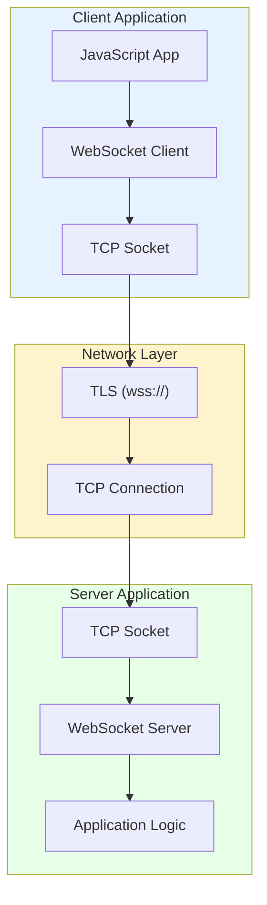
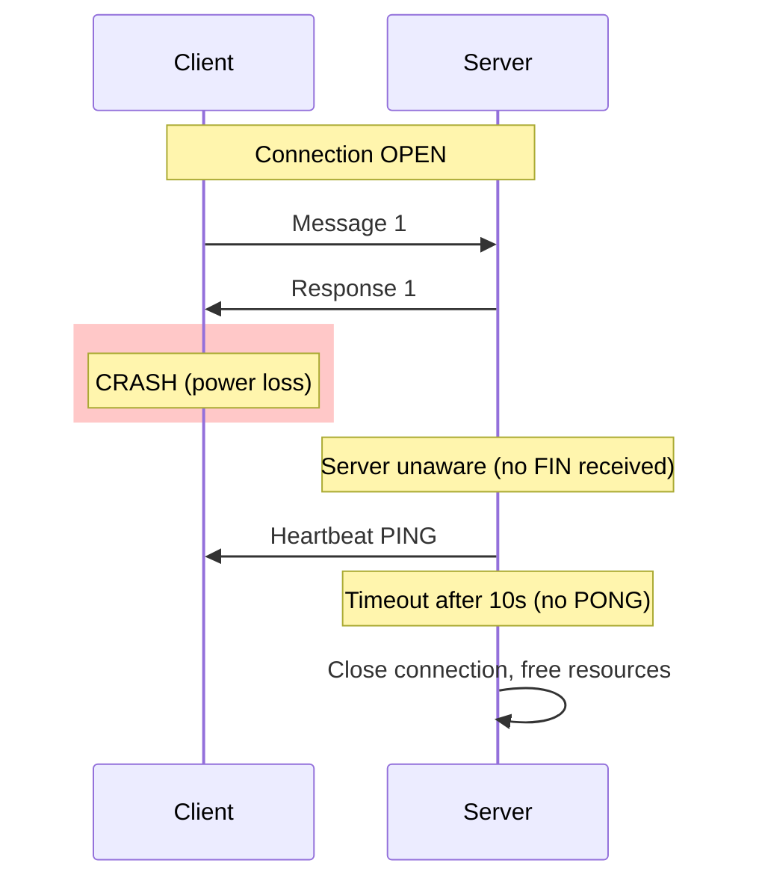

# WebSocket Deep Dive: Full-Duplex Communication on the Web

## 1. Introduction

**WebSocket** is a computer communications protocol providing full-duplex communication channels over a single TCP connection. It enables real-time, bidirectional data exchange between client and server without the overhead of HTTP request-response cycles.

**Problem It Solves**: How do web applications achieve real-time communication when:
- HTTP is request-response only (server can't push without request)
- Polling wastes bandwidth (99% of requests return "no new data")
- Long-polling ties up server resources
- SSE is unidirectional (server → client only)

**Key Differentiator**: Unlike HTTP polling or Server-Sent Events:
- **Full Duplex**: Both sides send data independently, simultaneously
- **Persistent Connection**: Single long-lived TCP connection
- **Low Overhead**: 2-14 byte headers vs 500+ bytes for HTTP
- **Binary & Text**: Native support for both payload types

**Industry Adoption**:
- **Chat Applications**: Slack, Discord, WhatsApp Web
- **Collaboration Tools**: Figma, Google Docs, Miro
- **Trading Platforms**: Coinbase, Robinhood, Bloomberg Terminal
- **Gaming**: Agar.io, Slither.io, multiplayer games
- **Live Feeds**: Twitter streams, stock tickers

**Historical Context**:
- **2008**: Initial proposal during WHATWG HTML5 development
- **2011**: RFC 6455 standardized (WebSocket Protocol)
- **2012**: Major browser support (Chrome 16, Firefox 11, Safari 6)
- **2015**: Widespread server support (Node.js, Python, Java)
- **2020+**: WebSocket over HTTP/2 and HTTP/3 experiments

**Current Adoption**: 20%+ of Alexa top 1000 sites use WebSocket for real-time features

**WebSocket vs Polling**:
| Aspect | WebSocket | HTTP Polling |
|:-------|:----------|:-------------|
| **Latency** | 1-50ms | 500-5000ms (poll interval) |
| **Overhead** | 2 bytes/message | 500+ bytes/request |
| **Server Load** | 1 connection | N connections (N = poll rate) |
| **Bidirectional** | Yes | No (separate requests) |
| **Real-time** | True push | Simulated push |

---

## 2. Core Architecture

WebSocket enables direct, full-duplex communication through the TCP stack with minimal protocol overhead.



### Key Components

**1. WebSocket Client (Browser/App)**:
- JavaScript WebSocket API (`new WebSocket(url)`)
- Manages connection state (CONNECTING, OPEN, CLOSING, CLOSED)
- Buffers outgoing messages when connection busy
- Automatic frame assembly/disassembly

**2. WebSocket Server**:
- Protocol upgrade handler (HTTP → WebSocket)
- Frame parser and validator
- Connection pool manager
- Message routing to application logic

**3. Handshake Protocol**:
- Starts as HTTP/1.1 Upgrade request
- Sec-WebSocket-Key/Accept challenge-response
- Switches from HTTP to WebSocket framing

**4. Frame Protocol**:
- Binary framing layer
- Masking (client → server required)
- Fragmentation for large messages
- Control frames (PING, PONG, CLOSE)

**5. Connection State Machine**:
```
CONNECTING → Handshake in progress
    ↓
OPEN → Data exchange
    ↓
CLOSING → Close frame sent, waiting for response
    ↓
CLOSED → Connection terminated
```

---

## 3. How It Works: Protocol Mechanics

### A. The Handshake (HTTP Upgrade)

**Client Request** (HTTP/1.1):
```http
GET /chat HTTP/1.1
Host: example.com
Upgrade: websocket
Connection: Upgrade
Sec-WebSocket-Key: dGhlIHNhbXBsZSBub25jZQ==
Sec-WebSocket-Version: 13
Origin: https://example.com
```

**Server Response**:
```http
HTTP/1.1 101 Switching Protocols
Upgrade: websocket
Connection: Upgrade
Sec-WebSocket-Accept: s3pPLMBiTxaQ9kYGzzhZRbK+xOo=
```

**Magic Algorithm** (RFC 6455):
```python
import hashlib
import base64

# Server computes Sec-WebSocket-Accept
key = "dGhlIHNhbXBsZSBub25jZQ=="  # From client
magic_guid = "258EAFA5-E914-47DA-95CA-C5AB0DC85B11"

concat = key + magic_guid
sha1 = hashlib.sha1(concat.encode()).digest()
accept = base64.b64encode(sha1).decode()
# Result: s3pPLMBiTxaQ9kYGzzhZRbK+xOo=
```

**Purpose**: Proves server deliberately implements WebSocket (not a generic HTTP server)

---

### B. Frame Structure

**Base Frame Format**:
```
 0                   1                   2                   3
 0 1 2 3 4 5 6 7 8 9 0 1 2 3 4 5 6 7 8 9 0 1 2 3 4 5 6 7 8 9 0 1
+-+-+-+-+-------+-+-------------+-------------------------------+
|F|R|R|R| opcode|M| Payload len |    Extended payload length    |
|I|S|S|S|  (4)  |A|     (7)     |             (16/64)           |
|N|V|V|V|       |S|             |   (if payload len==126/127)   |
| |1|2|3|       |K|             |                               |
+-+-+-+-+-------+-+-------------+ - - - - - - - - - - - - - - - +
|     Extended payload length continued, if payload len == 127  |
+ - - - - - - - - - - - - - - - +-------------------------------+
|                               | Masking-key, if MASK set to 1 |
+-------------------------------+-------------------------------+
| Masking-key (continued)       |          Payload Data         |
+-------------------------------- - - - - - - - - - - - - - - - +
:                     Payload Data continued ...                :
+ - - - - - - - - - - - - - - - - - - - - - - - - - - - - - - - +
|                     Payload Data continued ...                |
+---------------------------------------------------------------+
```

**Fields**:
- **FIN** (1 bit): Final fragment (1) or more coming (0)
- **Opcode** (4 bits): Frame type
  - `0x0`: Continuation
  - `0x1`: Text (UTF-8)
  - `0x2`: Binary
  - `0x8`: Close
  - `0x9`: Ping
  - `0xA`: Pong
- **MASK** (1 bit): Payload masked (1 for client→server)
- **Payload Length** (7/7+16/7+64 bits):
  - 0-125: Actual length
  - 126: Next 2 bytes = length
  - 127: Next 8 bytes = length

---

### C. Masking (Security Measure)

**Rule**: All frames from client to server MUST be masked

**Algorithm**:
```python
def mask_payload(payload, masking_key):
    masked = bytearray(len(payload))
    for i in range(len(payload)):
        masked[i] = payload[i] ^ masking_key[i % 4]
    return bytes(masked)

# Example
payload = b"Hello"
mask_key = b"\x12\x34\x56\x78"

masked = mask_payload(payload, mask_key)
# H ^ 0x12 = 0x5A
# e ^ 0x34 = 0x51
# ... etc
```

**Why Masking?**:
- Prevents cache poisoning attacks
- Mitigates proxy interference
- Ensures frames aren't interpreted as HTTP by middleboxes

---

### D. Fragmentation

**Problem**: Sending 10MB file as single frame blocks connection

**Solution**: Split into fragments

**Example**:
```
Large text message: "Very long message..." (10MB)

Frame 1: [FIN=0, Opcode=0x1] "Very long mes"
Frame 2: [FIN=0, Opcode=0x0] "sage part 2..."
Frame 3: [FIN=1, Opcode=0x0] "final part"

Receiver reassembles frames in order
```

---

## 4. Deep Dive: Internal Implementation

### A. Connection Establishment (Kernel Level)

**TCP Socket Creation**:
```c
// Server-side (simplified)
int server_fd = socket(AF_INET, SOCK_STREAM, 0);

struct sockaddr_in addr = {
    .sin_family = AF_INET,
    .sin_port = htons(8080),
    .sin_addr.s_addr = INADDR_ANY
};

bind(server_fd, (struct sockaddr*)&addr, sizeof(addr));
listen(server_fd, SOMAXCONN);

int client_fd = accept(server_fd, NULL, NULL);
// client_fd is now connected TCP socket

// Read HTTP upgrade request
char buffer[4096];
recv(client_fd, buffer, sizeof(buffer), 0);

// Parse headers, compute Sec-WebSocket-Accept
// Send 101 Switching Protocols

// Connection is now WebSocket (no longer HTTP)
```

---

### B. Heartbeat Mechanism (Keeping Connections Alive)

**Problem**: Network middle boxes close idle connections (NAT timeouts, firewalls)

**Solution**: PING/PONG frames

**Server Implementation**:
```python
import asyncio

async def heartbeat(websocket):
    while True:
        try:
            await websocket.ping()  # Send PING frame
            await asyncio.wait_for(
                websocket.pong_received, 
                timeout=10
            )
            await asyncio.sleep(30)  # Ping every 30s
        except asyncio.TimeoutError:
            # Client didn't respond to PING
            await websocket.close(1002, "Ping timeout")
            break
```

**Wire Protocol**:
```
Server→Client: [Opcode=0x9] (PING)
Client→Server: [Opcode=0xA] (PONG) - automatic response

If no PONG after 10s: Server closes connection
```

---

### C. Backpressure Handling

**Problem**: Fast sender overwhelms slow receiver

**TCP-Level Solution**:
```python
async def send_with_backpressure(websocket, data):
    # WebSocket built on TCP, inherits flow control
    
    await websocket.send(data)
    # send() blocks if TCP send buffer full
    # TCP window size controls flow
    
    # Application layer: monitor queue
    if len(websocket._outgoing_queue) > 100:
        await asyncio.sleep(0.1)  # Slow down
```

---

### D. Scalability (Connection Pooling)

**Challenge**: 10,000 concurrent WebSocket connections

**Memory Footprint**:
```
Per connection:
- TCP socket: ~4KB kernel buffer
- WebSocket state: ~1KB
- Application data: ~10KB

Total: 15KB × 10,000 = 150MB minimum
```

**Server Architecture** (async I/O):
```python
# Event loop model (1 thread handles 10,000 connections)
import asyncio

async def handle_client(websocket):
    async for message in websocket:
        # Process message (non-blocking)
        response = await process(message)
        await websocket.send(response)

# Single event loop
async def main():
    async with websockets.serve(handle_client, "0.0.0.0", 8080):
        await asyncio.Future()  # Run forever

asyncio.run(main())
```

**Contrast with Thread-Per-Connection**:
```
Threaded model:
10,000 connections × 1MB/thread = 10GB RAM
Context switches kill performance

Async model:
10,000 connections × 15KB = 150MB RAM
Single thread, no context switches
```

---

## 5. End-to-End Walkthrough: Chat Application

**Scenario**: User sends "Hello" in chat room

### Step 1: Initial Connection (t=0ms)
```
Browser executes:
const ws = new WebSocket('wss://chat.example.com/room/123');

TCP handshake: SYN, SYN-ACK, ACK (50ms RTT)
TLS handshake: ClientHello, ServerHello, Finished (50ms)
WebSocket handshake: Upgrade request/response (50ms)

Total: 150ms to OPEN state
```

### Step 2: User Types "Hello" (t=5000ms)
```
JavaScript:
ws.send("Hello");

Browser WebSocket implementation:
1. Create frame:
   - FIN=1 (complete message)
   - Opcode=0x1 (text)
   - MASK=1
   - Payload length=5
   - Masking key=random 4 bytes
   - Masked payload="Hello" ^ key
   
2. Write to TCP socket:
   Frame size: 2 + 4 + 5 = 11 bytes
   
3. TCP sends packet (1ms)
```

### Step 3: Server Receives (t=5051ms)
```
Server reads TCP socket:
1. Parse frame header (2 bytes)
2. Read masking key (4 bytes)
3. Read payload (5 bytes)
4. Unmask: payload ^ key = "Hello"
5. Validate UTF-8 encoding
6. Deliver to application: on_message("Hello")

Processing time: 1ms
```

### Step 4: Server Broadcasts (t=5052ms)
```
Application logic:
for client in room_123_clients:
    if client != sender:
        await client.send(f'{username}: Hello')

Create frames for 99 other clients:
- No masking needed (server→client)
- Frame size: 2 + 12 = 14 bytes

TCP sends 99 packets in parallel: 10ms
```

### Step 5: Other Clients Receive (t=5112ms)
```
Each client:
1. Read frame from TCP socket
2. Parse frame (no unmasking needed)
3. Trigger onmessage event
4. JavaScript updates UI

Total latency: 112ms (user types → others see message)
```

---

## 6. Failure Scenarios

### Scenario A: Half-Open Connection (Zombie Connection)

**Symptom**: Server thinks connection is open, client is gone

**Cause**: Client crashes, network cable unplugged (no FIN/RST sent)

#### The Mechanism



**Detection**:
```
t=0s: Client crashes
t=0s-30s: Server sends normal messages (dropped by network)
t=30s: Server sends PING
t=40s: Timeout (no PONG) → Server closes connection

Memory leak prevented!
```

#### The Fix

**Server-side heartbeat**:
```python
async def connection_with_heartbeat(websocket):
    heartbeat_task = asyncio.create_task(ping_loop(websocket))
    
    try:
        async for message in websocket:
            await process(message)
    except websockets.exceptions.ConnectionClosed:
        pass
    finally:
        heartbeat_task.cancel()

async def ping_loop(websocket):
    while True:
        await asyncio.sleep(30)
        try:
            pong = await websocket.ping()
            await asyncio.wait_for(pong, timeout=10)
        except asyncio.TimeoutError:
            await websocket.close()
            break
```

---

### Scenario B: Reconnection Storm

**Symptom**: Server overload as thousands of clients reconnect simultaneously

**Cause**: Server restart, network outage recovery

#### The Mechanism

```
Server restart at t=0:
10,000 connected clients all detect closure at t=1s

Without backoff:
All 10,000 clients reconnect at t=1.1s
Server receives 10,000 connection requests in 100ms
→ Listen queue overflow (SOMAXCONN limit)
→ SYN packets dropped
→ Clients retry immediately
→ Amplified storm

Result: Server unusable for minutes
```

#### The Fix

**Exponential backoff with jitter**:
```javascript
class ReconnectingWebSocket {
    constructor(url) {
        this.url = url;
        this.attempt = 0;
        this.connect();
    }
    
    connect() {
        this.ws = new WebSocket(this.url);
        
        this.ws.onclose = () => {
            // Exponential backoff: 1s, 2s, 4s, 8s, max 30s
            const delay = Math.min(
                1000 * Math.pow(2, this.attempt), 
                30000
            );
            
            // Jitter: ±50% randomization
            const jitter = delay * (Math.random() - 0.5);
            
            setTimeout(() => {
                this.attempt++;
                this.connect();
            }, delay + jitter);
        };
        
        this.ws.onopen = () => {
            this.attempt = 0;  // Reset on success
        };
    }
}
```

**Result**:
```
With backoff + jitter:
t=1s: 33% of clients reconnect (avg 1s delay + jitter)
t=2s: 33% reconnect (avg 2s delay)
t=4s: 34% reconnect (avg 4s delay)

Connection rate spread over 7 seconds
Server handles load smoothly
```

---

### Scenario C: Message Too Large (Frame Size Limit)

**Symptom**: Connection closes with 1009 (Message Too Big)

**Cause**: Client sends 20MB message, server limit is 10MB

#### The Mechanism

```
Client:
ws.send(image_data);  // 20MB blob

Server receives:
Frame header: Payload length = 20,000,000 bytes

Server check:
if (payload_length > MAX_MESSAGE_SIZE):
    send_close_frame(1009, "Message too big")
    close_connection()

Result: Connection terminated
```

#### The Fix

**Client-side chunking**:
```javascript
async function sendLargeFile(ws, file) {
    const CHUNK_SIZE = 1 * 1024 * 1024;  // 1MB chunks
    
    for (let offset = 0; offset < file.size; offset += CHUNK_SIZE) {
        const chunk = file.slice(offset, offset + CHUNK_SIZE);
        const arrayBuffer = await chunk.arrayBuffer();
        
        ws.send(arrayBuffer);  // Send 1MB at a time
        
        // Wait for server ACK (backpressure)
        await new Promise(resolve => {
            ws.onmessage = (event) => {
                if (event.data === 'ACK') resolve();
            };
        });
    }
    
    ws.send('EOF');  // Signal completion
}
```

**Server-side config**:
```python
# Increase limit if needed
websocket_server = websockets.serve(
    handler,
    "0.0.0.0",
    8080,
    max_size=50 * 1024 * 1024  # 50MB limit
)
```

---

### Scenario D: Proxy BufferingDelaying Messages

**Symptom**: Messages delayed by 30-60 seconds

**Cause**: HTTP proxy buffers WebSocket frames

#### The Mechanism

```
Client → Corporate Proxy → Server

Proxy behavior (misconfigured):
1. Sees "Upgrade: websocket" header
2. Allows connection (doesn't block)
3. BUT buffers frames (treats as HTTP)
4. Flushes buffer every 60s

Result: Real-time app has 60s delay!
```

#### The Fix

**Detect buffering**:
```javascript
const start = Date.now();

ws.send('PING');

ws.onmessage = (event) => {
    if (event.data === 'PONG') {
        const latency = Date.now() - start;
        
        if (latency > 5000) {
            alert('High latency detected. Proxy may be buffering.');
            // Fallback to HTTP polling
        }
    }
};
```

**Server headers**:
```
X-Accel-Buffering: no  # Nginx: disable buffering
```

**Proxy configuration** (Nginx):
```nginx
location /ws {
    proxy_pass http://backend;
    proxy_http_version 1.1;
    proxy_set_header Upgrade $http_upgrade;
    proxy_set_header Connection "Upgrade";
    
    proxy_buffering off;  # Critical!
    proxy_read_timeout 86400;
}
```

---

## 7. Performance Tuning / Scaling Strategies

### Configuration Table

| Configuration | Recommended | Why? |
|:--------------|:------------|:-----|
| **Max Message Size** | 1-10 MB | Prevent memory exhaustion |
| **Ping Interval** | 30-60 seconds | Keep NAT mappings alive |
| **Ping Timeout** | 10 seconds | Detect dead connections quickly |
| **Max Connections** | 10,000-100,000 | Based on RAM (15KB/conn) |
| **Compression** | permessage-deflate | 60% bandwidth reduction |
| **TCP Keep-Alive** | Enabled (7200s) | OS-level dead connection detection |
| **TCP_NODELAY** | Enabled | Disable Nagle's algorithm (low latency) |
| **Max Frame Size** | 16 KB | Balance fragmentation vs overhead |
| **Reconnect Backoff** | Exponential (1s → 30s) | Prevent reconnection storms |
| **Message Queue Depth** | 100 messages | Backpressure threshold |
| **TLS Session Resumption** | Enabled | Save 1 RTT on reconnect |
| **HTTP/2 Upgrade** | No (incompatible) | WebSocket works over HTTP/1.1 only |

### Scaling Strategies

**1. Horizontal Scaling (Load Balancer + Sticky Sessions)**:
```nginx
upstream websocket_backend {
    ip_hash;  # Sticky sessions (same client → same server)
    server backend1:8080;
    server backend2:8080;
    server backend3:8080;
}

server {
    location /ws {
        proxy_pass http://websocket_backend;
        proxy_http_version 1.1;
        proxy_set_header Upgrade $http_upgrade;
        proxy_set_header Connection "Upgrade";
    }
}
```

**2. Message Broadcasting (Redis Pub/Sub)**:
```python
# Server 1 receives message from Client A
await redis.publish('chat_room_123', message)

# Server 2, 3 receive via subscription
pubsub = redis.pubsub()
pubsub.subscribe('chat_room_123')

async for message in pubsub.listen():
    # Broadcast to local connections on Server 2, 3
    for websocket in local_clients:
        await websocket.send(message)
```

**3. Connection Compression**:
```
Enable permessage-deflate extension:

Sec-WebSocket-Extensions: permessage-deflate; 
  client_max_window_bits=15; 
  server_max_window_bits=15

JSON message: {"type": "chat", "text": "Hello"} = 42 bytes
Compressed: 28 bytes (33% reduction)

Trade-off: 5-10ms CPU overhead per message
```

**4. Binary Format (Protocol Buffers)**:
```javascript
// Instead of JSON (text, larger, slower parsing)
const msg = JSON.stringify({type: 'chat', text: 'Hello'});
ws.send(msg);  // 42 bytes

// Use Protocol Buffers (binary, compact, fast)
const msg = ChatMessage.encode({type: 1, text: 'Hello'}).finish();
ws.send(msg);  // 12 bytes (71% smaller)
```

---

## 8. Constraints & Limitations

| Constraint | Limit | Why? |
|:-----------|:------|:-----|
| **Browser Connection Limit** | 6-30 per domain | Browser resource management |
| **Max Frame Size** | 65536 bytes (common) | Balance fragmentation vs overhead |
| **Proxy Compatibility** | ~85% | Some proxies block/buffer WebSocket |
| **HTTP/2 Incompatibility** | N/A | WebSocket requires HTTP/1.1 upgrade |
| **Message Ordering** | Per-connection only | Multiple connections = no global order |
| **Mobile Battery** | Higher drain | Persistent connection prevents sleep |
| **Firewall Blocking** | Corporate networks | Some block non-HTTP(S) traffic |
| **No Automatic Reconnect** | Application responsibility | Must implement manually |
| **Broadcast Complexity** | N² without pub/sub | Need Redis/NATS for multi-server |
| **Memory Growth** | 15KB per connection | 100K connections = 1.5GB RAM |

### Why Not WebSocket?

| Use Case | Better Alternative | Reason |
|:---------|:-------------------|:-------|
| **Request-Response API** | HTTP/2 | Simpler, better caching |
| **Unidirectional Push** | Server-Sent Events | Lighter weight, HTTP-friendly |
| **File Transfer** | HTTP Multipart | Better resume/progress support |
| **Microservice RPC** | gRPC | Type safety, code generation |
| **IoT Telemetry** | MQTT | Lower overhead, QoS levels |

---

## 9. When to Use WebSocket?

| Use Case | Verdict | Why? |
|:---------|:--------|:-----|
| **Chat/Messaging** | ✅ **YES** | Full duplex, instant delivery |
| **Collaboration** (Google Docs) | ✅ **YES** | Real-time cursor/edit sync |
| **Live Feeds** (Stock Ticker) | ✅ **YES** | Server push, low latency |
| **Online Gaming** | ✅ **YES** | Bidirectional, sub-50ms latency |
| **Video Streaming** | ❌ **NO** | Use WebRTC (UDP, lower latency) |
| **REST API** | ❌ **NO** | HTTP/2 better for request-response |
| **File Upload** | ❌ **NO** | HTTP multipart has better semantics |
| **Notifications** | ⚠️ **MAYBE** | SSE simpler if unidirectional |

### WebSocket vs Alternatives

| Protocol | Latency | Overhead | Bidirectional | Use Case |
|:---------|:--------|:---------|:--------------|:---------|
| **WebSocket** | 1-50ms | 2-14 bytes | Yes | Chat, collaboration |
| **SSE** | 1-100ms | 500+ bytes | No | Live feeds, notifications |
| **HTTP/2** | 50-200ms | 10-100 bytes | Request-response | APIs, web pages |
| **WebRTC** | <10ms | Variable | Yes (P2P) | Video, voice, gaming |
| **Long Polling** | 500-5000ms | 500+ bytes | No | Legacy real-time |

---

## 10. Production Checklist

1. [ ] **Implement heartbeat** (PING every 30s, timeout 10s): Detect dead connections
2. [ ] **Enable TLS** (wss://): Encryption and firewall compatibility
3. [ ] **Exponential backoff** (1s → 30s with jitter): Prevent reconnection storms
4. [ ] **Message size limit** (1-10MB): Prevent memory exhaustion
5. [ ] **Sticky sessions** (load balancer): Same client → same server
6. [ ] **Redis Pub/Sub** (broadcast): Scale horizontally for multi-server
7. [ ] **Compression** (permessage-deflate): 60% bandwidth reduction
8. [ ] **TCP_NODELAY** enabled: Minimize latency (disable Nagle)
9. [ ] **Monitor connection count**: Alert if > 80% capacity
10. [ ] **Graceful shutdown**: Send CLOSE frame, wait for acknowledgment

**Critical Metrics**:

```
# Connection Metrics
websocket_connections_active:
  Current WebSocket connections
  Alert if > 80% of max (memory exhaustion)
  
websocket_connections_total:
  Connection open rate (per second)
  Baseline for capacity planning

# Latency Metrics
websocket_message_latency_seconds:
  p50 < 0.05s (good), p99 < 0.2s
  Round-trip time for messages
  
websocket_ping_latency_seconds:
  p50 < 0.05s (good), p99 < 0.1s
  Network latency indicator

# Throughput Metrics  
websocket_messages_sent_total:
  rate(5m) - outgoing message rate
  
websocket_messages_received_total:
  rate(5m) - incoming message rate
  
websocket_bytes_sent_total:
  Bandwidth usage (compress if high)

# Error Metrics
websocket_errors_total{type="close_timeout|parse_error|oversized"}:
  < 1% error rate (alert if > 5%)
  
websocket_reconnects_total:
  High rate indicates network issues

# Lifecycle Metrics
websocket_connection_duration_seconds:
  p50 > 300s (good - long-lived connections)
  Short durations indicate problems
  
websocket_heartbeat_failures_total:
  PING timeout count (dead connections detected)
  
websocket_close_codes{code="1000|1001|1006|1009"}:
  1000: Normal (good)
  1006: Abnormal (network issue)
  1009: Message too big

# Performance Indicators
websocket_message_queue_depth:
  Backpressure indicator (should be < 100)
  
websocket_compression_ratio:
  permessage-deflate effectiveness (60%+ good)
  
websocket_memory_bytes:
  Total memory usage (15KB × active connections)
```

---

**Conclusion**: WebSocket provides true full-duplex communication with minimal overhead, enabling real-time web applications. Its persistent connection model requires careful management of reconnections, heartbeats, and scalability through pub/sub systems. For bidirectional, low-latency communication, WebSocket is the standard choice over HTTP polling or Server-Sent Events.
