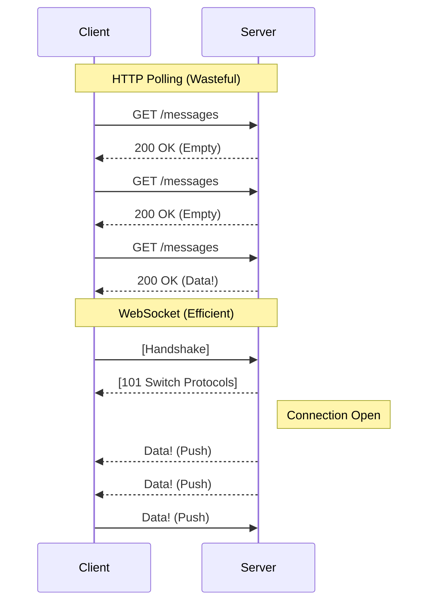

# WebSocket Deep Dive: The Real-Time Web

This document explores **WebSocket**, the protocol that enabled true real-time interaction on the web by breaking away from the strict Request-Response model of HTTP.

---

## 1. The Evolution: Why do we need it?

Before WebSockets (2011), the web was **passive**. A server could not speak unless spoken to. If you wanted to know "Did I get a new message?", you had to ask repeatedly.

### The Legacy Hacks

1.  **Short Polling**:
    *   *Client:* "Any news?" -> *Server:* "No."
    *   *Client (1s later):* "Any news?" -> *Server:* "No."
    *   *Problem:* Extremely wasteful. 99% of requests yield no data. bandwidth = wasted.
2.  **Long Polling**:
    *   *Client:* "Any news?" -> *Server:* ... (Waits 30s) ... "Yes!"
    *   *Problem:* Still relies on opening/closing HTTP connections. Heavy header overhead.

### The Solution: WebSocket
A single, long-lived TCP connection where **both sides can talk at any time**.



---

## 2. The Handshake: "Upgrading" HTTP

WebSockets don't start as WebSockets. They start as a standard HTTP 1.1 request. This allows them to bypass firewalls and load balancers that only understand HTTP.

### The Mechanism
1.  **Client Request:** "Hello Server, I speak HTTP, but I would like to **Upgrade** to `websocket`."
2.  **Server Response:** "Okay, I understand `websocket`. Let's switch."

### The Wire Protocol
```http
// Client Request
GET /chat HTTP/1.1
Host: example.com
Connection: Upgrade
Upgrade: websocket
Sec-WebSocket-Key: dGhlIHNhbXBsZSBub25jZQ==
Sec-WebSocket-Version: 13
```

```http
// Server Response
HTTP/1.1 101 Switching Protocols
Upgrade: websocket
Connection: Upgrade
Sec-WebSocket-Accept: s3pPLMBiTxaQ9kYGzzhZRbK+xOo=
```

*   **101 Switching Protocols**: The specific status code that tells the client "We are no longer speaking HTTP."
*   **Sec-WebSocket-Key/Accept**: A security challenge to prove the server genuinely understands WebSockets (and isn't just a confused echo server).

---

## 3. The Protocol Internals

Once the handshake is done, HTTP rules (headers, verbs, cookies) are gone. We are now exchanging raw **WebSocket Frames**.

### Features
1.  **Low Overhead**: The header is only **2 to 14 bytes** (compared to ~500+ bytes for HTTP headers).
2.  **Full Duplex**: Client and Server sends data independently.
3.  **Binary & Text**: Can send Strings (JSON) or Binary (Images/Protobuf).

### Security: Masking
*   **Rule:** All frames sent from **Client to Server** MUST be masked (XOR encryption).
*   **Why?** To prevent "Cache Poisoning" attacks on intermediate proxies.
*   **Server to Client**: Data is NOT masked.

### Frame Types (Opcodes)
The protocol uses specific "Opcodes" to define what the data is:
*   `0x1`: Text Frame.
*   `0x2`: Binary Frame.
*   `0x8`: **Close** (Polite disconnect).
*   `0x9`: **Ping** (Heartbeat).
*   `0xA`: **Pong** (Heartbeat response).

---

## 4. Use Cases

| Use Case | Why WebSocket? |
| :--- | :--- |
| **Chat Apps** (Slack, WhatsApp) | Instant message delivery without polling. |
| **Live Feeds** (Stock Tickers, Sports) | Low latency updates pushed from server. |
| **Collaboration** (Figma, Google Docs) | Sending mouse cursors and text diffs in real-time. |
| **Multiplayer Games** (Agar.io) | Syncing game state 60 times per second. |
| **System Alerts** | Pushing "Job Completed" notifications to dashboards. |

---

## 5. Production Best Practices

WebSockets are "Stateful" (the connection stays alive), which introduces problems that stateless HTTP doesn't have.

### A. The "Half-Open" Problem (Heartbeats)
*   **Scenario:** A user rips out their ethernet cable. The Server thinks the connection is still open and keeps writing data to a black hole.
*   **Solution:** **Heartbeats**.
    *   Server sends `PING` every 30s.
    *   If Client doesn't reply with `PONG`, Server kills the connection.

### B. Load Balancing (Sticky Sessions)
*   **Problem:** Client connects to Server A. Nginx is the Load Balancer.
    *   Request 1 (Handshake) -> Goes to **Server A**.
    *   The TCP connection is locked to Server A.
    *   You cannot "move" this connection to Server B.
*   **Scaling:** If you have 100k users, you need a **Redis Pub/Sub** backend so Server A can talk to users on Server B.

### C. Reconnection Logic
*   **Fact:** Mobile networks flake out. WiFi drops.
*   **Code:** Your client **MUST** have auto-reconnect logic.
*   **Strategy:** Use **Exponential Backoff** (Wait 1s, then 2s, then 4s...) to avoid hammering the server when it comes back up.

### D. Security (WSS)
*   Always use `wss://` (WebSocket Secure).
*   It encrypts the traffic using TLS (SSL), just like HTTPS.
*   Crucial because many proxies block non-encrypted WebSocket traffic on port 80.
