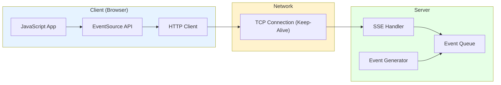
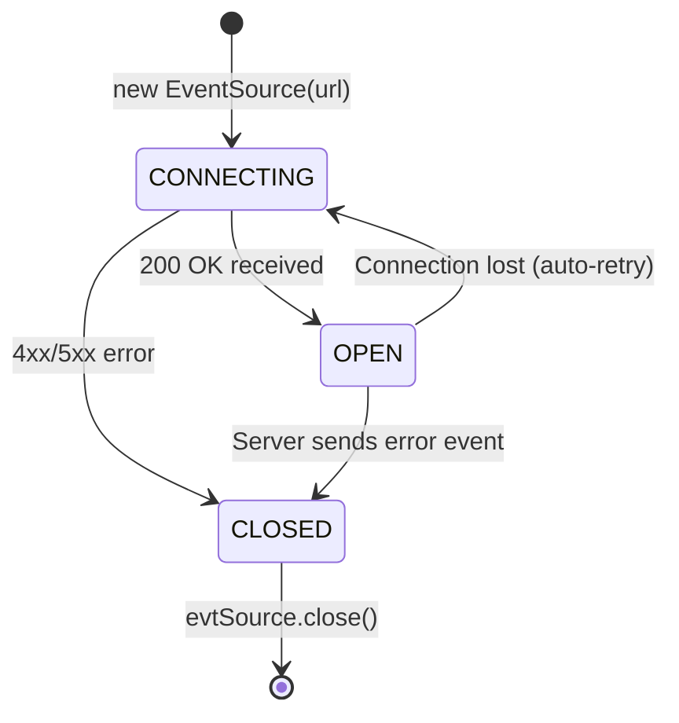

# Server-Sent Events (SSE): Unidirectional Push at Scale

## 1. Introduction

**Server-Sent Events (SSE)** is an HTTP-based protocol enabling servers to push real-time updates to clients over a single, long-lived connection. Unlike WebSocket's bidirectional complexity, SSE provides elegant simplicity for one-way data streams.

**Problem It Solves**: How do servers push real-time updates when:
- WebSocket's bidirectional nature is overkill
- HTTP polling wastes bandwidth (99% empty responses)
- Long-polling ties up server threads
- Simplicity and HTTP compatibility are priorities

**Key Differentiator**:
- **Unidirectional**: Server → Client only (perfect for feeds, notifications)
- **HTTP-Based**: Rides on standard HTTP, works through proxies/firewalls
- **Auto-Reconnect**: Built-in browser retry logic (no manual implementation)
- **Text-Only**: UTF-8 encoded data (JSON, plain text)
- **EventSource API**: Native browser support, zero dependencies

**Industry Adoption**:
-

 **AI Streaming**: ChatGPT, Claude, DeepSeek (token-by-token generation)
- **Live Feeds**: Twitter/X timelines, stock tickers, sports scores
- **Notifications**: Activity feeds, system alerts, build status
- **Analytics**: Real-time dashboards, monitoring systems

**Historical Context**:
- **2004**: Comet technique (hacks for server push)
- **2009**: HTML5 specification includes Server-Sent Events
- **2011**: All major browsers support EventSource API
- **2020s**: AI boom drives SSE adoption (LLM streaming)

**SSE vs Alternatives**:
| Aspect | SSE | WebSocket | HTTP Polling |
|:-------|:----|:----------|:-------------|
| **Direction** | Server → Client | Bidirectional | Client → Server → Client |
| **Overhead** | Low (HTTP headers once) | Lowest (2-14 bytes/message) |High (headers every request) |
| **Complexity** | Very Low | Medium | Low |
| **Reconnect** | Automatic | Manual | N/A (stateless) |
| **Browser Support** | 97% | 98% | 100% |

---

## 2. Core Architecture

SSE is fundamentally a long-lived HTTP GET request with streaming response.



### Key Components

**1. EventSource (Client)**:
- JavaScript API: `new EventSource(url)`
- State machine: CONNECTING → OPEN → CLOSED
- Automatic reconnection with exponential backoff
- Last-Event-ID tracking for resume

**2. SSE Handler (Server)**:
- Keeps HTTP response open indefinitely
- Sends events as text/event-stream
- Manages connection lifecycle
- Handles client disconnects

**3. Wire Protocol**:
- Format: `data: <payload>\n\n`
- Optional fields: `event:`, `id:`, `retry:`
- Double newline (`\n\n`) marks message end

**4. Reconnection Logic**:
- Browser automatically reconnects on disconnect
- Sends `Last-Event-ID` header to resume
- Exponential backoff (3s default, customizable)

---

## 3. How It Works: Protocol Mechanics

### A. Request-Response Flow

**Client Request**:
```http
GET /stream HTTP/1.1
Host: example.com
Accept: text/event-stream
Cache-Control: no-cache
```

**Server Response** (never closes):
```http
HTTP/1.1 200 OK
Content-Type: text/event-stream
Cache-Control: no-cache
Connection: keep-alive
X-Accel-Buffering: no

data: {"price": 100}\n\n

data: {"price": 102}\n\n

event: alert\ndata: Price spike!\n\n
```

---

### B. Message Format

**Simple Message**:
```
data: Hello World

```
(note the blank line)

**Multi-line Message**:
```
data: First line
data: Second line

```
Received as: `"First line\nSecond line"`

**Message with ID** (for resume):
```
id: 42
data: Important update

```
If client disconnects, reconnect sends: `Last-Event-ID: 42`

**Custom Event Type**:
```
event: userJoined
data: {"user": "Alice"}

```
Client:
```javascript
evtSource.addEventListener('userJoined', (e) => {
    const data = JSON.parse(e.data);
});
```

**Retry Configuration**:
```
retry: 5000

```
Sets client retry interval to 5 seconds

---

### C. Connection Lifecycle



---

## 4. Deep Dive: Implementation Details

### A. Server-Side Streaming (Python FastAPI)

```python
import asyncio
from fastapi import FastAPI
from fastapi.responses import StreamingResponse

app = FastAPI()

async def event_generator():
    for i in range(10):
        # Simulate event generation
        await asyncio.sleep(1)
        
        # SSE format: data: <payload>\n\n
        yield f"id: {i}\n"
        yield f"data: Event {i}\n\n"

@app.get("/stream")
async def stream():
    return StreamingResponse(
        event_generator(),
        media_type="text/event-stream",
        headers={
            "Cache-Control": "no-cache",
            "X-Accel-Buffering": "no",  # Nginx: disable buffering
        }
    )
```

---

### B. Client-Side Consumption

```javascript
const evtSource = new EventSource('/stream');

// Default 'message' event
evtSource.onmessage = (event) => {
    console.log('Data:', event.data);
    console.log('ID:', event.lastEventId);
};

// Custom events
evtSource.addEventListener('alert', (event) => {
    console.log('Alert:', event.data);
});

// Connection opened
evtSource.onopen = () => {
    console.log('Connected');
};

// Connection error/closed
evtSource.onerror = (err) => {
    console.error('Error:', err);
    // Browser automatically retries
};

// Manual close
evtSource.close();
```

---

### C. Resume After Disconnect

**Server**:
```python
from fastapi import Request

@app.get("/stream")
async def stream(request: Request):
    last_event_id = request.headers.get("Last-Event-ID")
    start_from = int(last_event_id) + 1 if last_event_id else 0
    
    async def generator():
        for i in range(start_from, 100):
            yield f"id: {i}\ndata: Event {i}\n\n"
            await asyncio.sleep(1)
    
    return StreamingResponse(generator(), media_type="text/event-stream")
```

**Client**: Automatic! Browser sends `Last-Event-ID` header on reconnect.

---

### D. AI Token Streaming (ChatGPT-style)

**Server**:
```python
async def ai_token_stream(prompt: str):
    # Simulate LLM token generation
    tokens = ["The", "quick", "brown", "fox", "jumps"]
    
    for token in tokens:
        await asyncio.sleep(0.05)  # 50ms per token
        yield f"data: {json.dumps({'token': token})}\n\n"
    
    # Signal completion
    yield "data: [DONE]\n\n"

@app.post("/chat")
async def chat(prompt: str):
    return StreamingResponse(
        ai_token_stream(prompt),
        media_type="text/event-stream"
    )
```

**Client**:
```javascript
const evtSource = new EventSource(`/chat?prompt=${encodeURIComponent(userPrompt)}`);

evtSource.onmessage = (event) => {
    if (event.data === '[DONE]') {
        evtSource.close();
        return;
    }
    
    const {token} = JSON.parse(event.data);
    document.getElementById('output').textContent += token + ' ';
};
```

---

## 5. End-to-End Walkthrough: Stock Ticker

**Scenario**: Real-time stock price updates

### Step 1: Connection Establishment (t=0ms)
```
Browser: new EventSource('https://api.example.com/stocks/AAPL')

HTTP Request:
GET /stocks/AAPL HTTP/1.1
Accept: text/event-stream

Server Response:
HTTP/1.1 200 OK
Content-Type: text/event-stream
Connection: keep-alive

Total: 50ms RTT (TCP + TLS + request)
```

### Step 2: Server Pushes Price (t=1000ms)
```
Server detects price change: $150.00 → $150.25

Server writes to response stream:
id: 1001
data: {"symbol": "AAPL", "price": 150.25, "time": "14:30:00"}

Client receives onmessage event after 51ms (50ms RTT + 1ms processing)
```

### Step 3: Browser Updates UI (t=1051ms)
```
JavaScript:
evtSource.onmessage = (e) => {
    const {price} = JSON.parse(e.data);
    document.getElementById('price').textContent = `$${price}`;
};
```

### Step 4: Network Glitch (t=5000ms)
```
WiFi drops for 2 seconds

Browser detects connection closed (TCP FIN)
Browser automatically waits 3s (retry interval)
Browser reconnects at t=10000ms

Reconnect request:
GET /stocks/AAPL HTTP/1.1
Accept: text/event-stream
Last-Event-ID: 1001  ← Resume from here!

Server resumes from ID 1002 onwards
```

---

## 6. Failure Scenarios

### Scenario A: Proxy Buffering

**Symptom**: No events received for 60 seconds, then all at once

**Cause**: Nginx/Apache buffers response before sending to client

#### The Fix

**Nginx configuration**:
```nginx
location /stream {
    proxy_pass http://backend;
    proxy_set_header Connection '';
    proxy_http_version 1.1;
    chunked_transfer_encoding off;
    proxy_buffering off;  # Critical!
    proxy_cache off;
}
```

**Server headers**:
```python
return StreamingResponse(
    generator(),
    media_type="text/event-stream",
    headers={
        "X-Accel-Buffering": "no",  # Nginx-specific
        "Cache-Control": "no-cache", 
    }
)
```

---

### Scenario B: Memory Leak (Infinite Streams)

**Symptom**: Server memory grows unbounded

**Cause**: Client disconnects, but server keeps generating events

#### The Fix

**Detect client disconnect**:
```python
from fastapi import Request

@app.get("/stream")
async def stream(request: Request):
    async def generator():
        for i in range(1000000):  # "Infinite" stream
            # Check if client disconnected
            if await request.is_disconnected():
                break
            
            yield f"data: Event {i}\n\n"
            await asyncio.sleep(1)
    
    return StreamingResponse(generator(), media_type="text/event-stream")
```

---

### Scenario C: CORS Preflight

**Symptom**: EventSource fails with CORS error in browser console

**Cause**: Cross-origin requests require CORS headers

#### The Fix

**Server CORS configuration**:
```python
from fastapi.middleware.cors import CORSMiddleware

app.add_middleware(
    CORSMiddleware,
    allow_origins=["https://example.com"],
    allow_methods=["GET"],
    allow_headers=["Last-Event-ID"],
)
```

**Note**: EventSource doesn't support custom headers (no Authorization), use query params or cookies

---

## 7. Performance Tuning / Scaling

### Configuration Table

| Configuration | Recommended | Why? |
|:--------------|:------------|:-----|
| **Retry Interval** | 3-5 seconds | Balance reconnect speed vs server load |
| **HTTP Keep-Alive** | 300 seconds | Prevent connection drops |
| **TCP Keep-Alive** | Enabled | Detect dead connections |
| **Max Connections** | 10,000-50,000 | Based on RAM (5KB/conn) |
| **Compression** | Disabled | Breaks streaming (buffers until compress) |
| **Proxy Buffering** | Disabled | Enables real-time delivery |
| **heartbeat Interval** | 15-30 seconds | Keep connection alive through NAT/firewalls |
| **Message Size** | <4KB | Large messages cause blocking |

### Scaling Strategies

**1. Horizontal Scaling (Redis Pub/Sub)**:
```python
import redis.asyncio as redis

pubsub = redis.pubsub()
await pubsub.subscribe('stock_updates')

async def stream_from_redis():
    async for message in pubsub.listen():
        if message['type'] == 'message':
            yield f"data: {message['data']}\n\n"
```

**2. Heartbeat (Keep Connection Alive)**:
```python
async def stream_with_heartbeat():
    last_event = time.time()
    
    while True:
        if has_new_event():
            yield f"data: {get_event()}\n\n"
            last_event = time.time()
        elif time.time() - last_event > 15:
            yield ":heartbeat\n\n"  # Comment (ignored by client)
            last_event = time.time()
        
        await asyncio.sleep(0.1)
```

---

## 8. Constraints & Limitations

| Constraint | Limit | Why? |
|:-----------|:------|:-----|
| **Unidirectional** | Server → Client only | Client can't send via same connection |
| **Text Only** | UTF-8 strings | No binary data support |
| **No Custom Headers** | Can't set Authorization | EventSource API limitation |
| **Browser Limit** | 6 connections/domain | HTTP/1.1 limitation |
| **No IE Support** | Polyfill needed | Internet Explorer never supported SSE |
| **Compression** | Not recommended | Breaks streaming (buffering) |
| **Max Message Size** | Practical limit ~64KB | Large messages block event loop |

---

## 9. When to Use SSE?

| Use Case | Verdict | Why? |
|:---------|:--------|:-----|
| **AI Streaming** | ✅ **YES** | Token-by-token generation (ChatGPT, Claude) |
| **Live Feeds** | ✅ **YES** | News, social media, stock tickers |
| **Notifications** | ✅ **YES** | Activity feed, alerts, build status |
| **Real-Time Analytics** | ✅ **YES** | Dashboards, monitoring systems |
| **Chat App** | ❌ **NO** | Need bidirectional (use WebSocket) |
| **File Transfer** | ❌ **NO** | Binary data unsupported |
| **Gaming** | ❌ **NO** | Need low latency bidirectional (WebSocket) |

### SSE vs Alternatives

| Protocol | Latency | Bidirectional | Browser Support | Use Case |
|:---------|:--------|:--------------|:----------------|:---------|
| **SSE** | 50-200ms | No | 97% | Live feeds, AI streaming |
| **WebSocket** | 1-50ms | Yes | 98% | Chat, collaboration |
| **HTTP/2 Push** | 50-100ms | No | 95% | Resource hints (not events) |
| **Long Polling** | 500-5000ms | No | 100% | Legacy |

---

## 10. Production Checklist

1. [ ] **Disable proxy buffering** (Nginx: `proxy_buffering off`): Enable real-time delivery
2. [ ] **Set retry interval** client-side (`retry: 3000`): Balance reconnect speed vs load
3. [ ] **Implement heartbeat** (every 15-30s): Keep connections alive through NAT
4. [ ] **Detect client disconnect** (`request.is_disconnected()`): Prevent memory leaks
5. [ ] **Use Last-Event-ID** for resume: Enable seamless reconnection
6. [ ] **Set Cache-Control: no-cache**: Prevent caching layers from buffering
7. [ ] **Monitor connection count**: Alert if > 80% capacity
8. [ ] **CORS configuration**: Allow cross-origin EventSource requests
9. [ ] **TCP keep-alive enabled**: Detect dead connections at OS level
10. [ ] **Limit message size** (<4KB): Prevent event loop blocking

**Critical Metrics**:

```
# Connection Metrics
sse_connections_active:
  Current SSE connections
  Alert if > 80% of max

sse_connection_duration_seconds:
  p50 > 300s (long-lived connections are good)

# Throughput Metrics
sse_messages_sent_total:
  rate(5m) - event push rate

sse_bytes_sent_total:
  Bandwidth usage monitoring

# Error Metrics
sse_errors_total{type="disconnect|timeout"}:
  < 5% error rate

sse_reconnects_total:
  High rate indicates network issues

# Performance Metrics
sse_message_latency_seconds:
  Time from event generation to client receive
  p50 < 0.1s, p99 < 0.5s

sse_heartbeat_sent_total:
  Heartbeat frequency (every 15-30s)
```

---

**Conclusion**: SSE provides elegant simplicity for server-to-client push using standard HTTP. Its automatic reconnection and Last-Event-ID resume make it ideal for AI streaming, live feeds, and notifications. When bidirectional communication isn't needed, SSE is simpler and more robust than WebSocket.
