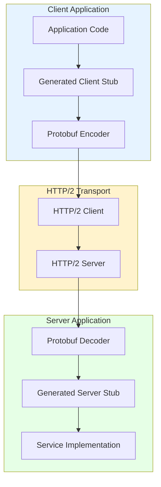

# gRPC Deep Dive: Binary RPC for Modern Microservices

## 1. Introduction

**gRPC** (gRPC Remote Procedure Call) is a high-performance, open-source RPC framework created by Google. It enables developers to call methods on remote servers as if they were local functions, using Protocol Buffers for serialization and HTTP/2 for transport.

**Problem It Solves**: How do microservices communicate efficiently when:
- JSON is too verbose and slow to parse
- REST lacks type safety and contracts
- Network overhead matters at scale
- Multiple language support is required

**Key Differentiator**:
- **Binary Protocol**: Protocol Buffers (10x smaller than JSON)
- **HTTP/2 Native**: Multiplexing, streaming, header compression
- **Strong Typing**: Compile-time checked contracts
- **Code Generation**: Auto-generate client/server code from `.proto` files
- **4 Communication Patterns**: Unary, server streaming, client streaming, bidirectional

**Industry Adoption**:
- **Netflix**: Microservice mesh (thousands of services)
- **Uber**: Inter-service communication
- **Google**: Internal infrastructure (everything)
- **Square**: Payment processing
- **Spotify**: Backend services

**Historical Context**:
- **2000s**: Google develops Stubby (internal RPC)
- **2015**: gRPC open-sourced (based on Stubby learnings)
- **2017**: CNCF adoption (Cloud Native Computing Foundation)
- **2020**: gRPC 1.0 standardization

**gRPC vs REST**:
| Aspect | gRPC | REST |
|:-------|:-----|:-----|
| **Protocol** | Binary (Protobuf) | Text (JSON) |
| **Transport** | HTTP/2 (required) | HTTP/1.1 or HTTP/2 |
| **Contract** | Required (`.proto`) | Optional (OpenAPI) |
| **Performance** | High (binary, multiplexed) | Medium (text, serialized) |
| **Browser Support** | Limited (needs gRPC-Web) | Native |
| **Streaming** | Native (4 patterns) | Limited (SSE) |

---

## 2. Core Architecture

gRPC builds on three pillars: Protocol Buffers (data), HTTP/2 (transport), and code generation (tooling).



### Key Components

**1. Protocol Buffers (.proto files)**:
- Interface Definition Language (IDL)
- Defines services and messages
- Language-agnostic contracts
- Versioning support (field numbers)

**2. Compiler (protoc)**:
- Reads `.proto` files
- Generates code for target languages
- Creates stubs (client) and skeletons (server)
- Type-safe method signatures

**3. Client Stub**:
- Local proxy for remote service
- Serializes request to binary
- Manages HTTP/2 connection
- Deserializes response

**4. Server Stub**:
- Receives binary request
- Deserializes to typed object
- Calls service implementation
- Serializes response to binary

**5. HTTP/2 Transport**:
- Multiplexed streams (no HOL blocking)
- Binary framing
- Header compression (HPACK)
- Flow control

---

## 3. How It Works: RPC Mechanics

### A. The Contract (.proto Definition)

**Step 1**: Define service interface
```
service Calculator {
  rpc Add (AddRequest) returns (AddResponse);
  rpc StreamResults (Request) returns (stream Result);
}

message AddRequest {
  int32 a = 1;
  int32 b = 2;
}

message AddResponse {
  int32 sum = 1;
}
```

**Key Concepts**:
- **Service**: Collection of RPC methods
- **Message**: Structured data (like a class/struct)
- **Field Numbers** (1, 2): Wire format encoding (never change!)
- **Types**: int32, string, bool, repeated (arrays), map

---

### B. Code Generation Flow

**Step 2**: Compile `.proto` → Code

**Command**:
```
protoc --python_out=. --grpc_python_out=. calculator.proto
```

**Output**:
- `calculator_pb2.py`: Message classes (AddRequest, AddResponse)
- `calculator_pb2_grpc.py`: Stub and Servicer base classes

**What Gets Generated**:
1. **Message Classes**: With getters/setters, serialization methods
2. **Client Stub**: Methods matching service definition
3. **Server Servicer**: Base class to implement
4. **Serializers**: Binary encoding/decoding logic

---

### C. Communication Patterns

**Pattern 1: Unary RPC** (Request-Response)
```
Step 1: Client creates request object
Step 2: Stub serializes to binary (Protobuf)
Step 3: HTTP/2 POST to /service.Method
Step 4: Server deserializes request
Step 5: Server executes logic
Step 6: Server serializes response
Step 7: HTTP/2 response stream
Step 8: Client deserializes response

Timeline: 1 request → 1 response (like REST)
```

**Pattern 2: Server Streaming**
```
Step 1: Client sends single request
Step 2: Server sends multiple responses (stream)
Step 3: Server signals end of stream
Step 4: Connection closes

Use Case: Database query returning many rows
```

**Pattern 3: Client Streaming**
```
Step 1: Client sends multiple requests (stream)
Step 2: Server receives all, processes batch
Step 3: Server sends single response
Step 4: Connection closes

Use Case: File upload in chunks
```

**Pattern 4: Bidirectional Streaming**
```
Step 1: Client and server both send streams
Step 2: Independent read/write (full duplex)
Step 3: Either side can close

Use Case: Chat, real-time collaboration
```

---

## 4. Deep Dive: Protocol Buffers Encoding

### A. Wire Format (Binary Encoding)

**Scenario**: Encode `AddRequest { a: 5, b: 10 }`

**Step 1**: Field encoding
```
Field 1 (a = 5):
  Tag: (field_number << 3) | wire_type = (1 << 3) | 0 = 8
  Value: 5
  Bytes: [0x08, 0x05]

Field 2 (b = 10):
  Tag: (2 << 3) | 0 = 16
  Value: 10
  Bytes: [0x10, 0x0A]
```

**Final Binary**: `[0x08, 0x05, 0x10, 0x0A]` = 4 bytes total

**JSON Equivalent**: `{"a": 5, "b": 10}` = 19 bytes (4.75x larger!)

---

### B. Backward Compatibility

**Scenario**: Add optional field to existing message

**Old Version**:
```
message User {
  string name = 1;
}
```

**New Version**:
```
message User {
  string name = 1;
  string email = 2;  // New field
}
```

**Compatibility Rules**:
1. **Old client → New server**: Server sees `email` missing, uses default (empty string)
2. **New client → Old server**: Server doesn't recognize field 2, ignores it
3. **Result**: No crashes, graceful degradation

**CRITICAL RULE**: Never reuse field numbers!

---

## 5. End-to-End Walkthrough: Microservice Call

**Scenario**: Service A calls Service B's `GetUser` method

### Step 1: Client Stub Invocation (t=0ms)
```
Application code:
  user = stub.GetUser(user_id=123)

Stub creates request:
  message = GetUserRequest { user_id: 123 }
```

### Step 2: Protobuf Serialization (t=0.1ms)
```
Encoder converts message to binary:
  Field 1 (user_id): [0x08, 0x7B]  // 123 in varint
  
Total: 2 bytes
```

### Step 3: HTTP/2 Frame Creation (t=0.2ms)
```
HTTP/2 HEADERS frame:
  :method = POST
  :scheme = https
  :path = /userservice.UserService/GetUser
  :authority = service-b.internal
  content-type = application/grpc+proto
  grpc-timeout = 5000m  // 5 second deadline

HTTP/2 DATA frame:
  Length-Prefixed Message: [0x00, 0x00, 0x00, 0x00, 0x02, 0x08, 0x7B]
    Compression flag: 0x00 (none)
    Length: 0x00000002 (2 bytes)
    Payload: [0x08, 0x7B]
```

### Step 4: Network Transmission (t=0.2ms - 50ms)
```
TCP packet sent over established HTTP/2 connection
RTT: 50ms
```

### Step 5: Server Receives HTTP/2 Frame (t=50ms)
```
HTTP/2 server parses frame
Extracts path: /userservice.UserService/GetUser
Routes to registered handler
```

### Step 6: Protobuf Deserialization (t=50.1ms)
```
Decoder reads binary:
  Field 1: user_id = 123
  
Creates GetUserRequest object
```

### Step 7: Service Logic Execution (t=50.2ms)
```
Server implementation:
  def GetUser(request):
    user = database.query("SELECT * FROM users WHERE id = ?", request.user_id)
    return GetUserResponse(name=user.name, email=user.email)

Database query: 10ms
```

### Step 8: Response Serialization (t=60.2ms)
```
Encode GetUserResponse to binary:
  Field 1 (name): [0x0A, 0x05, 'A', 'l', 'i', 'c', 'e']
  Field 2 (email): [0x12, 0x0F, 'a', 'l', 'i', 'c', 'e', '@', 'e', 'x', ...]
  
Total: 28 bytes
```

### Step 9: HTTP/2 Response (t=60.3ms)
```
HEADERS frame:
  :status = 200
  grpc-status = 0  // OK
  
DATA frame:
  Length-Prefixed: [0x00, 0x00, 0x00, 0x00, 0x1C, ...]
  
Network transmission: 50ms RTT
```

### Step 10: Client Receives Response (t=110.3ms)
```
Client stub deserializes response
Returns GetUserResponse object to application

Total latency: 110ms
```

---

## 6. Failure Scenarios

### Scenario A: Deadline Exceeded

**Symptom**: Client receives `DEADLINE_EXCEEDED` error

**Mechanism**:
```
t=0ms: Client sets deadline (timeout=500ms)
t=0ms: Request sent with grpc-timeout: 500m header

t=300ms: Server receives request, starts processing
t=400ms: Database query slow (200ms remaining)
t=600ms: Server finishes, attempts to send response

Server checks: current_time (600ms) > deadline (500ms)
Server discards work, sends grpc-status: 4 (DEADLINE_EXCEEDED)

Client: Timeout error, no result
```

**Fix**:
1. Increase timeout for slow operations
2. Implement cascading deadlines (subtract time already spent)
3. Add timeout monitoring/alerting

---

### Scenario B: Schema Evolution Breaking Change

**Symptom**: Client/server incompatible, parsing errors

**Cause**: Changed field type

**Mechanism**:
```
Old schema:
  message User {
    int32 age = 1;
  }

Bad change:
  message User {
    string age = 1;  // Changed type! BREAKS COMPATIBILITY
  }

Result:
  Old client sends: field 1, wire_type=0 (varint), value=25
  New server expects: field 1, wire_type=2 (length-delimited string)
  Server error: Wire type mismatch, parsing fails
```

**Fix**:
1. Never change field types
2. Add new field instead: `string age_string = 2`
3. Deprecate old field (`reserved 1`)

---

### Scenario C: Load Balancing Connection Affinity

**Symptom**: Uneven load distribution, some servers idle

**Cause**: HTTP/2 connection reuse

**Mechanism**:
```
Client creates 1 HTTP/2 connection to load balancer
Load balancer routes connection to Backend Server 1

All requests (1000/s) use same connection
Result: Server 1 handles 1000 req/s, Servers 2-10 idle

Problem: HTTP/2 connection-level load balancing, not request-level
```

**Fix**:
1. Client-side load balancing (gRPC DNS resolver)
2. Proxy with stream-level balancing (Envoy, Linkerd)
3. Connection pooling (multiple connections to spread load)

---

## 7. Performance Tuning / Scaling

### Configuration Table

| Configuration | Recommended | Why? |
|:--------------|:------------|:-----|
| **Max Message Size** | 4-16 MB | Prevent memory exhaustion |
| **HTTP/2 Max Streams** | 100-1000 | Balance concurrency vs overhead |
| **Connection Timeout** | 60-120s | Long-lived for multiplexing |
| **Deadline (per-call)** | 1-30s | Prevent hanging requests |
| **Keep-Alive Ping** | 20s | Detect dead connections |
| **Keep-Alive Timeout** | 10s | Fast connection cleanup |
| **Compression** | gzip (level 6) | 30-50% size reduction (CPU cost) |
| **Connection Pool** | 3-10 connections | Load distribution |
| **Max Concurrent Streams** | 100 (client) | Backpressure control |
| **Retry Policy** | Exponential backoff | Avoid retry storms |

### Scaling Patterns

**1. Connection Pooling**:
```
Problem: Single HTTP/2 connection limits throughput

Solution: Create multiple connections
  Connection 1: Handles streams 1, 3, 5... (odd)
  Connection 2: Handles streams 2, 4, 6... (even)
  
Result: 2x parallelism, better load distribution
```

**2. Client-Side Load Balancing**:
```
Step 1: DNS returns multiple IPs (server1, server2, server3)
Step 2: Client maintains connection pool (1 conn per server)
Step 3: Round-robin requests across connections
Step 4: Health checking removes failed servers from pool

Result: Request-level load balancing, not connection-level
```

**3. Streaming for Large Datasets**:
```
Instead of: Single 100MB response (blocks for 10s)

Use server streaming:
  Step 1: Client sends request
  Step 2: Server streams 100 x 1MB chunks
  Step 3: Client processes chunks as they arrive
  
Result: First chunk at 100ms, progressive rendering
```

---

## 8. Constraints & Limitations

| Constraint | Limit | Why? |
|:-----------|:------|:-----|
| **HTTP/2 Required** | No HTTP/1.1 support | Binary framing needed |
| **Browser Support** | Limited (needs gRPC-Web + proxy) | Browsers don't expose HTTP/2 frames API |
| **Message Size** | 4MB default, 64MB max | Protobuf performance degrades |
| **Field Numbers** | 1-536,870,911 | Protocol buffer encoding limit |
| **Debugging Difficulty** | Tools needed (grpcurl) | Binary format, not curl-friendly |
| **Learning Curve** | Steeper than REST | Protobuf, code generation, tooling |
| **Network Traversal** | Firewalls may block | Non-standard HTTP/2 usage |

---

## 9. When to Use gRPC?

| Use Case | Verdict | Why? |
|:---------|:--------|:-----|
| **Microservices (internal)** | ✅ **YES** | Performance, type safety, streaming |
| **Mobile → Backend** | ✅ **YES** | Bandwidth savings (binary), offline sync |
| **Public API** | ❌ **NO** | REST/GraphQL better for developers |
| **Browser Web App** | ❌ **NO** | Limited support, needs gRPC-Web |
| **IoT Devices** | ⚠️ **MAYBE** | Good if HTTP/2 supported, else MQTT better |
| **Real-time Streaming** | ✅ **YES** | Bidirectional streaming native |

### gRPC vs Alternatives

| Protocol | Performance | Type Safety | Browser | Use Case |
|:---------|:------------|:------------|:--------|:---------|
| **gRPC** | Highest | Strong | No | Microservices |
| **REST** | Medium | Weak (OpenAPI) | Yes | Public APIs |
| **GraphQL** | Medium | Strong | Yes | Flexible queries |
| **Thrift** | High | Strong | No | Legacy systems |

---

## 10. Production Checklist

1. [ ] **Define `.proto` schemas** with versioning rules: Never change field numbers
2. [ ] **Set deadlines** on all calls (1-30s): Prevent hanging requests
3. [ ] **Enable keep-alive pings** (20s interval): Detect dead connections
4. [ ] **Configure retries** with exponential backoff: Handle transient failures
5. [ ] **Use client-side load balancing**: Request-level distribution
6. [ ] **Monitor RPC latency** (p50, p99): Detect slow services
7. [ ] **Set max message size** (4-16MB): Prevent memory exhaustion
8. [ ] **Enable compression** (gzip level 6): 30-50% bandwidth reduction
9. [ ] **Implement health checks**: `/grpc.health.v1.Health/Check`
10. [ ] **Use TLS** in production: Encrypt service-to-service traffic

**Critical Metrics**:

```
grpc_requests_total{method, status}:
  Success rate by RPC method
  
grpc_request_duration_seconds{method}:
  p50 < 0.1s, p99 < 0.5s

grpc_deadlines_exceeded_total:
  Timeout rate (should be < 1%)
  
grpc_message_size_bytes{direction="sent|received"}:
  Monitor payload sizes
  
grpc_connections_active:
  Connection pool utilization
  
grpc_streams_active:
  Concurrent stream count (max 100-1000)
```

---

**Conclusion**: gRPC provides high-performance RPC with strong types, efficient binary encoding, and native streaming. Its HTTP/2 foundation enables multiplexing and low latency. Best suited for internal microservice communication where performance and type safety outweigh REST's simplicity.
