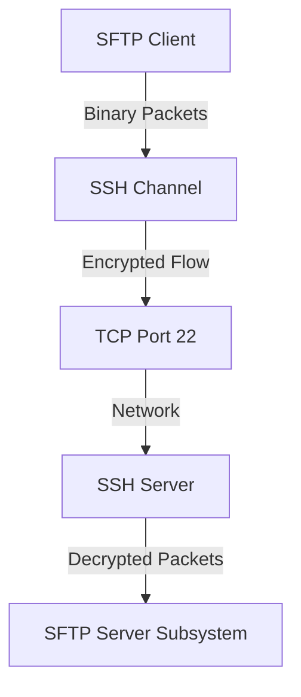

# SFTP: The SSH File Transfer Protocol

**Stop right there.** If you think SFTP is just "FTP with SSL", you are wrong. That is FTPS.

**SFTP** (SSH File Transfer Protocol) is a completely different beast. It is a binary protocol that runs inside an **SSH Tunnel**. It has nothing to do with the old `RFC 959` FTP protocol.

---

## 1. The Architecture: SSH Subsystem

SFTP is not a standalone protocol. It is a **Subsystem** of SSH.

### The Stack


1.  **Transport:** It uses the same TCP connection (Port 22) as your terminal shell.
2.  **Multiplexing:** You can have an open terminal (`bash`) and a file transfer (`sftp`) running over the *same* TCP connection simultaneously.
3.  **Security:** Since it runs over SSH, it gets strong encryption and authentication (Keys/Passwords) for free.

---

## 2. The Protocol: Binary RPC

Unlike FTP (which is text-based: `USER`, `PASS`, `RETR`), SFTP is **Binary**. It works like a Remote Procedure Call (RPC).

### The General Packet Format
Every packet starts with a standard header:
```text
uint32    length        (Total size of packet)
byte      type          (Opcode: OPEN, READ, DATA...)
uint32    request_id    (To match Request <-> Response)
byte[]    payload       (The arguments)
```

### Example: Opening a File (`SSH_FXP_OPEN`)
**Client sends:**
*   **Type:** `SSH_FXP_OPEN` (3)
*   **ID:** 101
*   **Path:** "/home/user/data.txt"
*   **Flags:** Read/Write

**Server responds:**
*   **Type:** `SSH_FXP_HANDLE` (102)
*   **ID:** 101
*   **Handle:** "A7 3F" (An opaque string identifying the open file)

---

## 3. The Comparison: SFTP vs FTP vs FTPS

This is the most common interview question in file transfer.

| Feature | FTP (Legacy) | FTPS (FTP + SSL) | SFTP (SSH) |
| :--- | :--- | :--- | :--- |
| **Origin** | RFC 959 (1985) | RFC 2228 (1997) | SecSH (2006) |
| **Ports** | **21** (Control) + **Random** (Data) | **990** or **21** + **Random** | **22** (Single Port) |
| **Firewall** | 💀 **Nightmare**. Needs ALG or Passive Mode. | 😓 **Hard**. Random ports are encrypted. | 😎 **Easy**. Just allow Port 22. |
| **Encryption** | None (Plaintext!) | TLS (Explicit or Implicit) | SSH Tunnel |
| **Engine** | Text Commands (`RETR`, `STOR`) | Text Commands | Binary Packets |

**Why SFTP wins:**
It only needs **Port 22**. Firewall admins love this. You don't need to open a range of 1000 passive ports like you do for FTPS.

---

## 4. Performance: The Latency Trap

Because SFTP is Request-Response (Stop-and-Wait), it is very sensitive to **Latency**.

*   **Bad Client:** Sends `READ` -> Waits for Data -> Sends `READ` -> ...
    *   *Result:* 50ms latency = Max 20 packets per second. Slow!
*   **Good Client:** Uses **Pipelining**. It sends 100 `READ` requests at once without waiting.
    *   *Result:* Maximizes throughput by filling the pipe.

---

## summary
*   **SFTP** runs inside SSH.
*   **FTPS** is FTP wrapped in SSL.
*   **SFTP** is binary and firewall-friendly (Port 22).
*   **Performance** depends heavily on pipelining requests.
