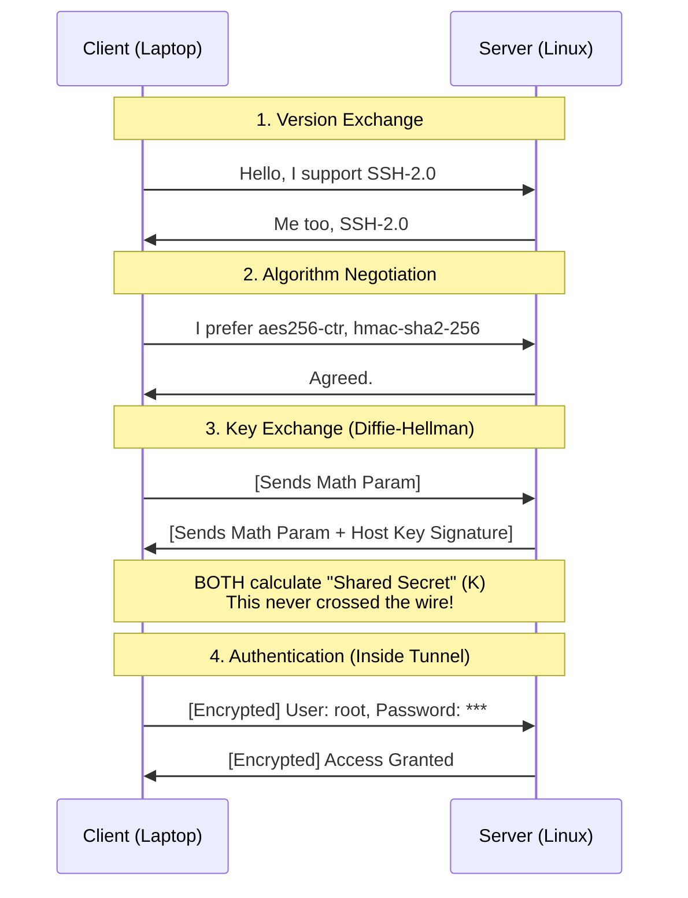

# SSH (Secure Shell): The Encrypted Tunnel

Before SSH (1995), the internet was naked. Admins used **Telnet**, where your root password flew across the network in plaintext.

**SSH** solved this by creating an **Encrypted Tunnel** *before* you even try to log in.

---

## 1. The 4-Stage Handshake (The "Magic")

How do two computers that have never met agree on a secret encryption key over an open, hostile network?

### The Sequence

---

## 2. Key Exchange: The "Shared Secret"

The most important part is Step 3 (Diffie-Hellman).
1.  They exchange "Public variables" (colors mixed with a secret).
2.  Through a mathematical property, they both derive the **Same Final number** (The session key).
3.  **An eavesdropper** seeing all traffic *cannot* calculate this number.

Once this key is generated, the **Tunnel is active**. All subsequent traffic is encrypted with AES/ChaCha20.

---

## 3. Public Key Authentication (`id_rsa`)

Why is this better than a password?
*   **Password:** You send the secret string to the server. If the server is hacked or fake, they have your password.
*   **Public Key:** You NEVER send your private key.

**How it works:**
1.  **Setup:** You put `id_rsa.pub` (Public Lock) on the server (`~/.ssh/authorized_keys`).
2.  **Login:**
    *   Server: "Oh, you are user `alice`? I see your Public Lock here. I am encrypting a random challenge with it."
    *   Client (Laptop): "Easy. I decrypted it with my Private Key. Here is the answer."
    *   Server: "Correct. Come on in."

**Proof in the pudding:** The private key never left your RAM.

---

## 4. SSH is a Multiplexer

SSH is not just a black screen with text. It is a container for **Channels**.

A single TCP connection (Port 22) supports multiple logic streams:
1.  **Channel 0:** Interactive Shell (`bash`).
2.  **Channel 1:** SFTP File Transfer.
3.  **Channel 2:** X11 Forwarding (GUI Apps).
4.  **Channel 3:** Port Forwarding (`-L 8080:localhost:80`).

This is why `sftp` has no "Connect" button. It just piggybacks on the existing SSH capability.
