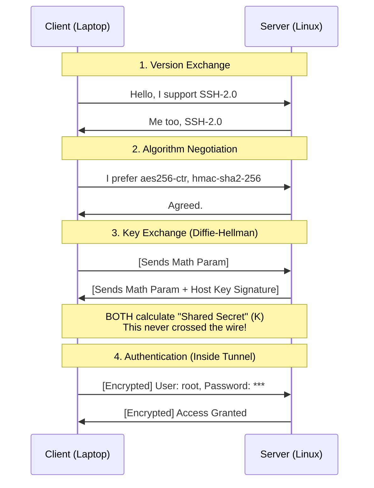

# SSH (Secure Shell): The Encrypted Tunnel

Before SSH (1995), the internet was naked. Admins used **Telnet**, where your root password flew across the network in plaintext.

**SSH** solved this by creating an **Encrypted Tunnel** *before* you even try to log in.

---

## 1. The 4-Stage Handshake (The "Magic")

How do two computers that have never met agree on a secret encryption key over an open, hostile network?

### The Sequence

---

## 2. Wait, why Diffie-Hellman? Why not just use TLS?
You asked: *"Why do we need this 'Diffie-Hellman' math? Can't we just use a standard secure protocol like **TLS**?"*

**1. TLS *uses* Diffie-Hellman!**
This is the key distinction:
*   **Diffie-Hellman** is the **Algorithm** (The Math).
*   **TLS** is the **Protocol** (The Wrapper).

You cannot "replace" Diffie-Hellman with TLS, because TLS *depends* on Diffie-Hellman to generate its keys (specifically `ECDHE` - Elliptic Curve Diffie-Hellman).

**2. Why does SSH strictly define its own protocol?**
*   **History:** SSH (1995) was invented before TLS (1999) became the universal standard.
*   **Purpose:**
    *   **TLS** is designed to verify **Servers** (Is this really google.com?).
    *   **SSH** is designed to verify **Users** (Are you really `root`?).
    *   SSH includes built-in Multiplexing (SFTP, Tunnels) which TLS does not have.

**Summary:** Both SSH and HTTPS are cousins. They **both** use Diffie-Hellman to create the secret key.

---

## 3. Key Exchange: The "Shared Secret" (Diffie-Hellman)

How do two people who have never met agree on a secret key, while everyone is listening?
This is the **Diffie-Hellman (DH)** algorithm.

### The Analogy: Mixing Paint 🎨

Imagine Alice and Bob are in a public room. Eve is watching everything.

1.  **Public Color (Yellow):** They agree on a Common Color. *Eve sees Yellow.*
2.  **Private Colors:**
    *   Alice picks **Red** (Secret).
    *   Bob picks **Blue** (Secret).
    *   *Eve sees nothing.*
3.  **The Mix:**
    *   Alice mixes Yellow + Red = **Orange**.
    *   Bob mixes Yellow + Blue = **Green**.
4.  **The Exchange:**
    *   Alice sends **Orange** to Bob. *Eve sees Orange.*
    *   Bob sends **Green** to Alice. *Eve sees Green.*
5.  **The Final Secret:**
    *   Alice takes Bob's **Green** + adds her **Red** = **Brown**.
    *   Bob takes Alice's **Orange** + adds his **Blue** = **Brown**.

**Result:** Both have **Brown** (The Shared Secret).
**Eve's Problem:** She has Yellow, Orange, and Green. She cannot make Brown without Red or Blue.

### The Math Version
It works the same way with modular arithmetic:
*   **Paint** = Large Prime Numbers (`p`, `g`).
*   **Mixing** = `g^private_key % p`.
*   **Hardness** = Discrete Logarithm Problem (It's easy to mix, hard to un-mix).

Once this "Brown" color (Session Key) is generated, the **Tunnel is active**. All subsequent traffic is encrypted.

---

## 4. Public Key Authentication (`id_rsa`)

Why is this better than a password?
*   **Password:** You send the secret string to the server. If the server is hacked or fake, they have your password.
*   **Public Key:** You NEVER send your private key.

**How it works:**
1.  **Setup:** You put `id_rsa.pub` (Public Lock) on the server (`~/.ssh/authorized_keys`).
2.  **Login:**
    *   Server: "Oh, you are user `alice`? I see your Public Lock here. I am encrypting a random challenge with it."
    *   Client (Laptop): "Easy. I decrypted it with my Private Key. Here is the answer."
    *   Server: "Correct. Come on in."

**Proof in the pudding:** The private key never left your RAM.

---

## 5. SSH is a Multiplexer

SSH is not just a black screen with text. It is a container for **Channels**.

A single TCP connection (Port 22) supports multiple logic streams:
1.  **Channel 0:** Interactive Shell (`bash`).
2.  **Channel 1:** SFTP File Transfer.
3.  **Channel 2:** X11 Forwarding (GUI Apps).
4.  **Channel 3:** Port Forwarding (`-L 8080:localhost:80`).

This is why `sftp` has no "Connect" button. It just piggybacks on the existing SSH capability.
