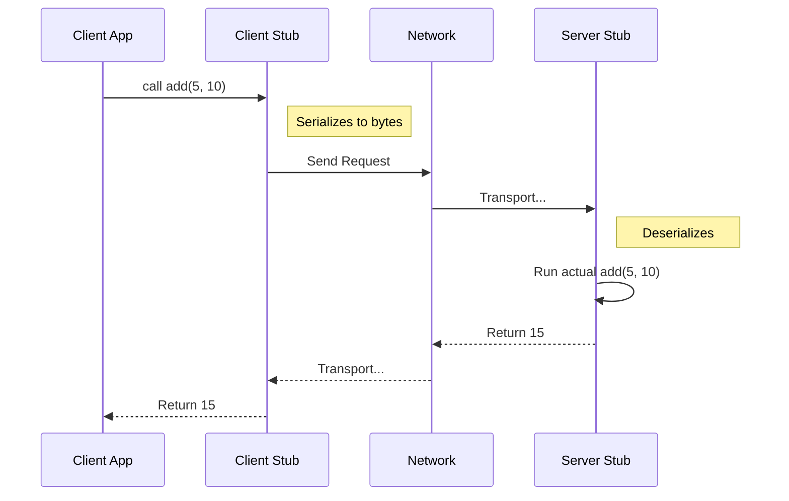

# gRPC: The Future of Microservices

For the last 15 years, **REST + JSON** ruled the world. But as systems reached massive scale (like Netflix or Uber), JSON became too slow and loose.

Enter **gRPC** (Google Remote Procedure Call), open-sourced in 2015.

---

## 1. What is RPC (Remote Procedure Call)?

Before we understand gRPC, we must understand **RPC**.

### The Concept: "The Local Illusion"
In a normal program, if you want to calculate a sum, you call a function:
```python
result = add(5, 10) // Included in the same memory space
```

**RPC** tries to keep this exact same simplicity, even if the `add` function is on a server in Japan and you are in New York.
```python
# The Code looks local...
result = client.add(5, 10) 
# ...but the execution happens across the ocean!
```

### Under the Hood: The "Stub" Mechanism
How does the code know to go to Japan?

1.  **Client Stub:** A piece of auto-generated code that looks like the real function. It takes your variables (`5, 10`), packages them (Serialization), and sends them over the network.
2.  **Network Transport:** The package travels over HTTP/TCP.
3.  **Server Stub:** Receives the package, unpacks it (Deserialization), and calls the *actual* `add` function on the server.



### Hands-on: The Code Structure
How does this look in practice?

**1. The Contract (Method Definition)**
First, we agree on what the function looks like.
```protobuf
// calculator.proto
service Calculator {
  rpc Add (AddRequest) returns (AddResponse);
}
```

**2. The Client Side (The Illusion)**
Notice how the client doesn't know *how* `Add` is implemented. It just calls the **Stub**.
```python
# Create a connection (Channel)
channel = grpc.insecure_channel('localhost:50051')

# Create the Stub (The Proxy Object)
stub = calculator_pb2_grpc.CalculatorStub(channel)

# Call the remote function (Looks local!)
response = stub.Add(AddRequest(a=5, b=10))

print(response.result) # Output: 15
```

**3. The Server Side (The Reality)**
The server implements the actual logic.
```python
class CalculatorServicer(calculator_pb2_grpc.CalculatorServicer):
    def Add(self, request, context):
        # The actual work happens here
        return AddResponse(result = request.a + request.b)
```

### The Catch
While the *syntax* looks local, the *reality* is different. A local function call takes nanoseconds and never fails. An RPC call takes milliseconds and can fail (Network timeout, Server down).

---

## 2. Evolution: Why reinvent the wheel?

1.  **XML-RPC / SOAP (1998):**
    *   Strict, Enterprise-ready, but **Huge and Complex**. Parsing XML is CPU expensive.
2.  **REST + JSON (2000s):**
    *   Flexible, Human-readable, using standard HTTP verbs (`GET`, `POST`).
    *   *Problem:* Text-based. "123456" takes more bytes than a 4-byte integer. No type safety.
3.  **gRPC (2015):**
    *   **Binary** (Protobuf).
    *   **Strict Contracts** (`.proto`).
    *   **Multiplexed** (HTTP/2).

---

## 2. The Components

gRPC is built on two pillars:

### A. Protocol Buffers (The Data Format)
Instead of sending JSON text, we define a schema:

```protobuf
// user.proto
message User {
  int32 id = 1;
  string name = 2;
  string email = 3;
}
```

*   **Binary:** This compiles into a compact binary blob.
*   **Safety:** You can't send a String where an Int is expected.
*   **Code Gen:** The compiler (`protoc`) generates classes for Python, Java, Go, etc.

### B. HTTP/2 (The Highway)
gRPC **requires** HTTP/2. It uses:
*   **Binary Framing:** Fits perfectly with Protobuf.
*   **Multiplexing:** Thousands of parallel requests over 1 TCP connection.
*   **Streaming:** Bi-directional streaming (Client and Server talking at the same time).

---

## 3. Comparison: REST vs gRPC

| Feature | REST (JSON) | gRPC (Protobuf) |
| :--- | :--- | :--- |
| **Payload** | Text (Large) | Binary (Small & Fast) |
| **Contract** | Optional (OpenAPI/Swagger) | **Required** (.proto) |
| **Protocol** | HTTP/1.1 or 2 | **HTTP/2 Only** |
| **Browser Support** | Native (fetch) | Limited (Needs gRPC-Web Proxy) |
| **Debuggability** | High (Human readable) | Low (Binary blobs) |

---

## 4. Use Cases: When to use what?

1.  **Internal Microservices (Backend-to-Backend):** ✅ **Use gRPC.**
    *   Low latency is critical.
    *   Strict contracts prevent teams from breaking each other's APIs.
2.  **Public API (Backend-to-User):** ✅ **Use REST.**
    *   External developers prefer readable JSON.
    *   Browsers handle JSON natively without extra proxies.

## 5. Challenges
*   **Browser Support:** Browsers cannot expose raw HTTP/2 frames yet. You need a wrapper like `gRPC-Web` or a gateway (Envoy) to translate.
*   **Debugging:** You can't just use `curl`. You need special tools like `grpcurl` to decode the binary responses.
