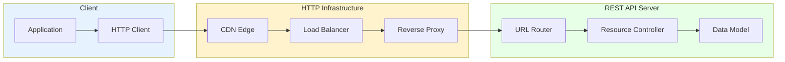

# REST Deep Dive: The Architecture of the Web

## 1. Introduction

**REST** (Representational State Transfer) is an architectural style for designing networked applications. Defined by Roy Fielding in his 2000 PhD dissertation, REST provides constraints that, when applied to web services, create scalable, maintainable, and performant systems.

**Problem It Solves**: How do we build web APIs that:
- Scale to billions of users (like the web itself)
- Work through caching layers (CDN, proxies)
- Remain simple and understandable
- Enable independent evolution of client and server

**Key Differentiator**:
- **Resource-Oriented**: Data organized as resources (nouns) not actions (verbs)
- **Stateless**: Each request contains all necessary information
- **Cacheable**: Responses explicitly declare cache ability
- **Uniform Interface**: Consistent patterns across all endpoints
- **Self-Descriptive Messages**: Each message describes how to process it

**Industry Adoption**:
- **Stripe**: Payment API (99.99% uptime)
- **Twilio**: Communication APIs
- **GitHub**: REST API v3
- **AWS**: S3, EC2 APIs
- Most public web APIs

**Historical Context**:
- **2000**: Roy Fielding publishes REST dissertation
- **2005-2010**: REST replaces SOAP as dominant web service style
- **2010s**: Richardson Maturity Model defines REST levels
- **2015+**: GraphQL emerges as alternative for complex UIs

**REST vs Other Approaches**:
| Aspect | REST | SOAP | GraphQL | gRPC |
|:-------|:-----|:-----|:--------|:-----|
| **Protocol** | HTTP | HTTP + XML | HTTP | HTTP/2 |
| **Message Format** | JSON (typically) | XML | JSON | Protobuf |
| **Contract** | Optional (OpenAPI) | Required (WSDL) | Required (Schema) | Required (.proto) |
| **Caching** | Native (HTTP) | Complex | Complex | Complex |
| **Learning Curve** | Low | High | Medium | Medium |

---

## 2. Core Architecture

REST leverages HTTP infrastructure (caching, load balancing, authentication) as first-class citizens.



### Key Components

**1. Resources**:
- Addressable entities (users, products, orders)
- Identified by URLs (`/users/123`)
- Represented in multiple formats (JSON, XML)

**2. HTTP Methods (Verbs)**:
- `GET`: Retrieve resource
- `POST`: Create resource
- `PUT`: Replace resource
- `PATCH`: Update resource
- `DELETE`: Remove

 resource

**3. Status Codes**:
- 2xx: Success
- 3xx: Redirection
- 4xx: Client error
- 5xx: Server error

**4. Headers**:
- `Content-Type`: Response format
- `Cache-Control`: Caching directives
- `Authorization`: Authentication
- `ETag`: Resource versioning

**5. Representations**:
- Same resource, multiple formats
- Content negotiation via `Accept` header
- HATEOAS: Hypermedia links

---

## 3. How It Works: The 6 REST Constraints

### A. Client-Server Separation

**Principle**: UI concerns separated from data storage

**Benefits**:
- Client and server evolve independently
- Multiple clients (web, mobile) share same server
- Simplified server (stateless, scales horizontally)

**Example**:
```
Client: React app (handles rendering, state management)
Server: Express API (handles data, business logic)

Client can be replaced (React → Vue) without touching server
```

---

### B. Stateless

**Principle**: Each request contains all necessary context

**Mechanism**:
```
Step 1: Client authenticates → receives JWT token
Step 2: Every request includes:
  Authorization: Bearer <JWT>
  
Server:
  - Doesn't store session in memory
  - Validates JWT on each request
  - No server-side session store needed
```

**Benefits**:
- Horizontal scaling easy (any server handles any request)
- No session synchronization between servers
- Server failures don't lose state

**Trade-off**: Larger requests (token in every request)

---

### C. Cacheable

**Principle**: Responses must declare cache-ability

**Mechanism**:
```
GET /users/123

Response:
  Cache-Control: max-age=3600, public
  ETag: "abc123"
  
Browser/CDN caches response for 1 hour

Next request:
  If-None-Match: "abc123"
  
Server:
  ETag unchanged → 304 Not Modified (no body sent)
  ETag changed → 200 OK (new body)
```

**Benefits**:
- Reduced server load (95%+ cache hit ratio possible)
- Lower latency (CDN edge serves cached responses)
- Bandwidth savings

---

### D. Uniform Interface

**4 Sub-Constraints**:

**1. Resource Identification**:
```
URLs identify resources uniquely:
/users/123 - User with ID 123
/products/456 - Product with ID 456
```

**2. Resource Manipulation via Representations**:
```
Same resource, different formats:
GET /users/123 with Accept: application/json → JSON
GET /users/123 with Accept: application/xml → XML
```

**3. Self-Descriptive Messages**:
```
Response includes all metadata:
Content-Type: application/json
Content-Length: 256
Cache-Control: max-age=3600
```

**4. HATEOAS** (Hypermedia as Engine of Application State):
```
Response includes navigation links:
{
  "id": 123,
  "name": "Alice",
  "_links": {
    "self": "/users/123",
    "posts": "/users/123/posts",
    "friends": "/users/123/friends"
  }
}
```

---

### E. Layered System

**Principle**: Client doesn't know if it's talking to end server or intermediary

**Architecture**:
```
Client → CDN → Load Balancer → API Gateway → Microservice

Client makes request to api.example.com
Could be served by:
- CDN edge (cached)
- Load balancer (routing)
- API gateway (auth, rate limiting)
- Actual microservice

Client doesn't know/care
```

**Benefits**:
- Insert caching/security layers transparently
- Zero client changes needed

---

### F. Code on Demand (Optional)

**Principle**: Server can send executable code

**Example**: Server sends JavaScript that client executes

**Rarely used** in modern REST APIs (security concerns)

---

## 4. Deep Dive: Idempotency andSafety

### A. Idempotency Rules

**Definition**: Multiple identical requests have same effect as single request

**Idempotent Methods**:

**GET**:
```
GET /users/123 (10 times) → Same result each time
Side effects: None
```

**PUT**:
```
PUT /users/123 { name: "Bob" } (3 times)
Result: User 123 has name "Bob" (idempotent)
Database writes: 3 (but final state is same)
```

**DELETE**:
```
DELETE /users/123 (2 times)
First: 200 OK (deleted)
Second: 404 Not Found (already gone)
Final state: User 123 doesn't exist (idempotent)
```

**Non-Idempotent Methods**:

**POST**:
```
POST /orders { product_id: 5, quantity: 1 } (2 times)
Result: 2 orders created (not idempotent)
```

**Idempotency Key Pattern** (for POST):
```
POST /payments
Idempotency-Key: abc123
{amount: 100}

Server checks: Have I seen "abc123" before?
- No: Process payment, store key → 201 Created
- Yes: Return cached response → 200 OK (not processed again)
```

---

### B. Safety

**Definition**: Method doesn't modify server state

**Safe Methods**: `GET`, `HEAD`, `OPTIONS`
```
Can be pre-fetched, cached aggressively
No side effects guaranteed
```

**Unsafe Methods**: `POST`, `PUT`, `PATCH`, `DELETE`
```
Modify server state
Require user intention (not pre-fetched)
```

---

## 5. End-to-End Walkthrough: E-Commerce Checkout

**Scenario**: User purchases product

### Step 1: View Product (t=0ms)
```
Client: GET /products/456

Server response:
  Status: 200 OK
  Cache-Control: max-age=3600
  Body: {id: 456, name: "Laptop", price: 999, stock: 5}

Cached at CDN edge for 1 hour
```

### Step 2: Add to Cart (t=1000ms)
```
Client: POST /cart/items
Authorization: Bearer <jwt>
Body: {product_id: 456, quantity: 1}

Server:
  1. Validate JWT → user_id=123
  2. Check stock: 5 > 1 ✓
  3. INSERT INTO cart_items  
  4. Response: 201 Created
     Location: /cart/items/789
     Body: {id: 789, product_id: 456, quantity: 1}
```

### Step 3: Checkout (t=5000ms)
```
Client: POST /orders
Authorization: Bearer <jwt>
Idempotency-Key: checkout-2024-01-01-abc
Body: {cart_id: 456, payment_method: "card_123"}

Server (within transaction):
  1. Lock cart items (SELECT FOR UPDATE)
  2. Check idempotency key → new (proceed)
  3. Verify stock still available
  4. Create order: INSERT INTO orders
  5. Charge payment (external API call)
  6. Decrement stock: UPDATE products SET stock=stock-1
  7. Clear cart: DELETE FROM cart_items
  8. Store idempotency key with response
  9. Commit transaction
  
Response: 201 Created
  Location: /orders/1001
  Body: {id: 1001, status: "confirmed", total: 999}
```

### Step 4: Get Order Status (t=10000ms)
```
Client: GET /orders/1001
Authorization: Bearer <jwt>

Server:
  1. Verify user owns order
  2. SELECT * FROM orders WHERE id=1001
  3. Response: 200 OK
     Cache-Control: private, max-age=60
     ETag: "order-1001-v2"
     Body: {id: 1001, status: "shipped", tracking: "ABC123"}
```

---

## 6. Failure Scenarios

### Scenario A: Accidental Double POST

**Symptom**: User charged twice, 2 orders created

**Cause**: Network timeout, user retries button click

**Mechanism**:
```
t=0s: User clicks "Buy"
t=0s: POST /orders sent
t=30s: Network timeout (but server processing succeeded)
t=31s: User clicks "Buy" again
t=31s: Second POST /orders sent
t=32s: Second order created, user charged twice
```

**Fix**: Idempotency keys
```
Client generates unique key per operation:
  Idempotency-Key: checkout-<user_id>-<timestamp>-<random>

Server stores key + response for 24 hours
Duplicate requests return cached response
```

---

### Scenario B: Stale Cache

**Symptom**: User sees old data, confused

**Cause**: Aggressive caching, data changed

**Mechanism**:
```
t=0: GET /products/456 → price: $100 (cached for 1 hour)
t=30min: Admin updates price to $80
t=31min: User GETs /products/456 → still sees $100 (CDN cache)
t=60min: Cache expires, user sees $80
```

**Fix**: Cache invalidation
```
When product updated:
  1. Update database
  2. Purge CDN cache: PURGE /products/456
  3. Future requests fetch  fresh data

Or use shorter TTL for frequently changing data
```

---

## 7. Performance Tuning / Scaling

### Configuration Table

| Configuration | Recommended | Why? |
|:--------------|:------------|:-----|
| **Cache-Control** | max-age=3600 (static), 60 (dynamic) | Balance freshness vs performance |
| **ETag** | Enabled | Conditional requests save bandwidth |
| **Compression** | gzip/brotli | 60-80% size reduction |
| **Pagination** | limit=20, max=100 | Prevent large responses |
| **Rate Limiting** | 1000 req/hour/user | Prevent abuse |
| **Connection Keep-Alive** | 120s | Reuse TCP connections |
| **HTTP/2** | Enabled | Multiplexing, header compression |
| **CDN TTL** | 3600s (static), 60s (dynamic) | Edge caching |

### Scaling Patterns

**Pagination**:
```
GET /users?page=2&limit=20
Response:
  Link: </users?page=3>; rel="next"
  X-Total-Count: 1000
```

**Rate Limiting**:
```
Response headers:
  X-Rate-Limit-Limit: 1000
  X-Rate-Limit-Remaining: 950
  X-Rate-Limit-Reset: 1609459200

If exceeded: 429 Too Many Requests
```

---

## 8. Constraints & Limitations

| Constraint | Limit | Why? |
|:-----------|:------|:-----|
| **Multiple Requests** | N+1 problem | No native nested fetching |
| **Over-Fetching** | Fixed endpoints | Server decides response shape |
| **Versioning** | URL or header | Breaking changes require v2 |
| **Real-Time** | Polling/SSE needed | HTTP request-response model |
| **Caching Complexity** | POST, Authentication | Authenticated requests hard to cache |

---

## 9. When to Use REST?

| Use Case | Verdict | Why? |
|:---------|:--------|:-----|
| **Public APIs** | ✅ **YES** | Simplicity, HTTP caching, widely understood |
| **Simple CRUD** | ✅ **YES** | Resource model maps naturally |
| **Web Applications** | ✅ **YES** | Browser support, CDN caching |
| **Mobile Apps (simple)** | ✅ **YES** | Easy to implement, broad support |
| **Complex Nested Data** | ❌ **NO** | GraphQL better (avoid N+1) |
| **Real-Time** | ❌ **NO** | WebSocket/SSE better |
| **Microservices (internal)** | ⚠️ **MAYBE** | gRPC often better (performance) |

---

## 10. Production Checklist

1. [ ] **Use plural nouns** for resources (`/users`, not `/user`): Consistency
2. [ ] **Version API** from day 1 (`/v1/users`): Enable non-breaking evolution
3. [ ] **Implement idempotency keys** for POST: Prevent duplicate operations
4. [ ] **Add pagination** to all list endpoints: Prevent large responses
5. [ ] **Set Cache-Control** headers appropriately: Enable CDN caching
6. [ ] **Use ETags** for conditional requests: Save bandwidth
7. [ ] **Implement rate limiting** (per user/IP): Prevent abuse
8. [ ] **Enable compression** (gzip/brotli): 60-80% size reduction
9. [ ] **Document with OpenAPI/Swagger**: Auto-generate client libraries
10. [ ] **Monitor 4xx/5xx rates**: Detect client/server issues

**Critical Metrics**:

```
http_requests_total{method, path, status}:
  Request rate by endpoint and status
  
http_request_duration_seconds{method, path}:
  p50 < 0.1s, p99 < 0.5s
  
http_cache_hit_ratio:
  > 80% (CDN caching effectiveness)
  
http_errors_total{status="4xx|5xx"}:
  4xx < 5%, 5xx < 1%
  
http_rate_limit_exceeded_total:
  Monitor abuse attempts
```

---

**Conclusion**: REST provides a simple, scalable architectural style leveraging HTTP infrastructure. Its resource-oriented model, stateless nature, and caching support make it ideal for public APIs and web applications. While GraphQL addresses some limitations (over/under-fetching), REST remains the dominant choice for most web services due to its simplicity and HTTP ecosystem integration.
