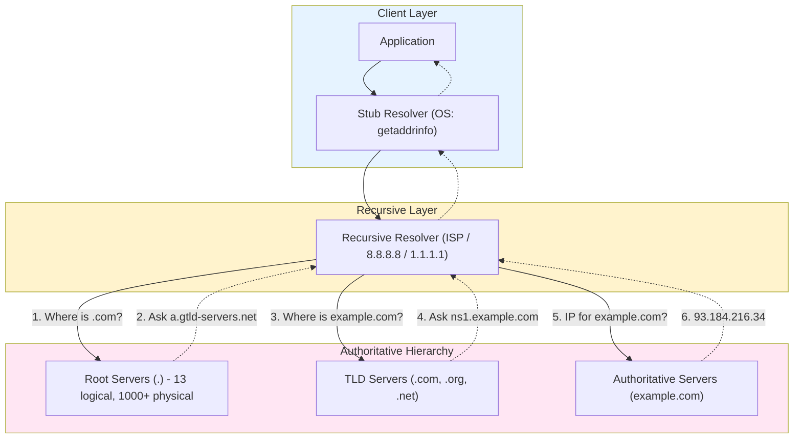
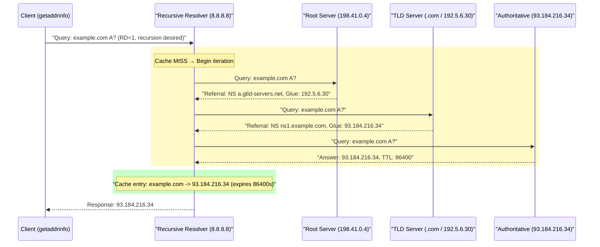
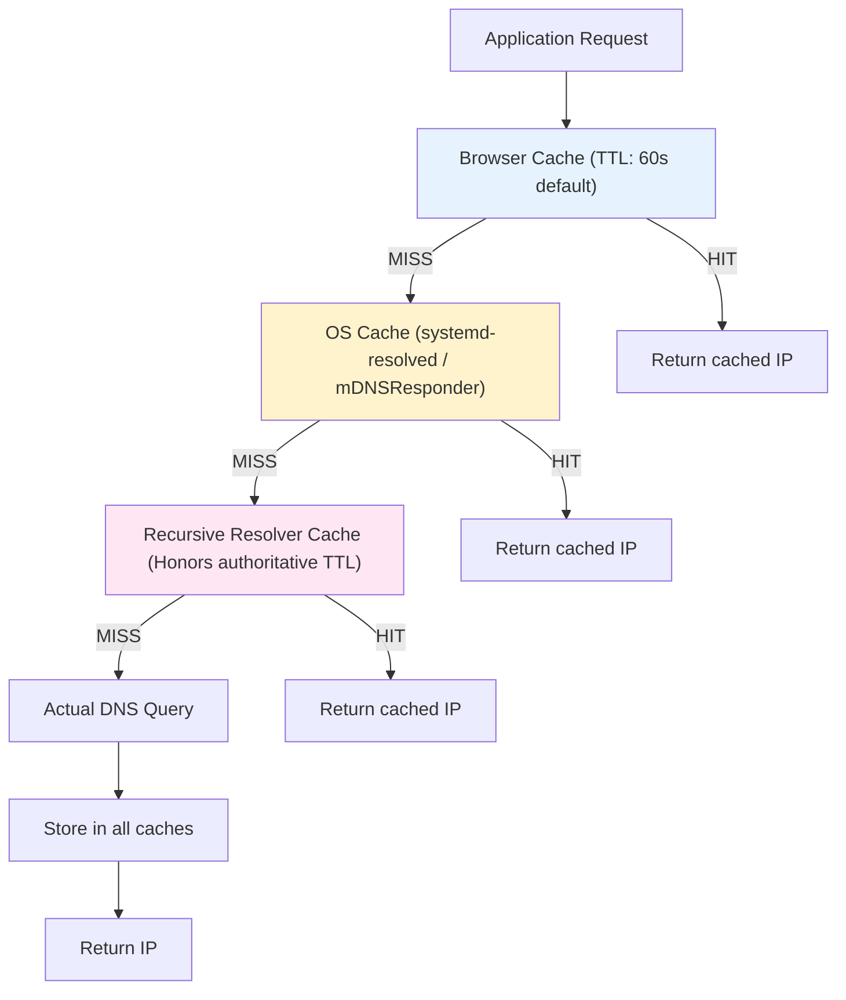
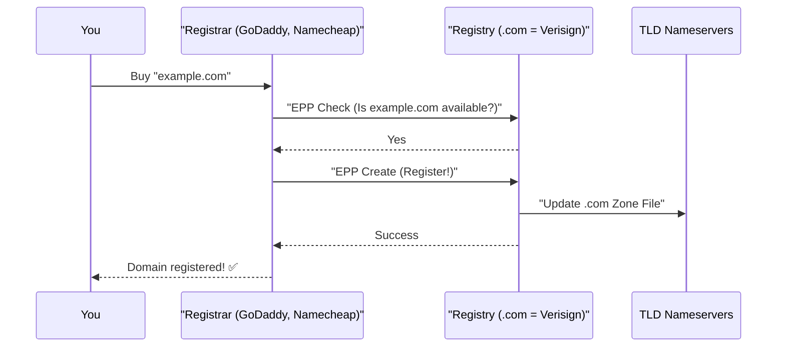
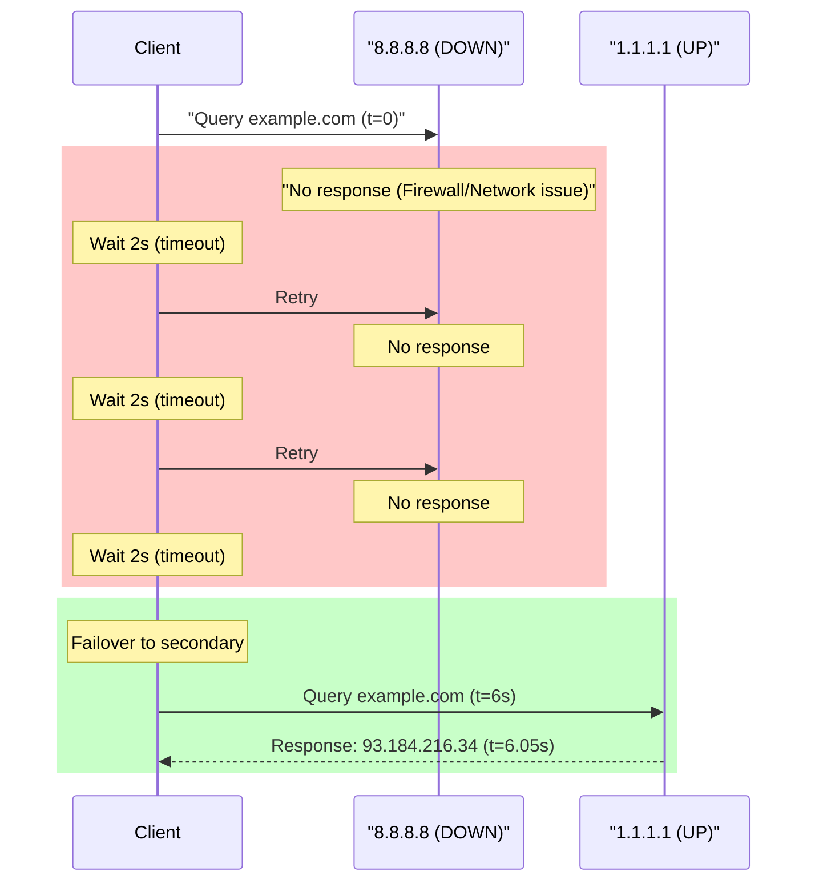
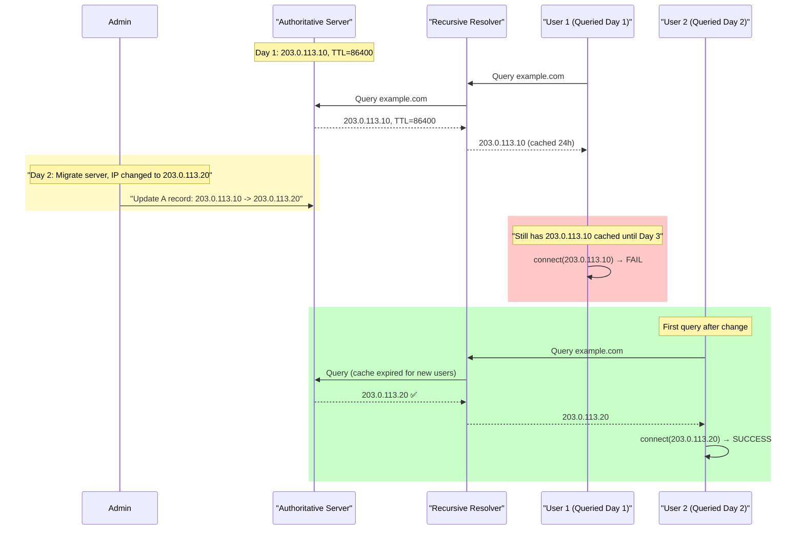

# 08. DNS: The Internet's Distributed Directory System

## 1. Introduction

**DNS (Domain Name System)** is the fundamental distributed directory system that maps human-readable domain names (`google.com`) to machine-routable IP addresses (`142.250.190.46`). First specified in 1983 by Paul Mockapetris (RFC 1034/1035), DNS is one of the internet's core protocols, resolving billions of queries per second globally.

**Problem It Solves**:
- **Human-Friendly Naming**: People remember names, not 32-bit numbers
- **Service Abstraction**: Change backend IPs without affecting clients
- **Load Distribution**: Route requests geographically or by load
- **Service Discovery**: Find endpoints dynamically in distributed systems

**Key Differentiator**: Unlike centralized phone books, DNS is **hierarchical** (distributed authority), **cached** (fast lookups), and **eventually consistent** (updates propagate over time).

**Industry Adoption**:
- **BIND**: Most popular authoritative DNS server (ISC)
- **Cloudflare DNS (1.1.1.1)**: Public resolver with privacy focus
- **Google Public DNS (8.8.8.8)**: Largest public DNS service
- **AWS Route 53**: Managed DNS with health checks and geo-routing
- **CoreDNS**: Cloud-native DNS for Kubernetes

**Historical Context**: Before DNS, the internet used a single `HOSTS.TXT` file maintained by SRI-NIC. As the internet grew past a few hundred hosts, this centralized approach became untenable. DNS introduced delegation, allowing distributed management while maintaining global consistency through the hierarchy.

---

## 2. Core Architecture

DNS implements a hierarchical, distributed database where authority is delegated at each level.



### Key Components

**1. Stub Resolver** (Client-side, in OS):
- **Location**: Part of C standard library (glibc on Linux, libc on macOS)
- **Function**: Initiates DNS queries, parses `/etc/resolv.conf`, checks `/etc/hosts`
- **Syscall**: `getaddrinfo()` or legacy `gethostbyname()`

**2. Recursive Resolver** (The Workhorse):
- **Role**: Performs iterative queries on behalf of clients
- **Examples**: ISP resolver, 8.8.8.8 (Google), 1.1.1.1 (Cloudflare)
- **Features**: Caching, query aggregation, DNSSEC validation
- **Protocol**: UDP port 53 (default), TCP for large responses

**3. Root Name Servers** (Top of Hierarchy):
- **Count**: 13 logical servers (a.root-servers.net through m.root-servers.net)
- **Physical**: 1000+ anycast instances worldwide
- **Function**: Delegate to TLD servers, respond in ~1ms globally

**4. TLD Name Servers** (Top-Level Domains):
- **Examples**: `.com` (Verisign), `.org` (PIR), `.uk` (Nominet)
- **Function**: Delegate to authoritative servers for specific domains
- **Zone File**: Millions of NS records pointing to authoritative servers

**5. Authoritative Name Servers** (Source of Truth):
- **Role**: Hold actual IP mappings for a domain
- **Configured By**: Domain owner via registrar or DNS provider
- **Records**: A, AAAA, CNAME, MX, TXT, NS, SOA

**6. Caching Infrastructure**:
- **Browser Cache**: Short-lived (60s typical)
- **OS Cache**: `systemd-resolved` (Linux), `mDNSResponder` (macOS)
- **Resolver Cache**: Honors TTL from authoritative server

---

## 3. How It Works: DNS Resolution Mechanics

### A. Client-Level Resolution (Syscall Perspective)

**Application Request**:
```
Steps:
1. Application calls: getaddrinfo("example.com", "443", &hints, &result)
2. glibc reads: /etc/nsswitch.conf
   - Determines lookup order: files dns myhostname
3. Check /etc/hosts for local overrides:
   - Format: 127.0.1.1 example.com
   - If found: Return immediately (no DNS query)
4. If not in hosts file: Proceed to DNS lookup
5. glibc reads: /etc/resolv.conf
   - nameserver 8.8.8.8
   - nameserver 1.1.1.1
   - search localdomain
6. Build DNS query packet (see next section)
7. Send via UDP socket: sendto(sock, packet, len, 0, &dest, sizeof(dest))
8. Wait for response: recvfrom(sock, buffer, buflen, 0, &src, &addrlen)
9. Parse response: Extract IP from Answer section
10. Return: struct addrinfo containing IP address
```

**Configuration Files**:

`/etc/resolv.conf`:
```
nameserver 8.8.8.8       # Primary resolver
nameserver 1.1.1.1       # Backup resolver
search example.com       # Append domain for short names
options timeout:2        # Query timeout (seconds)
options attempts:3       # Retry count
```

`/etc/hosts` (checked first):
```
127.0.0.1       localhost
127.0.1.1       myhost.localdomain myhost
192.168.1.100   dev-server.local
```

---

### B. DNS Message Format (Packet Structure)

**UDP Packet Structure** (UDP port 53):

```
Steps:
1. Header (12 bytes fixed):
   - Query ID (16 bits): Random number (0x1234) to match request/response
   - Flags (16 bits):
     * QR (1 bit): 0=Query, 1=Response
     * Opcode (4 bits): 0=Standard query
     * AA (1 bit): Authoritative Answer
     * TC (1 bit): Truncated (response > 512 bytes)
     * RD (1 bit): Recursion Desired
     * RA (1 bit): Recursion Available
     * Z (3 bits): Reserved
     * RCODE (4 bits): 0=No error, 3=NXDOMAIN
   - QDCOUNT (16 bits): Number of questions (usually 1)
   - ANCOUNT (16 bits): Number of answers
   - NSCOUNT (16 bits): Number of authority records
   - ARCOUNT (16 bits): Number of additional records

2. Question Section (variable):
   - QNAME: Domain encoded as length-prefixed labels
     Example: example.com → [7]example[3]com[0]
   - QTYPE (16 bits): 1=A, 28=AAAA, 5=CNAME, 15=MX, 16=TXT
   - QCLASS (16 bits): 1=IN (Internet)

3. Answer Section (in response only):
   - NAME: Pointer to question (compression to save space)
   - TYPE: Same as QTYPE
   - CLASS: Same as QCLASS  
   - TTL (32 bits): Time to live in seconds
   - RDLENGTH (16 bits): Length of RDATA
   - RDATA: Actual data (4 bytes for A record = IPv4 address)
```

**Example Query Packet** (example.com A record):
```
Header:
  ID: 0x1abc
  Flags: 0x0100 (RD=1, recursion desired)
  QDCOUNT: 1, ANCOUNT: 0, NSCOUNT: 0, ARCOUNT: 0

Question:
  QNAME: 07 65 78 61 6d 70 6c 65 03 63 6f 6d 00  ([7]example[3]com[0])
  QTYPE: 0x0001 (A record)
  QCLASS: 0x0001 (IN)

Total size: ~29 bytes
```

---

### C. Iterative Resolution Process

**The Full Journey** (uncached):



**Steps**:
1. **Client → Resolver**: "What's the IP for example.com?" (RD=1)
2. **Resolver → Root**: "Where's example.com?"
3. **Root → Resolver**: "I don't know, but ask .com TLD at 192.5.6.30"
4. **Resolver → TLD**: "Where's example.com?"
5. **TLD → Resolver**: "Ask ns1.example.com at 93.184.216.34"
6. **Resolver → Authoritative**: "What's example.com's IP?"
7. **Authoritative → Resolver**: "93.184.216.34, TTL=86400"
8. **Resolver → Client**: "93.184.216.34" (and cache for 24 hours)

**Latency Breakdown** (uncached):
- Client → Resolver: 5-20ms
- Resolver → Root: 10-30ms
- Resolver → TLD: 20-50ms
- Resolver → Auth: 20-80ms
- **Total**: 55-180ms

**Latency (cached)**: <1ms if in resolver cache

---

### D. Record Types

| Type | Code | Purpose | Example |
|:-----|:-----|:--------|:--------|
| **A** | 1 | IPv4 address | `example.com A 93.184.216.34` |
| **AAAA** | 28 | IPv6 address | `example.com AAAA 2606:2800:220:1:...` |
| **CNAME** | 5 | Alias to another name | `www.example.com CNAME example.com` |
| **MX** | 15 | Mail server | `example.com MX 10 mail.example.com` |
| **NS** | 2 | Nameserver delegation | `example.com NS ns1.example.com` |
| **TXT** | 16 | Arbitrary text | `example.com TXT "v=spf1 mx -all"` |
| **SOA** | 6 | Zone authority info | Contains serial, refresh, retry, expire |

**CNAME Chain Example**:
```
Steps:
1. Query: www.cdn.example.com
2. Response: CNAME cdn-provider.net
3. New Query: cdn-provider.net
4. Response: CNAME edge.cdn.net
5. New Query: edge.cdn.net
6. Response: A 203.0.113.50

Total: 3 queries to resolve (CNAME chain limit: typically 16)
```

---

### E. Caching Hierarchy



**Cache Inspection Commands**:

**Linux (systemd-resolved)**:
```
resolvectl statistics
  Current Cache Size: 247
  Cache Hits: 1523
  Cache Misses: 89

resolvectl flush-caches  # Clear OS cache
```

**macOS (mDNSResponder)**:
```
sudo dscacheutil -flushcache  # Clear OS cache
sudo killall -HUP mDNSResponder
```

**Negative Caching** (NXDOMAIN):
```
Steps:
1. Query non-existent: nonexistent.example.com
2. Authoritative responds: RCODE=3 (NXDOMAIN)
3. Response includes SOA record with MINIMUM field: 900s
4. Resolver caches "doesn't exist" for 900s
5. Subsequent queries return NXDOMAIN from cache (no network query)
```

---

## 4. Deep Dive: Internal Implementation

### A. UDP vs TCP Decision Logic

**Default Protocol**: UDP (port 53)

**TCP Fallback Conditions**:
```
Steps:
1. Resolver sends query via UDP (53 bytes)
2. If response > 512 bytes:
   - Authoritative sets TC (truncated) flag
   - Truncates response at 512 bytes
   - Returns partial response
3. Resolver detects TC=1
4. Resolver retries over TCP (port 53)
5. TCP allows full response (up to 65535 bytes)
```

**EDNS0 Extension** (RFC 6891):
```
Purpose: Increase UDP message size limit

Steps:
1. Client adds OPT pseudo-record in Additional section:
   - UDP payload size: 4096 bytes (advertised)
2. Server respects size if supported
3. Avoids TCP fallback for DNSSEC signatures

Result: Most modern resolvers use EDNS0
```

**When TCP is mandatory**:
- Zone transfers (AXFR, IXFR) - always TCP
- Responses with DNSSEC signatures (often > 512 bytes)
- Explicit DNS-over-TLS (DoT, port 853)
- DNS-over-HTTPS (DoH, port 443)

---

### B. Domain Ownership and Zone Authority

**Purchasing a Domain** (EPP Protocol):



**Steps**:
1. **Check availability**: Registrar queries registry via EPP
2. **Purchase**: You pay registrar  
3. **Create domain**: Registrar sends EPP CREATE command
4. **Zone file update**: Registry adds NS record to .com zone
5. **Propagation**: TLD servers reload zone file (minutes to hours)

**Zone Authority Power**:
```
Once you own example.com:
- You control *.example.com namespace
- Create unlimited subdomains for free:
  * app.example.com
  * api.example.com
  * dev.api.example.com
- No additional payments
- No permission needed from registry/registrar

Mechanism:
1. TLD server delegates: "example.com → ns1.example.com"
2. Your authoritative server receives ALL queries for *.example.com
3. You define records in your zone file (text file)
4. Changes take effect immediately (within TTL)
```

---

### C. DNS Security: Chain of Trust

**Question**: Can I create a fake `google.com` record on my server?

**Answer**: Yes, but it will be ignored by everyone.

**Why: Chain of Trust**:
```
Steps:
1. Root zone is trusted (hardcoded in OS)
2. Root signs .com zone with DNSSEC
3. .com TLD delegates google.com to ns1.google.com
4. Only ns1.google.com can authoritatively answer for google.com

Your fake record:
- Lives on your-server.com
- Not trusted by .com TLD
- Queries bypass your server entirely
- Internet follows official delegation chain

Result: Your fake record never queried ✅
```

**DNSSEC (DNS Security Extensions)**:
```
Steps:
1. Root zone publishes: DNSKEY (public key)
2. Root signs .com delegation: Creates RRSIG record
3. .com zone publishes: DNSKEY, DS (delegation signer)
4. .com signs google.com delegation: Creates RRSIG
5. google.com publishes: DNSKEY, RRSIG for all records

Resolver validation:
1. Fetch google.com A record + RRSIG
2. Fetch google.com DNSKEY
3. Verify: RRSIG valid for A record using DNSKEY
4. Fetch .com DS record (hash of google.com DNSKEY)
5. Verify: DS matches google.com DNSKEY
6. Fetch .com DNSKEY
7. Verify: .com signed DS record
8. Continue chain up to root

If any step fails: SERVFAIL (tampered/invalid)
```

---

### D. CNAME Flattening and Alias Records

**Standard CNAME Limitation**:
```
Problem: CNAME at apex domain (example.com) violates RFC

Invalid:
  example.com CNAME cdn.provider.net  ❌

Why invalid:
- RFC 1034: CNAME must be only record at that name
- But apex needs SOA and NS records
- Conflict: Cannot have CNAME + SOA + NS

Valid workaround:
  www.example.com CNAME cdn.provider.net  ✅
```

**Cloud Provider Solution: Alias Records**:

**AWS Route 53 Alias** (not standard DNS):
```
Mechanism:
1. You create: example.com ALIAS cloudfront.amazonaws.com
2. Route 53 internally:
   - Resolves cloudfront.amazonaws.com → [ 13.224.157.1, 13.224.157.2, ... ]
   - Returns A records: example.com A 13.224.157.1
3. Client sees: Standard A record (no CNAME)
4. Updates automatically: If CloudFront changes IPs, alias updates

Benefits:
- Works at apex (doesn't violate RFC)
- Free (no query charges for alias targets within AWS)
- Health checks (failover if target unhealthy)
```

**Cloudflare CNAME Flattening**:
```
Mechanism:
1. You create: example.com CNAME cdn.cloudflare.net
2. Cloudflare authoritative server:
   - Resolves cdn.cloudflare.net → 104.16.132.229
   - Returns A record: example.com A 104.16.132.229
3. Client receives: A record (transparent CNAME resolution)

Result: CNAME at apex works (Cloudflare handles internally)
```

---

## 5. End-to-End Walkthrough: Life of a DNS Query

### Scenario: `curl https://example.com`

**Complete trace from application to connection**:

### Step 1: Application Initiates Request
```
Command: curl https://example.com
Library call: getaddrinfo("example.com", "443", &hints, &result)
Process: curl (PID 1234)
Thread: Main thread
```

### Step 2: Stub Resolver Configuration
```
glibc reads: /etc/nsswitch.conf
  hosts: files dns myhostname

Result: Check files first, then DNS

glibc reads: /etc/hosts
  127.0.0.1 localhost
  (no entry for example.com)

Result: Proceed to DNS lookup

glibc reads: /etc/resolv.conf
  nameserver 8.8.8.8
  nameserver 1.1.1.1
  options timeout:2
  options attempts:3

Result: Use 8.8.8.8 as primary, 1.1.1.1 as backup
```

### Step 3: Check OS Cache
```
OS: Linux with systemd-resolved

Check: systemd-resolved cache
Query: example.com A
Result: MISS (not in cache)

Proceed to network query
```

### Step 4: Build DNS Query Packet
```
Header:
  ID: 0x7a3f (random, for matching response)
  Flags: 0x0100
    QR=0 (query), RD=1 (recursion desired)
  QDCOUNT: 1 (one question)
  ANCOUNT: 0, NSCOUNT: 0, ARCOUNT: 0

Question:
  QNAME: [7]example[3]com[0]
  QTYPE: 1 (A record - IPv4)
  QCLASS: 1 (IN - Internet)

Total packet size: 29 bytes
```

### Step 5: Send to Recursive Resolver
```
Socket operation:
  socket(AF_INET, SOCK_DGRAM, 0) → fd=4
  sendto(fd=4, packet, 29, 0, 8.8.8.8:53, sizeof(addr))

Network path:
  PC (192.168.1.100) → Router (192.168.1.1) → ISP → Internet → Google DNS (8.8.8.8)

Time: t=0ms
```

### Step 6: Recursive Resolver Checks Cache
```
Resolver: 8.8.8.8 (Google Public DNS)

Cache lookup:
  Key: "example.com A"
  Result: MISS

Decision: Perform iterative resolution
```

### Step 7: Query Root Server
```
Resolver → Root server:
  Destination: 198.41.0.4 (a.root-servers.net, anycast)
  Query: example.com A?

Root server response:
  RCODE: 0 (no error)
  AA: 0 (not authoritative)
  Answer section: Empty
  Authority section:
    com. NS a.gtld-servers.net
    com. NS b.gtld-servers.net
    ...
  Additional section (glue records):
    a.gtld-servers.net A 192.5.6.30
    b.gtld-servers.net A 192.5.6.31
    ...

Latency: 12ms
Time: t=12ms
```

### Step 8: Query TLD Server
```
Resolver → TLD server:
  Destination: 192.5.6.30 (a.gtld-servers.net for .com)
  Query: example.com A?

TLD response:
  RCODE: 0
  AA: 0 (not authoritative for example.com)
  Authority section:
    example.com NS a.iana-servers.net
    example.com NS b.iana-servers.net
  Additional section (glue):
    a.iana-servers.net A 199.43.135.53
    b.iana-servers.net A 199.43.133.53

Latency: 28ms
Time: t=40ms
```

### Step 9: Query Authoritative Server
```
Resolver → Authoritative server:
  Destination: 199.43.135.53 (a.iana-servers.net)
  Query: example.com A?

Authoritative response:
  RCODE: 0 (success)
  AA: 1 (authoritative answer ✅)
  Answer section:
    example.com A 93.184.216.34
    TTL: 86400 (24 hours)

Latency: 45ms
Time: t=85ms
```

### Step 10: Resolver Caches and Returns
```
Cache update:
  Key: "example.com A"
  Value: 93.184.216.34
  TTL: 86400s
  Expires: Current time + 86400s

Response to client:
  ID: 0x7a3f (matches request)
  Flags: 0x8180 (QR=1, RA=1, recursion available)
  Answer section:
    example.com A 93.184.216.34
    TTL: 86400

Packet size: 45 bytes
```

### Step 11: OS Receives and Caches
```
OS (systemd-resolved) receives response:
  recvfrom(fd=4, buffer, 512, 0, &src, &addrlen)
  
Validates:
  - Query ID matches (0x7a3f)
  - Source is 8.8.8.8:53
  - RCODE = 0 (no error)

Caches:
  example.com A 93.184.216.34 (TTL: 86400s)

Returns to application:
  struct addrinfo {
    ai_family: AF_INET
    ai_socktype: SOCK_STREAM
    ai_addr: 93.184.216.34
  }

Time: t=90ms
Total DNS resolution time: 90ms
```

### Step 12: Application Connects
```
curl now has IP: 93.184.216.34

TCP connection:
  socket(AF_INET, SOCK_STREAM, 0) → fd=5
  connect(fd=5, 93.184.216.34:443, sizeof(addr))
  
TLS handshake:
  ClientHello → ServerHello → Certificate → KeyExchange → Finished

HTTP request:
  GET / HTTP/1.1
  Host: example.com

Response received
Web page displayed ✅

Total time (cold cache): 90ms (DNS) + 50ms (TCP) + 100ms (TLS) + 30ms (HTTP) = 270ms
Total time (warm cache): <1ms (DNS) + 50ms (TCP) + 100ms (TLS) + 30ms (HTTP) = 181ms
```

**Savings from caching**: ~89ms (33% faster)

---

## 6. Failure Scenarios (The Senior View)

### Scenario A: DNS Timeout

**Symptom**: `curl: (6) Could not resolve host: example.com` after 10-second hang

**Cause**: Primary recursive resolver (8.8.8.8) unreachable

#### The Problem

**Timeline**:
```
t=0: curl initiates getaddrinfo()
t=0: Send query to 8.8.8.8:53
t=2s: Timeout (no response from 8.8.8.8)
t=2s: Retry #1 to 8.8.8.8
t=4s: Timeout
t=4s: Retry #2 to 8.8.8.8
t=6s: Timeout
t=6s: Failover to secondary: 1.1.1.1:53
t=6.05s: Response received from 1.1.1.1 ✅
t=6.05s: Return IP to application

Total delay: 6 seconds
```



#### The Fix

**Option 1: Reduce Timeout**
```
Edit /etc/resolv.conf:
  nameserver 8.8.8.8
  nameserver 1.1.1.1
  options timeout:1    ← Reduce from 2s to 1s
  options attempts:2   ← Reduce from 3 to 2

New timeline:
  t=0: Query 8.8.8.8
  t=1: Timeout, retry
  t=2: Timeout, failover to 1.1.1.1
  t=2.05: Response ✅

Total delay: 2 seconds (3x faster)
```

**Option 2: Reorder Nameservers**
```
Test which is faster:
  dig @8.8.8.8 example.com  → 120ms
  dig @1.1.1.1 example.com  → 15ms

Update /etc/resolv.conf:
  nameserver 1.1.1.1   ← Put faster first
  nameserver 8.8.8.8

Result: Always use fastest, 8.8.8.8 as backup
```

**Option 3: Monitor and Alert**
```
Prometheus alert:
  dns_query_failures_total{nameserver="8.8.8.8"} > 10 in 5m

Action: Investigate firewall, network path
```

---

### Scenario B: NXDOMAIN (Non-Existent Domain)

**Symptom**: `curl: (6) Could not resolve host: exampl.com` (typo)

**Cause**: Domain doesn't exist in DNS

#### The Mechanism

**Timeline**:
```
t=0: Query: exampl.com (typo - missing 'e')
t=0.02s: Root server: "Ask .com TLD"
t=0.04s: TLD server: "No NS records for exampl.com"
t=0.04s: TLD responds: RCODE=3 (NXDOMAIN) + SOA record

SOA record:
  com. SOA a.gtld-servers.net. nstld.verisign-grs.com. (
    1638316800 ; serial
    1800       ; refresh (30 minutes)
    900        ; retry (15 minutes)
    604800     ; expire (7 days)
    86400      ; minimum TTL (24 hours) ← Negative cache TTL
  )

t=0.05s: Resolver caches: "exampl.com does NOT exist" for 86400s
t=0.05s: Returns NXDOMAIN to client
```

**Error Message**:
```
getaddrinfo() returns: EAI_NONAME (-2)
curl displays: "Could not resolve host: exampl.com"
```

#### Debugging

**Command**:
```
dig exampl.com

Response:
  status: NXDOMAIN
  ANSWER: 0
  AUTHORITY section:
    com. SOA a.gtld-servers.net. ... 86400
```

**Verify with multiple resolvers**:
```
dig @8.8.8.8 exampl.com  → NXDOMAIN
dig @1.1.1.1 exampl.com  → NXDOMAIN
dig @8.8.4.4 exampl.com  → NXDOMAIN

Conclusion: Domain truly doesn't exist (not a resolver issue)
```

#### The Fix

**Check delegation**:
```
Steps:
1. Verify you own domain:
   whois example.com → Check registrant

2. Check nameserver delegation:
   dig NS example.com
   
   If NXDOMAIN: Nameservers not set at registrar
   Fix: Update NS records at registrar (GoDaddy, Namecheap, etc.)

3. Check authoritative response:
   dig @ns1.example.com example.com
   
   If times out: Authoritative server down
   Fix: Start DNS server or update to working nameservers
```

---

### Scenario C: Stale Cache After IP Migration

**Symptom**: Website unreachable for some users after changing IP

**Cause**: Old IP cached with long TTL

#### The Problem

**Timeline**:
```
Day 1 (before migration):
  example.com A 203.0.113.10 (TTL: 86400s = 24 hours)
  Users query → Cached until Day 2

Day 2 (migration):
  10:00 AM: Change example.com A 203.0.113.20
  10:00 AM: New users get new IP ✅
  10:00 AM: Old users still have 203.0.113.10 cached ❌
  
Day 3:
  10:00 AM: All caches expired, everyone has new IP ✅

Impact: 24-hour migration window
```



#### The Fix

**Option 1: Pre-Migration TTL Reduction** (Recommended)
```
Steps:
1. Week before migration:
   Update TTL: 86400 → 300 (5 minutes)
   
2. Wait 24 hours:
   All caches now have 300s TTL
   
3. Perform migration:
   Change IP: 203.0.113.10 → 203.0.113.20
   
4. Monitor:
   Max stale cache duration: 5 minutes ✅
   
5. After migration:
   Restore TTL: 300 → 3600 (1 hour)
```

**Option 2: Parallel Operation**
```
Steps:
1. Keep old server running: 203.0.113.10 (serves traffic)
2. Add new server: 203.0.113.20 (ready)
3. Change DNS: Point to 203.0.113.20
4. Wait 24-48 hours: Old caches expire
5. Verify: No traffic to 203.0.113.10
6. Decommission: Shut down old server ✅
```

**Option 3: Force Cache Flush** (Not recommended)
```
Ask users to flush:
  
Linux:
  sudo systemd-resolve --flush-caches
  
macOS:
  sudo dscacheutil -flushcache
  
Windows:
  ipconfig /flushdns

Problem: Cannot force all internet users to flush
Solution: Use Option 1 or 2
```

---

### Scenario D: DNS Amplification DDoS Attack

**Symptom**: Authoritative server overloaded, slow responses

**Cause**: Attacker spoofs victim's IP, sends queries to open resolvers

#### The Attack Mechanism

**Steps**:
```
1. Attacker identifies: Open recursive resolvers (accept queries from anyone)
2. Attacker crafts:
   - Source IP: Victim (203.0.113.100) ← Spoofed
   - Destination IP: Open resolver (8.8.8.8)
   - Query: example.com ANY (returns all record types)
   
3. Resolver processes query:
   - Sees source: 203.0.113.100
   - Resolves example.com ANY → 3000 bytes response
   - Sends response to: 203.0.113.100 (victim)
   
4. Amplification:
   - Query size: 50 bytes
   - Response size: 3000 bytes
   - Amplification factor: 60x
   
5. Attacker sends: 1 million queries/sec from botnet
   - Victim receives: 3 GB/sec traffic ❌

Result: Victim's internet link saturated
```

#### The Fix

**DNS Server Configuration** (Disable open recursion):
```
BIND configuration (/etc/named.conf):
  options {
    recursion no;          ← Disable recursion
    allow-query { any; };  ← Allow authoritative queries only
  };

Result: Server only answers for zones it's authoritative for
```

**Rate Limiting** (Response Rate Limiting - RRL):
```
BIND RRL:
  rate-limit {
    responses-per-second 10;
    window 5;
    slip 2;           ← Send truncated response every 2nd blocked
  };

Effect:
  - Limit identical responses to 10/sec per client
  - Mitigates amplification attacks
```

**Query Type Restrictions**:
```
Block ANY queries (deprecated, often used in attacks):
  
PowerDNS:
    any-to-tcp=yes     ← Force ANY queries to use TCP
    
Result: Attacker must complete TCP handshake (harder to spoof)
```

**Monitoring**:
```
Prometheus metrics:
  dns_queries_total{qtype="ANY"} > 1000 in 1m → Alert
  dns_responses_total{} > 100k/s → Alert

Action: Investigate source IPs, block if attack confirmed
```

---

## 7. Performance Tuning / Scaling Strategies

### Configuration Table

| Configuration | Recommendation | Why? |
|:--------------|:---------------|:-----|
| **TTL (A records)** | 300-3600s (5min-1hr) | Balance: Faster failover vs query load reduction |
| **TTL (pre-migration)** | 60s | Minimize stale cache window during IP changes |
| **Resolver timeout** | 1-2s | Fail fast to backup resolver without excessive delay |
| **Resolver attempts** | 2-3 | Balance reliability vs cumulative latency |
| **Negative cache TTL** | 300-900s | Prevent repeated NXDOMAIN queries for typos |
| **EDNS0 buffer size** | 1232-4096 bytes | Avoid IP fragmentation (1232) vs DNSSEC support (4096) |
| **Query rate limit** | 10-1000 qps/client | Prevent abuse while allowing legitimate bursts |

### A. Resolver-Side Optimization

**Prefetching** (proactive cache refresh):
```
Mechanism:
1. Record cached: example.com A 93.184.216.34, TTL=3600s
2. After 50% TTL (1800s elapsed):
   - Resolver proactively re-queries authoritative
   - Updates cache before expiration
3. When client queries at t=3600s:
   - Cache already refreshed
   - No wait for authoritative query

Result: Zero cache-miss latency for popular domains

BIND configuration:
  prefetch 3 9;  // Prefetch when TTL < 9s, if accessed in last 3s
```

**Query Aggregation** (coalescing):
```
Problem:
  1000 clients query example.com simultaneously
  Naive: 1000 queries to authoritative server

Solution:
  1. First query triggers authoritative lookup
  2. Subsequent queries (while pending) wait
  3. Single response satisfies all 1000 clients

Result: 1000x reduction in authoritative queries
```

---

### B. Authoritative Server Scaling

**Anycast** (geographic distribution):
```
Mechanism:
1. Authoritative servers: 10 locations worldwide
   - Los Angeles: 203.0.113.1
   - London: 203.0.113.1 (same IP!)
   - Tokyo: 203.0.113.1
   - Sydney: 203.0.113.1
   
2. BGP routing: Announces 203.0.113.1 from all locations
3. Internet routers: Direct traffic to nearest instance

Result:
  - US client queries → LA server (15ms)
  - EU client queries → London server (10ms)
  - APAC client queries → Tokyo server (8ms)

Benefit: Global latency <20ms vs single server (100ms+)
```

**NS Record Load Balancing**:
```
Configuration:
  example.com NS ns1.example.com
  example.com NS ns2.example.com
  example.com NS ns3.example.com
  example.com NS ns4.example.com
  
  ns1.example.com A 203.0.113.10
  ns2.example.com A 203.0.113.20
  ns3.example.com A 203.0.113.30
  ns4.example.com A 203.0.113.40

Resolver behavior:
  - Queries ns1 first (alphabetical or random)
  - Failover to ns2/ns3/ns4 if timeout
  - Distributes load across 4 servers

Result: 4x capacity, high availability
```

---

### C. CDN Integration

**Geo-Routing** (Route53 example):
```
Configuration:
  example.com A 203.0.113.10 (US-EAST)  [latency-based routing]
  example.com A 203.0.113.20 (EU-WEST)  [latency-based routing]
  example.com A 203.0.113.30 (AP-SOUTH) [latency-based routing]

Mechanism:
1. US client queries Route53
2. Route53 measures: Client IP location
3. Route53 returns: 203.0.113.10 (nearest server)
4. EU client queries
5. Route53 returns: 203.0.113.20

Result: Clients automatically routed to nearest server
```

**Health-Based Failover**:
```
Route53 health checks:
  - Check: TCP port 443 every 30s
  - If 2 consecutive failures:
    * Mark endpoint unhealthy
    * Remove from DNS responses
  - Failover: Return backup endpoint IP

Example:
  Primary: 203.0.113.10 (healthy)
  Backup: 203.0.113.20 (standby)
  
  Primary fails → Route53 returns 203.0.113.20 (within 60s)
```

---

## 8. Constraints & Limitations

| Constraint | Limit | Why? |
|:-----------|:------|:-----|
| **UDP message size** | 512 bytes (classic), 4096 bytes (EDNS0) | UDP fragmentation issues, path MTU limits |
| **Label length** | 63 bytes | DNS packet format (6-bit length field) |
| **Total domain name length** | 255 bytes | QNAME length field (8 bits) |
| **Delegation depth** | ~127 levels practical | Exponential query cost, implementation limits |
| **Record data (RDATA)** | 65535 bytes | 16-bit RDLENGTH field |
| **Zone transfer frequency** | Typically 1-24 hours | Consistency vs load trade-off |
| **Query rate (single server)** | ~30k-100k qps | CPU-bound (parsing, DNSSEC validation) |
| **Propagation delay** | Minutes to 48 hours | TTL-dependent, cache hierarchy |

### Why UDP 512-Byte Limit Persists

**Historical Context**:
```
1983: DNS designed for 576-byte IPv4 packets
  - 20 bytes: IP header
  - 8 bytes: UDP header
  - 548 bytes: Available for DNS
  - 512 bytes: Safe limit (buffer for options)

Problem: Larger responses require IP fragmentation
  - Fragments often blocked by firewalls
  - Lost fragments = entire response lost
  - Attackers can exploit fragmentation
```

**Modern Solution (EDNS0)**:
```
1999: RFC 2671 introduces EDNS0
  - Advertises larger UDP buffer (typically 1232-4096 bytes)
  - Avoids TCP fallback for DNSSEC signatures
  - Path MTU discovery prevents fragmentation

Recommendation: 1232 bytes
  - Fits in Ethernet MTU (1500 bytes)
  - No fragmentation on modern networks
  - Sufficient for most DNSSEC responses
```

---

## 9. When to Use DNS?

| Use Case | Verdict | Why? |
|:---------|:--------|:-----|
| **Service Discovery** | **YES** | Standard, cached, globally distributed, works everywhere |
| **Load Balancing (Basic)** | **MAYBE** | Works but coarse - DNS can't detect endpoint health or load |
| **Geo-Routing** | **YES** | Built into Route53, Cloudflare - routes by client location |
| **Microservices (Internal)** | **NO** | Use service mesh (Consul, Istio) - faster updates, health-aware |
| **Real-time Failover** | **NO** | TTL delay (seconds to hours) - use Anycast or Layer 4 LB instead |
| **CDN Content Distribution** | **YES** | Perfect for routing to nearest edge server via geo DNS |
| **Database Connection Strings** | **YES** | Abstract endpoint, allows zero-downtime migrations |
| **TLS Certificate Validation** | **NO** | Use direct IP validation or certificate pinning (DNS can be spoofed) |

---

## 10. Production Checklist

1. [ ] **Configure redundant nameservers**: Minimum 2, preferably 4, across different networks/providers
2. [ ] **Enable DNSSEC**: Sign zones to prevent cache poisoning and MITM attacks
3. [ ] **Monitor query latency**: Alert if p99 > 100ms (indicates resolver or network issues)
4. [ ] **Set appropriate TTLs**: 300-3600s for stable services, 60s before planned changes
5. [ ] **Implement health checks**: Use Route53 health-based routing or equivalent for failover
6. [ ] **Log all DNS queries**: Detect DDoS patterns, analyze traffic, debug issues
7. [ ] **Rate limit queries**: Prevent amplification attacks with RRL (Response Rate Limiting)
8. [ ] **Test failover scenarios**: Simulate primary nameserver failure monthly
9. [ ] **Backup zone files**: Daily automated exports to S3/Git with versioning
10. [ ] **Use separate resolvers for internal**: Don't expose internal DNS to internet

### Critical Metrics

```
dns_query_latency_p50: < 20ms
dns_query_latency_p99: < 100ms
dns_query_success_rate: > 99.95%
dns_cache_hit_rate: > 85% (varies by traffic pattern)
dns_negative_cache_rate: < 5% (high = misconfigured clients or attacks)
dns_servfail_rate: < 0.1% (indicates resolver or configuration issues)
authoritative_query_rate: Monitor baseline, alert on 10x spike
```

### Security Monitoring

```
Alerts:
  - dns_queries_total{qtype="ANY"} > 1000/min → Possible amplification attack
  - dns_nxdomain_rate > 30% → DNS tunneling or DGA malware
  - dns_query_source_entropy < 0.5 → Single source flooding
  
Response:
  - Enable RRL (Response Rate Limiting)
  - Block abusive source IPs at firewall
  - Switch to TCP-only mode temporarily
  - Contact ISP for upstream filtering
```

---

**Remember**: DNS is a critical dependency - every application query starts with DNS. Failures cascade to entire systems. Test thoroughly, monitor continuously, and always have redundancy.
