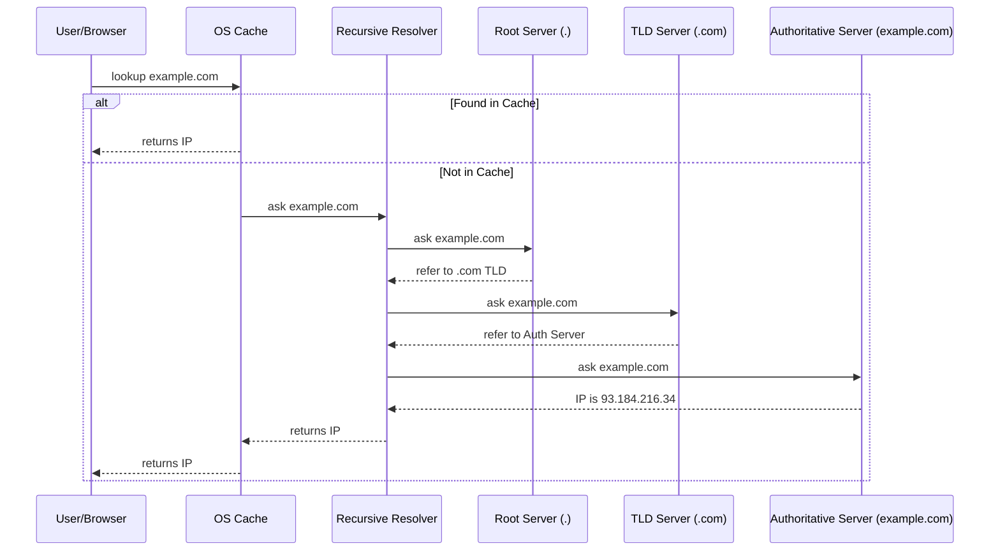
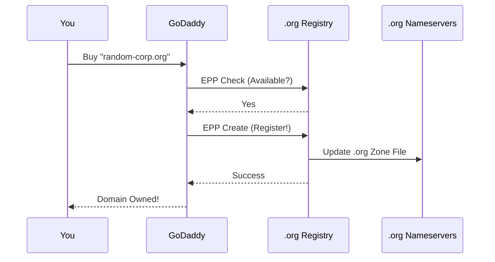
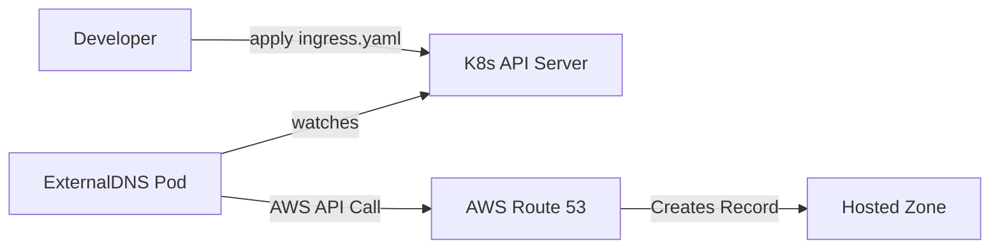
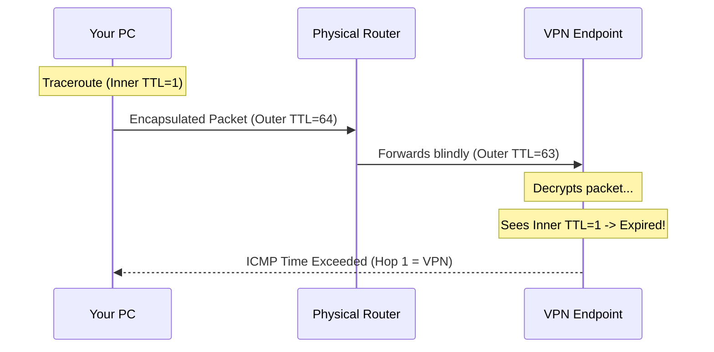

# 08_DNS_Deep_Dive

## 1. The Basics: What is DNS?

**DNS (Domain Name System)** is the "Phonebook of the Internet." Humans speak in names (`google.com`); Computers speak in numbers (`142.250.190.46`). DNS translates the former to the latter.

---

## 2. Mechanics: How Resolution Works

When you type a URL, your browser doesn't know where to go. It starts a "Lookup Chain."

### The 4 Layers of DNS Servers
1.  **Recursive Resolver (The Librarian)**: Usually your ISP or Google (8.8.8.8). It does the legwork of asking around for you.
2.  **Root Server (.)**: The top of the hierarchy. It knows where the `.com`, `.org`, etc., servers are.
3.  **TLD Server (.com)**: Managed by registries (like Verisign). It knows which company (Registrar) manages a specific domain.
4.  **Authoritative Nameserver (ns1.google.com)**: The final boss. It holds the actual IP address.

### The Resolution Diagram (`example.com`)

---

## 3. Ownership: Buying & Controlling a Domain

This section explains the business logic behind the technical records.

### Scenario 1: Purchasing a Domain (The EPP Flow)
When you buy `random-corp.org` from GoDaddy:
1.  **Check**: GoDaddy asks the Registry (Public Interest Registry for .org) if it's free.
2.  **Create**: You pay, and GoDaddy sends a "Create" command via **EPP** (Extensible Provisioning Protocol).
3.  **Update**: The Registry adds `random-corp.org` to the Global .org Zone File.

### The Power of "Zone Authority"
You bought `random-corp.org`. Suddenly, you can create `app.random-corp.org` for free. Why?
*   **The Rule**: Buying the domain makes you the **Dictator of the Zone**.
*   **The Mechanics**: The Registry directs all traffic for `*.random-corp.org` to your nameservers. Once traffic reaches you, you can create infinite subdomains (rows in your text file) without asking anyone.

### Security: Chain of Trust
**Question**: Can I just create a record for `google.com` on my server?
**Answer**: Yes, but nobody will listen.
*   The Internet trusts the Root.
*   The Root says `.com` is boss.
*   The `.com` server says "Go to Google's Nameservers", not yours.
*   Therefore, your fake record is ignored. This is the **Chain of Trust**.

---

## 4. Management: Configuring Your Domain

### Scenario 2: Delegation (Switching Nameservers)
You want to move from GoDaddy to Cloudflare. This is called **Delegation**.
1.  **Cloudflare**: Gives you nameservers `bob.ns.cloudflare.com`.
2.  **GoDaddy**: You paste these new names into your dashboard.
3.  **Registry**: GoDaddy tells the Registry: "Update the pointer. `random-corp.org` is now handled by Cloudflare."

*Propagation Delay occurs because ISPs worldwide cached the old "GoDaddy" pointer and need time to forget it.*

### The CNAME Mechanism (Aliasing)
Sometimes you don't want to point to an IP. You want to point to another name.
*   **Use Case**: Hosting a blog on `bestbloghost.com`.
*   **Record**: `blog.random-corp.org` **CNAME** `user-site.bestbloghost.com`.
*   **Indirection**: If the blog host changes their IP, your site still works because it just follows the *name*.

---

## 5. Advanced: Cloud & Kubernetes

In the modern cloud, IPs change every minute. Hardcoding A Records is impossible.

### The "Alias" Record & ExternalDNS
You have a Kubernetes cluster running an Ingress.
1.  **The Problem**: The Load Balancer's IP changes.
2.  **The Solution**: An **AWS Alias Record**. It looks like an A Record but points to a hostname (`elb.amazonaws.com`). AWS resolves this internally to the current IPs.
3.  **The Automation**: A tool called **ExternalDNS** runs in your cluster. It watches your Ingress and automatically talks to Route 53 to create these records.

---

## 6. Debugging: Traceroute & VPNs

### How Traceroute Works (The TTL Trick)
Traceroute finds the path by intentionally failing.
1.  Packet 1: **TTL=1**. Reaches Router A. Router A sees TTL=0, kills it, sends "Time Exceeded". (Hop 1 Found).
2.  Packet 2: **TTL=2**. Reaches Router B. Router B kills it. (Hop 2 Found).

### The VPN "First Hop" Mystery
Why is Hop 1 often a private IP when using VPN?
*   **Encapsulation**: Your packet is wrapped inside an Outer Packet.
*   **Tunnel**: The physical routers only see the Outer Packet (TTL=64). They forward it blindly.
*   **Teleportation**: Your Inner Packet (TTL=1) effectively "teleports" through the internet inside the tunnel and only "expires" when it hits the VPN server.

