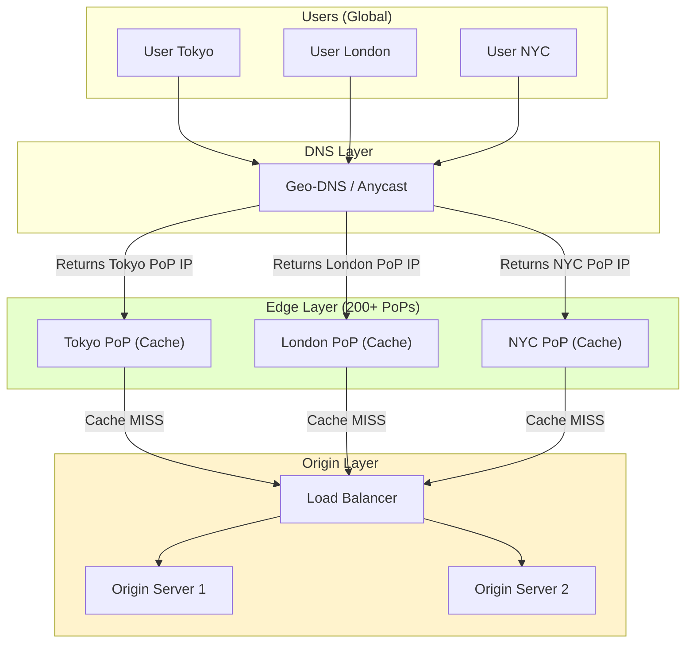

# 09. CDN (Content Delivery Network): Edge Caching at Internet Scale

## 1. Introduction

**Content Delivery Networks (CDNs)** are geographically distributed systems of edge servers that cache and deliver web content from locations closest to end users. By serving content from the network edge rather than a centralized origin, CDNs dramatically reduce latency, improve performance, and protect origin infrastructure from traffic spikes.

**Problem It Solves**:
- **Latency = Distance**: A user in Tokyo fetching from a New York server waits for light to travel 11,000 km (70ms RTT minimum)
- **Origin Overload**: Single server handles 100% of global traffic → bottleneck and failure risk
- **Bandwidth Costs**: All traffic through origin's network connection
- **DDoS Vulnerability**: Direct attacks on origin infrastructure

**Key Differentiator**: CDNs transform a single-server architecture into a distributed edge network. Instead of every user hitting the origin, 90%+ of requests are served from nearby cache servers (PoPs - Points of Presence), reducing latency by 5-10x and offloading 60-90% of bandwidth from the origin.

**Industry Adoption**:
- **Akamai**: Delivers 15-30% of all web traffic globally, 240k+ servers in 135 countries
- **Cloudflare**: 310+ cities, 100+ Tbps capacity, free tier for millions of websites
- **AWS CloudFront**: Integrated with S3, Lambda@Edge for edge compute
- **Fastly**: Real-time purging, VCL customization for advanced use cases
- **Netflix**: Custom CDN (Open Connect) with 17k+ servers inside ISP networks

**Historical Context**: Early web (1995-2000) relied on "mirror sites" - manual content duplication across regions. Akamai pioneered commercial CDNs in 1998 to handle Flash crowds (SlashDot effect). Modern CDNs evolved from simple caching proxies to sophisticated edge platforms with compute (Cloudflare Workers), security (WAF, DDoS protection), and analytics.

**Performance Impact**:
- **Latency reduction**: 200ms → 20ms (10x improvement)
- **Bandwidth savings**: 60-90% of traffic served from cache
- **Availability**: 99.99%+ uptime with multi-PoP redundancy
- **DDoS mitigation**: Absorb 10+ Tbps attacks at the edge

---

## 2. Core Architecture

A CDN consists of four primary layers working together to deliver content efficiently.



### Key Components

**1. Origin Server (Source of Truth)**:
- Master copy of all content (HTML, images, videos, API responses)
- Typically behind load balancer with multiple replicas
- Handles cache MISS requests (10-40% of traffic with CDN)
- Example: `origin.mysite.com` resolves to your data center

**2. Edge Servers / PoPs (Point of Presence)**:
- **Location**: Inside ISP networks, major cities (200-300 globally)
- **Storage**: SSD/NVMe for cached content (hot tier: RAM, cold tier: disk)
- **Software**: Nginx, Varnish, Apache Traffic Server
- **Capacity**: 10-100 Gbps per PoP
- **Function**: HTTP cache + TLS termination + origin connection pooling

**3. DNS Layer (User → Edge Routing)**:

**Option A: Geo-DNS** (Traditional):
```
User in India queries: www.cdn.example.com
DNS server checks requester IP geolocation
Returns: Mumbai PoP IP (203.0.113.10)
```

**Option B: Anycast** (Modern):
```
All edge servers announce SAME IP (e.g., 1.1.1.1)
BGP routing guides user to topologically nearest PoP
Client connects to "same" IP, reaches closest server
```

**4. Backhaul Network (Edge ↔ Origin)**:
- Private peering connections between PoPs and origin
- Faster than public internet (dedicated fiber, optimized routing)
- Example: AWS CloudFront uses AWS backbone, not public internet

---

## 3. How It Works: Caching Strategies

### A. Pull CDN (Lazy Loading) - Default Strategy

**Model**: Edge servers start empty, fetch content on-demand

**Flow**:
```
Request 1 (Cache MISS):
1. User → Edge: GET /image.jpg
2. Edge checks cache: Key not found
3. Edge → Origin: Fetch /image.jpg (backhaul trip)
4. Origin → Edge: 200 OK + content + Cache-Control: max-age=86400
5. Edge: Store in cache (TTL = 24 hours)
6. Edge → User: Serve content
   Time: 200ms (origin latency)

Request 2 (Cache HIT):
1. User → Edge: GET /image.jpg
2. Edge checks cache: Key found, not expired
3. Edge → User: Serve from cache
   Time: 20ms (edge latency only)
```

**Pros**:
- Zero configuration (transparent caching)
- Automatic cache warming based on actual traffic
- No storage costs for unused content

**Cons**:
- **First-user penalty**: Initial request slow
- **Cache stampede risk**: Popular item expires → 1000s of simultaneous origin requests

---

### B. Push CDN (Proactive Distribution)

**Model**: Upload content to CDN storage before users request it

**Flow**:
```
Deployment:
1. Developer: Upload video.mp4 to CDN API/S3
2. CDN: Distribute to all edge servers (or on-demand to PoPs)
3. Content instantly available globally

User Request:
1. User → Edge: GET /video.mp4
2. Edge: Already cached (100% hit rate from minute 1)
3. Edge → User: Serve immediately
   Time: 20ms (no origin trip ever)
```

**Pros**:
- **Instant cache hit ratio**: 100% from deployment
- **Origin protection**: Zero traffic for pushed content
- **Predictable performance**: No first-user penalty

**Cons**:
- Higher storage costs (pay for all content, not just popular)
- Manual upload workflows (CI/CD integration required)
- Purge complexity (invalidate across all PoPs)

**Use Case: "Viral Event Protection"**:
```
Scenario: Influencer with 100M followers posts photo

Without Push CDN:
  t=0: Post goes live, 1M fans click instantly
  Edge: Empty cache, all MISS
  Origin: 1M requests in 1 second → Crash (Thundering Herd)

With Push CDN:
  t=-5min: Upload photo to CDN
  t=0: Post goes live, 1M fans click
  Edge: Cache HIT for 100% of requests
  Origin: 0 requests → Safe
```

---

### C. Cache Key Logic (Critical for Hit Ratio)

**Base Key**: URL
```
GET /image.jpg → Cache key: /image.jpg
```

**Query String Handling**:
```
GET /image.jpg?v=1.2 → Different key than /image.jpg
GET /image.jpg?utm_source=fb → Should this be different?

Configuration:
  - Ignore tracking params: utm_*, fbclid, etc.
  - Include version params: v=*, hash=*
```

**Vary Header (Content Negotiation)**:
```
Request 1: Accept-Encoding: gzip
  → Cache key: /image.jpg|gzip

Request 2: Accept-Encoding: br (Brotli)
  → Cache key: /image.jpg|br

Separate cache entries for different encodings
```

---

## 4. Deep Dive: HTTP Cache Mechanics

### A. Cache-Control Directives

**Origin Response Headers**:

```http
HTTP/1.1 200 OK
Cache-Control: max-age=3600
Content-Type: image/jpeg
Content-Length: 524288

[image data]
```

**Directive Reference**:

| Directive | Meaning | CDN Behavior |
|:----------|:--------|:-------------|
| `max-age=3600` | Fresh for 1 hour | Cache for 1 hour, serve without revalidation |
| `s-maxage=86400` | CDN-specific TTL | Override max-age for shared caches (24h for CDN, 1h for browser) |
| `public` | Cacheable by anyone | CDN + browser can cache |
| `private` | Browser-only | CDN must NOT cache (user-specific data) |
| `no-cache` | Must revalidate | CDN caches but validates on every request (ETag check) |
| `no-store` | Never cache | CDN passes through, doesn't store |
| `stale-while-revalidate=86400` | Serve stale during revalidation | If origin down, serve stale for 24h while retrying |
| `stale-if-error=86400` | Serve stale on error | Origin 5xx → serve stale |

**Example: Static Asset**:
```http
Cache-Control: public, max-age=31536000, immutable
```
Meaning: Cache for 1 year, content never changes (use cache busting: /app.v2.js)

**Example: API Response**:
```http
Cache-Control: public, max-age=60, s-maxage=300
```
Meaning: Browser cache 1 min, CDN cache 5 min

**Example: User Dashboard**:
```http
Cache-Control: private, no-cache
```
Meaning: Browser validates on every page load, CDN doesn't cache

---

### B. Cache Validation (Avoiding Unnecessary Transfers)

**Strong Validation (ETag)**:

```http
First Request:
  User → Edge: GET /api/data
  Edge → Origin: GET /api/data
  Origin → Edge:
    HTTP/1.1 200 OK
    ETag: "v2-abc123"
    Cache-Control: max-age=60
    {"result": "data"}
  Edge: Store with ETag

After 60 seconds (expired):
  User → Edge: GET /api/data
  Edge → Origin:
    GET /api/data
    If-None-Match: "v2-abc123"
  
  If unchanged:
    Origin → Edge:
      HTTP/1.1 304 Not Modified
      ETag: "v2-abc123"
      (no body!)
    Edge: Refresh TTL, serve cached body
  
  If changed:
    Origin → Edge:
      HTTP/1.1 200 OK
      ETag: "v3-xyz789"
      {"result": "new data"}
    Edge: Update cache
```

**Bandwidth Savings**: 304 response = ~200 bytes vs 200 response = 5KB (25x reduction)

**Weak Validation (Last-Modified)**:
```http
Response:
  Last-Modified: Mon, 01 Jan 2024 12:00:00 GMT

Revalidation Request:
  If-Modified-Since: Mon, 01 Jan 2024 12:00:00 GMT

Response:
  304 Not Modified (if not modified after that time)
```

---

### C. Edge Server Internals

**Architecture**:
```
Edge Server (Single PoP)
├─ Nginx/Varnish (HTTP layer)
│   ├─ TLS termination (Let's Encrypt)
│   ├─ HTTP/2, HTTP/3 support
│   └─ Request routing
├─ Cache Storage
│   ├─ Hot tier: RAM (16-256GB) - frequently accessed
│   ├─ Warm tier: SSD (1-10TB) - recently accessed
│   └─ Cold tier: HDD (optional, rarely accessed)
├─ Cache Index (Redis)
│   └─ Key → Storage location mapping
├─ Origin Connection Pool
│   └─ Keep-alive connections to origin (reuse TCP)
└─ Monitoring Agent
    └─ Metrics: Hit ratio, latency, errors
```

**Cache Eviction Policies**:

**LRU (Least Recently Used)** - Default:
```
Cache full, need space for new item
Evict: Item accessed longest ago
Pro: Protects frequently accessed content
Con: One-hit wonders waste space
```

**LFU (Least Frequently Used)**:
```
Cache full
Evict: Item with lowest access count
Pro: Keeps truly popular content
Con: New popular content slow to cache
```

**TTL-Based**:
```
Item expires (max-age exceeded)
Evict: Expired items first
Pro: Respects origin's cache intent
Con: Popular expired items removed
```

---

## 5. End-to-End Walkthrough: User Request Flow

**Scenario**: User in Tokyo requests `https://cdn.example.com/image.jpg` (500KB image)

### Step 1: DNS Resolution (50ms)

```
User: Resolve cdn.example.com

Local DNS → CDN's Geo-DNS:
  Query: cdn.example.com A?
  Source IP: 203.0.113.5 (Tokyo ISP)

CDN Geo-DNS:
  1. Lookup IP geolocation: Tokyo, Japan
  2. Find nearest PoPs: Tokyo (5ms away), Osaka (20ms)
  3. Check health: Tokyo PoP healthy
  4. Return: 203.0.113.100 (Tokyo PoP IP)

User's DNS cache: cdn.example.com → 203.0.113.100 (TTL=60s)
Time: 50ms
```

### Step 2: TCP + TLS Handshake (15ms)

```
User (Tokyo) → Edge (Tokyo, 5ms away):

TCP 3-way handshake:
  SYN → (5ms RTT)
  SYN-ACK ← (5ms RTT)
  ACK → (5ms RTT)
  Total: 1.5 RTT = 7.5ms

TLS 1.3 handshake:
  ClientHello → 
  ServerHello + Certificate + Finished ←
  Finished →
  Total: 1 RTT = 5ms (TLS 1.3, vs 2 RTT for TLS 1.2)

Connection established: 12.5ms
Edge terminated TLS (origin connection: plain HTTP over private network)
```

### Step 3: HTTP Request - Cache MISS (200ms)

```
User → Edge:
  GET /image.jpg HTTP/2
  Host: cdn.example.com
  Accept-Encoding: br, gzip
  If-None-Match: (none - first request)

Edge Cache Check:
  Key: /image.jpg|br
  Result: MISS (not in cache)

Edge → Origin (USA, 150ms away via backhaul):
  GET /image.jpg HTTP/1.1
  Host: origin.example.com
  Accept-Encoding: br
  X-Forwarded-For: 203.0.113.5 (user IP)

Origin → Edge (150ms):
  HTTP/1.1 200 OK
  Cache-Control: public, max-age=86400
  Content-Type: image/jpeg
  Content-Encoding: br
  ETag: "img-v1-hash123"
  Content-Length: 350000
  [350KB Brotli-compressed data]

Edge Actions:
  1. Store in cache:
     - Key: /image.jpg|br
     - Value: Response headers + body
     - TTL: 86400 seconds (24 hours)
     - Storage: SSD (warm tier)
  2. Stream to user concurrently
  3. Update metrics: cache_miss++

Edge → User (5ms):
  HTTP/2 200 OK
  [350KB data]

Total Time: 50ms (DNS) + 12.5ms (handshake) + 150ms (origin) + 5ms (edge→user) = 217.5ms
```

### Step 4: Second User - Cache HIT (17.5ms)

```
User 2 (Tokyo) → Edge:
  GET /image.jpg HTTP/2

Edge Cache Check:
  Key: /image.jpg|br
  Result: HIT (cached 5 seconds ago, TTL remaining: 86395s)

Edge → User 2:
  HTTP/2 200 OK
  Age: 5 (seconds since cached)
  [350KB data from SSD]

Total Time: 12.5ms (handshake) + 5ms (edge retrieval) = 17.5ms

Improvement: 217.5ms → 17.5ms (12x faster!)
Origin traffic: 0 (100% offload)
```

### Step 5: After 24 Hours - Revalidation (52.5ms)

```
User 3 → Edge:
  GET /image.jpg

Edge Cache Check:
  Key found, but TTL expired (86400s passed)

Edge → Origin:
  GET /image.jpg
  If-None-Match: "img-v1-hash123"

Origin Checks:
  Image unchanged (same hash)

Origin → Edge:
  HTTP/1.1 304 Not Modified
  ETag: "img-v1-hash123"
  Cache-Control: public, max-age=86400
  (no body - saves 350KB transfer!)

Edge Actions:
  1. Refresh TTL: 86400 seconds
  2. Serve cached body

Edge → User 3:
  HTTP/2 200 OK
  [350KB from cache]

Total Time: 12.5ms (handshake) + 150ms (304 check) + 5ms = 167.5ms
Bandwidth saved: 350KB (only 200-byte 304 response sent)
```

---

## 6. Failure Scenarios (The Senior View)

### Scenario A: Origin Server Failure

**Symptom**: Edge receives 502 Bad Gateway or timeout from origin

**Mechanism**:
```
Timeline:
t=0: Origin deployment fails, all servers down
t=0.1s: Edge health check detects failure (3 consecutive 5xx)
t=0.2s: Edge marks origin as unhealthy
t=1s: Cache MISS arrives at edge

Edge Decision Tree:
1. Check cache: MISS
2. Attempt origin fetch: Connection refused
3. Check stale cache: Available (expired 10 min ago)
4. Serve stale content (if configured)

Response:
  HTTP/1.1 200 OK
  Warning: 110 Response is Stale
  Age: 86400
  [stale content]
```

**Configuration**:
```http
Origin Response (when healthy):
Cache-Control: max-age=3600, stale-while-revalidate=86400, stale-if-error=86400

Meaning:
- Fresh for 1 hour
- If origin down while revalidating: serve stale for 24 hours
- If origin returns 5xx: serve stale for 24 hours
```

**The Fix**:

**Short-term**: Stale content keeps site operational

**Long-term**:
1. **Multiple origins**: Edge fails over to backup origin
   ```
   Primary: origin1.example.com (USA East)
   Backup: origin2.example.com (USA West)
   ```

2. **Origin health checks**: 5s interval, 3 failures = unhealthy

3. **Monitoring**: Alert on origin error rate > 1%

---

### Scenario B: Cache Poisoning

**Attack**: Malicious actor poisons cache with harmful content

**Mechanism**:
```
Attacker Request:
  GET /api/user?callback=<script>alert(document.cookie)</script>

If CDN caches full URL as key:
  Cache Key: /api/user?callback=<script>...
  
Origin Response (vulnerable):
  HTTP/1.1 200 OK
  Content-Type: application/json
  {"result": "data", "callback": "<script>alert..."}

CDN caches poisoned response

Victim Request:
  GET /api/user?callback=processData
  
CDN checks cache:
  Partial match on /api/user
  Serves poisoned response (if cache key includes malicious param)

Victim's browser executes: alert(document.cookie) → XSS!
```

**The Fix**:

**Option 1: Cache Key Normalization**
```
Ignore dangerous query parameters:
  - callback, jsonp
  - Anything with <script>, javascript:
  
Cache Key: /api/user (without query string)
```

**Option 2: Validate Origin Responses**
```
CDN checks response before caching:
  - Content-Type matches expected (JSON, not HTML)
  - No script tags in JSON responses
  - Reject suspicious patterns
```

**Option 3: Set Proper Cache Headers**
```http
Dynamic Endpoint Response:
Cache-Control: private, no-store
```

**Monitoring**:
```
Alert: Unusual cache keys with suspicious patterns
  - script, eval, onerror in URLs
  - Sudden spike in unique cache keys
```

---

### Scenario C: DDoS Amplification at Edge

**Attack**: Flood uncacheable endpoint to bypass CDN protection

**Mechanism**:
```
Normal traffic:
  90% cache HIT (static assets)
  10% cache MISS (API, dynamic pages)
  Origin handles: 10% of traffic ✅

Attack traffic:
  Attacker: 1M requests/sec to /api/login (uncacheable)
  Cache MISS rate: 100%
  Origin receives: 1M requests/sec → Overwhelmed ❌
```

**The Fix**:

**1. Rate Limiting at Edge**:
```
Configuration:
  /api/login: 10 requests/min per IP
  /api/*: 100 requests/min per IP
  
Exceeds limit:
  429 Too Many Requests (served by edge, origin protected)
```

**2. Challenge (CAPTCHA) for Suspicious Traffic**:
```
Heuristics:
  - IP with no previous traffic
  - User-Agent: curl, python-requests (bots)
  - Missing browser cookies/headers
  
Action: Serve CAPTCHA challenge page
  Legitimate user: Solves, gets cookie, continues
  Bot: Fails, blocked at edge
```

**3. WAF (Web Application Firewall) Rules**:
```
Block patterns:
  - SQL injection attempts in query strings
  - Common vulnerability scanners (sqlmap, nikto)
  - Known bad IP ranges (Tor exit nodes, botnets)
```

**4. Origin Shield (Cache Layer)**:
```
Architecture:
  User → Edge PoP → Origin Shield → Origin

Origin Shield:
  - Single cache layer in front of origin
  - Coalesces requests from multiple edge PoPs
  - Reduces origin load by 90%+
  
Example:
  100 edge PoPs each send 100 req/s (cache miss)
  → Origin Shield receives 10,000 req/s
  → Coalesces to 100 unique requests
  → Origin receives 100 req/s (99% reduction)
```

---

### Scenario D: Cache Stampede (Thundering Herd)

**Problem**: Popular cached item expires, causing simultaneous origin requests

**Mechanism**:
```
State:
  - /video.mp4 cached with TTL=3600s (1 hour)
  - Receives 10,000 requests/sec (popular video)
  - All requests: cache HIT (origin idle)

t=3600s: Cache expires

t=3600.1s: 10,000 requests arrive simultaneously
  All check cache: MISS (just expired)
  All forward to origin: 10,000 concurrent requests
  Origin: Overloaded, responds slowly (5 seconds)
  
Problem: 5s × 10,000 req/s = 50,000 pending requests to origin!
```

**The Fix: Request Coalescing (Cache Lock)**:

```
First Request (t=3600.1s):
  1. Check cache: MISS
  2. Acquire lock on cache key: /video.mp4
  3. Forward to origin
  4. State: IN_PROGRESS

Concurrent Requests (t=3600.1s - t=3605s):
  1. Check cache: MISS
  2. Check lock: LOCKED (another request in progress)
  3. Wait for lock to release (edge queues requests)
  
First Request Completes (t=3605s):
  1. Receives response from origin
  2. Stores in cache
  3. Releases lock
  4. Queued requests served from newly cached content

Result:
  Origin requests: 1 (instead of 50,000)
  User latency: First user 5s, others 5.05s (cached)
```

**Nginx Configuration**:
```nginx
proxy_cache_lock on;
proxy_cache_lock_timeout 10s;  # Max wait for lock
proxy_cache_use_stale updating;  # Serve stale while refreshing
```

---

## 7. Performance Tuning / Scaling Strategies

### Configuration Table

| Setting | Recommendation | Why? |
|:--------|:---------------|:-----|
| **TTL (max-age)** | Static: 7d, Dynamic: 1h | Balance freshness vs hit ratio |
| **s-maxage** | 2x max-age | CDN caches longer than browser |
| **stale-while-revalidate** | 24h - 7d | Serve stale during origin issues |
| **stale-if-error** | Match stale-while-revalidate | Origin 5xx → serve stale |
| **Cache key normalization** | Ignore tracking params | utm_*, fbclid increase hit ratio 10-20% |
| **Compression** | Brotli (br) > Gzip | 70% size reduction, 20% better than gzip |
| **TLS version** | TLS 1.3 minimum | 1-RTT handshake (vs 2-RTT for TLS 1.2) |
| **HTTP version** | HTTP/2 or HTTP/3 | Multiplexing, header compression |
| **Origin connection pooling** | 100-500 keep-alive conns | Reuse TCP, avoid handshake overhead |
| **Purge strategy** | Tag-based (not URL-based) | Purge all product pages with tag=product |

### Cache Hit Ratio Optimization

**Current**: 85% hit ratio → 15% origin traffic
**Target**: 95% hit ratio → 5% origin traffic (3x reduction!)

**Steps**:

**1. Analyze Cache Misses**:
```bash
# CDN analytics
GET /api/analytics/cache-misses

Top reasons:
1. New content (unavoidable): 40%
2. URL variations (fixable): 35%
3. Short TTLs (fixable): 15%
4. No-cache headers (review): 10%
```

**2. Normalize Cache Keys**:
```
Before:
  /image.jpg → cached
  /image.jpg?utm_source=fb → MISS (different key!)
  /image.jpg?fbclid=123 → MISS

After (normalized):
  /image.jpg?* → Same cache key
  Hit ratio: 85% → 92%
```

**3. Increase TTLs (where safe)**:
```
Static assets (versioned):
  Before: max-age=3600 (1 hour)
  After: max-age=31536000 (1 year) + cache busting (/app.v2.js)
  
API responses (acceptable staleness):
  Before: max-age=60 (1 min)
  After: max-age=300 (5 min) + stale-while-revalidate=3600
```

**4. Preload Popular Content (Hybrid Pull/Push)**:
```
Scenario: Product launch tomorrow

Strategy:
  1. Identify URLs: /product/new-phone, /images/phone-*.jpg
  2. Push to CDN 1 hour before launch
  3. Result: 100% hit ratio from minute 1
```

---

## 8. Constraints & Limitations

| Constraint | Limit | Why? |
|:-----------|:------|:-----|
| **Max file size** | 5-50GB (CDN-dependent) | Large files need chunked transfer or streaming |
| **Cache TTL maximum** | 1 year (31536000s) | Prevent indefinitely stale content |
| **Purge propagation** | 5-30 seconds globally | Edge servers poll for invalidations |
| **Request rate per PoP** | 100k-1M req/s | DDoS protection limit per location |
| **Geographic coverage** | 200-300 PoPs | Remote regions (Africa, Antarctica) may lack nearby edge |
| **TLS cert propagation** | 5-15 minutes | DNS + certificate sync across all PoPs |
| **Bandwidth pricing** | $0.02-0.15 per GB egress | Asia/Australia 3-5x more expensive than USA/Europe |
| **Purge operations** | 1000-10000 per min | API rate limits to prevent abuse |
| *Cache storage per PoP** | 1-100TB | Limited by SSD cost |

### Why Not CDN?

| Use Case | Reason |
|:---------|:-------|
| **Highly personalized content** | User dashboards, emails - no caching benefit (private data) |
| **Real-time data** | Stock prices, live scores - stale cache unacceptable |
| **Very low traffic** | <1000 users/day, single region - CDN cost > benefit |
| **Stateful applications** | WebSocket chats, gaming - CDN can't maintain connection state |
| **Regulatory constraints** | Data must stay in specific country - CDN distributes globally |

---

## 9. When to Use CDN?

| Use Case | Verdict | Why? |
|:---------|:--------|:-----|
| **Static assets (images, CSS, JS)** | **YES** ✅ | 10x latency reduction, 90% cache hit ratio, 60% bandwidth savings |
| **Video streaming (VOD)** | **YES** ✅ | Massive bandwidth offload, adaptive bitrate from edge |
| **API responses (cacheable)** | **YES** ✅ | Reduce origin load 50-90%, sub-100ms response times |
| **Software downloads** | **YES** ✅ | Offload bandwidth (1GB download from origin → edge) |
| **DDoS protection** | **YES** ✅ | Edge absorbs attack (10+ Tbps capacity) |
| **Global audience** | **YES** ✅ | Reduce latency from 300ms → 30ms for distant users |
| **User dashboards (uncacheable)** | **NO** ❌ | Private data, no cache benefit, adds latency |
| **Real-time trading apps** | **NO** ❌ | Stale data unacceptable, need direct origin connection |
| **Single-region app** | **MAYBE** ⚠️ | DDoS protection valuable, but latency benefit minimal |

### CDN vs Alternatives

| Aspect | CDN | Object Storage (S3) | Reverse Proxy (Nginx) | Edge Compute (Cloudflare Workers) |
|:-------|:----|:--------------------|:----------------------|:----------------------------------|
| **Distribution** | Global (200+ PoPs) | Regional (3-5 zones) | Single server | Global (edge functions) |
| **Latency** | 10-50ms | 50-200ms | 1-10ms (origin-local) | 10-30ms |
| **Caching** | Automatic | Manual (client-side) | Manual config | Programmable |
| **Bandwidth cost** | $0.05-0.15/GB | $0.02-0.09/GB | Included (server) | $0.50/million requests |
| **DDoS protection** | Built-in | Limited | None | Built-in |
| **Dynamic content** | Pass-through | Static only | Supports | Full compute (API generation) |
| **Setup complexity** | Low (DNS change) | Low | Medium | Medium (code required) |

---

## 10. Production Checklist

1. [ ] **Set Cache-Control headers**: max-age for all responses (static: 7d, dynamic: 5m)
2. [ ] **Enable stale-while-revalidate**: 24h-7d for resilience during origin issues
3. [ ] **Normalize cache keys**: Ignore utm_*, fbclid, affiliate tracking parameters
4. [ ] **Enable compression**: Brotli (br) at edge, fallback to gzip
5. [ ] **Configure TLS 1.3**: Faster handshakes (1-RTT), enable HTTP/2 or HTTP/3
6. [ ] **Set up origin health checks**: 5s interval, 3 failures = unhealthy, auto-failover
7. [ ] **Implement purge webhooks**: Auto-purge on deployments (CI/CD integration)
8. [ ] **Enable WAF rules**: SQL injection, XSS, known bot signatures
9. [ ] **Configure rate limiting**: 100 req/min per IP for APIs, 1000 for static assets
10. [ ] **Monitor cache hit ratio**: Target > 90% for static, > 50% for dynamic
11. [ ] **Set up alerting**: Origin error rate > 1%, hit ratio drop > 10%, purge failures
12. [ ] **Test failover**: Simulate origin down, verify stale content serves

### Critical Metrics

```
cache_hit_ratio: > 90% (static), > 50% (dynamic)
  Low ratio = poor cache headers, URL variations, or short TTLs

edge_response_time_p95: < 50ms
  Global PoP coverage ensures low latency

origin_request_rate: < 10% of total requests
  CDN should handle 90%+ at edge

bandwidth_offload: > 60%
  Measure: (Total bandwidth - Origin bandwidth) / Total bandwidth

purge_propagation_time: < 30 seconds
  Critical for hotfixes, measure 95th percentile

ssl_handshake_time_p95: < 100ms
  TLS 1.3 + session resumption = fast

cache_miss_backend_time_p95: < 300ms
  Time for origin to respond on cache MISS
  
error_rate_5xx: < 0.1%
  Origin health + stale-if-error protects against spikes
```

### Monitoring Commands

```bash
# Check cache headers (from edge)
curl -I https://cdn.example.com/image.jpg | grep -i cache

Output:
  cache-control: public, max-age=86400
  age: 3456 (seconds since cached)
  x-cache: HIT (or MISS)

# Test from multiple regions
for region in us-east eu-west ap-southeast; do
  curl -w "Region: $region, Time: %{time_total}s\n" \
    -o /dev/null -s https://cdn.example.com/image.jpg
done

# Verify edge server (not origin IP)
dig cdn.example.com +short
  # Should return edge IP (203.0.*), not origin (10.0.*)

# Check TLS version
openssl s_client -connect cdn.example.com:443 -tls1_3

# Purge cache (API example)
curl -X POST https://api.cdn.com/purge \
  -H "Authorization: Bearer $TOKEN" \
  -d '{"urls": ["/image.jpg"], "tags": ["product-123"]}'
```

### Alerting Rules

```
Alert: cache_hit_ratio < 80% for 10 minutes
Action: Check for:
  - Deployment changing URLs
  - New tracking parameters polluting cache keys
  - Aggressive purges

Alert: origin_request_rate > 20% for 5 minutes
Action:
  - Verify cache headers on new endpoints
  - Check for cache bypass (cookies, Authorization headers)

Alert: purge_failures > 10 per hour
Action: Check CDN API status, verify auth tokens

Alert: edge_p95_latency > 100ms
Action: Investigate:
  - Specific PoP degradation
  - Origin response time increase
  - Network path issues

Alert: ssl_errors > 100 per minute
Action:
  - Certificate expiration check
  - TLS version compatibility
```

---

**Remember**: CDNs transform latency from a function of distance (physics) to a function of cache effectiveness (engineering). Optimizing cache hit ratio through proper headers, key normalization, and TTL tuning delivers 90%+ traffic from edge servers, reducing latency 5-10x while protecting origin infrastructure from overload and attacks.
