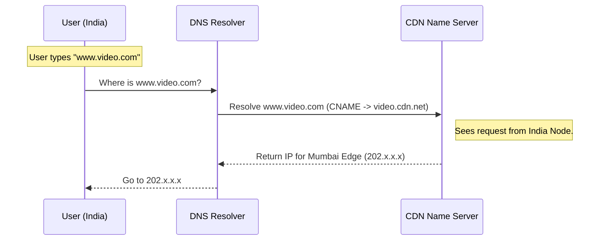
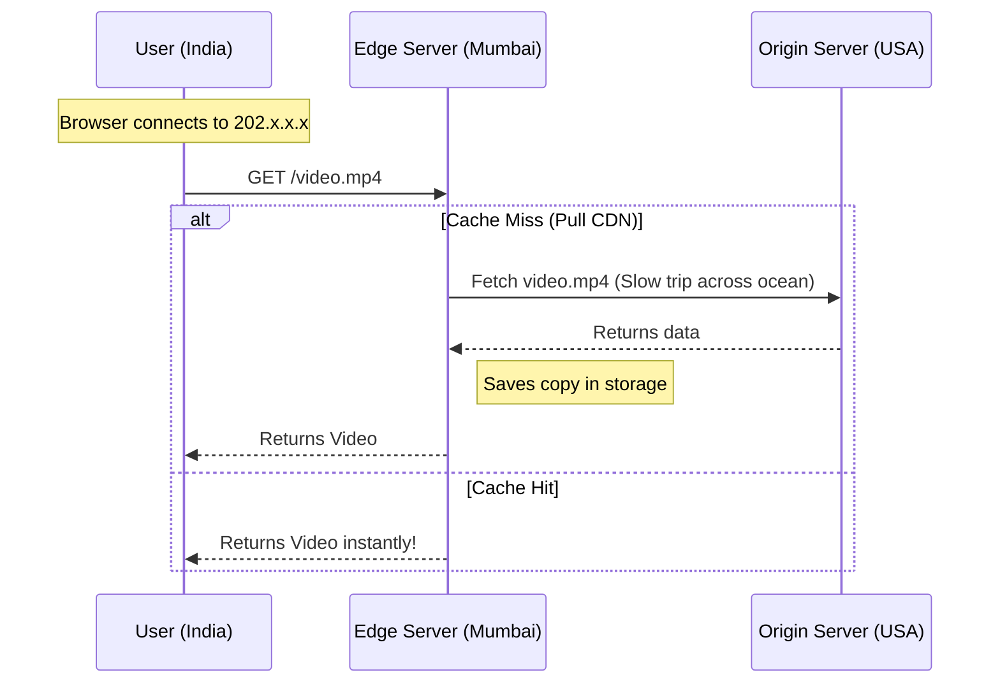
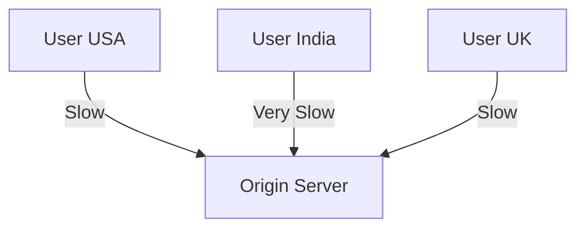
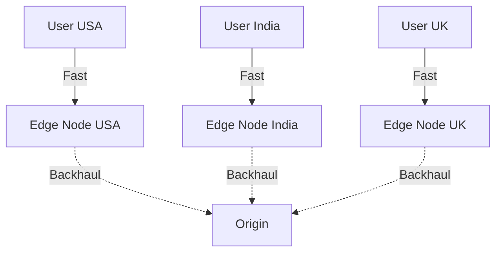

# 09_CDN_Deep_Dive

## 1. The Concept: Problem & Solution

### The Problem: Latency & Physics
Without a CDN, every user in the world must fetch data from your single **Origin Server** (e.g., in New York).
*   **Latency**: A user in Tokyo waits for light to travel halfway across the world.
*   **Load**: The Origin server takes 100% of the traffic.
*   **Risk**: If the Origin goes down, the site goes down globally.

### The Solution: Content Delivery Network (CDN)
A CDN is a distributed network of servers (Edge Nodes) that act as a "middleman," caching content closer to the user to reduce latency and protect the Origin.

---

## 2. Architecture: The Players

1.  **Origin Server**: The "Source of Truth." It holds the master copy of your website (HTML, images, DB).
2.  **Edge Servers (PoPs)**: Distributed servers located inside ISPs and major cities globally. They store copies of the content.

---

## 3. Strategies: Getting Data to the Edge

How does the file get from New York (Origin) to Tokyo (Edge)? There are two main strategies.

### A. Pull CDN (The Lazy Method) - *Standard*
*   **Mechanism**: The Edge Server sits empty. It only fetches files from the Origin when a user *asks* for them.
*   **Pros**: Zero maintenance. The CDN acts as a transparent cache.
*   **Cons**: The **First User Penalty**. The first request is a "Cache Miss" and is slow.

### B. Push CDN (The Proactive Method)
*   **Mechanism**: You manually **upload (push)** files to the CDN storage *before* users arrive.
*   **Pros**: **100% Cache Hit Ratio** instantly.
*   **Cons**: Higher storage costs; requires manual upload workflows.

### Real World Example: The "Influencer Post" (Why use Push?)
Imagine an Influencer posts a photo to 100M followers.
1.  **Pull CDN**: 1M fans click instantly. The Edge is empty. All 1M requests hit the Origin. **Origin Crashes (Thundering Herd)**.
2.  **Push CDN**: You upload the photo 5 mins early. The Edge is warm. 1M fans click. All 1M requests hit the Edge. **Origin Sleeps**.

### Caching & TTL
*   **Cache Hit**: Edge has the file -> Serves instantly.
*   **Cache Miss**: Edge has no file -> Fetches from Origin -> Saves it -> Serves it.
*   **TTL (Time To Live)**: How long the Edge keeps the file (e.g., 24 hours) before refreshing it.

---

## 4. Backend Logic: How Edge Finds Origin

When a Cache Miss occurs, the Edge must find the Origin.

1.  **Configuration**: You tell the CDN your Origin is `origin.mysite.com`.
2.  **DNS Resolution**: The Edge Node acts as a client and resolves `origin.mysite.com` to an IP.
3.  **Load Balancing**: If you have multiple Origins, the CDN monitors them with **Health Checks**. If Origin A fails (500 Error), the Edge instantly retries with Origin B.

---

## 5. Frontend Logic: How User Finds Edge

How does a user in India find the *Mumbai* Edge node instead of New York?

### A. Anycast (The "One IP" Magic)
*   Multiple physical servers announce the **SAME IP Address** (e.g., `1.1.1.1`).
*   **BGP** (Internet Routing) automatically guides the user to the topologically closest node.

### B. Geo-DNS
*   The CDN's Nameserver looks at the user's IP.
*   "Oh, you are in India? Here is the IP for the Mumbai Node: `203.0.113.5`."

---

## 6. The User Journey (Diagrams)

### Phase 1: DNS Resolution (Finding the Edge)

### Phase 2: Content Delivery (Fetching the Data)

---

## 7. Network Topologies Compared

### A. Traditional Unicast (Slow)

### B. CDN Anycast (Fast)

