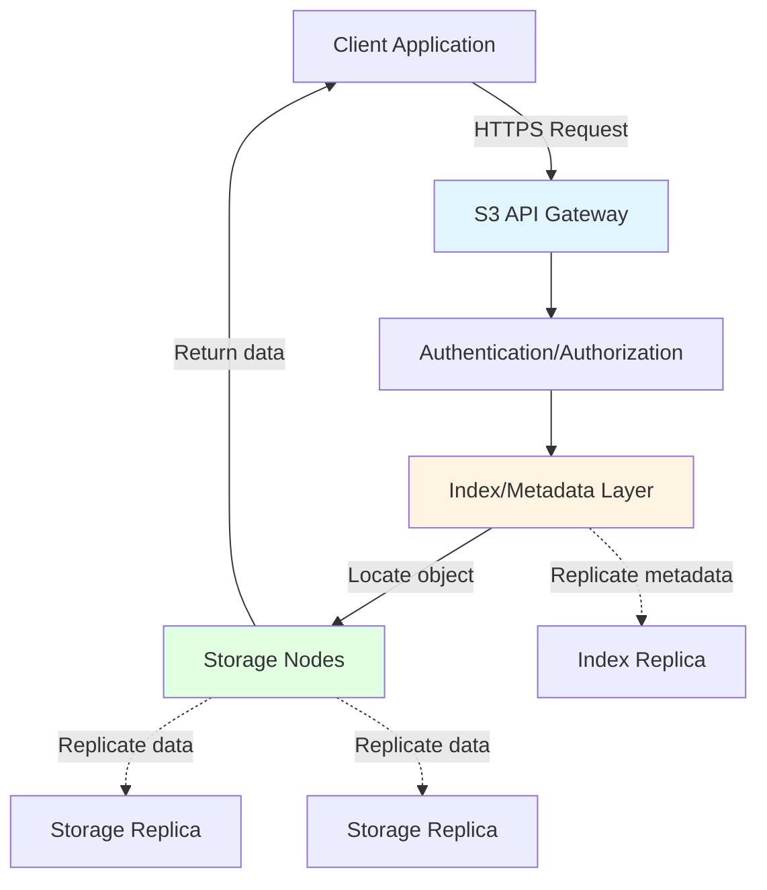
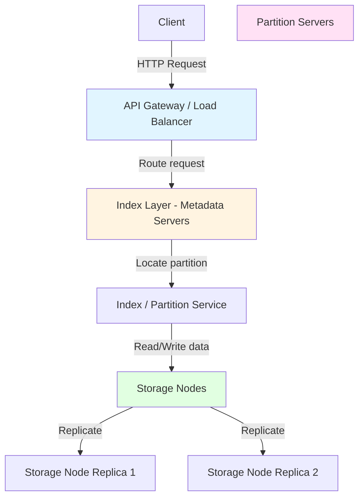
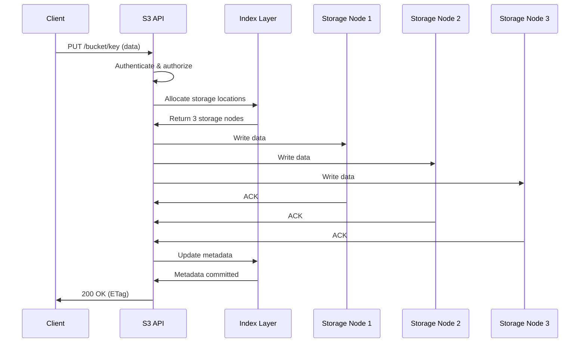
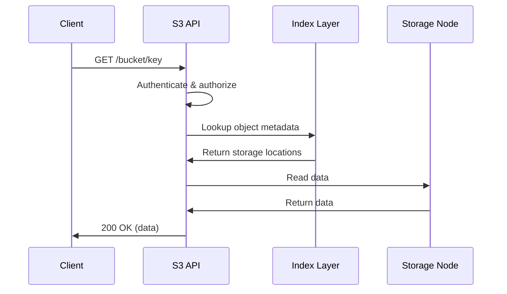

# Amazon S3 Internals: How It Works Behind the Scenes

This guide explains how Amazon S3 manages exabytes of data with 99.999999999% (11 nines) durability, covering architecture, partitioning, performance limits, and optimization strategies.

## Table of Contents
1. [Understanding Object Storage in S3](#understanding-object-storage-in-s3)
2. [S3 Architecture Overview](#s3-architecture-overview)
3. [Object Storage Model](#object-storage-model)
4. [Partitioning and Key Design](#partitioning-and-key-design)
5. [Performance Limits and Constraints](#performance-limits-and-constraints)
6. [Read and Write Operations](#read-and-write-operations)
7. [Consistency Model](#consistency-model)
8. [Durability and Replication](#durability-and-replication)
9. [Storage Classes and Lifecycle](#storage-classes-and-lifecycle)
10. [Optimization Strategies](#optimization-strategies)
11. [Comparison with Block and File Storage](#comparison-with-block-and-file-storage)

---

## Understanding Object Storage in S3

### What is an Object?

An **object** in S3 is a fundamental storage unit consisting of three components:

```
Object = Key + Data (Blob) + Metadata
```

Let's break down each component:

---

### 1. The Key (Object Identifier)

**What it is:**
- A **unique identifier** for the object within a bucket
- Like a file path, but it's just a string (not a real directory structure)
- Can be up to **1,024 bytes** long
- Case-sensitive

**Example keys:**
```
Simple key:
"photo.jpg"

Path-like key (looks like folders, but it's just a string):
"data/logs/2025/11/28/server-01/access.log"

The "/" characters are just part of the key name!
S3 has NO concept of directories - it's a flat namespace.
```

**Key anatomy:**
```
Key: "users/john/documents/report-2025.pdf"

Breakdown:
├── Full key: "users/john/documents/report-2025.pdf"
├── Prefix: "users/john/documents/"
├── Object name: "report-2025.pdf"
└── Delimiter: "/" (used by UI to simulate folders)

Important: S3 stores this as ONE string, not a hierarchy!
```

**How keys work internally:**
```
Bucket: my-bucket

Objects:
├── Key: "a.txt"
├── Key: "data/b.txt"
├── Key: "data/logs/c.txt"
└── Key: "data/logs/2025/d.txt"

Storage (flat):
my-bucket → {
  "a.txt": <object data>,
  "data/b.txt": <object data>,
  "data/logs/c.txt": <object data>,
  "data/logs/2025/d.txt": <object data>
}

No actual folders exist!
The "/" is just part of the key string.
```

---

### 2. The Data (Blob)

**What it is:**
- The actual **binary content** of the object
- Called a "blob" (Binary Large OBject)
- Can be **0 bytes to 5 TB** in size
- Stored as-is, S3 doesn't interpret the content

**Blob characteristics:**
```
Blob properties:
├── Immutable: Once written, cannot be partially modified
├── Opaque: S3 doesn't know or care what's inside
├── Atomic: Either fully written or not at all
└── Versioned: Each update creates a new blob (if versioning enabled)
```

**Example blobs:**
```
Object 1:
├── Key: "image.jpg"
└── Blob: [JPEG binary data, 2 MB]
    ├── Bytes: 0xFF 0xD8 0xFF 0xE0 ... (JPEG header)
    └── Content: Actual image pixels

Object 2:
├── Key: "data.json"
└── Blob: [JSON text, 1 KB]
    ├── Bytes: 0x7B 0x22 0x6E ... (UTF-8 encoded)
    └── Content: {"name": "John", "age": 30}

Object 3:
├── Key: "video.mp4"
└── Blob: [MP4 binary data, 500 MB]
    └── Content: Video frames, audio, metadata
```

**Blob immutability:**
```
Original blob:
Key: "config.json"
Blob: {"version": 1, "timeout": 30}
Size: 32 bytes

Want to change timeout to 60?

❌ Cannot do this:
"Modify byte 25 from '3' to '6'"

✅ Must do this:
1. Download entire blob (32 bytes)
2. Modify locally: {"version": 1, "timeout": 60}
3. Upload new blob (32 bytes)
4. Old blob is replaced (or kept if versioning enabled)

Result: New blob with new ETag
```

---

### 3. The Metadata

**What it is:**
- **Key-value pairs** describing the object
- Two types: **System metadata** and **User metadata**
- Stored separately from the blob
- Used for object management and retrieval

#### System Metadata (Managed by S3)

```
System metadata (automatically set by S3):

├── Content-Type: "image/jpeg"
│   └── MIME type of the object
│
├── Content-Length: 2097152
│   └── Size in bytes (2 MB)
│
├── Last-Modified: "2025-11-28T10:00:00Z"
│   └── Timestamp of last modification
│
├── ETag: "686897696a7c876b7e"
│   └── MD5 hash of the object (for integrity)
│
├── Storage-Class: "STANDARD"
│   └── Which storage tier (STANDARD, GLACIER, etc.)
│
├── Version-ID: "3HL4kqtJlcpXroDTDmJ+rmSpXd3dIbrHY"
│   └── Unique version identifier (if versioning enabled)
│
└── Server-Side-Encryption: "AES256"
    └── Encryption method used
```

#### User Metadata (Custom Key-Value Pairs)

```
User metadata (set by you):

Prefix: x-amz-meta-

├── x-amz-meta-author: "john.doe"
├── x-amz-meta-department: "engineering"
├── x-amz-meta-project: "analytics"
├── x-amz-meta-uploaded-by: "data-pipeline-v2"
└── x-amz-meta-classification: "confidential"

Limits:
├── Max size: 2 KB total for all user metadata
├── Keys: Must start with "x-amz-meta-"
└── Values: UTF-8 strings
```

**Complete object example:**
```
PUT https://my-bucket.s3.amazonaws.com/reports/2025/Q4-sales.pdf

Request headers:
Content-Type: application/pdf
x-amz-meta-author: jane
x-amz-meta-quarter: Q4
x-amz-meta-year: 2025

S3 stores:
┌─────────────────────────────────────┐
│ KEY                                 │
│ "reports/2025/Q4-sales.pdf"        │
├─────────────────────────────────────┤
│ BLOB (Data)                         │
│ [PDF binary content, 5 MB]          │
│ %PDF-1.4...                         │
├─────────────────────────────────────┤
│ SYSTEM METADATA                     │
│ ├── Content-Type: application/pdf  │
│ ├── Content-Length: 5242880        │
│ ├── Last-Modified: 2025-11-28...   │
│ ├── ETag: "abc123def456..."        │
│ └── Storage-Class: STANDARD        │
├─────────────────────────────────────┤
│ USER METADATA                       │
│ ├── x-amz-meta-author: jane        │
│ ├── x-amz-meta-quarter: Q4         │
│ └── x-amz-meta-year: 2025          │
└─────────────────────────────────────┘
```

---

### What Happens with Files > 5 GB?

S3 has a **5 GB limit for single PUT operations**, but supports files up to **5 TB** using **multipart upload**.

#### Why the 5 GB Limit?

```
Single PUT limitations:
├── Network reliability: Long uploads can fail
├── Memory constraints: Entire object buffered
├── Retry cost: Failure means restart from beginning
└── Timeout issues: Very long HTTP connections
```

#### Multipart Upload (Required for >5 GB)

**How it works (The "Pizza" Analogy):**

1.  **Slice it**: You split your 10 GB file into 100 parts (100 MB each).
2.  **Upload slices**: You upload parts in parallel (faster!).
3.  **Retry slices**: If Part 50 fails, you just retry Part 50 (not the whole file).
4.  **Box it**: S3 assembles the parts into one final object.

**Step-by-step:**

```
1. Initiate: POST /bucket/large-file?uploads → Get Upload ID
2. Upload Parts:
   PUT /.../large-file?partNumber=1&uploadId=xyz (Part 1 Data)
   PUT /.../large-file?partNumber=2&uploadId=xyz (Part 2 Data)
   ...
3. Complete: POST /.../large-file?uploadId=xyz (List of Parts)
   → S3 assembles and returns final ETag
```

**Multipart upload constraints:**

| Constraint | Value |
|------------|-------|
| **Minimum part size** | 5 MB (except last part) |
| **Maximum part size** | 5 GB |
| **Maximum parts** | 10,000 |
| **Maximum object size** | 5 TB (10,000 × 5 GB) |
| **Part numbering** | 1 to 10,000 |

**What happens behind the scenes:**

```
During upload:
S3 Storage:
├── Upload ID: xyz123
├── Part 1: Stored in temporary location
├── Part 2: Stored in temporary location
├── Part 3: Stored in temporary location
...
└── Part 100: Stored in temporary location

After completion:
S3 assembles:
┌──────────────────────────────────┐
│ Final Object                     │
│ Key: large-dataset.parquet       │
│ Size: 10 GB                      │
│ ETag: "abc-100" (special format) │
│                                  │
│ Blob:                            │
│ ├── Part 1 data (100 MB)        │
│ ├── Part 2 data (100 MB)        │
│ ├── Part 3 data (100 MB)        │
│ ...                              │
│ └── Part 100 data (350 MB)      │
└──────────────────────────────────┘

Temporary parts are deleted.
```

**ETag for multipart objects:**

```
Single PUT object:
ETag: "686897696a7c876b7e"
(MD5 hash of entire object)

Multipart object:
ETag: "abc123def456-100"
       └─────┬─────┘  └┬┘
         MD5 of      Number
         concatenated of parts
         part ETags

You can identify multipart objects by the "-N" suffix!
```

**Benefits of multipart upload:**

```
1. Parallel uploads:
   ├── Upload 10 parts simultaneously
   ├── 10× faster than sequential
   └── Saturate network bandwidth

2. Resume capability:
   ├── Part 1: ✅ Uploaded
   ├── Part 2: ✅ Uploaded
   ├── Part 3: ❌ Failed
   └── Resume: Only re-upload Part 3

3. Upload while creating:
   ├── Start upload before file is complete
   ├── Stream data as it's generated
   └── Useful for video encoding, backups

4. Better reliability:
   ├── Smaller parts = less likely to fail
   ├── Failed part = retry only that part
   └── Not entire 10 GB file
```

**Abort multipart upload:**

```
If upload is abandoned:
DELETE /bucket/large-dataset.parquet?uploadId=xyz123

S3 cleans up:
├── Deletes all uploaded parts
├── Frees storage
└── No charges for incomplete upload

Important: Incomplete multipart uploads are charged!
Use lifecycle policies to auto-abort after 7 days:
<AbortIncompleteMultipartUpload>
  <DaysAfterInitiation>7</DaysAfterInitiation>
</AbortIncompleteMultipartUpload>
```

---

### Object Versioning

**How versioning affects objects:**

```
Bucket with versioning ENABLED:

Upload v1:
PUT /bucket/data.json
Body: {"version": 1}
Result: Version ID: abc123

Upload v2 (same key):
PUT /bucket/data.json
Body: {"version": 2}
Result: Version ID: def456

Upload v3 (same key):
PUT /bucket/data.json
Body: {"version": 3}
Result: Version ID: ghi789

S3 storage:
Key: "data.json"
├── Version ghi789 (current): {"version": 3}
├── Version def456 (old): {"version": 2}
└── Version abc123 (old): {"version": 1}

All versions are stored as separate blobs!
```

**Storage implications:**

```
Object: 1 GB file
Updates: 10 times

Without versioning:
Storage used: 1 GB (only latest version)

With versioning:
Storage used: 11 GB (1 original + 10 updates)
Cost: 11× higher!

Use case: Worth it for critical data protection
```

---

## S3 Architecture Overview

Amazon S3 is a **distributed object storage service** designed for:
- **Massive scale** (trillions of objects, exabytes of data)
- **High durability** (99.999999999% - 11 nines)
- **High availability** (99.99% SLA)
- **Unlimited storage** (no capacity planning needed)
- **Strong consistency** (since Dec 2020)

### Key Design Principles

> [!IMPORTANT]
> **Core Characteristics:**
> - Object storage (not file system or block storage)
> - Flat namespace within buckets
> - Eventual → Strong consistency (as of Dec 2020)
> - Automatic partitioning and scaling
> - Multi-AZ replication by default

### High-Level Architecture



**Key layers:**
1. **API Gateway**: Request routing, authentication
2. **Index Layer**: Metadata, object location mapping
3. **Storage Layer**: Actual object data storage

---

## Object Storage Model

### Buckets and Objects

**Bucket:**
- Global namespace (unique across all AWS accounts)
- Regional resource (data stored in specific region)
- Flat structure (no true folders, just key prefixes)

**Object:**
- Identified by unique **key** (up to 1024 bytes)
- Stores **data** (0 bytes to 5 TB)
- Has **metadata** (system and user-defined)
- Immutable (updates create new version)

### Object Anatomy

```
Object: s3://my-bucket/data/logs/2025/11/28/access.log

Components:
├── Bucket: my-bucket
├── Key: data/logs/2025/11/28/access.log
├── Version ID: 3HL4kqtJlcpXroDTDmJ+rmSpXd3dIbrHY
├── Metadata:
│   ├── System metadata:
│   │   ├── Content-Type: text/plain
│   │   ├── Content-Length: 1048576
│   │   ├── Last-Modified: 2025-11-28T10:00:00Z
│   │   └── ETag: "686897696a7c876b7e"
│   └── User metadata:
│       ├── x-amz-meta-author: john
│       └── x-amz-meta-project: analytics
└── Data: [1 MB of log data]
```

### Storage Structure

**Physical storage:**
```
S3 Storage Nodes (simplified view):
├── Partition 1 (prefix: a-c):
│   ├── Object: analytics/data-001.parquet
│   ├── Object: backups/db-snapshot.sql
│   └── Object: configs/app.yaml
├── Partition 2 (prefix: d-l):
│   ├── Object: data/logs/2025-11-01.log
│   ├── Object: images/photo-001.jpg
│   └── Object: logs/access.log
└── Partition 3 (prefix: m-z):
    ├── Object: models/ml-model-v1.pkl
    ├── Object: reports/monthly-2025-11.pdf
    └── Object: videos/demo.mp4
```

---

## Partitioning and Key Design

### S3 Internal Architecture: Partitions and Nodes

Before understanding partitioning, let's look at S3's physical architecture.

#### Architecture Layers



**Components:**

1. **API Gateway**: Routes requests, authentication
2. **Index Layer**: Metadata about buckets and object locations
3.  **Index / Partition Service**: Manages metadata and partitions keys
4. **Storage Nodes**: Physical disks storing actual object data

---

### What is a Partition?

A **partition** in S3 is a logical grouping of objects based on **key prefix**.

```
Partition = Group of objects with similar key prefixes
          + Managed by dedicated partition server(s)
          + Handles requests for those specific keys
```

**Key concepts:**
- **Index Service**: Manages the "phone book" of where objects are.
- **Partitions**: Logical groups of keys (e.g., "a" to "c") to spread load.
- **Auto-Scaling**: S3 splits partitions automatically when they get hot.

---

### How Prefix Maps to Partition

**Step-by-step mapping:**

```
1. Object key: "tenant=entergy/date=2025-11-28/data.parquet"

2. S3 extracts prefix (variable length):
   Prefix: "tenant=entergy/date=2025-11-28/"

3. S3 hashes the prefix:
   Hash: SHA256("tenant=entergy/date=2025-11-28/")
   Result: 0x7a3b9f2c... (256-bit hash)

4. Hash maps to partition ID:
   Partition ID = Hash % Number_of_Partitions
   Example: 0x7a3b9f2c % 10000 = Partition 8492

5. Partition 8492 is managed by specific partition server(s):
   Partition 8492 → Partition Server: ps-us-east-1-az1-042
```

**Visual representation:**

```
Key Prefix Space (sorted lexicographically):
├── "a" - "azz..."     → Partition 1 → Partition Server Group A
├── "b" - "bzz..."     → Partition 2 → Partition Server Group B
├── "c" - "czz..."     → Partition 3 → Partition Server Group C
...
├── "tenant=entergy/"  → Partition 8492 → Partition Server Group X
├── "tenant=pge/"      → Partition 9103 → Partition Server Group Y
...
└── "z" - "zzz..."     → Partition N → Partition Server Group Z

Note: S3 dynamically adjusts partition boundaries based on load!
```

---

### Partition Servers: What They Do

**Responsibilities:**
```
Index Service (managing a partition):
├── Maintains map of "Key → Storage Node locations"
├── Handles request traffic for its key range
├── Enforces rate limits (3,500 writes/s, 5,500 reads/s)
└── Coordinates with storage nodes to read/write data
```

**Simple Request Flow (PUT):**

1.  **Client**: "I want to write `data.parquet`"
2.  **Partition Server**: "Okay, write it to Storage Nodes A, B, and C."
3.  **Client**: Writes data to A, B, C.
4.  **Partition Server**: "Write confirmed. Here is your success message."

---

### Storage Mechanisms: How S3 Stores Your Data

S3 uses **two different approaches** depending on storage class:

---

**Concept: Multi-AZ Redundancy**

```
Your file: photo.jpg (100 MB)

S3 ensures data is durable across 3 Availability Zones (AZs):
├── Zone A: Data stored & protected
├── Zone B: Data stored & protected
└── Zone C: Data stored & protected

Result: Even if an entire data center (AZ) goes down, your data is safe!
```

> [!NOTE]
> **Technical Reality:** S3 Standard actually uses a mix of replication and erasure coding *across* AZs to ensure durability without wasting too much space. But conceptually, think of it as "data present in 3 places."

---

#### 2. Erasure Coding (S3 Glacier, S3-IA)

**Smart: Split into pieces + add recovery pieces**

**What is a "shard"?**
- A **shard** = A piece of your file
- Like cutting a pizza into slices

**How it works:**

```
Your file: archive.zip (100 MB)

Step 1: Split into 10 data shards (pieces)
├── Shard 1: 10 MB (bytes 0-10 MB of your file)
├── Shard 2: 10 MB (bytes 10-20 MB of your file)
├── Shard 3: 10 MB (bytes 20-30 MB of your file)
...
└── Shard 10: 10 MB (bytes 90-100 MB of your file)

Step 2: Generate 6 parity shards (recovery pieces)
├── Parity 1: 10 MB (calculated from data shards)
├── Parity 2: 10 MB (calculated from data shards)
...
└── Parity 6: 10 MB (calculated from data shards)

Step 3: Store all 16 shards on different servers
Total storage used: 160 MB (1.6× your file size)

Magic: You can lose ANY 6 shards and still recover your file! ✅
```

**Why erasure coding is better:**
- **Cheaper**: 1.6× storage vs 3× storage
- **Same safety**: Still 99.999999999% durable
- **Trade-off**: Slower to read (must reconstruct from shards)

---

### Comparison

| Method | Storage Class | Storage Cost | How It Works |
|--------|---------------|--------------|--------------|
| **Standard** | S3 Standard | High (Multi-AZ) | Data accessible in 3 AZs (Fast) |
| **Glacier** | Glacier, S3-IA | Low (Compact) | Aggressive Erasure Coding (Cost-efficient) |

---

### How S3 Actually Stores Objects

**Key point:** S3 stores your file as ONE complete object, then applies the storage method.

```
You upload: video.mp4 (1 GB)

S3 Standard:
1. Receives complete 1 GB file
2. Makes 3 copies
3. Stores copies in 3 different data centers

S3 Glacier:
1. Receives complete 1 GB file
2. Splits into shards (e.g., 10 pieces of ~100 MB each)
3. Generates parity shards (6 pieces of ~100 MB each)
4. Stores 16 shards across different servers
```

**Important:** 
- You always upload/download the COMPLETE file
- S3 handles splitting/reconstruction internally
- You never see or manage shards directly

---

### What About Multipart Upload?

**Multipart upload is different - it's for YOUR convenience, not S3's storage:**

```
You have: huge-file.dat (10 GB)

Without multipart:
- Upload entire 10 GB in one request
- If it fails at 9 GB, start over ❌

With multipart:
- YOU split into parts (e.g., 100 MB each)
- Upload 100 parts separately
- If part 50 fails, retry only part 50 ✅
- S3 assembles parts into one 10 GB object
- THEN S3 applies storage method (replication or erasure coding)
```

**Multipart is NOT how S3 stores data internally!**

---

### Complete Request Flow with Partitions and Nodes

#### PUT Request (Write) - Concise Example

```
Client: PUT /bucket/tenant=entergy/data.parquet (100 MB)

1. API Gateway → Authenticate, extract key
2. Index Layer → Hash prefix → Partition 8492 → Route to ps-042
3. Partition Server (ps-042):
   - Check rate limit (3,500 writes/s)
   - Allocate storage nodes (3 for Standard, 16 for Glacier)
   - Return addresses to client
4. Client → Storage Nodes:
   - Split into chunks (64 MB + 36 MB)
   - Write chunks to nodes (parallel)
5. Storage Nodes → Partition Server: ACK
6. Partition Server → Client: 200 OK + ETag
```

#### GET Request (Read) - Concise Example

```
Client: GET /bucket/tenant=entergy/data.parquet

1. Hash prefix → Partition 8492 → Route to ps-042
2. Partition Server:
   - Lookup object metadata
   - Find chunk locations
   - Select optimal nodes (closest/least-loaded)
3. Client → Storage Nodes: Read chunks (parallel)
4. Client: Reassemble chunks → Return to application
```

---

### How Many Nodes in a Partition?

**Partition ≠ Physical container**

```
Relationship:
├── 1 Partition → 1-3 Partition Servers (for redundancy)
├── 1 Partition → Objects stored across 100s of Storage Nodes
└── 1 Storage Node → Stores chunks from 1000s of Partitions

Example:
Partition 8492 ("tenant=entergy/"):
├── Managed by: 3 partition servers
├── Contains: 10,000 objects (5 TB total)
├── Storage nodes used: ~500 nodes

Storage Node sn-101:
├── Stores chunks from: ~2,000 partitions
├── Total capacity: 10 TB disk
```

---

### Partition Performance (Historical vs Current)

**Before 2018:**
- **100 requests/second per prefix**
- Required careful key design (random prefixes)
- Manual partition management

**After July 2018:**
- **3,500 PUT/COPY/POST/DELETE requests/second per prefix**
- **5,500 GET/HEAD requests/second per prefix**
- Automatic partition splitting
- No manual tuning needed

> [!IMPORTANT]
> **Current S3 Performance:**
> - 3,500 writes/sec per prefix (per partition)
> - 5,500 reads/sec per prefix (per partition)
> - S3 automatically creates new partitions when load increases
> - Partitions can split to handle hot prefixes

---

### Automatic Partition Splitting

**How S3 handles hot prefixes:**

```
Initial state:
Partition 8492: "tenant=entergy/" → 1,000 writes/sec ✅

Traffic increases:
Partition 8492: "tenant=entergy/" → 5,000 writes/sec ❌ (exceeds 3,500 limit)

S3 automatically splits:
├── Partition 8492a: "tenant=entergy/date=2025-11-01/" → 2,500 writes/sec ✅
└── Partition 8492b: "tenant=entergy/date=2025-11-28/" → 2,500 writes/sec ✅

Each new partition gets its own 3,500 writes/sec limit!
```

**Split criteria:**
- Request rate exceeds threshold
- Object count exceeds threshold
- Storage size exceeds threshold

---

### Partition Examples

**Bad key design (old S3, pre-2018):**
```
Sequential keys (all go to same partition):
├── data/2025-11-28-00-00-01.log → Partition 1234
├── data/2025-11-28-00-00-02.log → Partition 1234
├── data/2025-11-28-00-00-03.log → Partition 1234
└── data/2025-11-28-00-00-04.log → Partition 1234

Problem: All requests hit Partition 1234 → 100 req/sec limit
```

**Good key design (old S3, pre-2018):**
```
Random prefix (distributes across partitions):
├── 7a3b/data/2025-11-28-00-00-01.log → Partition 1001
├── 9f2c/data/2025-11-28-00-00-02.log → Partition 5432
├── 1e5d/data/2025-11-28-00-00-03.log → Partition 8765
└── 4c8a/data/2025-11-28-00-00-04.log → Partition 2109

Benefit: Requests spread across 4 partitions → 400 req/sec total
```

**Modern S3 (post-2018):**
```
Natural prefixes work fine:
├── tenant=entergy/date=2025-11-28/hour=00/data.parquet → Partition 8492
├── tenant=entergy/date=2025-11-28/hour=01/data.parquet → Partition 8492
├── tenant=pge/date=2025-11-28/hour=00/data.parquet → Partition 9103
└── tenant=pge/date=2025-11-28/hour=01/data.parquet → Partition 9103

Each partition gets:
├── 3,500 writes/sec
└── 5,500 reads/sec

If "tenant=entergy/" gets hot, S3 auto-splits to:
├── Partition 8492a: "tenant=entergy/date=2025-11-01/"
├── Partition 8492b: "tenant=entergy/date=2025-11-02/"
...
└── Partition 8492z: "tenant=entergy/date=2025-11-28/"
```

---

### Prefix-Based Partitioning

**How S3 determines prefixes:**

```
Object key: data/logs/2025/11/28/access.log

Possible prefix interpretations:
├── Prefix 1: data/
├── Prefix 2: data/logs/
├── Prefix 3: data/logs/2025/
├── Prefix 4: data/logs/2025/11/
└── Prefix 5: data/logs/2025/11/28/

S3 automatically determines optimal prefix granularity based on:
├── Request patterns
├── Object count
└── Access frequency
```

**Performance scaling with prefixes:**

| Prefixes | Partitions | Write Throughput | Read Throughput |
|----------|------------|------------------|-----------------|
| 1 prefix | 1 partition | 3,500 req/s | 5,500 req/s |
| 10 prefixes | 10 partitions | 35,000 req/s | 55,000 req/s |
| 100 prefixes | 100 partitions | 350,000 req/s | 550,000 req/s |
| 1,000 prefixes | 1,000 partitions | 3,500,000 req/s | 5,500,000 req/s |

---

### Key Takeaways

| Concept | Details |
|---------|---------|
| **Partition** | Logical grouping of objects by key prefix |
| **Partition Server** | Manages metadata and coordinates requests for a partition |
| **Storage Node** | Physical server storing actual object data (chunks) |
| **Replication** | Each object stored on 3+ storage nodes across AZs |
| **Chunking** | Large objects split into 64 MB chunks internally |
| **Prefix → Partition** | Hash of prefix determines partition ID |
| **Performance** | 3,500 writes/s, 5,500 reads/s per partition |
| **Auto-scaling** | S3 automatically splits hot partitions |

---

## Performance Limits and Constraints

### Request Rate Limits

**Per-prefix limits (automatic scaling):**

| Operation | Limit | Notes |
|-----------|-------|-------|
| **PUT/COPY/POST/DELETE** | 3,500 req/s | Per prefix |
| **GET/HEAD** | 5,500 req/s | Per prefix |
| **LIST** | ~5,000 objects/s | Bucket-level |

**Bucket-level limits:**

| Limit Type | Value |
|------------|-------|
| **Buckets per account** | 100 (soft limit, can increase) |
| **Objects per bucket** | Unlimited |
| **Bucket size** | Unlimited |

### Object Size Limits

| Operation | Limit | Recommendation |
|-----------|-------|----------------|
| **Single PUT** | 5 GB | Use multipart for >100 MB |
| **Multipart upload** | 5 TB max | Required for >5 GB |
| **Part size** | 5 MB - 5 GB | Except last part (can be smaller) |
| **Number of parts** | 10,000 max | Per multipart upload |

### Throughput Limits

**Per-connection throughput:**
- **Single TCP connection**: ~85-90 MB/s
- **Multiple connections**: Aggregate bandwidth increases

**Aggregate throughput:**
- **No hard limit** (scales with prefixes and connections)
- **Typical**: 100+ GB/s per bucket achievable

**Example:**
```
Single object download (1 GB):
├── 1 connection: ~12 seconds (85 MB/s)
└── 10 parallel connections: ~1.2 seconds (850 MB/s)

Multiple objects (100 × 1 GB):
├── Sequential: ~1200 seconds
└── 100 parallel: ~12 seconds (8.5 GB/s aggregate)
```

### Consistency Constraints

**Strong consistency (since Dec 2020):**
- **Read-after-write**: Immediate consistency for new objects
- **Read-after-update**: Immediate consistency for overwrites
- **Read-after-delete**: Immediate consistency for deletions
- **List consistency**: Immediate reflection in LIST operations

**No eventual consistency anymore!**

---

## Read and Write Operations

### PUT Operation (Upload Object)

**Single PUT (< 5 GB):**



**Steps:**
1. Client sends PUT request with data
2. S3 authenticates and authorizes
3. Index layer allocates 3+ storage locations (different AZs)
4. Data written to all storage nodes in parallel
5. Once majority (2/3) ACK, write is durable
6. Metadata updated in index
7. Client receives 200 OK with ETag

**Multipart Upload (> 100 MB recommended):**

```
Step 1: Initiate multipart upload
POST /bucket/key?uploads
→ Returns upload_id

Step 2: Upload parts (parallel)
PUT /bucket/key?partNumber=1&uploadId=xyz (part 1 data)
PUT /bucket/key?partNumber=2&uploadId=xyz (part 2 data)
PUT /bucket/key?partNumber=3&uploadId=xyz (part 3 data)
→ Each returns ETag

Step 3: Complete multipart upload
POST /bucket/key?uploadId=xyz
Body: <part numbers and ETags>
→ S3 assembles parts into single object
```

**Benefits of multipart:**
- Upload parts in parallel (faster)
- Resume failed uploads (no need to restart)
- Upload while creating (streaming)

### GET Operation (Download Object)

**Simple GET:**



**Range GET (partial object):**

```
GET /bucket/key
Range: bytes=0-1048575

→ Returns first 1 MB only

Use cases:
├── Download large file in chunks
├── Read specific portion (e.g., Parquet footer)
└── Parallel downloads (multiple range requests)
```

**Parallel download example:**
```
Object size: 1 GB (1,073,741,824 bytes)

Thread 1: GET Range: bytes=0-134217727        (0-128 MB)
Thread 2: GET Range: bytes=134217728-268435455 (128-256 MB)
Thread 3: GET Range: bytes=268435456-402653183 (256-384 MB)
...
Thread 8: GET Range: bytes=939524096-1073741823 (896-1024 MB)

Result: 8× faster download (8 × 85 MB/s = 680 MB/s)
```

### DELETE Operation

**Simple DELETE:**
```
DELETE /bucket/key
→ 204 No Content (success)
→ 404 Not Found (already deleted)
```

**Delete marker (versioned bucket):**
```
Versioned bucket:
DELETE /bucket/key
→ Creates delete marker (doesn't actually delete)
→ Object appears deleted in LIST
→ Previous versions still exist

To permanently delete:
DELETE /bucket/key?versionId=xyz
```

### LIST Operation

**List objects:**
```
GET /bucket?prefix=data/logs/&delimiter=/&max-keys=1000

Response:
├── CommonPrefixes: [data/logs/2025-11-01/, data/logs/2025-11-02/]
└── Contents: [objects in data/logs/]

Pagination:
├── max-keys: 1000 (default)
├── continuation-token: for next page
└── Performance: ~5000 objects/sec
```

**LIST performance considerations:**
```
Listing 1 million objects:
├── 1000 objects per request
├── 1000 requests needed
├── ~200 seconds (5000 objects/sec)

Optimization: Use S3 Inventory instead
├── Daily/weekly snapshots
├── CSV/Parquet format
└── Much faster for large buckets
```

---

## Consistency Model

### Strong Consistency (Since Dec 2020)

**What changed:**

| Operation | Before Dec 2020 | After Dec 2020 |
|-----------|-----------------|----------------|
| **New object PUT** | Read-after-write consistent | Read-after-write consistent ✅ |
| **Overwrite PUT** | Eventual consistency ❌ | Strong consistency ✅ |
| **DELETE** | Eventual consistency ❌ | Strong consistency ✅ |
| **LIST** | Eventual consistency ❌ | Strong consistency ✅ |

**What it means:**
- **Read-after-write**: If you write a new object, you can read it immediately.
- **Overwrite/Delete**: If you overwrite or delete, subsequent reads will immediately see the new version (or 404).

**Comparison:**

| Scenario | Old S3 (Pre-2020) | Modern S3 |
| :--- | :--- | :--- |
| **Write new file** | Immediate ✅ | Immediate ✅ |
| **Overwrite file** | Might see old version ❌ | See new version immediately ✅ |
| **Delete file** | Might still exist ❌ | Gone immediately ✅ |

### Versioning

**Enable versioning:**
```
PUT /bucket?versioning
<VersioningConfiguration>
  <Status>Enabled</Status>
</VersioningConfiguration>
```

**How versioning works:**
```
PUT /bucket/key (data: "v1")
→ Version ID: abc123

PUT /bucket/key (data: "v2")
→ Version ID: def456

PUT /bucket/key (data: "v3")
→ Version ID: ghi789

GET /bucket/key
→ Returns "v3" (latest)

GET /bucket/key?versionId=abc123
→ Returns "v1" (specific version)

DELETE /bucket/key
→ Creates delete marker (version: jkl012)

GET /bucket/key
→ 404 Not Found

GET /bucket/key?versionId=ghi789
→ Returns "v3" (still accessible)
```

---

## Durability and Replication

### 11 Nines Durability

**How S3 achieves 99.999999999% durability:**

1. **Multi-AZ replication**: Data stored across ≥3 Availability Zones
2. **Checksums**: Every object has MD5/SHA256 checksum
3. **Background verification**: Continuous integrity checks
4. **Automatic repair**: Corrupted data re-replicated from good copies
5. **Versioning**: Protects against accidental deletion/overwrite

**Durability calculation:**
```
99.999999999% durability = 0.00000000001 annual loss rate

If you store 10 million objects:
Expected loss: 10,000,000 × 0.00000000001 = 0.0001 objects/year
= 1 object lost every 10,000 years
```

### Replication Architecture

**Standard storage class:**
```
Object written to S3:
├── AZ 1: Full copy
├── AZ 2: Full copy
└── AZ 3: Full copy

Minimum: 3 copies across 3 AZs
Actual: Often more for hot data
```

**Cross-Region Replication (CRR):**
```
Source bucket (us-east-1):
├── Object: data.json
└── Replicate to: us-west-2

Destination bucket (us-west-2):
├── Object: data.json (replica)
└── Metadata: x-amz-replication-status: COMPLETED

Use cases:
├── Disaster recovery
├── Compliance (data residency)
└── Lower latency access
```

### Data Integrity

**Checksums:**
```
Upload:
Client → S3: PUT /bucket/key
  Header: Content-MD5: rL0Y20zC+Fzt72VPzMSk2A==
  
S3 verifies:
├── Compute MD5 of received data
├── Compare with Content-MD5 header
└── Reject if mismatch

Download:
S3 → Client: GET /bucket/key
  Header: ETag: "686897696a7c876b7e"
  
Client verifies:
├── Compute MD5 of received data
├── Compare with ETag
└── Retry if mismatch
```

---

## Storage Classes and Lifecycle

### Storage Classes

| Class | Durability | Availability | AZs | Use Case | Cost |
|-------|-----------|--------------|-----|----------|------|
| **Standard** | 11 nines | 99.99% | ≥3 | Frequently accessed | $$$ |
| **Intelligent-Tiering** | 11 nines | 99.9% | ≥3 | Unknown access patterns | $$-$$$ |
| **Standard-IA** | 11 nines | 99.9% | ≥3 | Infrequent access | $$ |
| **One Zone-IA** | 11 nines | 99.5% | 1 | Infrequent, reproducible | $ |
| **Glacier Instant** | 11 nines | 99.9% | ≥3 | Archive, instant retrieval | $ |
| **Glacier Flexible** | 11 nines | 99.99% | ≥3 | Archive, minutes-hours | $ |
| **Glacier Deep Archive** | 11 nines | 99.99% | ≥3 | Long-term archive, 12 hours | $ |

### Lifecycle Policies

**Example policy:**
```xml
<LifecycleConfiguration>
  <Rule>
    <ID>Archive old logs</ID>
    <Status>Enabled</Status>
    <Filter>
      <Prefix>logs/</Prefix>
    </Filter>
    <Transition>
      <Days>30</Days>
      <StorageClass>STANDARD_IA</StorageClass>
    </Transition>
    <Transition>
      <Days>90</Days>
      <StorageClass>GLACIER</StorageClass>
    </Transition>
    <Expiration>
      <Days>365</Days>
    </Expiration>
  </Rule>
</LifecycleConfiguration>
```

**Lifecycle flow:**
```
Day 0: Upload to Standard
  ↓
Day 30: Transition to Standard-IA
  ↓
Day 90: Transition to Glacier
  ↓
Day 365: Delete
```

---

## Optimization Strategies

### 1. Multipart Upload for Large Files

**When to use:**
- Files > 100 MB
- Unreliable network
- Need to resume uploads

**Example:**
```python
import boto3
s3 = boto3.client('s3')

# Initiate
response = s3.create_multipart_upload(Bucket='my-bucket', Key='large-file.dat')
upload_id = response['UploadId']

# Upload parts (parallel)
parts = []
for i, chunk in enumerate(file_chunks, start=1):
    response = s3.upload_part(
        Bucket='my-bucket',
        Key='large-file.dat',
        PartNumber=i,
        UploadId=upload_id,
        Body=chunk
    )
    parts.append({'PartNumber': i, 'ETag': response['ETag']})

# Complete
s3.complete_multipart_upload(
    Bucket='my-bucket',
    Key='large-file.dat',
    UploadId=upload_id,
    MultipartUpload={'Parts': parts}
)
```

### 2. Transfer Acceleration

**Enable Transfer Acceleration:**
```
PUT /bucket?accelerate
<AccelerateConfiguration>
  <Status>Enabled</Status>
</AccelerateConfiguration>
```

**How it works:**
```
Without acceleration:
Client (Tokyo) → S3 (us-east-1)
  ↓
Public internet (slow, variable latency)

With acceleration:
Client (Tokyo) → CloudFront edge (Tokyo) → AWS backbone → S3 (us-east-1)
  ↓
AWS private network (fast, low latency)

Speed improvement: 50-500% depending on distance
```

### 3. Parallel Operations

**Parallel uploads:**
```
Upload 100 files:
├── Sequential: 100 × 1 sec = 100 seconds
└── Parallel (10 threads): 100 / 10 = 10 seconds
```

**Parallel downloads:**
```
Download 1 GB file:
├── Single connection: 12 seconds (85 MB/s)
└── 10 range requests: 1.2 seconds (850 MB/s)
```

### 4. Prefix Design for High Throughput

**Modern S3 (post-2018):**
```
Natural prefixes work well:
├── tenant-1/date=2025-11-28/data.parquet
├── tenant-2/date=2025-11-28/data.parquet
└── tenant-3/date=2025-11-28/data.parquet

Each tenant prefix: 3,500 writes/s, 5,500 reads/s
Total: 10,500 writes/s, 16,500 reads/s (for 3 tenants)
```

### 5. S3 Select and Glacier Select

**Reduce data transfer:**
```
Without S3 Select:
GET /bucket/large-dataset.csv (10 GB)
→ Download entire 10 GB
→ Filter locally

With S3 Select:
POST /bucket/large-dataset.csv?select
Body: SELECT * FROM s3object WHERE amount > 1000
→ S3 filters server-side
→ Download only matching rows (100 MB)

Benefit: 100× less data transfer
```

### 6. CloudFront for Frequent Reads

**Cache objects at edge:**
```
Without CloudFront:
Every request → S3 (latency + cost)

With CloudFront:
First request → S3 → CloudFront cache
Subsequent requests → CloudFront edge (fast, cheap)

Benefits:
├── Lower latency (edge locations)
├── Lower cost (CloudFront cheaper than S3 GET)
└── Higher throughput (offload S3)
```

---

## Key Takeaways

| Aspect | Details |
|--------|---------|
| **Architecture** | Distributed object storage, multi-AZ |
| **Consistency** | Strong consistency (since Dec 2020) |
| **Durability** | 99.999999999% (11 nines) |
| **Availability** | 99.99% (Standard class) |
| **Performance** | 3,500 writes/s, 5,500 reads/s per prefix |
| **Scalability** | Unlimited objects, unlimited storage |
| **Object size** | 0 bytes - 5 TB |
| **Partitioning** | Automatic, prefix-based |
| **Replication** | ≥3 copies across ≥3 AZs |

---

## Performance Comparison

| Metric | S3 Standard | EBS (gp3) | EFS |
|--------|-------------|-----------|-----|
| **Throughput** | Unlimited (scales with prefixes) | 1,000 MB/s | 10+ GB/s |
| **IOPS** | 5,500 reads/s per prefix | 16,000 | 500,000+ |
| **Latency** | 100-200ms | <1ms | 1-3ms |
| **Durability** | 11 nines | 99.8-99.9% | 11 nines |
| **Use case** | Object storage, archives | Block storage, databases | Shared file system |

---

## Further Reading

- [S3 Performance Guidelines](https://docs.aws.amazon.com/AmazonS3/latest/userguide/optimizing-performance.html)
- [S3 Strong Consistency](https://aws.amazon.com/s3/consistency/)
- [S3 Storage Classes](https://aws.amazon.com/s3/storage-classes/)
- [Multipart Upload](https://docs.aws.amazon.com/AmazonS3/latest/userguide/mpuoverview.html)
